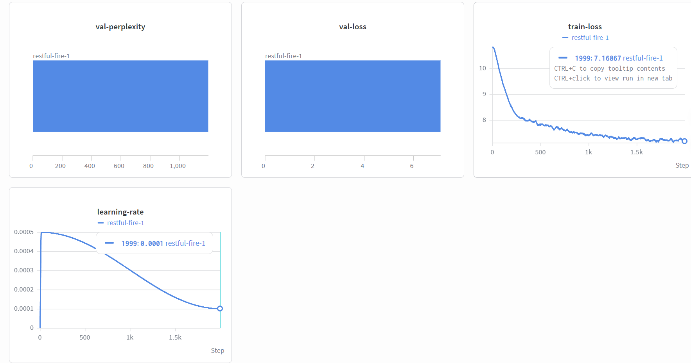

# Lab Note

## Assignment 1 - Preparing and Exploring Pre-Training Data

数据预处理，将原始网页爬取数据转化为干净、高效、易训练的数据集。

Q1.1

A. Knowledge cutoff 是知识界限，表示模型不具备此后发生的任何事件信息。Dolma CC 的 cutoff date 是 Mar 2023，C4 是 Apr 2019

B. data source 表示数据集的数据来源。Dolma 来源包括网络内容、学术出版物、代码、书籍、百科材料，大小 3 万亿 token

C. 基于 Dolma 训练的模型：OLMo、Poro

D. Dolma 遵循 ODC-BY 许可。用户可以复制、复制和分发 Dolma。用户还可以修改和创建 Dolma 数据集的全部或大部分衍生作品。虽然任何再分发或衍生作品都必须附有署名声明，说明该作品是从 Dolma 获得的，但作品本身不必以 ODC-BY 授权。

E. 处理中文等非英语语言的自然语言理解或生成任务。原因：Dolma 是一个以英文为主的预训练数据集，非英语内容（如中文、阿拉伯语等）占比极小或经过严格过滤。因此，模型的词汇表（tokenizer vocabulary）和内部表征很可能严重偏向英语，难以泛化至其他语言。

Q1.2

Model Card 是模型的 “说明书”，记录模型是如何设计、如何评估的。一般说某模型 “开源”，指的是权重开源

Q2.1

Use `html2text`, `nltk`, `BeautifulSoup` fucntions to parse html into text.

Q2.2

对训练数据集进行过滤，仅保留高质量文本，过滤可在文档级别进行，也可在文档内部进行。有多种衡量文本质量的方法，包括：使用自动分类器、基于启发式规则（如文档长度）、或仅选取特定域名下的内容等。

这里需要实现两个函数：

- 筛掉不符合简单条件的单行文本和整个文档
- mask 个人信息

Q2.3

对数据集去重。在某些情况下，若这些高密度样本本身具有较高价值，保留近似重复项可能有益。然而，在预训练场景中，由于目标评估分布通常未知，一般更倾向于去除重复数据，以使训练分布覆盖更广、冗余更少。

常用去重方法：

- 精确去重
  - URL 去重
  - 文档去重，hash/bloom filter
  - 片段去重，如共享长度超过 50 token 的片段判断重复
- 近似。成本较高，可作为后处理
  - 基于 hash 识别模块化文档，如 MinHash
  - 基于字符串度量，如通过 token 编辑距离判断相似度
  - 基于模型。通过语义信息

如何处理重复内容？

- 删除精确重复的字串，优于删除整篇文档
- 对重复 token 进行损失掩码，即训练时不计算这些 token 的损失

Q2.4

将数据集转成 huggingface 格式。

## Assignment 2 - Transformer

Q1.1

A. 对于 “有空格”、“Unicode 特殊字符” 的字符串，tokenizer 可能无法保证 injective 和 invertible；
对于 “没空格” 的字符串，可能无法保证 concatenation，例如 `helloworld` 会被拆成 `hello` 和 `##world`

B. 能满足加法律的 tokenizer 只能是 character-level 的，但是实际应用中，subword-level 的 tokenizer 是效率最高的

Q1.3

A. 最长的 token 是 `<Reference>`，可能说明：

- vocabulary size 较小。因为最长的 token 也不是很长，说明 BPE 合并次数有限，而 BPE 合并次数 = vocabulary size - 初始字符集合大小
- 训练数据是学术 / 技术文档，主要英文

B. BPE 分词可能泄露敏感信息：

- 高频词可能暴露训练数据种类
- merge rule 暴露文本结构

Q1.4

A.

```
document length in English 119
document length in Thai 636
```

不同的分词器是基于特定语言的训练数据学到的，当文本语言和分词器 “母语” 不匹配时，压缩效率会下降

B. low-resource 语言的语料有限，分词效率低。会导致 token 数量膨胀、推理成本上升、语义理解难度增加

Q2.1

解释 weight tying 的作用：

- weight tying 是指，输入 embedding 矩阵、输出 projection 矩阵共用同一组参数
- 让输入 / 输出语义空间保持一致。embedding 表示 “一个词进入模型时的语义向量”，输出 projection “模型判断下一个词时，每个候选词对应的向量”，同一个词在输入端和输出端是一致的，这在直觉上是合理的
- 让训练更稳定，因为参数共享减少了需要学习的独立参数，降低了优化难度

Q2.2

```py
logits = hidden_state @ embedding.T
```

Q2.3-Q3.1

完成

Q3.2

余弦退火：让学习率按照余弦曲线，从较大的初始值平滑下降到较小值

训练初期学习率较大，模型可以快速搜索参数空间；接近训练结束时，学习率逐渐减小，帮助模型在较优解附近进行细致调整。

$$

\eta_t=\eta_{\min}+\frac{1}{2}(\eta_{\max}-\eta_{\min})
\left(1+\cos\frac{\pi t}{T}\right)

$$

Q3.3

validation loss = 7.08407



Q3.4

使用 wandb sweep 来扫描超参数组合

- 在 Sweep 文件中指定搜索参数、搜索方法和评价指标。
- `grid` 穷举组合，`random` 随机搜索，`bayes` 根据已有结果选择更有潜力的组合。
- 训练代码通过 `wandb.config` 获取参数，并在创建模型、优化器之前覆盖原配置。
- 记录的验证指标名称必须与 Sweep 中完全一致。
- 用 `wandb sweep` 创建任务，用 `wandb agent --count N` 指定实验次数。
- 确保每组配置满足结构、显存和 FLOPs 限制，并使用独立输出目录避免模型互相覆盖。
- Sweep 完成后选择验证集指标最优的配置，再单独进行正式训练。

sweep得到的最佳超参数组合：

```
output_dir: outputs/GPT-best
tokenizer_encoding: gpt2
model_config:
  n_embd: 96
  n_head: 2
  n_positions: 128
  n_layer: 6
device: auto
batch_size: 64
seq_len: 128
num_warmup_steps: 100
num_training_steps: 2000
grad_accumulation_steps: 1
min_lr: 1e-4
max_lr: 0.001557416742188994
```

Q3.5

用于训练完整模型的设置：`num_training_steps: 350000`。完整模型训练结果：

```
val loss = xxx
PPL = xxx
```

Q4.1

