# CMU 11-667: Large Language Models: Methods and Applications

<!-- TOC -->

- [CMU 11-667: Large Language Models: Methods and Applications](#cmu-11-667-large-language-models-methods-and-applications)
  - [Language Models Basics](#language-models-basics)
  - [Neural Language Model Architectures](#neural-language-model-architectures)
  - [Pre-training data curation and tokenization](#pre-training-data-curation-and-tokenization)
  - [Side Story: Transformer](#side-story-transformer)
  - [Architecture Advancements on Transformers](#architecture-advancements-on-transformers)

<!-- /TOC -->

## Language Models Basics

语言模型：从 n-gram model 进化为 neural language model

**n-gram model**

链式计算概率：

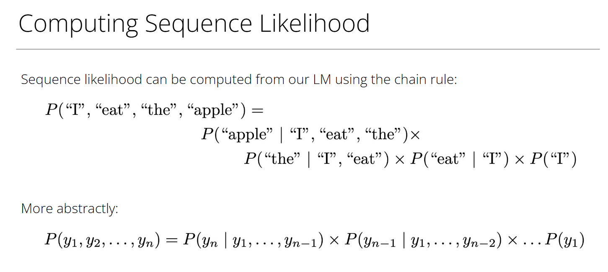

以 2-gram 为例，每个窗口两个词

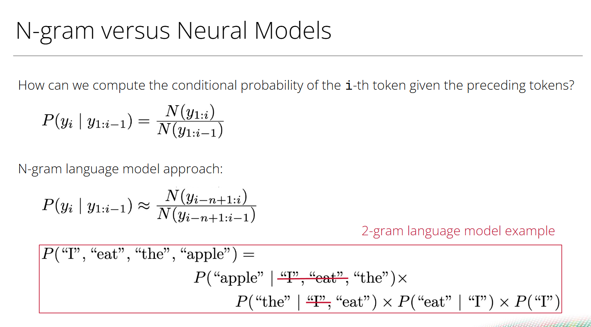

**neural language model**

计算下一个 token 的条件概率时，和 n-gram 的方法不同：

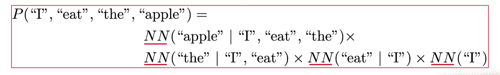

分类，基于计算方式区别：

- 根据前缀，预测下一个词。计算的序列概率是非条件概率。例如 GPT、LLaMA
- 根据前缀和额外的条件序列，预测下一个词。也叫 seq2seq 模型。计算的序列概率是条件概率。例如 T5、机器翻译模型。

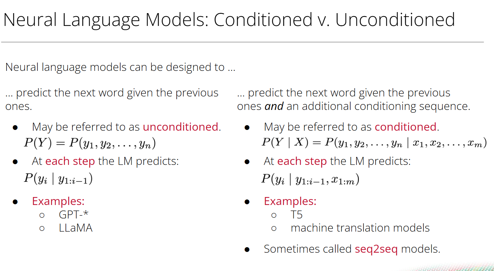

理论上，conditioned 和 unconditioned 可以相互转换。

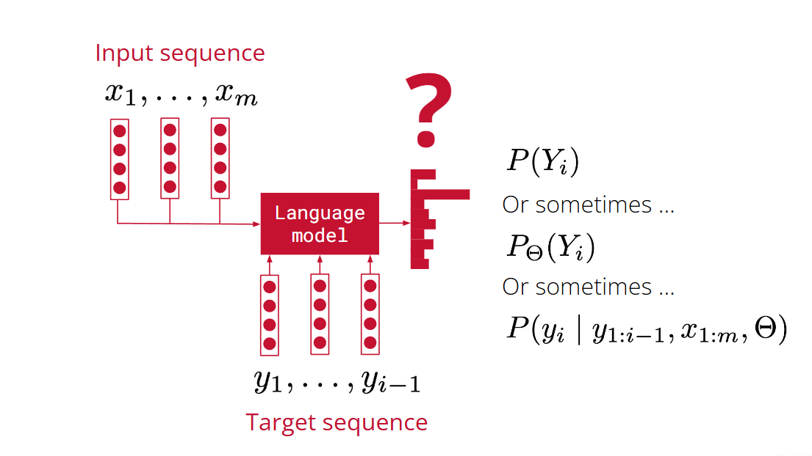

**language models terms**

以一个序列生成为例，给了三个词 I、eat、the。
第一个部分是 tokenization

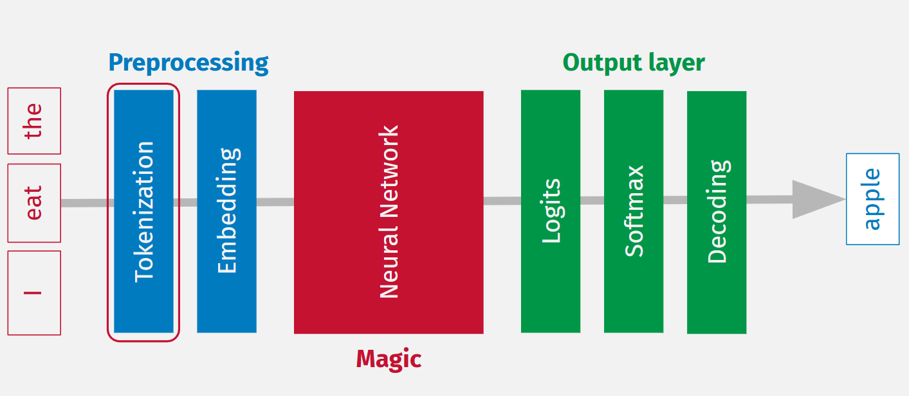

tokenization 将 text 变成 token sequence。vocabulary 是所有 token 的 list，根据级别不同（character/subword/word），生成 seq 的 length 会变化

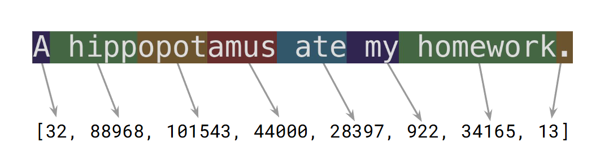

第二部分，embedding。为了让 NN 能处理，需要将离散的 token 变成连续的 vector。这一步构建一个 embedding matrix，大小是 vocabulary size * embedding dim

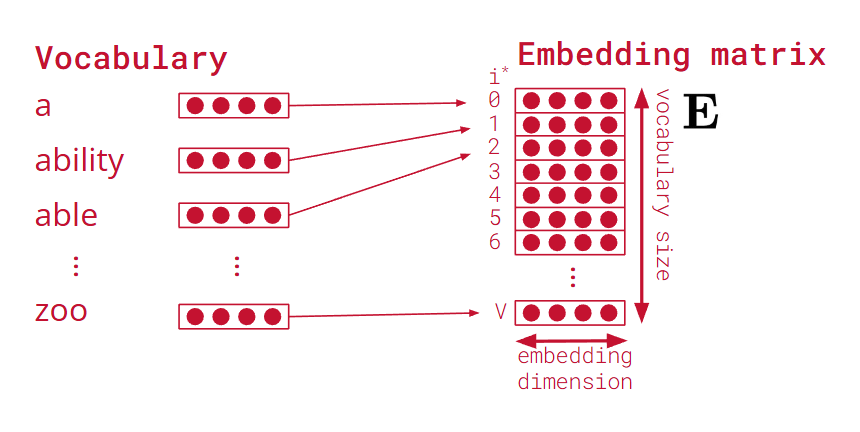

第三部分，NN。

NN 的输入：input seq 每个 token 的 vector

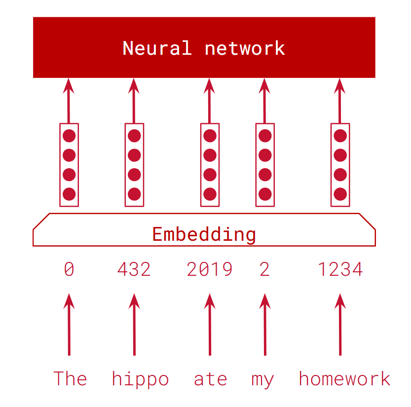

NN 的中间：每一层产生并向前传递 hidden state vector

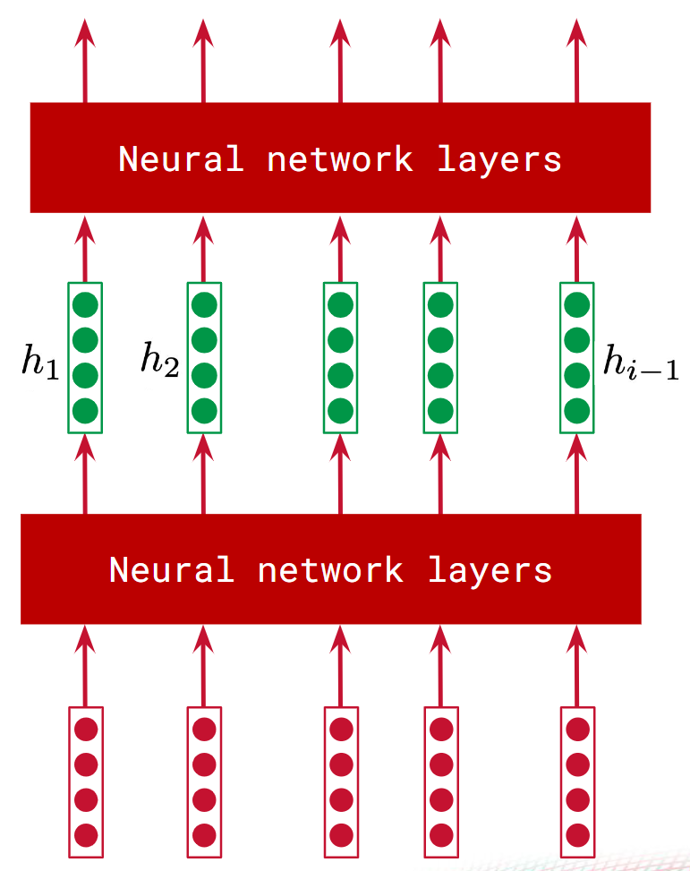

NN 的输出：表示生成 token 的 embedding

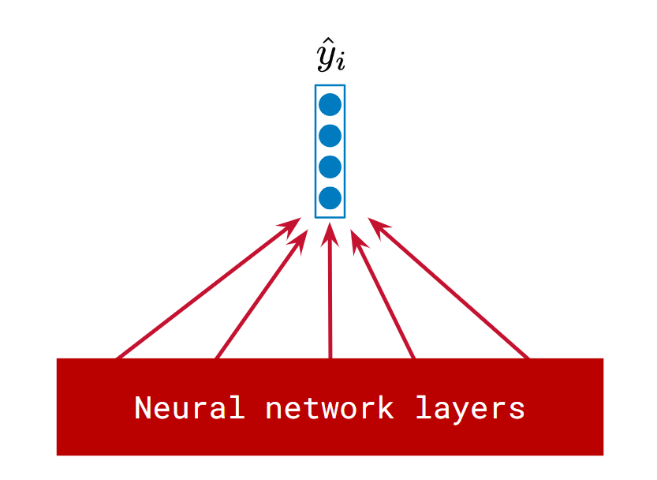

第四部分，Logits。

predicted embedding => logits（未归一化得分）===softmax===> probability

NN 预测的 enmedding 乘以 vocabulary embedding matrix，可以为 vocabulary 的每个 word 计算一个分数，这个分数称为 logits

第五部分，使用 softmax，将 logits 变成概率

以序列生成任务为例，使用 softmax 可以让我们知道下一个词的概率分布

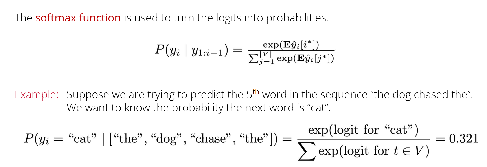

损失函数衡量该分布和真实的匹配程度。以负对数似然的损失函数为例，我们需要最大化真实序列的对数似然，因此需要最小化负对数似然。让模型学会什么是合理的语言

第六部分，Decoding。

我们需要根据下一个词的概率分布、取样算法，决定生成的下一个词。

- 选择概率最大的词。
- 根据 model 返回的概率分布，直接随机抽样。直接采样的后果是可能选到 softmax 的长尾噪声，这些词是低质量的。由于语言模型的 softmax 分布通常更平坦，因此尾部词的总概率不低，如 10~30%
- 根据温度随机采样。温度为 0 时接近 argmax 采样，温度越高时尾部的采样概率越高
- top-k 采样。只从 k 个高概率词采样，排除低质量 / 离群词，引入稀疏性。k 一般取值 10~50
- nucleus sampling，核采样，也称 top-p 采样。和 top k 采样类似，都是从高概率词取样。区别在于，top p 的 k 是不确定的，取决于概率和大于（例如）0.9 的 token 个数
- beam search，束搜索。一种在序列生成中平衡搜索质量和计算开销的搜索算法，假设质量最高的序列是概率最大的序列，并搜索这个序列。

例如，beam size=2 时，每次会搜索概率最大的两个分支

beam search 的问题：
对于开放问题（对话、故事生成），概率最高的生成序列不一定是最好的序列。即 beam search 生成的是更像人类写的文本，但是不够 surprising

decoding 策略的 trade-off：
质量、多样性、效率。

质量依赖高概率路径 → 需抑制尾部噪声 → 牺牲多样性；
多样性依赖探索低概率但合理路径 → 需保留尾部 → 风险引入错误。

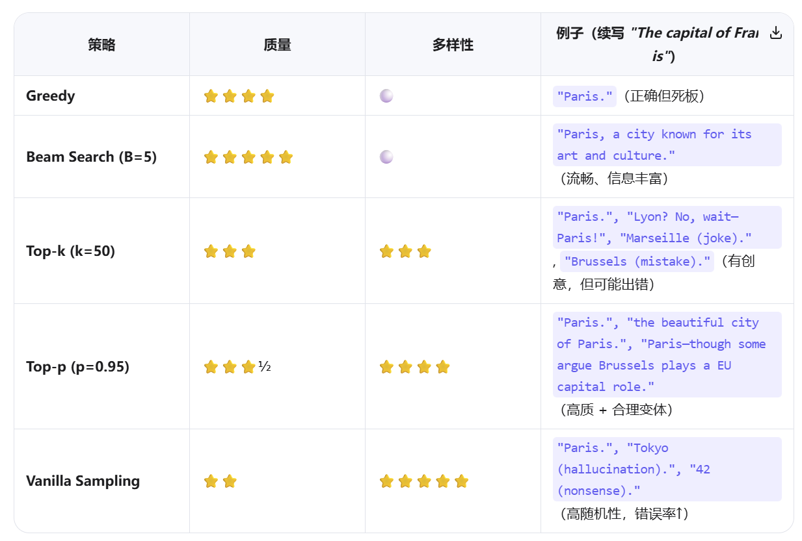

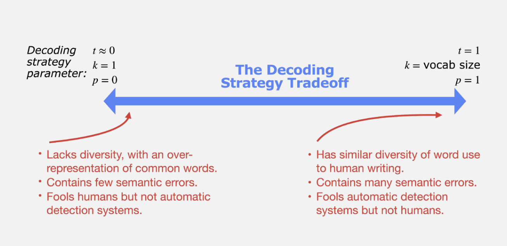

其他的 generation parameter：

- frequency penalty。一个 token 已经出现的次数越多，减少后续输出的概率越小
- presense penalty。减少一个 token 出现的概率。
- stopping criteria。在输出 k 个 token / 特定 token 后，结束输出

## Neural Language Model Architectures

给定一个前缀的 token 序列，如何计算下一个 token 的条件概率？

neural language model 的方法：整个序列的联合概率等于每个 token 的条件概率乘积。使用 NN 可以让每个条件概率项可计算、可泛化、非零，从而让概率的积变成真实联合概率的有效近似。

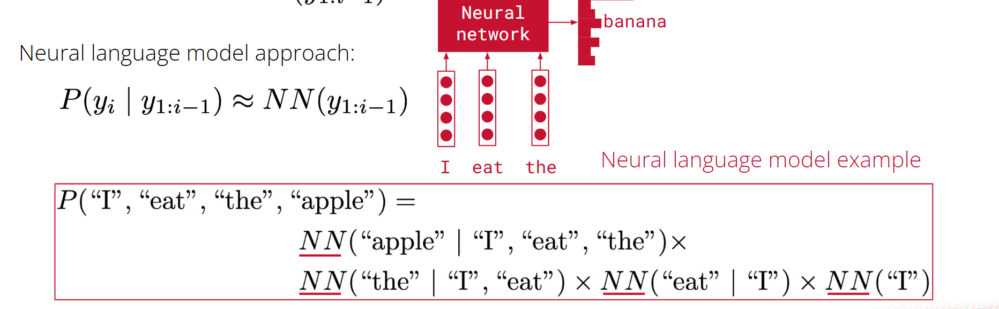

**Encoder-Decoder 架构 **

通常用来处理文本翻译等 seq2seq 任务。encoder 生成输入序列的向量表示，decoder 生成序列输出。
Encoder/Decoder 可以使用不同的内部实现。例如 RNN 或者 transformer block

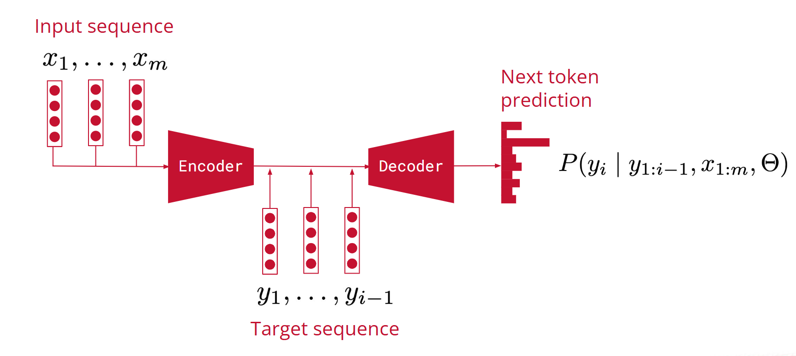

Encoder: input seq -> hidden states

- 输入序列是变长的
- 输出 vector summary

Decoder: hidden states + target seq -> next token prediction

- target seq 是变长的
- decoder 逐个处理 target seq 的 token 并预测下一个 token。（为什么要重复生成 target seq 的 token？因为要让模型学会每一步的分布）

Recurrent Neural Network (RNN)，循环神经网络

RNN 是专门处理序列数据（如时间序列、文本、语音）的神经网络，具有循环结构。在每个时间步共享参数，并将上一时刻的 hidden state 传递给当前时刻，从而具有记忆过去信息的能力。

- 输入：embedding seq
- recurrent unit（循环单元）接收前一个 hidden state 和需要处理的 token embedding
- 输出：predicted embedding + updated hidden state

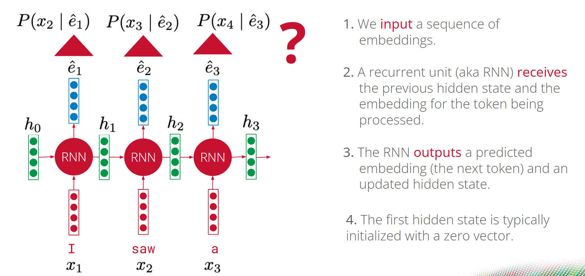

encoder final state -> decoder init state

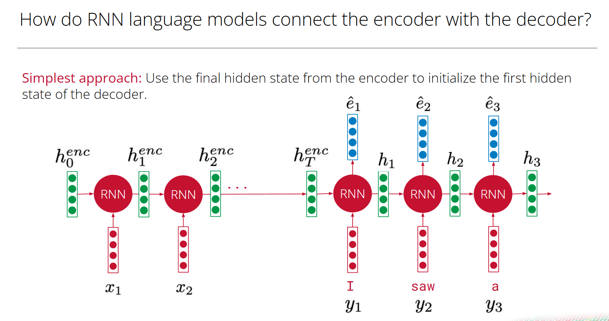

todo: 这块没太看懂，encoder/decoder/RNN 之间关系是怎样的

**Attention Mechanism**

动机：翻译下一个词的时候，对源序列中的不同词，应该分配不同的权重

注意力机制：

- 在 decoder 的第 t 步，都会计算一个上下文向量 context vector，该向量包含 encoder 中所有和 “当前位置 token 的预测” 相关的信息
- context vector 是 encoder hidden state 的线性组合，即：$\bm{c}_t=\bf{H}^{enc}\bf{\alpha_t}$
- decoder 对位置 t 的 token 预测，是 context vector 和 decoder 在 t 位置 hidden state 的函数

> decoder 从 encoder 的所有 hidden state 中按需提取信息 \
> $\alpha_{i,t}$ 是注意力权重，表示 encoder 中第 i 个 hidden state 的重要性 \
> 最终预测由 decoder 当前 hidden state $\bf{h}_t^{dec}$ 和上下文向量 $\bf{c}_t$ 共同决定

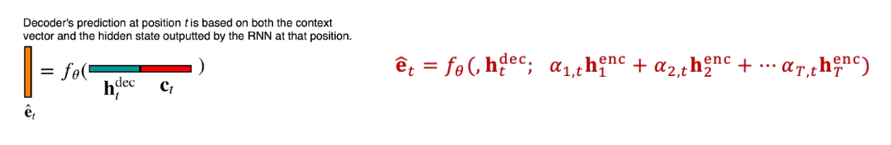

计算注意力权重

$\alpha_{i,j}$ 是注意力权重，表示 encoder 中第 i 个 hidden state 对预测 j 位置 token 的重要性。一般会 softmax 归一化处理，让所有权重和为 1

分子 $exp\ e_{i,j}$ 是原始分数，使用打分函数、encoder 第 i 时间步的 hidden state、decoder 第 j-1 步的 hidden state 计算

最简单的打分函数是点积注意力，点积越大表示两个向量越相似即权重越大。这里把 $\bf{h}^{enc}_{i}$ 看成 key，把 $\bf{h}^{dec}_{j-1}$ 看成 query

> Q: 计算注意力权重时，是否要限制 i、j 之间的大小关系？\
> A: 在 encoder-decoder 注意力中不应该限制，而在 decoder 自注意力中应该限制。因为：①decoder 有时需要回看整个原句，尤其是后面的词，需要利用全局信息。②decoder 自注意力中，必须限制 $i \le j$。因为不能泄露未来信息，破坏自回归性质。可以通过加 mask 使 $i\gt j$ 时的注意力为 0 或负无穷（softmax 后为 0）

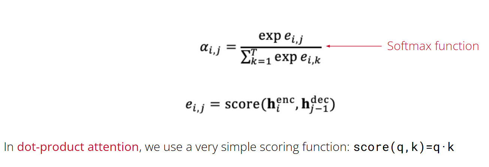

为什么需要注意力机制？同一个词在不同语境下含义不同，模型需要从上下文理解真正意思。传统 RNN/LSTM 会将所有上下文压缩成一个固定长度的向量，容易丢失细节

**Transformers**

为什么 Transformer 抛弃了 RNN，只用了注意力：

- RNN 训练很慢。计算不能并行化，需按位置顺序计算 token
- RNN 在长文本场景表现差。两个 token 距离越远，前面的 token 信息就越容易丢失（反之，注意力机制允许直接连接任意两个位置）

Attention is All You Need

Transformer 的 encoder、decoder 使用注意力机制实现

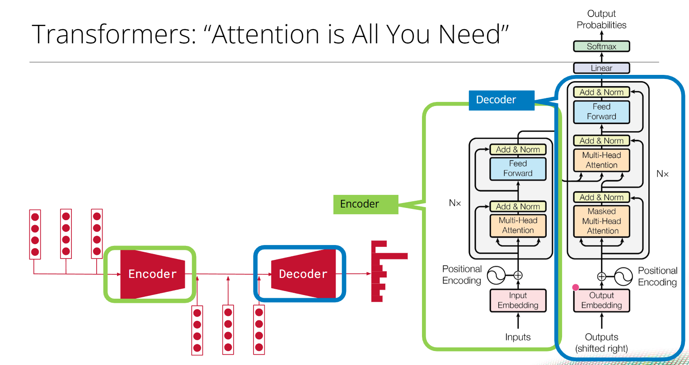

causal self attention（因果自注意力）

保证模型在生成序列时的自回归原则，即预测当前词时只能依赖前面的词。

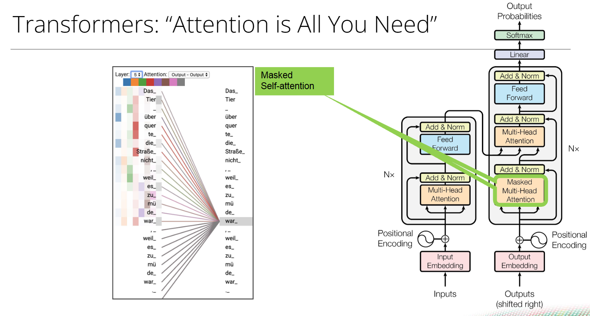

单向注意力机制：预测位置 i 只能用 $j\lt i$ 的权重

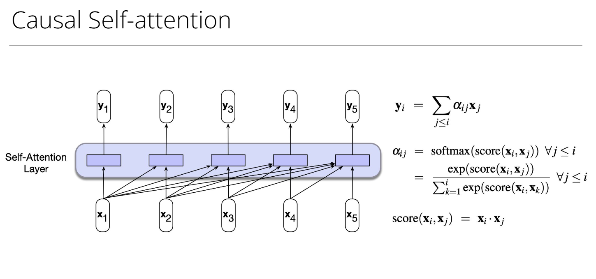

Transformer 是注意力实现的 encoder-decoder 架构模型，另外还有 encoder-only 架构，用于理解类任务；decoder-only 架构，用于生成类任务

## Pre-training data curation and tokenization

本节课是模型的预训练中的数据处理过程，将 raw data 变成能被 NN 处理的格式

**Obtaining Pre-training Data**

预训练的目标：让模型学到自然语言的结构、学到训练集中的知识、可以模拟训练数据生成

因此，理想的 pre-training 数据是：

- 大
- 高质量、干净、多样
- 书籍，百科，新闻，文献等

网络是常见的数据来源，从网络获取预训练数据的流程是：

- 从网页爬取页面。从 seed url 出发，向外探索超链接即 target url，爬取 HTML 内容并转成文本
- 筛选、清洗数据。清除噪声、spam、模板 / 碎片文字；挑选高质量文本；排除 toxic/biased 文本（ NSFW、strong bias ）

清洗数据中的挑战

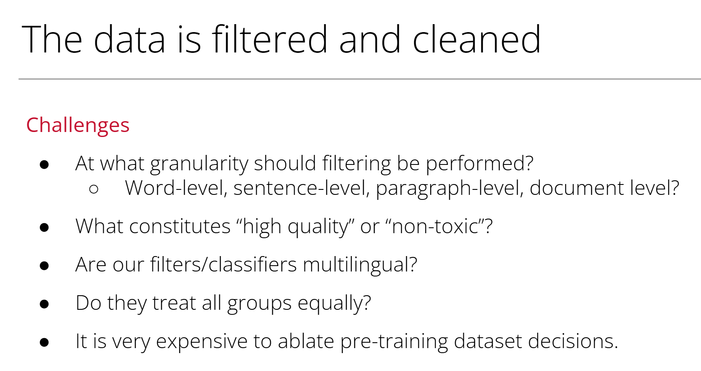

**Notable Datasets**

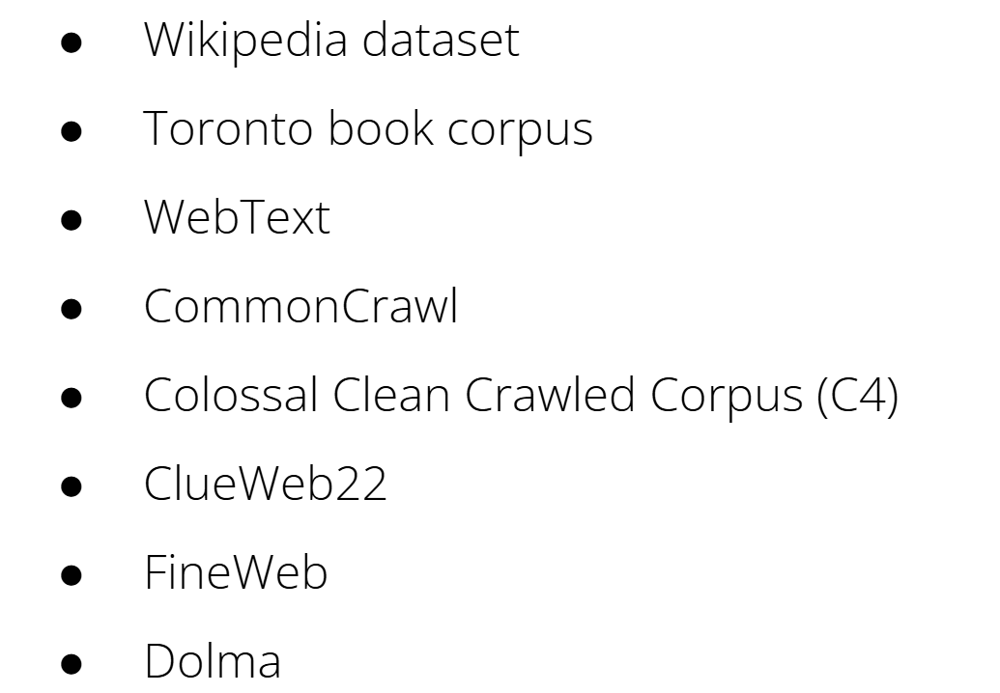

**Tokenization**

raw clean text ====tokenization===> tokens ====batching====> tensor

在 tokenization 中，有多种分词方式（character/subword/word），其中 word level 会碰到未登录词（OOV）问题，即训练集没有的单词、typo 会变成 `[UNK]`，无法分词。

而 subword 分词则更灵活，一种常见算法是 Byte Pair Encoding (BPE) 算法。统计所有相邻字符串出现概率，合并最频繁的一对作为新单元，逐步构建常见的 subword token。
最终高频词（the）被整个保留，低频词 / 未出现的词被拆分为已知子词（helloworld => hel|low|orld），极端情况退化到 character level tokenization

BPE 优点是，vocabulary 大小可控；能处理拼写变体、复合词、罕见词；支持黏着语；token 长度适中，和 NN 兼容好

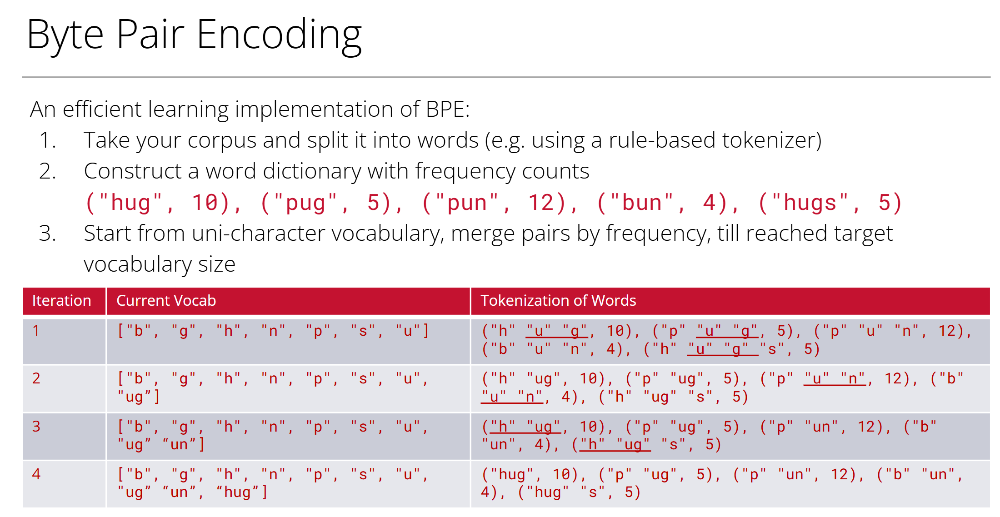

subword tokenization 优点：

- vocabulary size 可控（vocabulary size 也是一个超参数）
- learned vocabulary 有这些特点：高频词整个保存，低频词被拆分
- 很适合 NN 建模：常见组合高频出现，容易被注意力机制捕获；罕见词拆成 unit，其表征通过 subword unit 组合平滑生成

subword tokenization 存在问题：

- 如果起始 basic unit 是字母（如 a-z），那么还是可能存在未知 token（如中文）
  - 解法：byte-level BPE 使用 unicode byte 作为 basic character unit
- BPE 初始化需要 word-level 分词，再用 character 分词。第一步的 word 分词具体实现是 tricky 的（中文、代码不能直接用空格分）。
  - 解法：用更精确的 rule-based 做初始分词
- 找频率最高的组合时间复杂度 O(n^2)
  - 解法：算法优化

**Batching**

raw clean text 经过分词后变成很多 token，接下来需要 batching 变成 tensor

- batch size。一次性送入模型的样本数量，训练的核心超参数。在 LLM 训练中，一般指 global batch size，即每次参数更新所用的总 token 数量（含 padding）

例如，当前 batch 有 32 个样本，每个序列 pad 到 2048，那么总 token=32*2048=65536

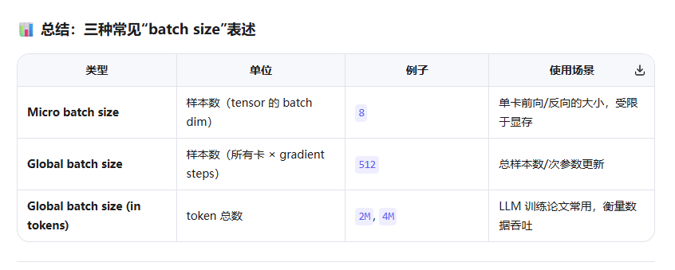

**Pre-treining Learning Objectives**

Transformer 模型可以通过多种自监督方式预训练（自监督：不需要人工打标签，从文本自身结构学习）

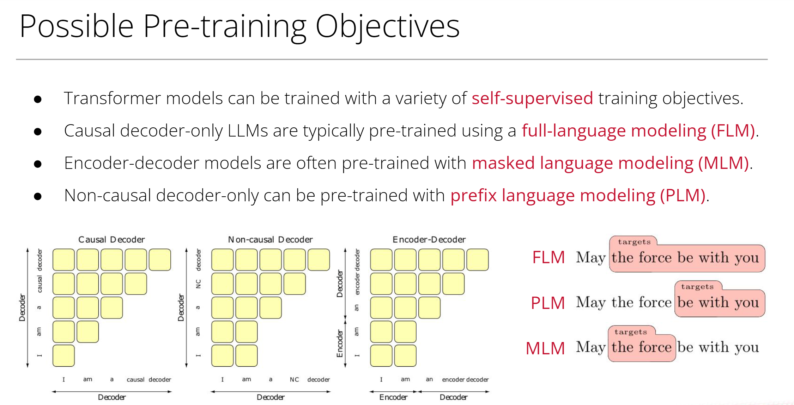

- full-language modeling。从左到右，逐词预测
- prefix language modeling。给开头，续写结尾
- masked language modeling。完形填空

## Side Story: Transformer

doc link: https://jalammar.github.io/illustrated-transformer/

**Transformer 整体结构 **
Input => Encoder Stack => Encoder Output => Decoder Stack => Output

- Encoder/Decoder Stack，N 个相同结构的 Encoder/Decoder 堆叠而成

单个 encoder 结构，包含两个子层：

- self-attention 层，让 encoder 在编码特定单词时能关注输入句子中的其他单词
- feed forward network 层，前馈神经网络。

单个 decoder 结构，包含三个子层，比 encoder 多一个注意力层：

- self-attention
- encoder-decoder attention，注意力层，让 decoder 关注输入句子中相关部分
- feed forward

**tensor 流动过程 **

1. 每个输入单词经过 embedding，转换成向量，这里是 512 维向量
2. 经过 encoder：每个 embedded 单词依次通过 encoder 的两个层。注意，每个词通过自己的路径流经 encoder。self-attention 层会用到位置关系，但是前馈层不需要，所以经过前馈层时多个路径可以并行执行。（feed forward 里面有多个 FNN，对应每个位置）

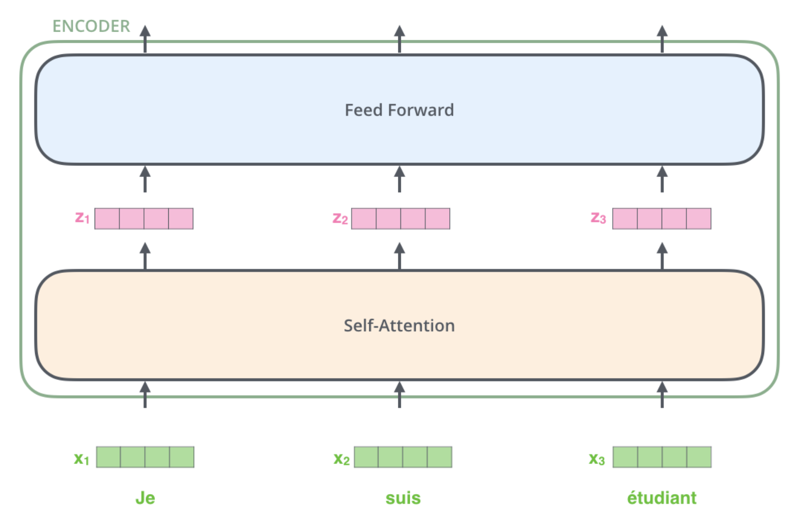

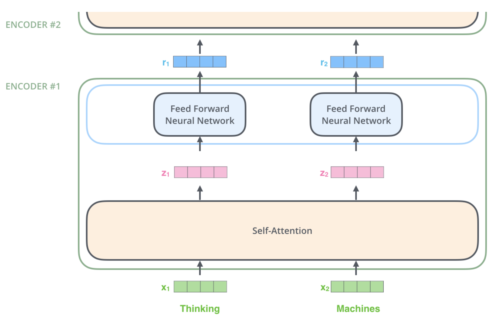

** 自注意力 **

- 将当前单词和输入序列中的词关联，从而更好地 encode
- 类似 RNN 中，将当前单词和之前的词通过 hidden state 关联起来。自注意力是 Transformer 使用相关词 “理解” 当前处理的词的方法

** 如何计算自注意力 **

为 encoder 输入的每个词创建三个向量，即 query/key/value 向量。通过将 embedding 向量乘以三个训练好的矩阵得到这三个向量

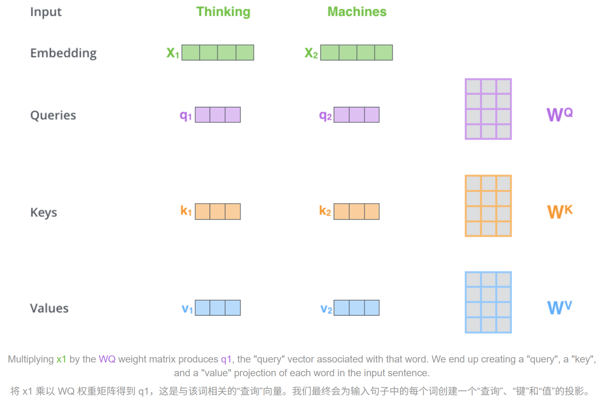

计算一个得分。将输入句子中的每个词与当前词评分，这个分数决定在编码某个位置的词时，需要给予输入句子的其他部分多少关注。
如何计算得分？对每个 query（来自当前词），计算它和所有 key 向量点积

例如假设正在计算位置 1 的词的自注意力，第一个得分是 $\bf{q}_1 \cdot \bf{k}_1$，第二个得分是 $\bf{q}_1 \cdot \bf{k}_2$。（针对第一个词提问题）

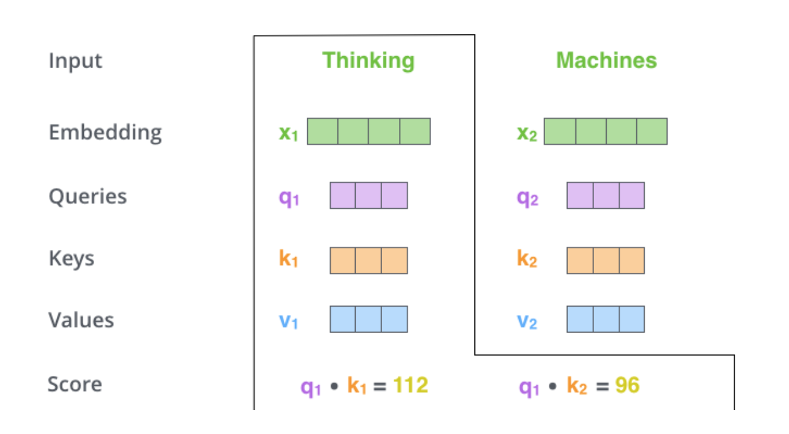

将分数除以 8，将结果输入 softmax。这里 8 是 key 向量维度 64 的平方根，有助于获得更稳定的梯度。softmax 使得分归一化。

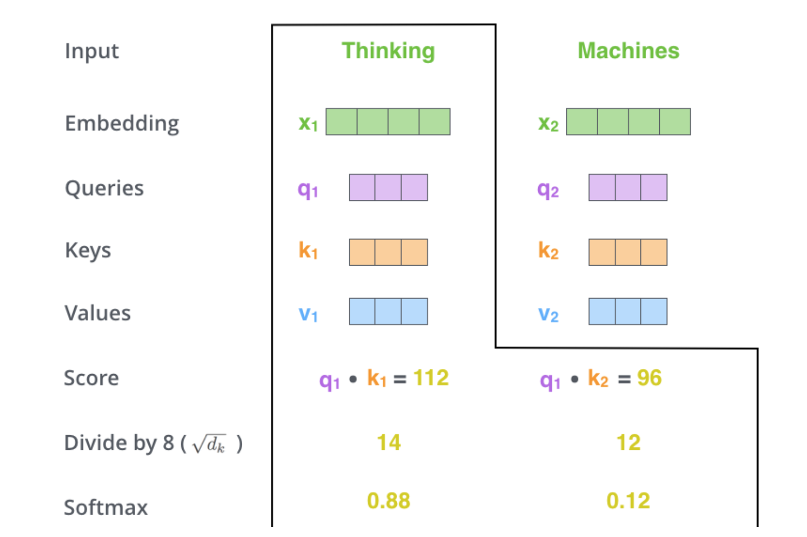

将每个 value 向量乘以 softmax 得分，然后求和，产生自注意力层在该位置的输出。注意这里的和也是向量

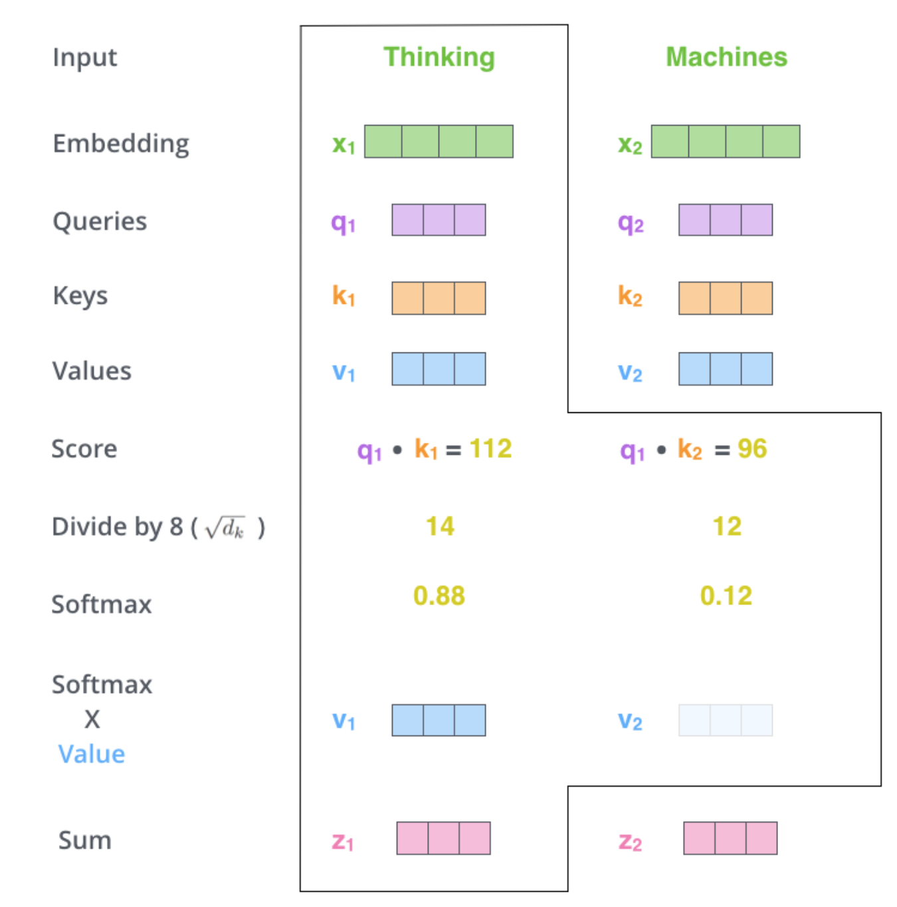

** 自注意力矩阵计算形式 **

上面部分提到，在计算每个词的自注意力分数时，需要将当前词的 q 和所有词的 k 相乘，因此可以用矩阵乘来并行执行

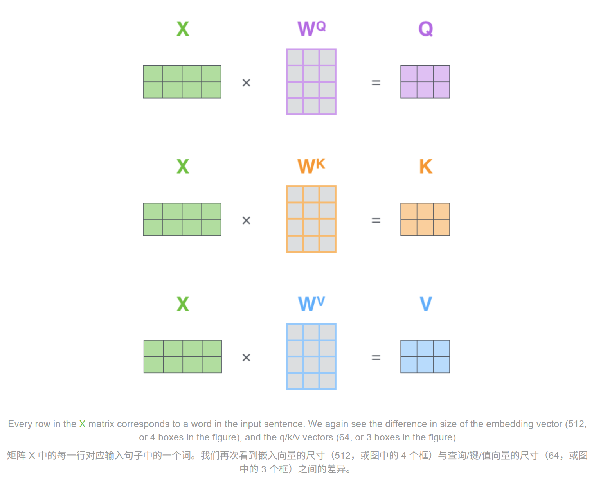

即：$Attention=softmax(\frac{\bf{Q}\bf{K}^\top}{\sqrt{\bf{d_k}}})V$

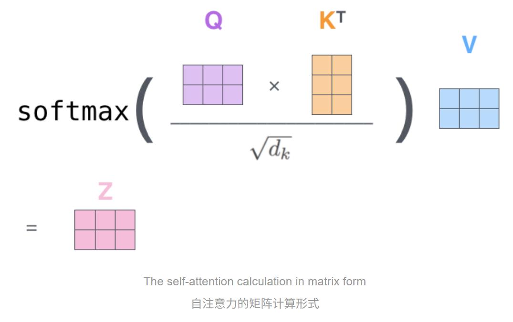

**Multi-Head Attention**

多头注意力机制，自注意力层的一种优化方法。在两个方面提升了性能：

- 模型对不同位置的关注能力。例如翻译句子中知道 it 指代哪个词
- 为注意力层提供多个 “表示子空间”（representation subspace）。Transformer 使用 8 个注意力头，因此每个 encoder/decoder 都有 8 个 QKV 矩阵。在训练之后，每个 QKV 都会将输入投影到不同的表示子空间。（表示子空间是原始 embedding 空间的一个线性变化的 view，可以捕捉原向量的不同语义 / 结构信息。不同的 QKV 投影矩阵将输入映射到不同的子空间，避免单一注意力机制的归纳偏置过强，可提升模型表达能力）

> Q: multi-head 是否真的保证语义 / 结构的多样性？\
> A: 不一定。一些 observation：
>   - 训练后期部分 head 相似
>   - 底层 head 更易冗余，高层 head 更特异，decoder 的 cross-attention heads 分化更明显
>   - 可通过 GQA、MQA 等结构做权衡

下图展示了不同的 head 对不同词的关注不一样

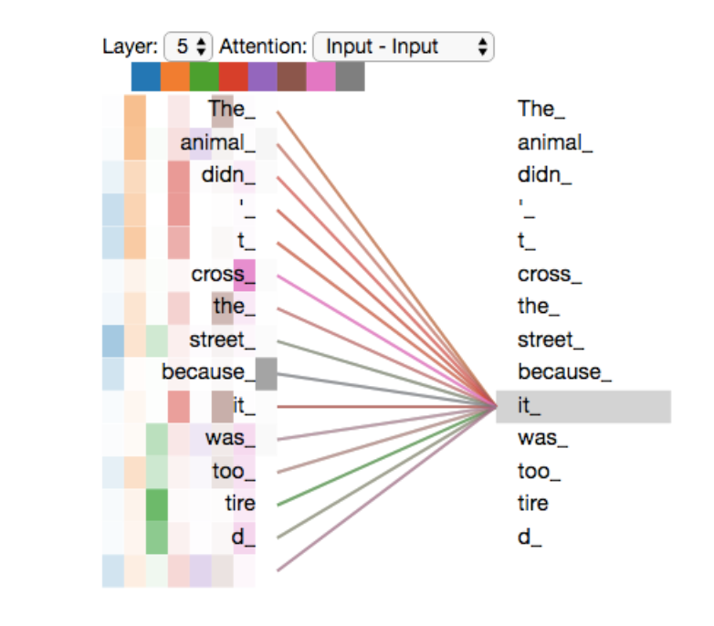

经过 encoder 的 multi-head attention 后，1 个 embedding input 矩阵会变成 8 个不同的 Z 矩阵，为了对接后面的 feed-forward 层，需要将 8 个矩阵压缩成 1 个矩阵。
因此，先把 8 个矩阵拼起来，再用另一个权重矩阵 $\bf{W}^o$ 相乘。再将压缩的矩阵送到 feed forward network

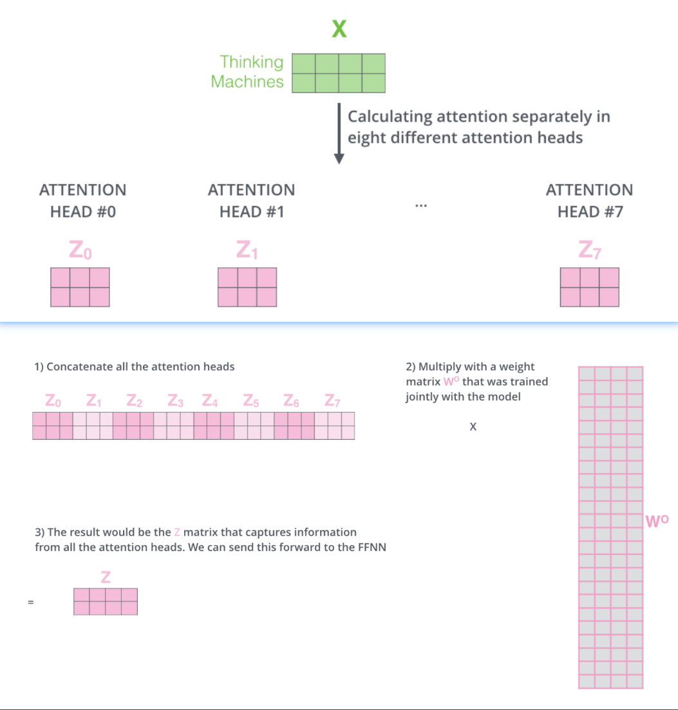

多头注意力机制总结图：

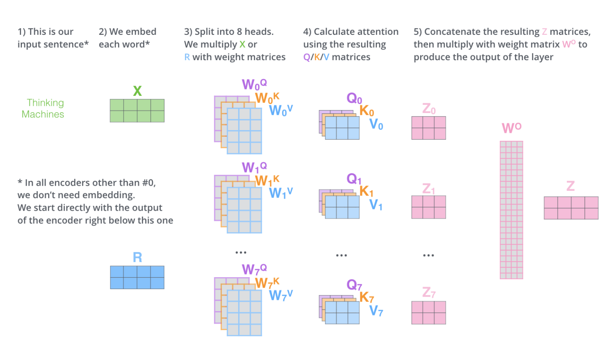

**postitional encoding 表示序列顺序 **

为了描述输入序列中的词语顺序，Transformer 在每个输入的 embedding 上加了一个向量。这些向量遵循特定模式，

## Architecture Advancements on Transformers

本节介绍基于 Transformer 架构的一些改进工作

**New Architectures**

xx

**Motivation and Benefits of Each Architecture Upgrades**

xx

**Choose Right Architecture**

xx
