# CMU 11-667: Large Language Models: Methods and Applications

<!-- TOC -->

- [CMU 11-667: Large Language Models: Methods and Applications](#cmu-11-667-large-language-models-methods-and-applications)
  - [Language Models Basics](#language-models-basics)
  - [Neural Language Model Architectures](#neural-language-model-architectures)
  - [Pre-training data curation and tokenization](#pre-training-data-curation-and-tokenization)
  - [Side Story: Transformer](#side-story-transformer)
  - [Architecture Advancements on Transformers](#architecture-advancements-on-transformers)
  - [Automatic Evaluation of LLMs](#automatic-evaluation-of-llms)
  - [Customizing LLMs via full model finetuning](#customizing-llms-via-full-model-finetuning)

<!-- /TOC -->

## Language Models Basics

语言模型：从 n-gram model 进化为 neural language model

**n-gram model**

链式计算概率：

以 2-gram 为例，每个窗口两个词

**neural language model**

计算下一个 token 的条件概率时，和 n-gram 的方法不同：

分类，基于计算方式区别：

- 根据前缀，预测下一个词。计算的序列概率是非条件概率。例如 GPT、LLaMA
- 根据前缀和额外的条件序列，预测下一个词。也叫 seq2seq 模型。计算的序列概率是条件概率。例如 T5、机器翻译模型。

理论上，conditioned 和 unconditioned 可以相互转换。

**language models terms**

以一个序列生成为例，给了三个词 I、eat、the。
第一个部分是 tokenization

tokenization 将 text 变成 token sequence。vocabulary 是所有 token 的 list，根据级别不同（character/subword/word），生成 seq 的 length 会变化

第二部分，embedding。为了让 NN 能处理，需要将离散的 token 变成连续的 vector。这一步构建一个 embedding matrix，大小是 vocabulary size * embedding dim

第三部分，NN。

NN 的输入：input seq 每个 token 的 vector

NN 的中间：每一层产生并向前传递 hidden state vector

NN 的输出：表示生成 token 的 embedding

第四部分，Logits。

predicted embedding => logits（未归一化得分）===softmax===> probability

NN 预测的 enmedding 乘以 vocabulary embedding matrix，可以为 vocabulary 的每个 word 计算一个分数，这个分数称为 logits

第五部分，使用 softmax，将 logits 变成概率

以序列生成任务为例，使用 softmax 可以让我们知道下一个词的概率分布

损失函数衡量该分布和真实的匹配程度。以负对数似然的损失函数为例，我们需要最大化真实序列的对数似然，因此需要最小化负对数似然。让模型学会什么是合理的语言

第六部分，Decoding。

我们需要根据下一个词的概率分布、取样算法，决定生成的下一个词。

- 选择概率最大的词。
- 根据 model 返回的概率分布，直接随机抽样。直接采样的后果是可能选到 softmax 的长尾噪声，这些词是低质量的。由于语言模型的 softmax 分布通常更平坦，因此尾部词的总概率不低，如 10~30%
- 根据温度随机采样。温度为 0 时接近 argmax 采样，温度越高时尾部的采样概率越高
- top-k 采样。只从 k 个高概率词采样，排除低质量 / 离群词，引入稀疏性。k 一般取值 10~50
- nucleus sampling，核采样，也称 top-p 采样。和 top k 采样类似，都是从高概率词取样。区别在于，top p 的 k 是不确定的，取决于概率和大于（例如）0.9 的 token 个数
- beam search，束搜索。一种在序列生成中平衡搜索质量和计算开销的搜索算法，假设质量最高的序列是概率最大的序列，并搜索这个序列。

例如，beam size=2 时，每次会搜索概率最大的两个分支

beam search 的问题：
对于开放问题（对话、故事生成），概率最高的生成序列不一定是最好的序列。即 beam search 生成的是更像人类写的文本，但是不够 surprising

decoding 策略的 trade-off：
质量、多样性、效率。

质量依赖高概率路径 → 需抑制尾部噪声 → 牺牲多样性；
多样性依赖探索低概率但合理路径 → 需保留尾部 → 风险引入错误。

其他的 generation parameter：

- frequency penalty。一个 token 已经出现的次数越多，减少后续输出的概率越小
- presense penalty。减少一个 token 出现的概率。
- stopping criteria。在输出 k 个 token / 特定 token 后，结束输出

## Neural Language Model Architectures

给定一个前缀的 token 序列，如何计算下一个 token 的条件概率？

neural language model 的方法：整个序列的联合概率等于每个 token 的条件概率乘积。使用 NN 可以让每个条件概率项可计算、可泛化、非零，从而让概率的积变成真实联合概率的有效近似。

**Encoder-Decoder 架构 **

通常用来处理文本翻译等 seq2seq 任务。encoder 生成输入序列的向量表示，decoder 生成序列输出。
Encoder/Decoder 可以使用不同的内部实现。例如 RNN 或者 transformer block

Encoder: input seq -> hidden states

- 输入序列是变长的
- 输出 vector summary

Decoder: hidden states + target seq -> next token prediction

- target seq 是变长的
- decoder 逐个处理 target seq 的 token 并预测下一个 token。（为什么要重复生成 target seq 的 token？因为要让模型学会每一步的分布）

Recurrent Neural Network (RNN)，循环神经网络

RNN 是专门处理序列数据（如时间序列、文本、语音）的神经网络，具有循环结构。在每个时间步共享参数，并将上一时刻的 hidden state 传递给当前时刻，从而具有记忆过去信息的能力。

- 输入：embedding seq
- recurrent unit（循环单元）接收前一个 hidden state 和需要处理的 token embedding
- 输出：predicted embedding + updated hidden state

encoder final state -> decoder init state

todo: 这块没太看懂，encoder/decoder/RNN 之间关系是怎样的

**Attention Mechanism**

动机：翻译下一个词的时候，对源序列中的不同词，应该分配不同的权重

注意力机制：

- 在 decoder 的第 t 步，都会计算一个上下文向量 context vector，该向量包含 encoder 中所有和 “当前位置 token 的预测” 相关的信息
- context vector 是 encoder hidden state 的线性组合，即：$\bm{c}_t=\bf{H}^{enc}\bf{\alpha_t}$
- decoder 对位置 t 的 token 预测，是 context vector 和 decoder 在 t 位置 hidden state 的函数

> decoder 从 encoder 的所有 hidden state 中按需提取信息 \
> $\alpha_{i,t}$ 是注意力权重，表示 encoder 中第 i 个 hidden state 的重要性 \
> 最终预测由 decoder 当前 hidden state $\bf{h}_t^{dec}$ 和上下文向量 $\bf{c}_t$ 共同决定

计算注意力权重

$\alpha_{i,j}$ 是注意力权重，表示 encoder 中第 i 个 hidden state 对预测 j 位置 token 的重要性。一般会 softmax 归一化处理，让所有权重和为 1

分子 $exp\ e_{i,j}$ 是原始分数，使用打分函数、encoder 第 i 时间步的 hidden state、decoder 第 j-1 步的 hidden state 计算

最简单的打分函数是点积注意力，点积越大表示两个向量越相似即权重越大。这里把 $\bf{h}^{enc}_{i}$ 看成 key，把 $\bf{h}^{dec}_{j-1}$ 看成 query

> Q: 计算注意力权重时，是否要限制 i、j 之间的大小关系？\
> A: 在 encoder-decoder 注意力中不应该限制，而在 decoder 自注意力中应该限制。因为：①decoder 有时需要回看整个原句，尤其是后面的词，需要利用全局信息。②decoder 自注意力中，必须限制 $i \le j$。因为不能泄露未来信息，破坏自回归性质。可以通过加 mask 使 $i\gt j$ 时的注意力为 0 或负无穷（softmax 后为 0）

为什么需要注意力机制？同一个词在不同语境下含义不同，模型需要从上下文理解真正意思。传统 RNN/LSTM 会将所有上下文压缩成一个固定长度的向量，容易丢失细节

**Transformers**

为什么 Transformer 抛弃了 RNN，只用了注意力：

- RNN 训练很慢。计算不能并行化，需按位置顺序计算 token
- RNN 在长文本场景表现差。两个 token 距离越远，前面的 token 信息就越容易丢失（反之，注意力机制允许直接连接任意两个位置）

Attention is All You Need

Transformer 的 encoder、decoder 使用注意力机制实现

causal self attention（因果自注意力）

保证模型在生成序列时的自回归原则，即预测当前词时只能依赖前面的词。

单向注意力机制：预测位置 i 只能用 $j\lt i$ 的权重

Transformer 是注意力实现的 encoder-decoder 架构模型，另外还有 encoder-only 架构，用于理解类任务；decoder-only 架构，用于生成类任务

## Pre-training data curation and tokenization

本节课是模型的预训练中的数据处理过程，将 raw data 变成能被 NN 处理的格式

**Obtaining Pre-training Data**

预训练的目标：让模型学到自然语言的结构、学到训练集中的知识、可以模拟训练数据生成

因此，理想的 pre-training 数据是：

- 大
- 高质量、干净、多样
- 书籍，百科，新闻，文献等

网络是常见的数据来源，从网络获取预训练数据的流程是：

- 从网页爬取页面。从 seed url 出发，向外探索超链接即 target url，爬取 HTML 内容并转成文本
- 筛选、清洗数据。清除噪声、spam、模板 / 碎片文字；挑选高质量文本；排除 toxic/biased 文本（ NSFW、strong bias ）

清洗数据中的挑战

**Notable Datasets**

**Tokenization**

raw clean text ====tokenization===> tokens ====batching====> tensor

在 tokenization 中，有多种分词方式（character/subword/word），其中 word level 会碰到未登录词（OOV）问题，即训练集没有的单词、typo 会变成 `[UNK]`，无法分词。

而 subword 分词则更灵活，一种常见算法是 Byte Pair Encoding (BPE) 算法。统计所有相邻字符串出现概率，合并最频繁的一对作为新单元，逐步构建常见的 subword token。
最终高频词（the）被整个保留，低频词 / 未出现的词被拆分为已知子词（helloworld => hel|low|orld），极端情况退化到 character level tokenization

BPE 优点是，vocabulary 大小可控；能处理拼写变体、复合词、罕见词；支持黏着语；token 长度适中，和 NN 兼容好

subword tokenization 优点：

- vocabulary size 可控（vocabulary size 也是一个超参数）
- learned vocabulary 有这些特点：高频词整个保存，低频词被拆分
- 很适合 NN 建模：常见组合高频出现，容易被注意力机制捕获；罕见词拆成 unit，其表征通过 subword unit 组合平滑生成

subword tokenization 存在问题：

- 如果起始 basic unit 是字母（如 a-z），那么还是可能存在未知 token（如中文）
  - 解法：byte-level BPE 使用 unicode byte 作为 basic character unit
- BPE 初始化需要 word-level 分词，再用 character 分词。第一步的 word 分词具体实现是 tricky 的（中文、代码不能直接用空格分）。
  - 解法：用更精确的 rule-based 做初始分词
- 找频率最高的组合时间复杂度 O(n^2)
  - 解法：算法优化

**Batching**

raw clean text 经过分词后变成很多 token，接下来需要 batching 变成 tensor

- batch size。一次性送入模型的样本数量，训练的核心超参数。在 LLM 训练中，一般指 global batch size，即每次参数更新所用的总 token 数量（含 padding）

例如，当前 batch 有 32 个样本，每个序列 pad 到 2048，那么总 token=32*2048=65536

**Pre-treining Learning Objectives**

Transformer 模型可以通过多种自监督方式预训练（自监督：不需要人工打标签，从文本自身结构学习）

- full-language modeling。从左到右，逐词预测
- prefix language modeling。给开头，续写结尾
- masked language modeling。完形填空

## Side Story: Transformer

doc link: https://jalammar.github.io/illustrated-transformer/

**Transformer 整体结构 **

Input => Encoder Stack => Encoder Output => Decoder Stack => Output

- Encoder/Decoder Stack，N 个相同结构的 Encoder/Decoder 堆叠而成

单个 encoder 结构，包含两个子层：

- self-attention 层，让 encoder 在编码特定单词时能关注输入句子中的其他单词
- feed forward network 层，前馈神经网络。

单个 decoder 结构，包含三个子层，比 encoder 多一个注意力层：

- self-attention
- encoder-decoder attention，注意力层，让 decoder 关注输入句子中相关部分
- feed forward

**tensor 流动过程 **

1. 每个输入单词经过 embedding，转换成向量，这里是 512 维向量
2. 经过 encoder：每个 embedded 单词依次通过 encoder 的两个层。注意，每个词通过自己的路径流经 encoder。self-attention 层会用到位置关系，但是前馈层不需要，所以经过前馈层时多个路径可以并行执行。（feed forward 里面有多个 FNN，对应每个位置）

** 自注意力 **

- 将当前单词和输入序列中的词关联，从而更好地 encode
- 类似 RNN 中，将当前单词和之前的词通过 hidden state 关联起来。自注意力是 Transformer 使用相关词 “理解” 当前处理的词的方法

** 如何计算自注意力 **

为 encoder 输入的每个词创建三个向量，即 query/key/value 向量。通过将 embedding 向量乘以三个训练好的矩阵得到这三个向量

计算一个得分。将输入句子中的每个词与当前词评分，这个分数决定在编码某个位置的词时，需要给予输入句子的其他部分多少关注。
如何计算得分？对每个 query（来自当前词），计算它和所有 key 向量点积

例如假设正在计算位置 1 的词的自注意力，第一个得分是 $\bf{q}_1 \cdot \bf{k}_1$，第二个得分是 $\bf{q}_1 \cdot \bf{k}_2$。（针对第一个词提问题）

将分数除以 8，将结果输入 softmax。这里 8 是 key 向量维度 64 的平方根，有助于获得更稳定的梯度。softmax 使得分归一化。

将每个 value 向量乘以 softmax 得分，然后求和，产生自注意力层在该位置的输出。注意这里的和也是向量

** 自注意力矩阵计算形式 **

上面部分提到，在计算每个词的自注意力分数时，需要将当前词的 q 和所有词的 k 相乘，因此可以用矩阵乘来并行执行

即：$Attention=softmax(\frac{\bf{Q}\bf{K}^\top}{\sqrt{\bf{d_k}}})V$

**Multi-Head Attention**

多头注意力机制，自注意力层的一种优化方法。在两个方面提升了性能：

- 模型对不同位置的关注能力。例如翻译句子中知道 it 指代哪个词
- 为注意力层提供多个 “表示子空间”（representation subspace）。Transformer 使用 8 个注意力头，因此每个 encoder/decoder 都有 8 个 QKV 矩阵。在训练之后，每个 QKV 都会将输入投影到不同的表示子空间。（表示子空间是原始 embedding 空间的一个线性变化的 view，可以捕捉原向量的不同语义 / 结构信息。不同的 QKV 投影矩阵将输入映射到不同的子空间，避免单一注意力机制的归纳偏置过强，可提升模型表达能力）

> Q: multi-head 是否真的保证语义 / 结构的多样性？\
> A: 不一定。一些 observation：
>   - 训练后期部分 head 相似
>   - 底层 head 更易冗余，高层 head 更特异，decoder 的 cross-attention heads 分化更明显
>   - 可通过 GQA、MQA 等结构做权衡

下图展示了不同的 head 对不同词的关注不一样

经过 encoder 的 multi-head attention 后，1 个 embedding input 矩阵会变成 8 个不同的 Z 矩阵，为了对接后面的 feed-forward 层，需要将 8 个矩阵压缩成 1 个矩阵。
因此，先把 8 个矩阵拼起来，再用另一个权重矩阵 $\bf{W}^o$ 相乘。再将压缩的矩阵送到 feed forward network

多头注意力机制总结图：

> 注：每个头都接收完整输入，学习不同的语义子空间表示

**postitional encoding 表示序列顺序 **

上面的模型结构没有包含输入序列中单词的顺序。为了描述单词顺序，Transformer 在每个输入的 embedding 上加了一个向量。

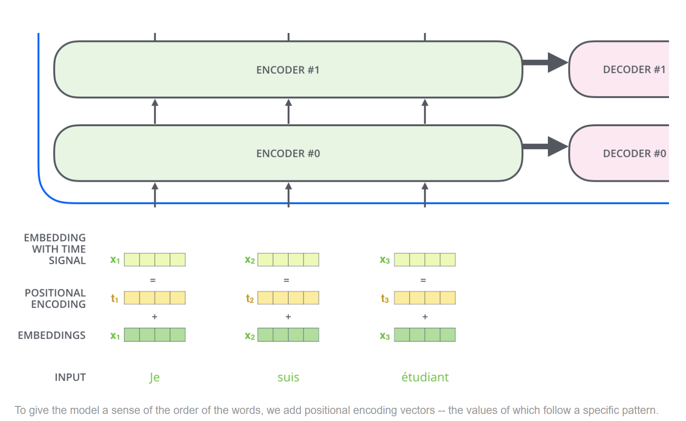

> Q: 为什么对位置单独编码？输入序列在进入 encoder stack 的时候，它们之间的位置关系不是隐含在矩阵的列之间了吗？
>
> A: 在计算中，矩阵没有保留利用位置索引的机制。位置编码为每个位置（如第 1 位、第 2 位、第 3 位）添加了唯一的向量，这样同一个单词如果出现在不同位置，表示含义也不同，例如：位置 1 的 dog 通常是主语，位置 3 的 dog 通常是宾语
>
> 和 RNN/CNN 对比：RNN 中的 hidden state 携带历史，时间步为隐式编码；CNN 中卷积核的滑动窗口依赖于固定的局部顺序。但 Transformer 是全连接的，self-attention 连接所有 token 对，没有递归或卷积结构，因此需要显式注入位置信息

一种位置编码方式是 sin/cos 编码：位置编码向量和输入 embedding 维度相同，每个位置、维度的值由函数决定。

sin/cos 编码优势是能捕捉向量间的相对距离信息（而非绝对位置），从而得到两个向量的关系，因此模型能泛化到比训练序列更长的序列

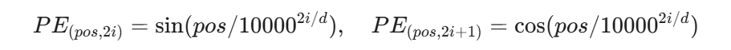

**Residuals 残差 **

残差。也称 skip connections，将某一层的输入直接加到输出上。是为了解决多层网络训练准确率下降而提出的

Transformer 每个 encoder 的 self-attention 子层都有残差：output = LayerNorm(x + SubLayer(x))。

sublayer 可以是 self-attention 也可以是 FFN

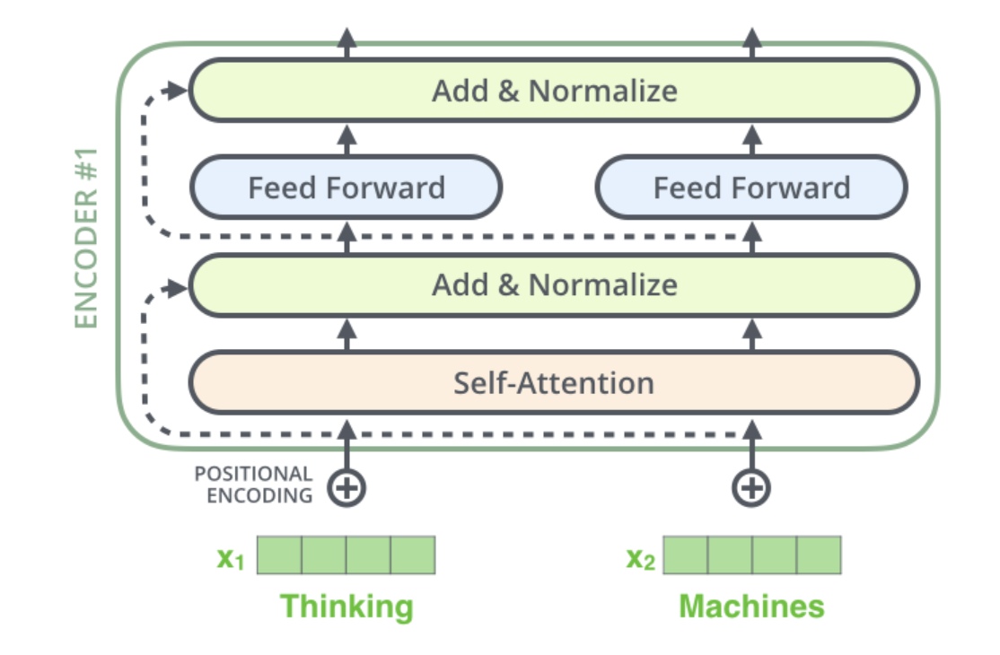

更详细的展示。LayerNorm 作用于残差后的结果，对单个样本的所有特征维度归一化，避免深层网络方差爆炸。（加上残差后，N 层输出方差是 $1+\sigma^2$）

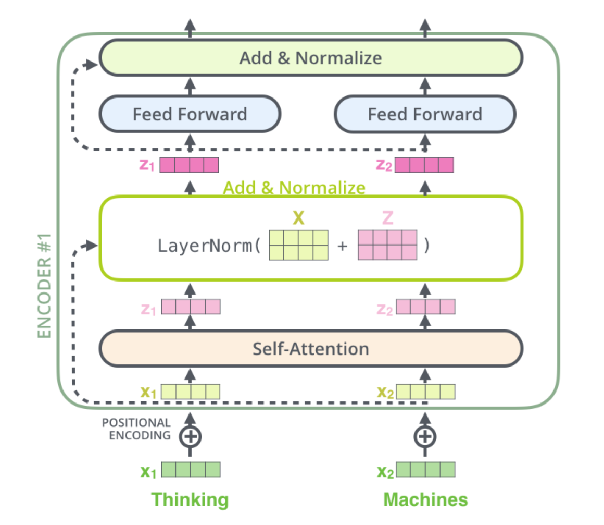

类似地，decoder 中也有 residual-layernorm 结构：

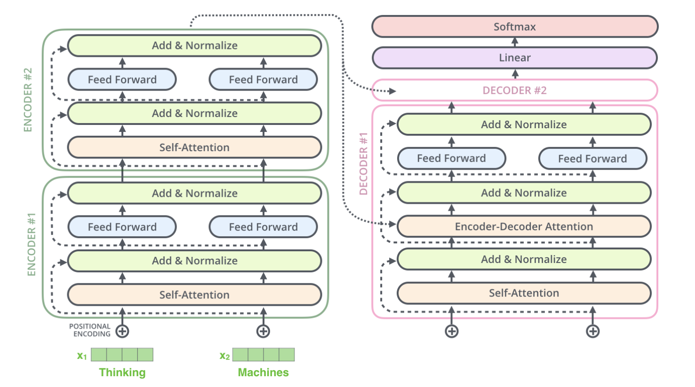

**decoder side**

最后一个 encoder 的输出被转换成一组注意力向量 K、V。这里的 KV 被每个 decoder 的 encoder-decoder attention 层中使用，帮助 decoder 聚焦输入系列的适当位置

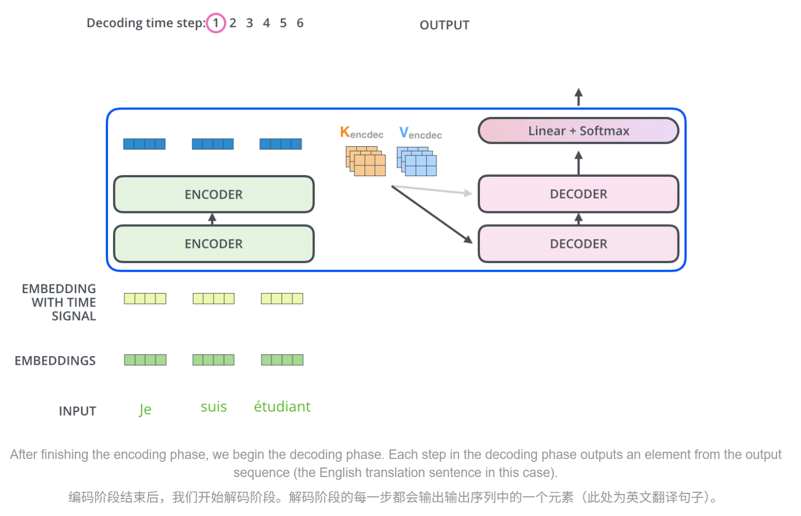

重复这个过程，直到 decoder 输出表示结束的特殊符号 \<EOS>。每一步生成一个词，并将该词作为下一步的输入

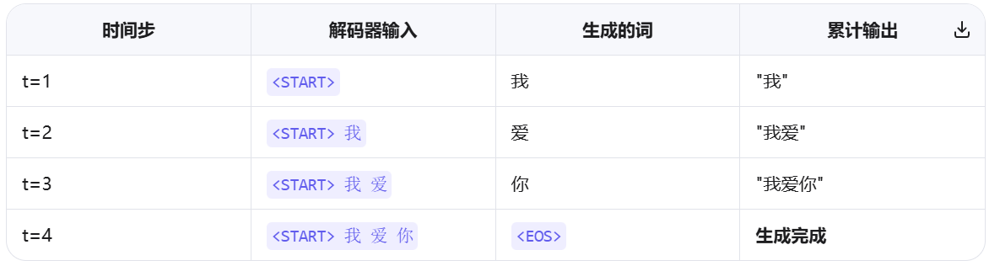

在 decoder 中，self-attention 层只能关注输出序列中更早的位置，通过在 softmax 前对 future position 设置 mask 实现

encoder-decoder 层的工作原理类似于多头自注意力层，但是 Q 矩阵来源于前序 decoder 的输出，K、V 矩阵来源于 encoder stack 的输出

** Linear 层和 Softmax 层 **

回忆整个 transformer 的架构：encoder stack -> decoder stack -> linear + softmax

最后的 linear+softmax 层将 decoder stack 输出的 vector of floats 转换成单词：

- linear 层是一个全连接神经网络，将 vector 投影到一个更大的向量，称为 logits 向量。logits 大小等于 vocabulary 大小，每个分量表示一个单词的得分
- softmax 将得分转换成概率，概率最高的单词被选中输出

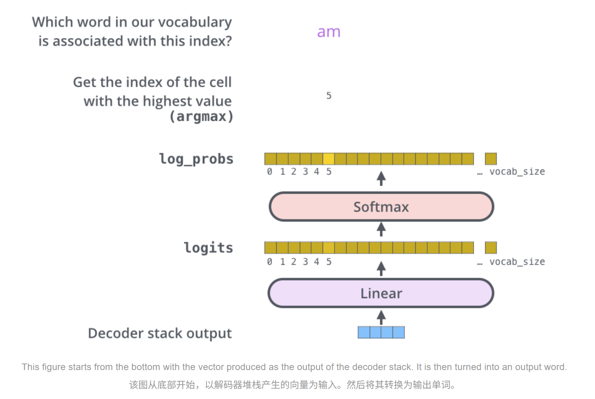

** 模型训练过程回顾 **

模型训练过程中，也有前述的前向传播过程，如果是在 labeled 训练集上训练，可以将模型输出与实际输出相比较

使用 one-hot 编码来表示 vocabulary 的每个词的概率分布，例如：

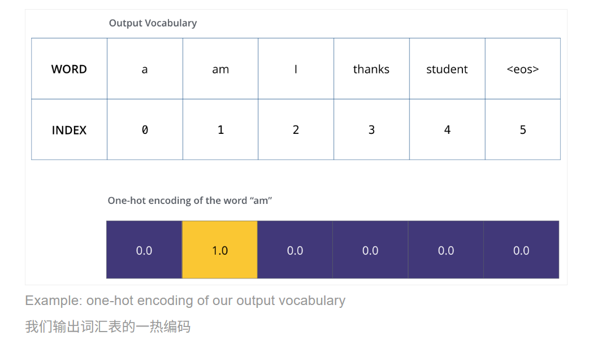

损失计算是 token-level 的，每个时间步比较 “模型预测的概率分布” 和 “该位置真实 token 概率分布” 的 one-hot 分布

Transformer 在序列生成（如翻译）中使用 token-level 的交叉熵损失：

- 模型在位置 t 输出一个词汇表大小的概率分布（如 30,000 维）
- 与真实目标 token 的 one-hot 分布计算交叉熵
- 对所有时间步的损失求平均或求和作为总损失

使用 teacher forcing，不让模型自回归生成完整句子：

- Decoder 的输入是目标句子右移一位（shifted right）的真实 token 序列
- 在每个时间步 t，模型基于前 t-1 个真实 token 预测第 t 个 token
- 即使模型在 t-1 步预测错误，下一步输入仍使用真实 token（而非模型自己的预测）

使用 teacher forcing 的好处：

- 训练效率高，teacher forcing 允许并行计算所有时间步的损失
- 避免早期错误预测造成后续梯度消失 / 爆炸
- 训练目标是最大化正确翻译的似然概率

## Architecture Advancements on Transformers

本节介绍基于 Transformer 架构的一些改进工作

原版 Transformer 架构

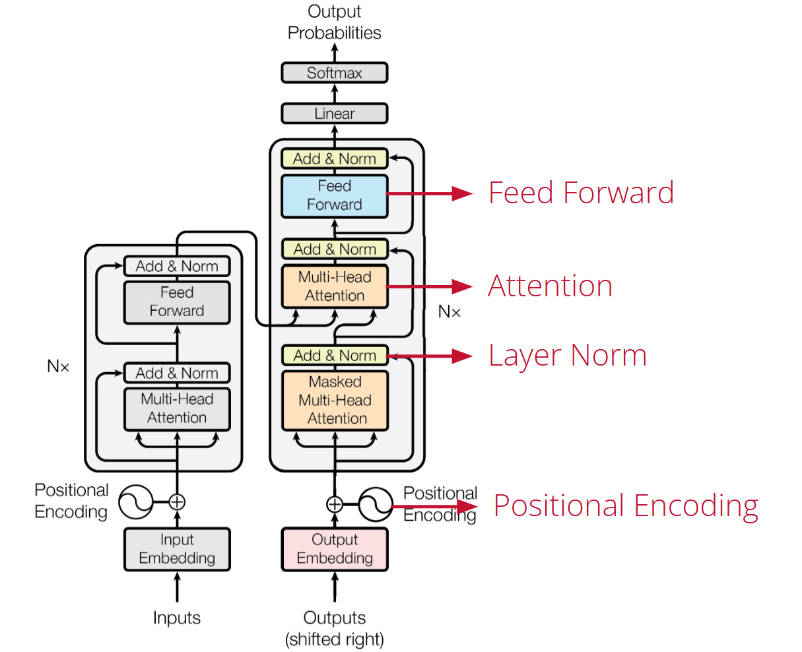

**FFN 优化 **

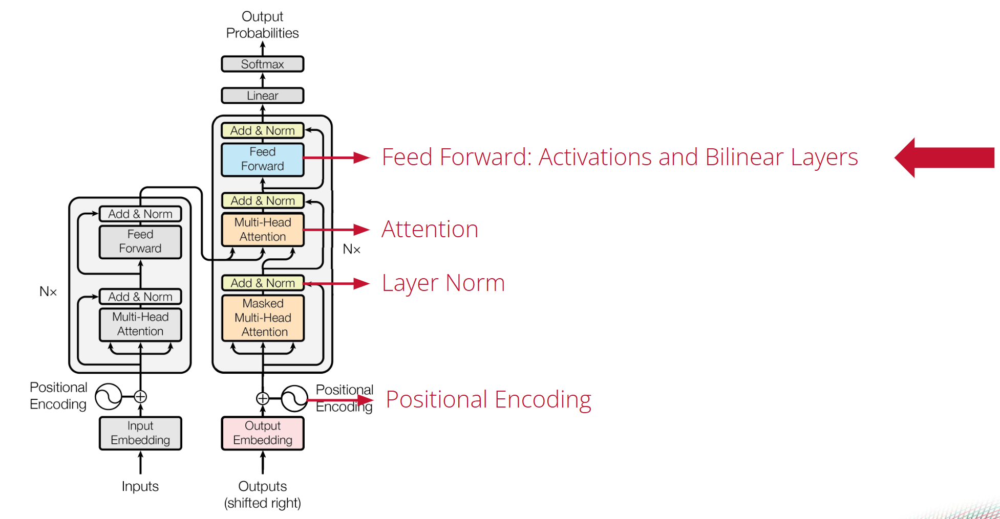

原版 FFN 使用 linear+ReLU+linear 的结构。ReLU 的负数部分梯度是 0，训练不稳定

优化的激活函数：

GELU (Gaussian Error Linear Unit)，ReLU 的平滑版本，$GELU(x)=x \cdot \Phi(x)$，$\Phi(x)$ 是标准正态分布的累积分布函数

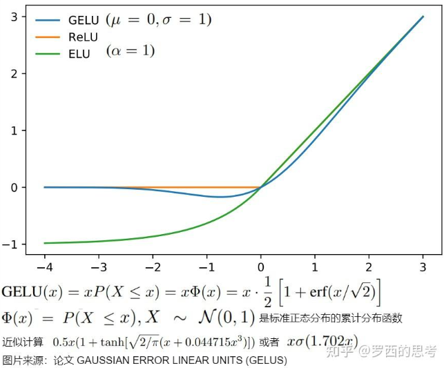

Swish 函数，曲线平滑并且在所有点可微，$Swish(x)=x\cdot Sigmoid(\beta x)$。
$\beta$ 可以控制函数形状，通常是常数或者让模型学习得到。beta=0 时 Swish 退化成线性函数，beta=∞时 Swish 变成 ReLU.
一般设置 beta=1，此时称为 SiLU，Sigmoid Gated Linear Unit

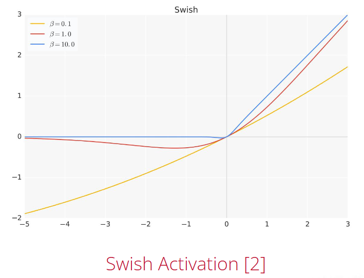

Bilinear FFN，非标准 FFN 的线性结构。两个 FFN 路径，按元素乘积，再线性变换

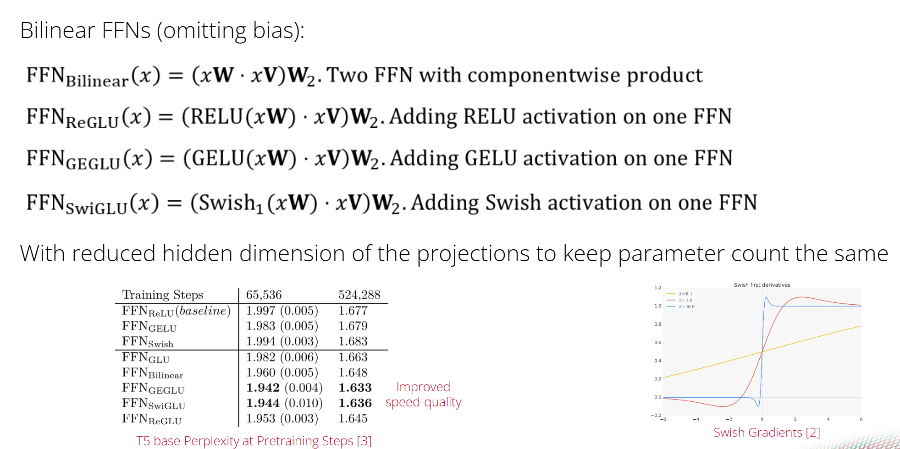

** 注意力优化 **

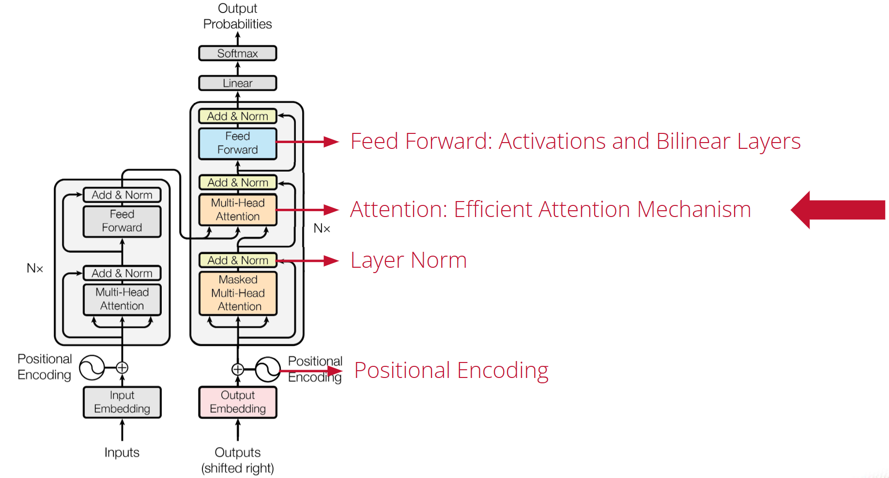

Standard Multi-Head Attention：每个头有自己的 QKV 矩阵，最后需要将所有头输出的 qkv 向量拼起来。每个 QKV 矩阵都需要占内存，下面几个变体注意力机制旨在优化 kv cache 占用

Grouped-Query Attention：将 query 头分组，每组共享独立的 k/v。kv cache 压缩比等于 group size。在推理优化场景有应用，例如训练时用 MHA，推理时转换成 GQA，在 group 内部平均。在几乎不损失质量前提下（<1%），显著降低推理延迟和内存

Multi-Query Attention：所有 query 头共享单个 key/value 头，在 GQA 基础上再减少 kv cache 大小。MQA 会导致模型表达能力下降，推理质量下降

Multi-Head Latent Attention：非共享 K/V。通过低秩联合压缩将 kv 映射到 latent space，用可学习的解压矩阵重建近似 kv，大幅减少 kv cache。MLA 比 GQA 压缩率更高，且不损失质量，适合超长上下文

一些性能数据，展示 GQA 可以平衡生成速度和质量：

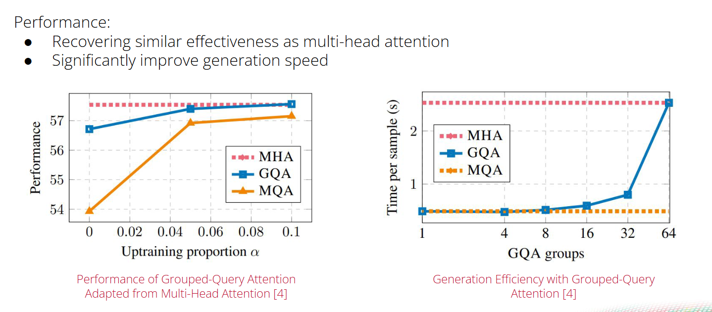

**Layer Norm 优化 **

Layer Norm 是为了解决训练不稳定问题设置，通过归一化每层输出稳定分布，使训练收敛更快。归一化在 `(batch, seq_len, d_model)` 的 `d_model` 维度进行，即同一 token 的不同特征维度被归一化，不同 token 独立处理

按照位置关系，有几种变体：

- Post-LN：原始 Transformer，x → Attention/FFN → Residual → LayerNorm，残差后面再接 LN，训练不稳定可能梯度爆炸
- Pre-LN：现代主流。x → LayerNorm → Attention/FFN → Residual。LN 后面接残差，削弱归一化效果。

Pre-LN 无需 warm-up，训练更稳定且收敛更快

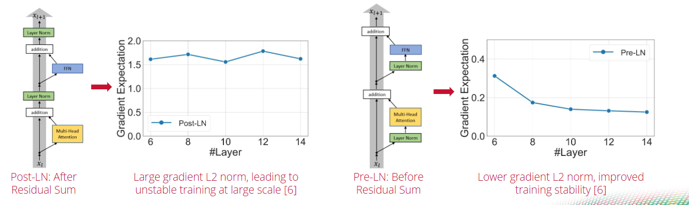

LayerNorm 的优化变体：

- RMSNorm (Root Mean Square Norm): 移除均值中心化，仅用均方根缩放

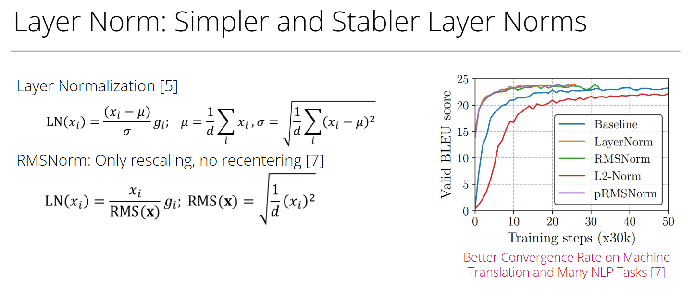

**Position Encoding 优化 **

Transformer 本身是不感知 position 的，因为计算注意力的时候只用了 qkv 的数值，没有位置信息

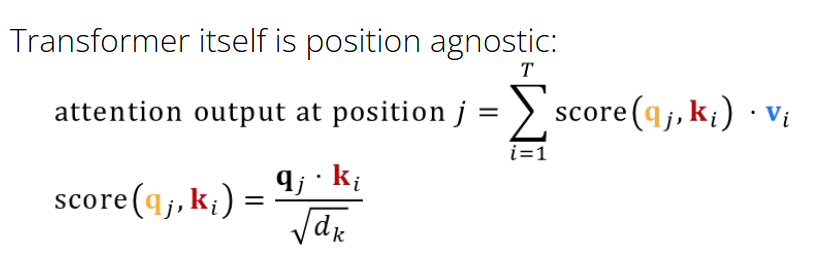

CNN、RNN 中都有隐式传递的位置信息。因为语言的序列数据依赖位置，所以 Transformer 需要在 token embedding 上增加 position encoding

语言理解中，单词之间的相对位置 / 相对距离比绝对位置更重要，因此，可以引入相对位置优化原注意力公式

$b_{i-j}$ 是可训练的相对位置 bias，根据相对距离 $i-j$ 动态调整，让模型更符合语言的相对位置特性。

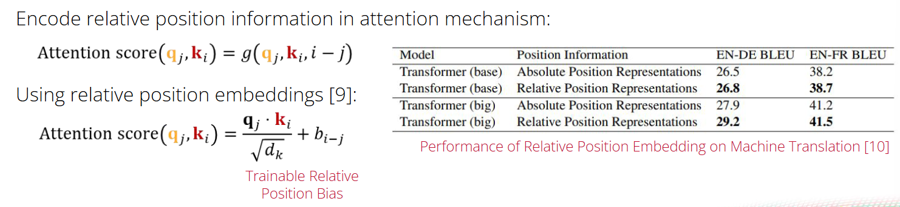

**Position Encoding: Rotational Position Embedding (RoPE)**

传统位置编码如 sin/cos 编码无法自然表示 “相对位置”，导致模型需额外学习相对位置关系，效率低

RoPE 将相对位置转化成向量夹角，使用旋转角度表示位置差。
位置近、夹角小、点积大；位置远、夹角大、点积小

对 q/k 向量应用旋转矩阵，$q_j$ 逆时针转 $j\theta$ 角度，$k_i$ 你是在转 $i\theta$ 角度，然后：
旋转 $j\theta$ 的 $q_j$ 和旋转 $i\theta$ 的 $k_i$ 的点积等于 $q_j$ 和旋转 $(i-j)\theta$ 的 $k_i$ 的点积。这样就把相对位置的信息引入注意力分数了。（callback，transformer 中是用绝对位置的 sin/cos 编码、加法融合，导致注意力分数依赖绝对位置）

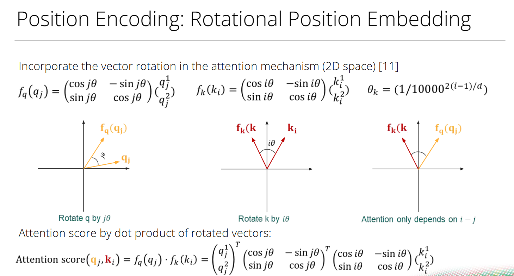

处理高维向量时，RoPE 将维度分为两两一组，然后每对 2 维的旋转计算 “附带相对位置” 的 qk 对

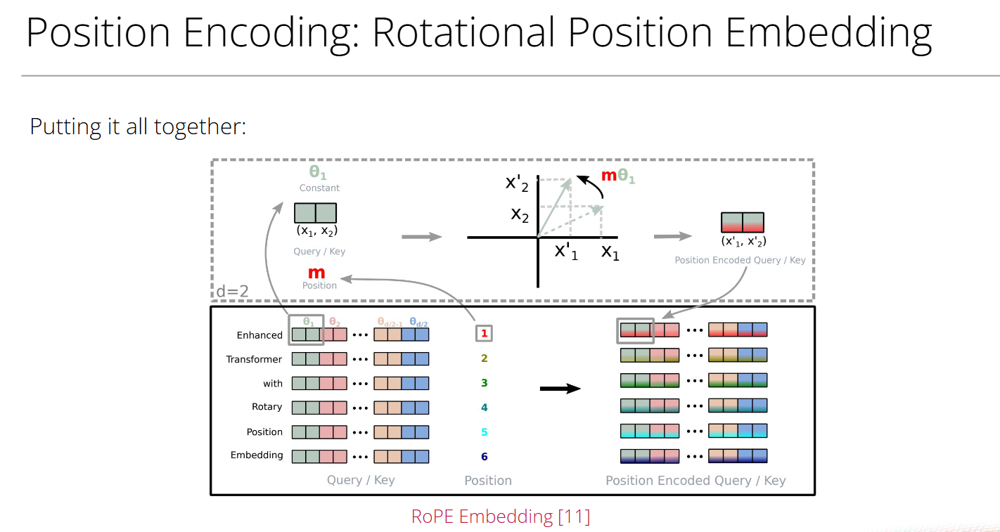

** 总结 **

对 Transformer 几个位置的优化

- FFN: 使用比 ReLU 更平滑的激活函数
- Attention: 优化注意力计算时的 kv cache 占用
- LayerNorm: 更稳定的 LN，最后面接残差
- Positional Encoding: 更好地捕捉单词位置信息（相对位置），如 RoPE

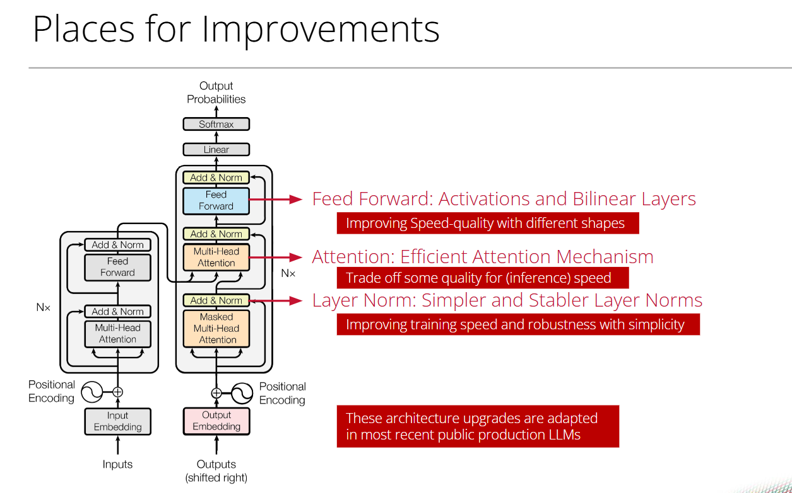

**LLaMA3 的架构优化 **

前面的都用上了

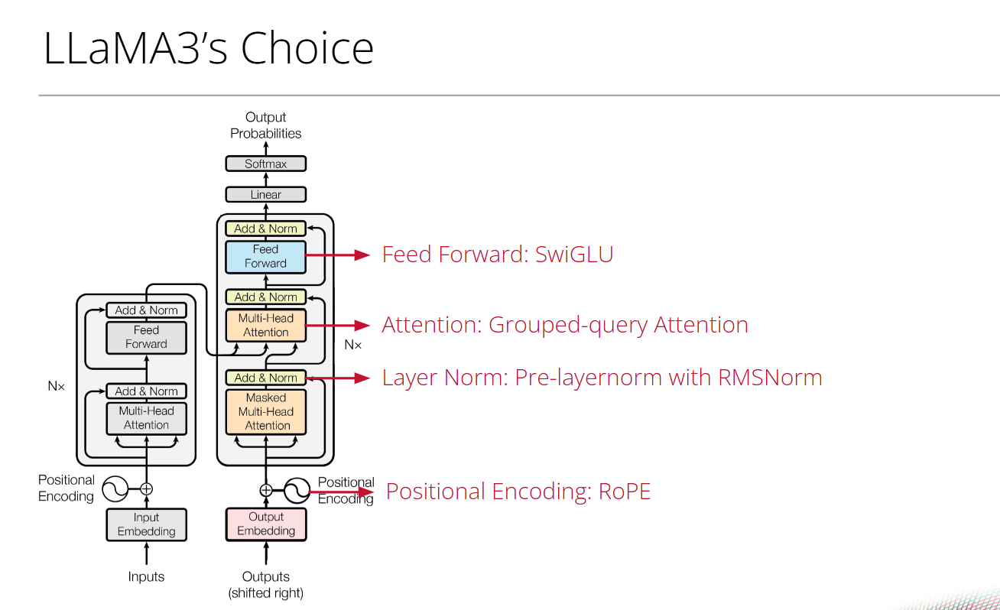

## Automatic Evaluation of LLMs

评估模型的标准：

- 抽象属性：质量、信息量、毒性、客户满意度
- 可量化指标：perplexity（困惑度 / 文本流畅度）、任务准确率、点击率

几种评估序列生成的方法：

- word error rate：从生成序列到期望序列的编辑距离。缺点是，不好处理同义词
- perplexity：交叉熵损失的 e 指数。值越小表示模型越 “确信” 正确答案。和测试集、分词器有关系。衡量的是模型对 “已知分布” 的拟合程度，不是人类感知的 “质量”
- BLEU：比较生成序列和期望序列的 n-gram 重合度，分数越高表示越接近期望序列。在机器翻译任务上，BLEU 和人工打分中度相关
- ROUGE k：和 BLEU 比较 precision 不同（有多少 generation 的词出现在 reference），ROUGE 比较 recall（有多少 reference 的词出现在 generation）

上面的 metric 都是基于序列相似性的，还有基于语义相似性的方法 BERTScore，可以更有效识别同义词场景。

以及，直接学习人类打分的 regression/ranking model 的 COMET。regression 是模拟人类打出分数，ranking 是给两个 hypothesis，模型选出更好的那个。ranking 的可以适用以下场景：

- 搜索
- 问答
- 自动补全，给出建议 list

后面还有关于 ranking 的更多讨论，这里略

## Customizing LLMs via full model finetuning

Transformer 之前，每个模型是根据特定任务数据来训练。
2018 的 Transformer 之后，对大模型先进行 generic language understanding 的预训练，再针对每个 NLP 任务微调

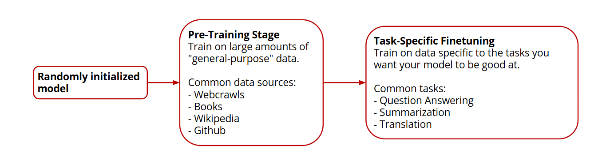

full model-finetuning（全量模型微调）的缺点：

- 训练全量模型时，显存需要存储梯度，因此显存占用远大于推理
- 如果微调数据集较小，容易过拟合
- 每微调一个任务都需要保存一份权重副本，存储成本高
- 任务很多时，同时部署所有的模型成本很高

提高效率的方法：

- 避免微调全参数，in-context learning
- parameter-efficient finetuning
- 将 multi-task finetuning 变成 instruction finetuning

**in-context learning**

GPT-2 paper 提出了一个论点：
language models are unsupervised multitask learners

这句话体现了这么几点：

- 简单的核心机制：Transformer 架构的自回归模型，本质任务就是预测下一个 token。为了预测下一个 token，模型需要理解语法、事实、逻辑甚至代码结构，这种简单机制是后续所有复杂能力的基础
- 自监督（无监督）：传统机器学习中，大多数任务需要有人工标注数据的 “有监督学习”，而 LLM 可以在公开文本上训练，这使得模型的数据量可以无限扩展
- 多任务：传统的 AI 是一个模型对应一个任务，但是现在的模型通过 prompt + 上下文学习完成多种任务。并且，这种能力是随着模型变大而 “涌现” 的

GPT-3 paper 提出：
language models are few-shot learners

这句话体现：

- 泛化能力质变：当模型大到一定程度，只要给几个例子，模型能快速适应新任务
- 推理即训练：在推理时提供示例，可以利用上下文窗口进行轻量级 “训练”

in-context learning：
将完成任务需要的信息，作为 prompt 的一部分传给 LLM。few-shot learning 是给 instruction+example，zero-shot 是指给 instruction

**parameter-efficient finetuning**

PEFT 高效微调算法，微调少量参数。主要分三类：

- addition：额外引入可训练参数，只训练这部分参数。如 prompt tuning、prefix tuning、adapters、compacters
- specification：选择网络中的部分参数，tune 这些参数。如 layer freezing、BitFit、DiffPruning
- reparameterization：重参数化，将权重的更新量分解成更小的、可训练的结构，如低秩矩阵。如 LoRA、QLoRA、$(IA)^3$

**addtion**

- prompt tuning
  - 动机：使用大量的 task example 训练一个 NN，来生成好的 task prompt
  - 方法：优化嵌入向量而非离散 token，将优化的向量加到 LLM 输入前面，引导模型
- prefix tuning
  - 动机：和 prompt tuning 类似，在模型输入序列前加上一串可训练的 prefix。但是 learned prefix 除了会追加到 input embedding，还会追加到 Transformer 的每一层 k/v
- adapter
  - adapter 是在预训练网络的层之间插入的小型可训练 module

prefix/prompt tuning 优缺点：

- 优点：learned embedding 一般比较小（几 MB）；推理时可以对任务切换特定 embedding
- 缺点：比全参数微调收敛慢；best prefix length 不确定；learned embedding 可解释性差

adapter 结构。在 Transformer 的每一层插入，下图以 FFN 之后插入 adapter 为例

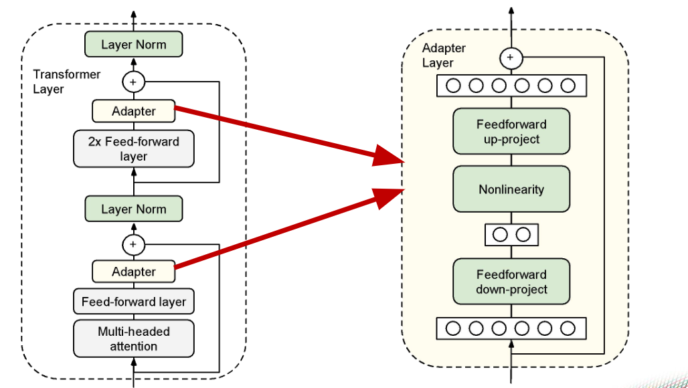

adapter 优缺点：

- 优点：比 prefix/prompt tuning 收敛更快；adapter 为模块化，可独立保存加载。在多任务中很有效，例如 AdapterFusion 可组合多个 adapter
- 缺点：新增网络层导致推理变慢；让模型更大，adapter size 和 layer number 有关

**specification**

- layer freezing
  - 动机：Transformer 浅层（靠近 embedding）主要是处理语言基础（局部特征、通用语言规则），深层是负责做决策（全局语义、逻辑、任务意图）。因此为了学习新任务，可以 freeze earlier layer，只微调 later layer
- BitFit：bias-terms fine-tuning。冻结所有权重矩阵，只训练 bias
- DiffPruning
  - 动机：前面的方法都是手动划分 freeze/tune 的参数，DiffPruning 选择学习 “更新哪些参数”
  - 方法：目标是找到 $\Delta W$ 使得 $W_{final}=W_{pretrained}+\Delta W$，并且 $\Delta W$ 是稀疏的。

**reparameterization**

什么是 intrinsic demension？

如果一个大模型是将数据映射到高维空间进行处理，这里假定在处理一个细分的小任务时，是不需要那么复杂的大模型的，可能只需要在某个子空间范围内就可以解决，那么也就不需要对全量参数进行优化了，现实中我们难以精确找到某个问题所对应的子空间，但是我们可以定义当对某个子空间参数进行优化时，能够达到全量参数优化的性能的一定水平（如 90% 精度）时，那么这个子空间所对应的维度就可以称为对应当前待解决问题的 Intrinsic Dimension

关于 intrinsic dimension 的几个结论：

1. 预训练隐式地降低了 Intrinsic Dimension
2. 大模型在经过一定次数训练后，倾向于有着更低的 Intrinsic Dimension
3. 越简单的下游任务，有着越低的 Intrinsic Dimension
4. 越低的 Intrinsic Dimension，有着越好的泛化性能

reparameterization 动机：
finetuning 的 intrinsic dimension 是 low，为了达到目标性能需要调整的最小参数量是不大的。因此，可以在训练时为了好优化，将参数拆开（原始权重 + 旁路小矩阵）

- LoRA (Low Rank Adaption)
  - 动机：模型权重是低秩的，权重的更新量也是低秩的，因此不需要完整的矩阵表示权重变化
  - 方法：LoRA 向每一层增加可训练的秩分解矩阵，像 DiffPruning 一样学习 delta，但是 LoRA 将 delta 重参数化为更低维形式。实际应用中，LoRA 只适配注意力层，其他层不变
- $(IA^3)$ (Infused Adapater by Inhibiting and Amplifying Inner Activations)
  - 旨在改进 LoRA 的方法
  - 目标：尽量减少新增 / 更新的参数量；仅用少量示例训练就能达到强准确性；允许 mixed-task batches
  - 核心思想：使用低维学习向量来 rescale inner activation，这些向量被注入到注意力模块、前馈模块
  - 和 LoRA 的区别：LoRA 在权重空间操作（加法），IA3 在激活空间操作（乘法 rescale）
- QLoRA (Quantized LoRA) 比 LoRA 更高效

** fine tuning 总结 **

- 性能：full fine tuning > LoRA > adapter > prefix tuning > prompt tuning
- memory usage：full fine tuning > adapter > LoRA > BitFit

如何使用 PEFT？

- 大模型厂商的 finetuning API
- HuggingFace 的 PEFT lib

** 实践 **

- 如何更新参数：全量微调、PEFT
- 用什么数据训练：multi-task（传统 NLP 任务）、instruction（指令 - 响应对）

以翻译为例，prompt tuning 里面的 few-shot example 是让模型学会 “按 xx 格式翻译”，而 instruction 是让模型学会翻译能力。

instruction tuning 训练数据例子：

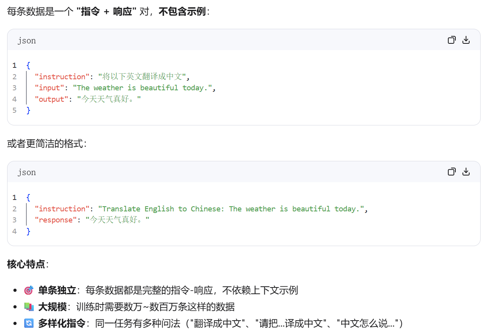
