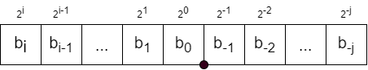
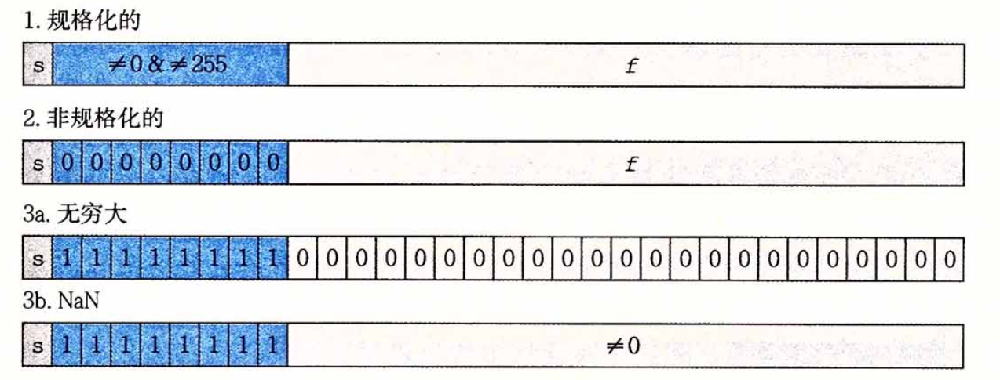
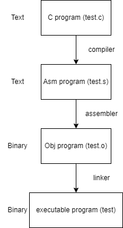

[toc]


## 简介

课程网站：http://csapp.cs.cmu.edu/

Lab assignments：http://csapp.cs.cmu.edu/3e/labs.html


## 1 Course Overview

* 计算机中数字的表示方法
* 机器语言、程序的解释和运行
* 内存模型
* 网络编程
* 并行编程、同步


## 2 Bits, Bytes and Integers

位运算可以用于集合的表示和运算：

```
和bitmap类似,1101表示集合{0,2,3},1000表示集合{3}
那么两个集合的交集可以用&表示
```

有符号的整数最高位是负数：

```
有一个5位的有符号数，每一位代表的数分别是：-16,8,4,2,1
那么，-10可以表示位10110
所以，5位的有符号数能表示的最小值是10000，最大值是01111
```

算术扩展，需要将符号位复制到所有扩展的位上：

```
一个5位的有符号数，原来是10110
现在扩展到6位：110110，按照前面的权重计算方法，-16=-32+16
扩展到8位：11110110，-16=-2^7+2^6+2^5+2^4
算术右移也是类似的
```


字节序：

* 大端（big endian）：高位字节在低地址，大端模式和字符串的存储模式类似
* 小端（little endian）：低位字节在低地址


## 3 Floating Point

浮点数的也可以用二进制表示：



上面的表示法有局限性

* 像`0.3`这样的数就不能用有限的位数表示，得表示为部分位循环的`0.0101[01]...`这种
* 当小数点的位置固定的时候，能表示的数的范围就固定了，而且表示范围和精度不能兼得

鉴于上面的局限性，**浮点**就是可移动的小数点


**浮点表示法**

类似于科学计数法，形式为：$(-1)^s \ M \ 2^E$

s 是 sign bit，决定正负；M 是尾数，一个二进制小数，范围是$[1.0,2.0)$；E 是阶码

 在编码中的形式为：

```
====================
|| s | exp | frac ||
====================
```

exp field 编码了 exp，但是不等于 E；frac field编码了 M，但是不等于 M

在 float32 中，s-exp-frac 的位数为 1-8-23 bit；在 float64 中，s-exp-frac 的位数为 1-11-52 bit


**单精度浮点数**



In normalized value:

* exp field is not 11...1 or 00...0
* $E=Exp-bias$
  * Exp: exp field unsigned value, bias: $2^{k-1}-1$, k: exp bits
  * single precision bias = 127, E in -126...127
  * double precision bias=1023, E in -1022...1023
* frac has implied leading `1`, $M=1.xxxx_2$
  * M in $1.0$...$2.0-\epsilon$

把浮点数设计成这种`符号位-阶码-尾数`的编码，是为了<u>方便浮点数之间的比较</u>。本来 exp 可能是负的，但是加了 bias 之后，encoded exp field 只可能是无符号的整数，方便比较。


In denormalized value:

* exp field = 00...0
* E = 1 - bias
* frac has implied leading `0`, $M=0.xxxxx_2$

当 exp field 和 frac field 全为 0 时，因为符号位 s，可能有`+0`和`-0`


Special values:

* exp field = 11...1
* $\infty$: exp = 11...1, frac = 00...0
* NaN: exp = 11...1, frac is not 00...0


把 norm value 和 denorm value 表示在数轴上的话，越靠近 0 的地方数字是越密集的，可以这样理解，在 exp field 固定时，frac field 增长的速度要乘以一个权重才等于整个数字增长的速度，这个权重就是由 exp field 决定的，所以数字越大在数轴上越分散。


**Rounding**

四舍六入五成双

IEEE 浮点数使用的舍入方式是：nearest even，向最近的偶数舍入


## 4 Machine-Level Programming I: Basics

object code in binary form 和 assembly code 是一一对应的关系


**Concepts**

Intel x86 processors:

* Complex Instruction Set Computer (CISC), Reduced ... (RISC)

ARM: Acronym RISC Machine

Architecture (Instruction Set Architecture, ISA): 定义了处理器指令集和规范。例如 Intel 的 x86、IA32、x86-64和 ARM 的 ARMv7、ARMv8

Microarchitecture: ISA implementation 


**C code -> object code**



26'22

