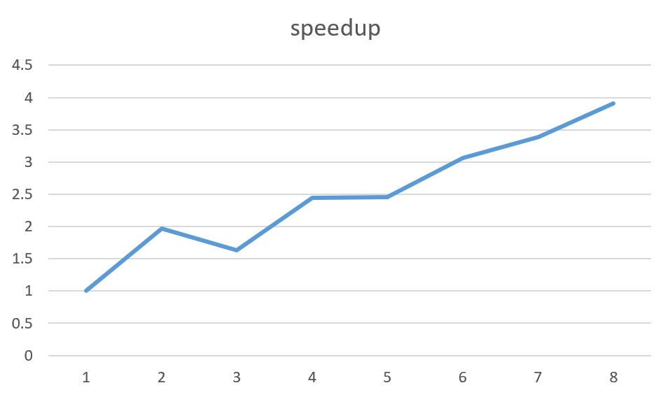
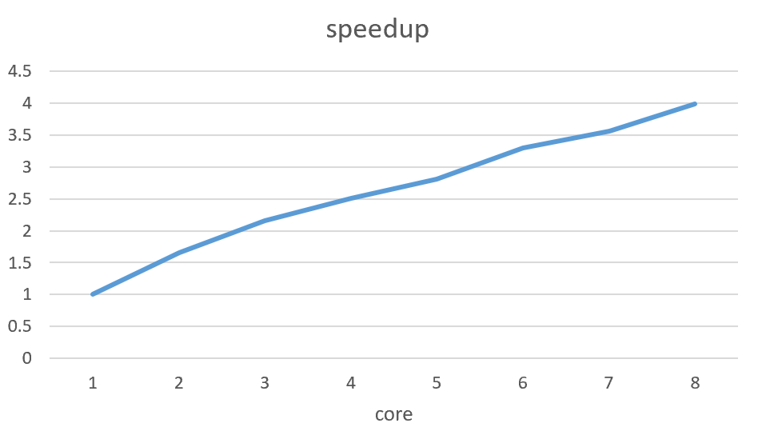

# Lab Notes

CS149 Parallel Computing Handout: <https://gfxcourses.stanford.edu/cs149/fall21>

## Assignment 1: Analyzing Parallel Program Performance on a Quad-Core CPU

### Program 1

1-8 thread下view 1的加速比：

1-8 thread下view 2的加速比：

总体来说，thread数目越大加速比越大。但是在view1中，thread为3时出现明显的性能下降，可能是和计算分配方式有关，中间的部分计算时间较长，拉低了整体加速比。

确实是thread 1比较慢

换成round-robin方法之后，即将所有行划分成一些chunk，线程按照0-1-2这样的顺序来计算，speedup上去了

