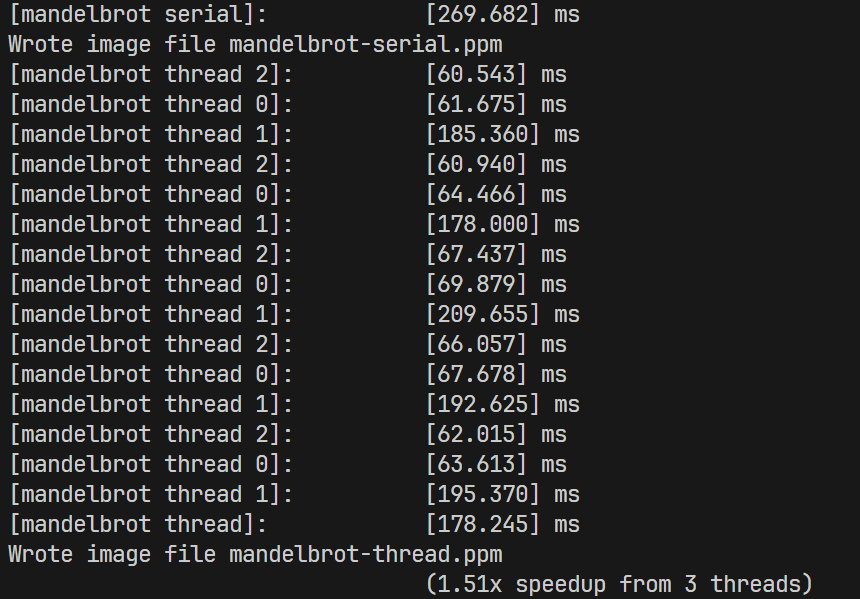
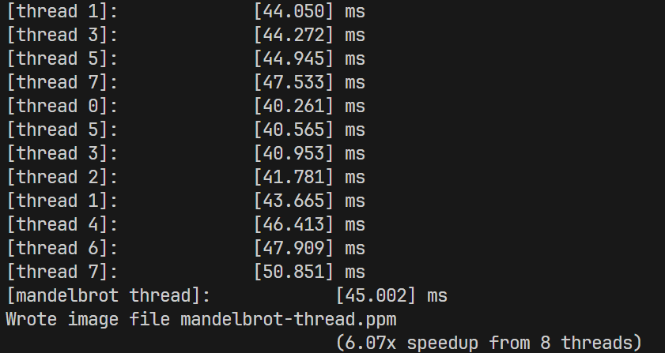

# Lab Notes

<!-- TOC -->

- [Lab Notes](#lab-notes)
  - [Assignment 1: Performance Analysis on a Quad-Core CPU](#assignment-1-performance-analysis-on-a-quad-core-cpu)
    - [Program 1: Parallel Fractal Generation Using Threads (20 points)](#program-1-parallel-fractal-generation-using-threads-20-points)
    - [Program 2: Vectorizing Code Using SIMD Intrinsics (20 points)](#program-2-vectorizing-code-using-simd-intrinsics-20-points)
    - [Program 3: Parallel Fractal Generation Using ISPC](#program-3-parallel-fractal-generation-using-ispc)
    - [Program 4: Iterative `sqrt`](#program-4-iterative-sqrt)

<!-- /TOC -->
<!-- /TOC -->
<!-- /TOC -->

## Assignment 1: Performance Analysis on a Quad-Core CPU

### Program 1: Parallel Fractal Generation Using Threads (20 points)

确实是 thread 1 比较慢

换成 round-robin 方法之后，即将所有行划分成一些 chunk，线程按照 0-1-2 这样的顺序来计算，speedup 上去了

### Program 2: Vectorizing Code Using SIMD Intrinsics (20 points)

1. 见代码
2. vector width 为 2、4、8、16 时的 vector utilization 如下图：

vector utilization 表示 enabled vector lane 的比例，因此 exponent 的分布会影响该值。当 vector width 越小时，对 exp 分的组越小，极小值的影响也小。
3. 见代码。先分组计算 vector，再对 vector 内求和。

### Program 3: Parallel Fractal Generation Using ISPC

Part 1

1. ISPC 程序的实际加速比为：3.37（view 1）和 3.08（view 2）。我推测的加速比为 8，因为 ISPC compiler 生成的 SIMD 指令一次操作的浮点数为 8 个。实际加速比较低的原因为：SIMD 分支分歧。在计算 Mandel 图时，黑白交界处就会出现这种分歧，view2 的加速比更低也是佐证。

Part 2

1. view 1 的加速比为：3.55（ISPC）、6.78（task ISPC）。
2. 加速比和 task 数目的关系。看起来 8 task 时效果最好

| task   | speedup |
| -------|---------|
| 2      | 5.98    |
| 4      | 6.51    |
| 8      | 6.99    |
| 16     | 6.59    |

### Program 4: Iterative `sqrt`

1. 加速比为：3.79（ISPC）、43.91（ISPC task）。
2. 我把输入数组的值全部换成了 `2.999f`，一方面这个输入会让 serial 计算时间最长，另一方面 ISPC SIMD 也不会提前退出造成分歧。最后的加速比为：4.26（ISPC）、37.37（ISPC task）
3. 输入设置为：`2.999f`（index 为 8 的倍数）、`1.f`（其他元素）。一方面可以减少 serial 的计算时间，另一方面让 SIMD 出现分歧。最后的加速比为：0.61（ISPC）、5.72（ISPC task）