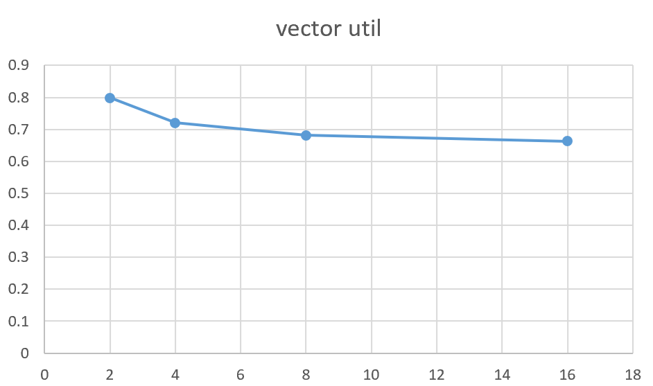

# Lab Notes

<!-- TOC -->

- [Lab Notes](#lab-notes)
  - [Assignment 1: Performance Analysis on a Quad-Core CPU](#assignment-1-performance-analysis-on-a-quad-core-cpu)
    - [Program 1: Parallel Fractal Generation Using Threads (20 points)](#program-1-parallel-fractal-generation-using-threads-20-points)
    - [Program 2: Vectorizing Code Using SIMD Intrinsics (20 points)](#program-2-vectorizing-code-using-simd-intrinsics-20-points)
    - [Program 3: Parallel Fractal Generation Using ISPC](#program-3-parallel-fractal-generation-using-ispc)
    - [Program 4: Iterative `sqrt`](#program-4-iterative-sqrt)
    - [Program 5: BLAS `saxpy`](#program-5-blas-saxpy)
  - [Assignment 2: Building A Task Execution Library from the Ground Up](#assignment-2-building-a-task-execution-library-from-the-ground-up)
  - [Assignment 3: A Simple CUDA Renderer](#assignment-3-a-simple-cuda-renderer)
    - [Part 1: CUDA Warm-Up 1: SAXPY (5 pts)](#part-1-cuda-warm-up-1-saxpy-5-pts)
    - [Part 2: CUDA Warm-Up 2: Parallel Prefix-Sum (10 pts)](#part-2-cuda-warm-up-2-parallel-prefix-sum-10-pts)
    - [Part 3: A Simple Circle Renderer (85 pts)](#part-3-a-simple-circle-renderer-85-pts)

<!-- /TOC -->
<!-- /TOC -->
<!-- /TOC -->

## Assignment 1: Performance Analysis on a Quad-Core CPU

### Program 1: Parallel Fractal Generation Using Threads (20 points)


确实是 thread 1 比较慢

换成 round-robin 方法之后，即将所有行划分成一些 chunk，线程按照 0-1-2 这样的顺序来计算，speedup 上去了


### Program 2: Vectorizing Code Using SIMD Intrinsics (20 points)

1. 见代码
2. vector width 为 2、4、8、16 时的 vector utilization 如下图：

vector utilization 表示 enabled vector lane 的比例，因此 exponent 的分布会影响该值。当 vector width 越小时，对 exp 分的组越小，极小值的影响也小。
3. 见代码。先分组计算 vector，再对 vector 内求和。

### Program 3: Parallel Fractal Generation Using ISPC

Part 1

1. ISPC 程序的实际加速比为：3.37（view 1）和 3.08（view 2）。我推测的加速比为 8，因为 ISPC compiler 生成的 SIMD 指令一次操作的浮点数为 8 个。实际加速比较低的原因为：SIMD 分支分歧。在计算 Mandel 图时，黑白交界处就会出现这种分歧，view2 的加速比更低也是佐证。

Part 2

1. view 1 的加速比为：3.55（ISPC）、6.78（task ISPC）。
2. 加速比和 task 数目的关系。看起来 8 task 时效果最好

| task   | speedup |
| -------|---------|
| 2      | 5.98    |
| 4      | 6.51    |
| 8      | 6.99    |
| 16     | 6.59    |

### Program 4: Iterative `sqrt`

1. 加速比为：3.79（ISPC）、43.91（ISPC task）。
2. 我把输入数组的值全部换成了 `2.999f`，一方面这个输入会让 serial 计算时间最长，另一方面 ISPC SIMD 也不会提前退出造成分歧。最后的加速比为：4.26（ISPC）、37.37（ISPC task）
3. 输入设置为：`2.999f`（index 为 8 的倍数）、`1.f`（其他元素）。一方面可以减少 serial 的计算时间，另一方面让 SIMD 出现分歧。最后的加速比为：0.61（ISPC）、5.72（ISPC task）

### Program 5: BLAS `saxpy`

1. task 带来的加速比为 1.95。该程序涉及很多内存读写，因此内存带宽是瓶颈
2. 读取写入 result 需要两次内存访问，读取 xy 需要两次，所以总内存访问次数是 4n

## Assignment 2: Building A Task Execution Library from the Ground Up

共两个 part，见代码了

## Assignment 3: A Simple CUDA Renderer

### Part 1: CUDA Warm-Up 1: SAXPY (5 pts)

1. CUDA 改写的 saxpy 程序计算 `N=100M` 输入的时间为 62ms（kernel 运行 1.4ms）。ISPC CPU 计算 `N=20M` 输入的时间为 6ms
2. CUDA 程序只有 2.3% 时间在计算，大部分时间在传数据。有效带宽为 15-17 GB/s，DGX-2 的内存带宽约 128GB/s，未跑满带宽的原因可能是：host CPU 内存未固定，因此 GPU 在访问内存时要走 VMA 转换，而不能直接访问内存。要使用 pinned memory，好像要用 `cudaHostAlloc()` 函数


### Part 2: CUDA Warm-Up 2: Parallel Prefix-Sum (10 pts)

这道题需要用 CUDA 改写前缀和算法。个要注意的点：算法是对长度为 2 的幂的数组设计的，但是输入的参数不一定满足要求。

```c
void exclusive_scan_iterative(int* start, int* end, int* output) {

    int N = end - start;
    memmove(output, start, N*sizeof(int));

    // upsweep phase
    for (int two_d = 1; two_d <= N/2; two_d*=2) {
        int two_dplus1 = 2*two_d;
        parallel_for (int i = 0; i < N; i += two_dplus1) {
            output[i+two_dplus1-1] += output[i+two_d-1];
        }
    }

    output[N-1] = 0;

    // downsweep phase
    for (int two_d = N/2; two_d>= 1; two_d /= 2) {
        int two_dplus1 = 2*two_d;
        parallel_for (int i = 0; i < N; i += two_dplus1) {
            int t = output[i+two_d-1];
            output[i+two_d-1] = output[i+two_dplus1-1];
            output[i+two_dplus1-1] += t;
        }
    }
}
```

我在这里的写法就是最简单的改编，对于输入不是 2 的幂的情况，就用了 `nextPow` 做了 workaround。


### Part 3: A Simple Circle Renderer (85 pts)

