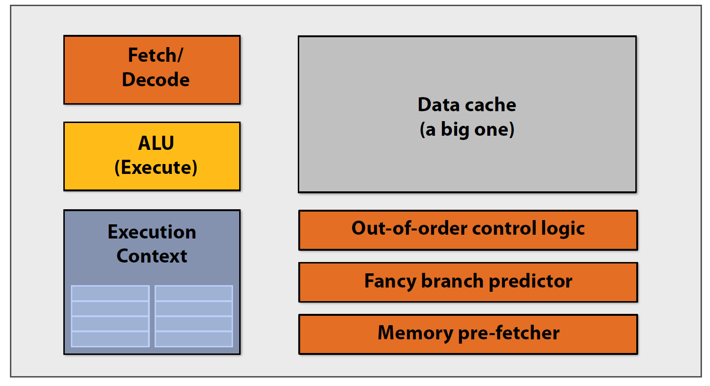
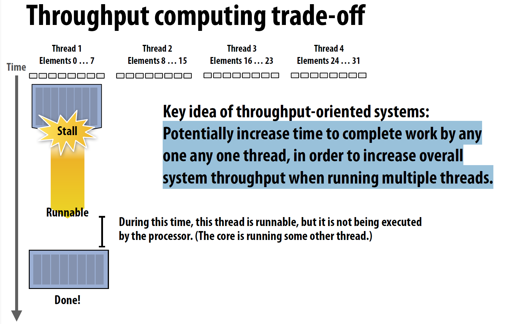

# Lecture

<!-- TOC -->

- [Lecture](#lecture)
  - [1 - Why prallelism? Why efficiency?](#1---why-prallelism-why-efficiency)
  - [2 - A Modern Multi-Core Processor](#2---a-modern-multi-core-processor)
    - [Parallel Execution](#parallel-execution)
    - [Accessing Memory](#accessing-memory)
  - [3 - Parallel Programming Abstractions](#3---parallel-programming-abstractions)
    - [Shared address space model](#shared-address-space-model)
    - [Message passing model](#message-passing-model)
    - [Data-parallel model](#data-parallel-model)
  - [4 - Parallel Programming Basics](#4---parallel-programming-basics)
  - [5 - Performance Optimization Part 1: Work Distribution and Scheduling](#5---performance-optimization-part-1-work-distribution-and-scheduling)

<!-- /TOC -->
<!-- /TOC -->
<!-- /TOC -->
<!-- /TOC -->
<!-- /TOC -->
<!-- /TOC -->
<!-- /TOC -->

## 1 - Why prallelism? Why efficiency?

使用 P 个处理器的加速比：$1 处理器的执行时间 / P 处理器的执行时间 $

本课程的主题：

- 优化并行程序中的通信。
- 并行系统的硬件架构。
- 对 efficiency 的理解。fast 不等于 efficient，充分利用硬件能力才能算有效。例如使用 10 个处理器但加速比为 2，不一定是个好结果。

Instruction level parallelism (ILP)

- 含义：处理器会按照顺序执行指令。但是对于相互独立的指令，处理器会同时执行这些指令，这样可以在不影响程序正确性的前提下加速程序。
- superscalar execution：处理器在同一时钟周期内并行执行多条 independent instruction 来提高性能和吞吐量

大部分支持 ILP 的处理器在一个时钟周期内可以处理 4 条指令，处理指令数大于 4 带来的加速有限。

ILP 带来的单核性能提升也到瓶颈了：

功率墙（power wall）

由于功耗和散热的限制，处理器的时钟频率和性能不能无限提升。

处理器的 core voltage 决定最大可能的频率。

基于两个原因，需要通过并行带来性能提升：

- 功率限制了频率
- ILP 对单核性能提升已到瓶颈

总结

- 单核性能提升已经到瓶颈
- 编写并行程序需要了解分区、通信、同步的知识，以及硬件相关

## 2 - A Modern Multi-Core Processor

### Parallel Execution

在多核处理器产生之前，性能提升的方法是：加速 single instruction stream 的执行。

通过增加晶体管数量，可以获得更大的 cache、更智能的 out-of-order logic、更只能的 branch predictor 等。

下面以计算 $sin x$ 为例，介绍并行程序的写法。使用 Taylor 公式计算，$sinx=x-x^3/3!+x^5/5!-x^7/7!+\dots$

data-parallel

一种优化方法是，观察到每项级数之间没有依赖关系，假设一共要计算 N 个级数，那么可以分两个线程计算，每个线程计算 N/2 个级数。

另一种优化方式使用 SIMD，摊销计算成本。（SIMD 指令集通过特定的指令来控制 ALU，以便在一个指令周期内对多个数据进行操作）

在执行有分支的 SIMD 代码时，可能出现线程分歧（thread divergence）的情况，只有部分 ALU 在有效计算。

一些术语

- coherent execution：对所有被操作的元素执行相同的指令，这样处理器可以最大提高并行效率
- divergent execution：在 SIMD 和 SIMT 架构下，线程或数据元素在条件分支选择的执行路径不同，因此导致了性能损失

SSE 指令集：支持 128 位的 SIMD 操作。4 个 32 位，或者 2 个 64 位

AVX 指令集：支持 256 位 SIMD 操作。8 个 32 位，或者 4 个 64 位。

CPU 上的显式 SIMD：程序员明确使用 SIMD 指令或 intrinsic，生成的可执行文件里面可以看到相关指令

GPU 上的隐式 SIMD：编译器生成 scalar instruction，硬件负责在 SIMD ALU 上执行相同的指令，但是处理的数据不同。

GPU 的 SIMD width 一般为 8-32，SIMD 宽度会影响并行代码的写法。

总结，现代处理器中 parallel execution 的形式：

- multi-core
  - thread-level parallelism，每个 core 上执行不同的 instruction stream
  - 需要在代码中创建 thread
- SIMD
  - data parallel
  - 向量化可以由编译器执行，也可以由硬件在 runtime 执行
  - 程序员要了解代码中的依赖并声明，或者由编译器推断
- superscalar
  - instruction parallel
  - 由硬件在 runtime 并行执行

### Accessing Memory

- memory latency: 处理器的 memory request（例如 load/store）得到相应的时间。例如 100 cpu cycles，100 nsec
- memory bandwidth: 内存系统向处理器提供数据的速度，例如 20GB/s
- stall: 处理器因为之前指令的依赖关系，无法执行后续指令。内存访问就是产生 stall 的一个主要原因。
- memory access time: 在 100 个 cpu cycle 量级。

现代处理器的缓存：

缓存可以减少 memory access latency

Prefetching

prefetch 可以提前把数据读到 CPU cache，减少 stall 并 hide latency。同时，预取也可能让性能降低。

Multi-threading

同一个 core 上 interleave 处理多个线程可以 hide stall。和 prefetch 类似，multi-threading 是 hide stall 的方法，而非 reduce latency 的方法。

对优化 throughput-oriented 系统的启示：

单个 interleave thread 完成工作的时间可能增加，但是整个系统的吞吐量增加了，因为 CPU 没有空闲时间。

Storing execution context：L1 cache 可以存储 thread execution context，用于 hide latency

Hardware-supported multi-threading

- core 管理多个线程的 execution context
- interleaved multi-threading (temporal multi-threading)：core 在每个 cycle 会选择一个 thread 来执行
- simultaneous multi-threading (SMT): core 在每个 cycle 会选择多个线程的指令在 ALU 上执行。例如 Intel 的超线程技术，每个 core 可以有 2 个线程

多线程总结：

- 优点：有效利用 ALU 资源。hide memory latency
- 开销：
  - thread context storage
  - 增加单个线程的执行时间。（一般不是问题，并行应用一般关注吞吐）
  - 需要的内存带宽更大。（更多的线程 -> 每个线程的 cache 更小 ->memory access 可能更多）

GPU

上图的上半部分有 16 个 SIMD ALU，但是能一次处理 32 个 warp 的数据。这是因为 ALU 的运行频率是其他组件的两倍。（但是对程序员来说，GPU 的 SIMD width 可以看成是 32）

GTX480 有 15 个 core，每个 core 有 32 个 ALU，因此同时能处理 15*32*48=23000 个 warp

CPU 和 GPU 的内存访问架构

如果处理器请求数据的速度太快，那么内存的带宽会成为瓶颈。对于 throughput-optimized system 来说，内存带宽是一个常见的挑战。对于一个高效的并行应用：

- 尽量少从内存拿数据。1）重用同一线程之前加载的数据。2）在线程之间共享数据。
- 提高计算的占比。arithmetic intensity 是 math operation 和 data access 的比例，提高这个比例可以充分利用处理器性能

总结

## 3 - Parallel Programming Abstractions

Intel SPMD Program Compiler (ISPC)

SPMD: single program multiple data

以 sinx 的计算为例，在执行 ISPC code 时，会启动多个 ISPC program instance，这些 instance 是并行运行的

ISPC compiler 会生成 SIMD 实现，ISPC instance 的数量等于硬件的 SIMD width

将 element 分配给 instance 有两种方式，interleaved 和 blocked

对于 interleaved 的方式，因为每个 instance 的输入可以一次读入，所以效率会高于 block

上面并行代码的改造方式是在循环内部，指定了每个 instance 的输入。ISPC 提供了一种更高的抽象层级，直接用 `foreach` 标记循环

- `foreach` 声明了 parallel loop interation
- ISPC 会在 instance 间分配 interation，默认的是 interleave 分配

ISPC 总结，抽象和实现：

- SPMD 编程模型。抽象出来的模型包括：`programCount` 个逻辑执行流，每个执行流的标识值为 `programIndex`
- SIMD 实现。ISPC 编译器会生成对应的指令。

一个计算多个数的和的例子。左边的 `sum` 为 `uniform`，只有一份，因此左边的会在编译时报错。

从系统层级理解 pthread 并行和 ISPC：

三种 communication model 的抽象

- shared address space
- messgae passing
- data parallel

### Shared address space model

程序可以看成是 instruction sequence。内存可以看成是 array of bytes，包含 address 和对应的 value。

thread 需要 sync 共享变量的读写操作，sync primitive 也是共享变量，例如 lock

由于 thread 之间可能会 interleave 执行，因此在每个 thread 执行 load-add-store 过程中，如果发生 interleave，会导致最后的结果不符合预期，因此某些 instruction 组合需要被 atomic 执行。

保证 atomicity 的方法

shared memory model 硬件实现：任意处理器可以直接访问任意位置的 memory

interconnect 方式有很多了，比如 shared bus、crossbar、ring、multi-stage network

Non-Uniform Memory Access (NUMA)

现象：不同 core 访问相同 memory location 的 latency 可能不一样，下图中 core 5-8 访问 X 位置

总结

### Message passing model

每个 thread 的 address space 是私有的，通过发送 / 接收消息来交流

### Data-parallel model

这块只看 slides 不是很好理解，我的理解是 data parallel 是指类似 python `map` 函数那样批量操作？

Map

以其他函数作为参数的高阶函数，可以对 sequence 操作。可以对 sequence 的所有元素应用 side-effect free 的函数 f。

因为函数 f 是无副作用的，因此及时 reorder/parallelize map 的顺序，输出也是不变的

对 map 的一些优化：

- 重组代码（map fusion）：对于一些连续的 map（例如 a->b->c），可以 reorg code 来减少 memory load/store
- prefetch：在处理 input sequence 时，prefetch 下一个元素来 hide memory latency

gather instruction

按照输入的位置，批量提取内存数据

总结

- 基本思想：将函数 map 到 data collection
- 有很多其他的 parallel operator：gather、scatter、reduce、scan、shift 等
- 这门课中会有很多需要用 data parallel primitive 思考的内容，但是很多现代的 data parallel language 并没有强制实现 data parallel primitive。例如 ISPC、CUDA 都在设计时选择命令式（imperative）的，并没有选择函数式
- 抽象模型和硬件实现的对应关系

## 4 - Parallel Programming Basics

编写并行程序的过程：

- 确定哪些部分可以并行处理
- 分配工作、数据
- 处理 data access、communication、synchronization 等
- 一般的目标是更大的加速比

在第一步的分解问题中，关键是找到程序中的依赖 / 非依赖关系

Amadahl law：依赖会限制加速比

定律表示，系统整体的性能提升受到不可并行部分（串行）部分的限制。整个系统最大的加速比是： 1 / 串行部分比例

从图中可以看出来，即使串行部分比例很小，最终的加速比也是被限制了

分配工作的时候，可以直接分配数据（比如 for 循环中划分数据），也可以用 ISPC task 分配。运行过程中，ISPC task 会动态分配给 worker thread

Orchestration

- worker thread 合作完成任务的过程，涉及任务调度、同步等操作。
- 目标是减少开销：减少通信 / 同步的开销，保持 data locality

Mapping

- 将 worker thread map 到 hardware execution unit
- 可以被 OS/compiler / 硬件执行 map
- 将 related thread 放在相同的处理器可以增加 locality，将 unrelated thread（一个是带宽受限，一个是计算受限）放在同一个处理器可以增加机器利用率

一个优化 Gauss-Seidel 迭代法的例子：

矩阵中每个元素需要通过周围的四个元素计算

寻找依赖关系，发现每个元素依赖的是：上面的元素、左边的元素

发现每个对角线上的元素彼此没有依赖，可以并行计算，但是这样有一些问题

上面的优化方法不够好，因此提出新的优化方法，需要用到具体领域知识（在并行编程中很常见）

新方法。先并行更新红色节点，再并行更新黑色节点，轮流计算直到收敛

具体到工作分配部分，有两种分配方式 blocked 和 interleaved。
这里说两种方法都可以，具体取决于系统实现。（这里 blocked 方法 locality 较好，负载可能不均匀；interleaved 方法负载均衡较好，通信开销较小？）

每轮计算之后，更新的值需要同步，blocked 需要同步的数据更少

三种实现方式：data parallel、shared address space、message passing

data parallel

shared address space

两种 sync primitive：lock、barrier

shared address space solver 包括：
全局的变量、每个 thread 都要执行的函数，下图用 lock 来保护修改 diff 的操作的原子性。

一个可能的性能瓶颈是，每次循环都要用一次 lock。正确的方法是先在本地保存临时值，最后用一次 lock

barrier

为什么有三个 barrier：

- 第一个是初始化的
- 每个 thread 都收敛
- 全部 thread 退出

优化代码，只用一个 barrier。优化思路：

- 使用临时变量，减少依赖（用存储换依赖）

两个编程模型的比较：data parallel、shared address space。

两个模型包括 synchronization 和 communication 的步骤，但是具体的形式不同。
对于 data parallel，synchronization 的形式是：并行执行结构完成，例如 `forall` 这种会等待所有 worker 都完成。
communication 的形式则是：通过共享变量的 load/store 实现，或者其他高级的原语例如 `reduce`。

对于 shared address space，synchronization 的形式是：通过锁这种共享变量实现 mutual exclusion。
communication 的形式则是：通过共享变量的 load/store，和前面类似。

总结

- Amdahl's law。最大加速比取决于程序中顺序执行部分的占比。
- 编写并行程序的要点。将整体工作拆分成互不依赖的部分，交给多个 worker 执行，同时协调这些 worker，以及这些操作在硬件上的 mapping

## 5 - Performance Optimization Part 1: Work Distribution and Scheduling

并行编程有几个关键目标：

- 将工作负载均匀分配在硬件资源上
- 减少 communication，从而减少 stall
- 减少 parallelism 带来的额外开销

与之对应的，优化并行程序有几个 tip：

- 多次迭代，每次用最简单的方法，每次迭代之后检查性能并继续优化
- xxx

Static assignment

在 worker 之间分配工作的方式和 runtime factor 无关。例如前面的 blocked/interleaved 分配方式。
static assignment 的优点是：简单，没有 runtime overhead。

适用条件：工作的数量和执行时间是可预测的，因此可以提前分配。

Semi-static assignment

工作的开销在短期是可预测的，可以用现在的开销来预测未来短期的开销。
应用会周期调整 assignment。

Dynamic assignment

任务的执行时间、总数都是不可预测的。
程序在 runtime 动态决定 assignment，以保证负载均匀分配。

这里给了两个例子：

- 顺序程序中，每次循环时间不确定
- 并行程序中，由于 mutual exclusion 限制，导致每次执行时间不确定

dynamic assignment，使用 work queue 存放所有的 sub problem，worker 会从 shared queue 拿任务，同时可能向队列加任务

一个程序的例子。这个程序的 workload partition 不错，但是 sync overhead 太高。

一种解决方法是，降低 workload partition granularity，从而减少 sync overhead

因此这就是一个 assignment/sync 的 trade-off，因此选择合适的 task size 很重要。

- task 的数量比 processor 数量越多越好，因为这样可以保证 workload balance（task granularity 越小越好）
- task 的数量越少越好，因为这样可以减少 assignment 的开销。（因此 task granularity 越大越好）

Smarter task scheduling

前面的方法主要是假设每个 task 的执行时间相近，对于 task 时间长短不一的情况，有其他的优化方法。

先调度 long task，并且执行 long task 的 worker 的总 task 数目更少。这种调度方法需要知道 workload 的 cost 特征。

slides5 p17/64