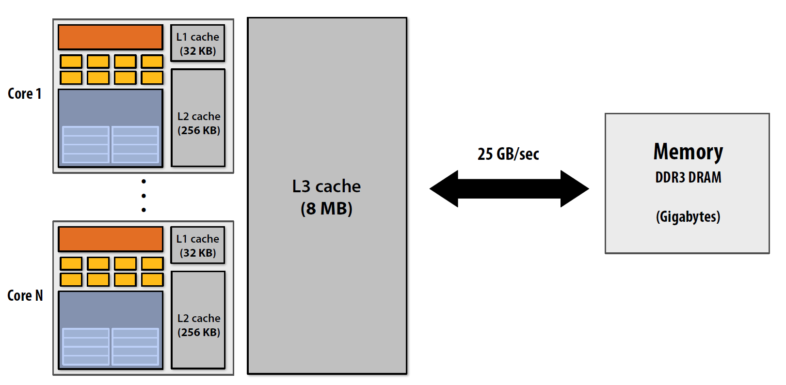
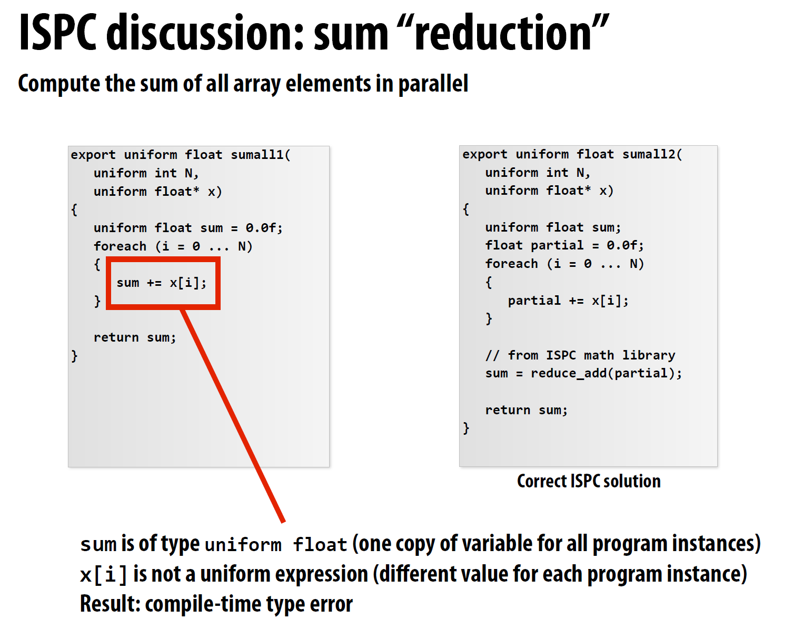

# Lecture

<!-- TOC -->

- [Lecture](#lecture)
  - [1 - Why prallelism? Why efficiency?](#1---why-prallelism-why-efficiency)
  - [2 - A Modern Multi-Core Processor](#2---a-modern-multi-core-processor)
    - [Parallel Execution](#parallel-execution)
    - [Accessing Memory](#accessing-memory)
  - [3 - Parallel Programming Abstractions](#3---parallel-programming-abstractions)
    - [Shared address space model](#shared-address-space-model)
    - [Message passing model](#message-passing-model)
    - [Data-parallel model](#data-parallel-model)
  - [4 - Parallel Programming Basics](#4---parallel-programming-basics)
  - [5 - Performance Optimization Part 1: Work Distribution and Scheduling](#5---performance-optimization-part-1-work-distribution-and-scheduling)
  - [6 - Performance Optimization Part 2: Locality, Communication, and Contention](#6---performance-optimization-part-2-locality-communication-and-contention)
  - [7 - GPU Architecture \& CUDA Programming](#7---gpu-architecture--cuda-programming)
  - [8 - Data-Parallel Thinking](#8---data-parallel-thinking)

<!-- /TOC -->

## 1 - Why prallelism? Why efficiency?

使用 P 个处理器的加速比：$1 处理器的执行时间 / P 处理器的执行时间 $

本课程的主题：

- 优化并行程序中的通信。
- 并行系统的硬件架构。
- 对 efficiency 的理解。fast 不等于 efficient，充分利用硬件能力才能算有效。例如使用 10 个处理器但加速比为 2，不一定是个好结果。

Instruction level parallelism (ILP)

- 含义：处理器会按照顺序执行指令。但是对于相互独立的指令，处理器会同时执行这些指令，这样可以在不影响程序正确性的前提下加速程序。
- superscalar execution：处理器在同一时钟周期内并行执行多条 independent instruction 来提高性能和吞吐量


大部分支持 ILP 的处理器在一个时钟周期内可以处理 4 条指令，处理指令数大于 4 带来的加速有限。

ILP 带来的单核性能提升也到瓶颈了：


功率墙（power wall）

由于功耗和散热的限制，处理器的时钟频率和性能不能无限提升。

处理器的 core voltage 决定最大可能的频率。

基于两个原因，需要通过并行带来性能提升：

- 功率限制了频率
- ILP 对单核性能提升已到瓶颈

总结

- 单核性能提升已经到瓶颈
- 编写并行程序需要了解分区、通信、同步的知识，以及硬件相关

## 2 - A Modern Multi-Core Processor

### Parallel Execution

在多核处理器产生之前，性能提升的方法是：加速 single instruction stream 的执行。

通过增加晶体管数量，可以获得更大的 cache、更智能的 out-of-order logic、更只能的 branch predictor 等。


下面以计算 $sin x$ 为例，介绍并行程序的写法。使用 Taylor 公式计算，$sinx=x-x^3/3!+x^5/5!-x^7/7!+\dots$

data-parallel

一种优化方法是，观察到每项级数之间没有依赖关系，假设一共要计算 N 个级数，那么可以分两个线程计算，每个线程计算 N/2 个级数。

另一种优化方式使用 SIMD，摊销计算成本。（SIMD 指令集通过特定的指令来控制 ALU，以便在一个指令周期内对多个数据进行操作）

在执行有分支的 SIMD 代码时，可能出现线程分歧（thread divergence）的情况，只有部分 ALU 在有效计算。


一些术语

- coherent execution：对所有被操作的元素执行相同的指令，这样处理器可以最大提高并行效率
- divergent execution：在 SIMD 和 SIMT 架构下，线程或数据元素在条件分支选择的执行路径不同，因此导致了性能损失


SSE 指令集：支持 128 位的 SIMD 操作。4 个 32 位，或者 2 个 64 位

AVX 指令集：支持 256 位 SIMD 操作。8 个 32 位，或者 4 个 64 位。

CPU 上的显式 SIMD：程序员明确使用 SIMD 指令或 intrinsic，生成的可执行文件里面可以看到相关指令

GPU 上的隐式 SIMD：编译器生成 scalar instruction，硬件负责在 SIMD ALU 上执行相同的指令，但是处理的数据不同。

GPU 的 SIMD width 一般为 8-32，SIMD 宽度会影响并行代码的写法。

总结，现代处理器中 parallel execution 的形式：

- multi-core
  - thread-level parallelism，每个 core 上执行不同的 instruction stream
  - 需要在代码中创建 thread
- SIMD
  - data parallel
  - 向量化可以由编译器执行，也可以由硬件在 runtime 执行
  - 程序员要了解代码中的依赖并声明，或者由编译器推断
- superscalar
  - instruction parallel
  - 由硬件在 runtime 并行执行

### Accessing Memory

- memory latency: 处理器的 memory request（例如 load/store）得到相应的时间。例如 100 cpu cycles，100 nsec
- memory bandwidth: 内存系统向处理器提供数据的速度，例如 20GB/s
- stall: 处理器因为之前指令的依赖关系，无法执行后续指令。内存访问就是产生 stall 的一个主要原因。
- memory access time: 在 100 个 cpu cycle 量级。

现代处理器的缓存：

缓存可以减少 memory access latency



Prefetching

prefetch 可以提前把数据读到 CPU cache，减少 stall 并 hide latency。同时，预取也可能让性能降低。

Multi-threading

同一个 core 上 interleave 处理多个线程可以 hide stall。和 prefetch 类似，multi-threading 是 hide stall 的方法，而非 reduce latency 的方法。


对优化 throughput-oriented 系统的启示：

单个 interleave thread 完成工作的时间可能增加，但是整个系统的吞吐量增加了，因为 CPU 没有空闲时间。


Storing execution context：L1 cache 可以存储 thread execution context，用于 hide latency

Hardware-supported multi-threading

- core 管理多个线程的 execution context
- interleaved multi-threading (temporal multi-threading)：core 在每个 cycle 会选择一个 thread 来执行
- simultaneous multi-threading (SMT): core 在每个 cycle 会选择多个线程的指令在 ALU 上执行。例如 Intel 的超线程技术，每个 core 可以有 2 个线程

多线程总结：

- 优点：有效利用 ALU 资源。hide memory latency
- 开销：
  - thread context storage
  - 增加单个线程的执行时间。（一般不是问题，并行应用一般关注吞吐）
  - 需要的内存带宽更大。（更多的线程 -> 每个线程的 cache 更小 ->memory access 可能更多）

GPU


上图的上半部分有 16 个 SIMD ALU，但是能一次处理 32 个 warp 的数据。这是因为 ALU 的运行频率是其他组件的两倍。（但是对程序员来说，GPU 的 SIMD width 可以看成是 32）

GTX480 有 15 个 core，每个 core 有 32 个 ALU，因此同时能处理 15*32*48=23000 个 warp

CPU 和 GPU 的内存访问架构


如果处理器请求数据的速度太快，那么内存的带宽会成为瓶颈。对于 throughput-optimized system 来说，内存带宽是一个常见的挑战。对于一个高效的并行应用：

- 尽量少从内存拿数据。1）重用同一线程之前加载的数据。2）在线程之间共享数据。
- 提高计算的占比。arithmetic intensity 是 math operation 和 data access 的比例，提高这个比例可以充分利用处理器性能

总结


## 3 - Parallel Programming Abstractions

Intel SPMD Program Compiler (ISPC)

SPMD: single program multiple data

以 sinx 的计算为例，在执行 ISPC code 时，会启动多个 ISPC program instance，这些 instance 是并行运行的


ISPC compiler 会生成 SIMD 实现，ISPC instance 的数量等于硬件的 SIMD width

将 element 分配给 instance 有两种方式，interleaved 和 blocked


对于 interleaved 的方式，因为每个 instance 的输入可以一次读入，所以效率会高于 block


上面并行代码的改造方式是在循环内部，指定了每个 instance 的输入。ISPC 提供了一种更高的抽象层级，直接用 `foreach` 标记循环

- `foreach` 声明了 parallel loop interation
- ISPC 会在 instance 间分配 interation，默认的是 interleave 分配


ISPC 总结，抽象和实现：

- SPMD 编程模型。抽象出来的模型包括：`programCount` 个逻辑执行流，每个执行流的标识值为 `programIndex`
- SIMD 实现。ISPC 编译器会生成对应的指令。

一个计算多个数的和的例子。左边的 `sum` 为 `uniform`，只有一份，因此左边的会在编译时报错。



从系统层级理解 pthread 并行和 ISPC：


三种 communication model 的抽象

- shared address space
- messgae passing
- data parallel

### Shared address space model

程序可以看成是 instruction sequence。内存可以看成是 array of bytes，包含 address 和对应的 value。


thread 需要 sync 共享变量的读写操作，sync primitive 也是共享变量，例如 lock

由于 thread 之间可能会 interleave 执行，因此在每个 thread 执行 load-add-store 过程中，如果发生 interleave，会导致最后的结果不符合预期，因此某些 instruction 组合需要被 atomic 执行。

保证 atomicity 的方法


shared memory model 硬件实现：任意处理器可以直接访问任意位置的 memory


interconnect 方式有很多了，比如 shared bus、crossbar、ring、multi-stage network

Non-Uniform Memory Access (NUMA)

现象：不同 core 访问相同 memory location 的 latency 可能不一样，下图中 core 5-8 访问 X 位置


总结


### Message passing model

每个 thread 的 address space 是私有的，通过发送 / 接收消息来交流


### Data-parallel model

这块只看 slides 不是很好理解，我的理解是 data parallel 是指类似 python `map` 函数那样批量操作？


Map

以其他函数作为参数的高阶函数，可以对 sequence 操作。可以对 sequence 的所有元素应用 side-effect free 的函数 f。

因为函数 f 是无副作用的，因此及时 reorder/parallelize map 的顺序，输出也是不变的

对 map 的一些优化：

- 重组代码（map fusion）：对于一些连续的 map（例如 a->b->c），可以 reorg code 来减少 memory load/store
- prefetch：在处理 input sequence 时，prefetch 下一个元素来 hide memory latency


gather instruction

按照输入的位置，批量提取内存数据


总结

- 基本思想：将函数 map 到 data collection
- 有很多其他的 parallel operator：gather、scatter、reduce、scan、shift 等
- 这门课中会有很多需要用 data parallel primitive 思考的内容，但是很多现代的 data parallel language 并没有强制实现 data parallel primitive。例如 ISPC、CUDA 都在设计时选择命令式（imperative）的，并没有选择函数式
- 抽象模型和硬件实现的对应关系


## 4 - Parallel Programming Basics

编写并行程序的过程：

- 确定哪些部分可以并行处理
- 分配工作、数据
- 处理 data access、communication、synchronization 等
- 一般的目标是更大的加速比

在第一步的分解问题中，关键是找到程序中的依赖 / 非依赖关系

Amadahl law：依赖会限制加速比


定律表示，系统整体的性能提升受到不可并行部分（串行）部分的限制。整个系统最大的加速比是： 1 / 串行部分比例


从图中可以看出来，即使串行部分比例很小，最终的加速比也是被限制了

分配工作的时候，可以直接分配数据（比如 for 循环中划分数据），也可以用 ISPC task 分配。运行过程中，ISPC task 会动态分配给 worker thread


Orchestration

- worker thread 合作完成任务的过程，涉及任务调度、同步等操作。
- 目标是减少开销：减少通信 / 同步的开销，保持 data locality


Mapping

- 将 worker thread map 到 hardware execution unit
- 可以被 OS/compiler / 硬件执行 map
- 将 related thread 放在相同的处理器可以增加 locality，将 unrelated thread（一个是带宽受限，一个是计算受限）放在同一个处理器可以增加机器利用率

一个优化 Gauss-Seidel 迭代法的例子：

矩阵中每个元素需要通过周围的四个元素计算


寻找依赖关系，发现每个元素依赖的是：上面的元素、左边的元素


发现每个对角线上的元素彼此没有依赖，可以并行计算，但是这样有一些问题


上面的优化方法不够好，因此提出新的优化方法，需要用到具体领域知识（在并行编程中很常见）


新方法。先并行更新红色节点，再并行更新黑色节点，轮流计算直到收敛


具体到工作分配部分，有两种分配方式 blocked 和 interleaved。
这里说两种方法都可以，具体取决于系统实现。（这里 blocked 方法 locality 较好，负载可能不均匀；interleaved 方法负载均衡较好，通信开销较小？）


每轮计算之后，更新的值需要同步，blocked 需要同步的数据更少


三种实现方式：data parallel、shared address space、message passing

data parallel


shared address space

两种 sync primitive：lock、barrier


shared address space solver 包括：
全局的变量、每个 thread 都要执行的函数，下图用 lock 来保护修改 diff 的操作的原子性。

一个可能的性能瓶颈是，每次循环都要用一次 lock。正确的方法是先在本地保存临时值，最后用一次 lock


barrier


为什么有三个 barrier：

- 第一个是初始化的
- 每个 thread 都收敛
- 全部 thread 退出


优化代码，只用一个 barrier。优化思路：

- 使用临时变量，减少依赖（用存储换依赖）


两个编程模型的比较：data parallel、shared address space。

两个模型包括 synchronization 和 communication 的步骤，但是具体的形式不同。
对于 data parallel，synchronization 的形式是：并行执行结构完成，例如 `forall` 这种会等待所有 worker 都完成。
communication 的形式则是：通过共享变量的 load/store 实现，或者其他高级的原语例如 `reduce`。

对于 shared address space，synchronization 的形式是：通过锁这种共享变量实现 mutual exclusion。
communication 的形式则是：通过共享变量的 load/store，和前面类似。


总结

- Amdahl's law。最大加速比取决于程序中顺序执行部分的占比。
- 编写并行程序的要点。将整体工作拆分成互不依赖的部分，交给多个 worker 执行，同时协调这些 worker，以及这些操作在硬件上的 mapping

## 5 - Performance Optimization Part 1: Work Distribution and Scheduling

并行编程有几个关键目标：

- 将工作负载均匀分配在硬件资源上
- 减少 communication，从而减少 stall
- 减少 parallelism 带来的额外开销

与之对应的，优化并行程序有几个 tip：

- 多次迭代，每次用最简单的方法，每次迭代之后检查性能并继续优化
- balance workload：不平衡的负载会严重影响加速比（当一个 worker 负载太高时，就有 parallel program runtime 变成 serial execution 了）

Static assignment

在 worker 之间分配工作的方式和 runtime factor 无关。例如前面的 blocked/interleaved 分配方式。
static assignment 的优点是：简单，没有 runtime overhead。

适用条件：工作的数量和执行时间是可预测的，因此可以提前分配。

Semi-static assignment

工作的开销在短期是可预测的，可以用现在的开销来预测未来短期的开销。
应用会周期调整 assignment。


Dynamic assignment

任务的执行时间、总数都是不可预测的。
程序在 runtime 动态决定 assignment，以保证负载均匀分配。

这里给了两个例子：

- 顺序程序中，每次循环时间不确定
- 并行程序中，由于 mutual exclusion 限制，导致每次执行时间不确定


dynamic assignment，使用 work queue 存放所有的 sub problem，worker 会从 shared queue 拿任务，同时可能向队列加任务


一个程序的例子。这个程序的 workload partition 不错，但是 sync overhead 太高。


一种解决方法是，降低 workload partition granularity，从而减少 sync overhead


因此这就是一个 assignment/sync 的 trade-off，因此选择合适的 task size 很重要。

- task 的数量比 processor 数量越多越好，因为这样可以保证 workload balance（task granularity 越小越好）
- task 的数量越少越好，因为这样可以减少 assignment 的开销。（因此 task granularity 越大越好）

Smarter task scheduling

前面的方法主要是假设每个 task 的执行时间相近，对于 task 时间长短不一的情况，有其他的优化方法。

先调度 long task，并且执行 long task 的 worker 的总 task 数目更少。这种调度方法需要知道 workload 的 cost 特征。


单个 work queue 可能有 sync 开销太高的问题，可以使用多个 queue（数量等于 worker thread 数量）来减少 sync 开销。
每个 worker 可以从自己的 queue 拿任务，向自己的 queue 加任务。当自己的 queue 空了，可以从其他 queue steal。（Golang GMP 模型使用了类似思想）


task queue 中的 task 可以有依赖关系。依赖关系在 enqueue task 的时候通过函数参数传入和表示


总结

- 要解决 workload balance 的问题，终极目标是让所有 worker 都在工作，没有 idle 的。为了低成本实现这个目的，需要减少计算开销（scheduling/assignment）、sync 开销
- 选择 static assignment 还是 dynamic assignment？如果先验知识越多，那么选 static，因为这样能减少 imbalance 和 task 管理开销

常见的并行编程模式：

- data parallel。在多个数据上执行相同的操作，例如 ISPC、高阶函数 map、OpenMP、CUDA
- 显式使用 thread 并行。类似：创建 thread->join

Cilk Plus

一种并行编程框架，是 C++ 的扩展，提供几个函数：

- `cilk_spawn foo(args)`，类似 fork，会创建一个新的逻辑控制流。和普通函数调用区别是，caller 会和 `foo` 同时异步执行
- `cilk_sync`，类似 join，在所有 spawned call 结束之后返回。在包含 `cilk_spawn` 的函数中，结尾会有个隐式的 `cilk_sync`


Cilk 抽象 - 实现

- `cilk_spawn` 没有说明新的 call 调度的时间和方式
- `cilk_sync` 指定所有 spawned call 结束再返回


一些 tips。

- 任务量至少要达到机器的处理资源
- independent work 越多越好，因为这样 workload balance 更好。一个合适的 parallel slack 比例是：independent work/machine capacity=8
- 太多的 independent work 会让管理开销更高


Cilk 实现方式

设想一种简单的方式。将 `cilk_spawn`、`cilk_sync` 替换成线程调度的 `pthread_create`、`pthread_join` 函数。这样可能带来的问题：

- spawn call 开销很大
- 可能会创建很多的线程，超过 core 数量。导致 context 切换开销大、cache 局部性差

Cilk 采用线程池的形式，线程池的数量等于 machine core 数目，线程池在程序启动时创建


前面的 worker queue 让 spawned call 或者 continuation 可以被 steal。下图左边有一个例子，calling thread 是选择 child stealing 还是 continuation stealing？


两种 steal 方法（child stealing 和 continuation stealing）我看下来感觉没什么区别，就是 BFS/DFS 的区别，不知道在 locality 上有没有区别？

Cilk Plus runtime 用的应该是 continuation stealing，init thread 会 run spawned child


Cilk 的 sync 实现

stalling join：负责 fork 的 thread 负责 sync，因此它会等待所有创建的 thread 结束


greedy sync policy：每个 thread 在 idle 时都会 steal work，最后一个到达 join point 的 thread 会继续执行 continuation part


Cilk 的 sync 使用 greedy join scheduling policy。启动 spawn worker 的


## 6 - Performance Optimization Part 2: Locality, Communication, and Contention

还是以这个矩阵迭代为例子，假设将整个矩阵分成 4 个，那么相邻 worker 之间需要交换行。


整个程序看起来是这样：


synchronous send/recv：阻塞的 send/recv，两个函数都是在收到对面 ack 之后返回

在前面的程序中，如果用的是 sync read/recv，那么会产生 deadlock。


为了解决这个问题，需要修改相邻 worker 传输数据的部分。将奇数、偶数行的 send、recv 操作对应起来。


Non-blocking asynchronous send/recv：两个函数都是立即返回。send 调用之后无法再修改 buffer 内容，send/recv 调用之后可以用 `checksend()`、`checkrecv()` 函数查询 send/recv 状态。

并行系统中的 memory hierarchy 视角：多个 level 之间的 communication，communication 不局限在节点之间的 message 交换


cache 的结构：
CPU cache 由多个 cache line 组成，cache line 是数据的最小存储单元。
下图的例子 cache capacity 是 32 字节，cache line 大小是 16 字节


Pipelining

流水线。通过将指令执行过程分解成多个阶段，使多条指令可以在不同阶段并行处理，从而提高吞吐量。

下图中，分了四个 instruction pipeline（IF 取指，ID 译码，EX 执行，WB 写回），每个 pipeline 需要 1 cycle 完成。


以 message 为例的 pipeline


这里因为 buffer 只能存两个 message，因此从 msg 2 开始，新的 msg 需要等 phase 2（send data over slow link）结束才能开始。
导致 sender stall


CPU-memory communication pipeline。类比前面的：sender-slow link-fast link-recver。这里 cache-memory 相当于 slow link


图中模拟的是 size 为 1 的 memory req buffer。由于 cache-memory 为 slow link，load miss 1 的 mem req 需要等上一个 mem req 传输完成，导致 load miss2 的 load instruction stall

这里我有点疑惑：phase 1 为 processor 发出读内存到寄存器的指令，应该要先 lookup cache 才能确定是否真的要从内存读，所以 stall 应该和 load miss 1 一样，在 phase2（cache lookup）的结束？

问了下 AI，说是 load 之前会检查资源预留，如果资源不够（这里就是 buffer 满了），那么就不会 load。另一个原因是，cache lookup 需要时间，且一般是多个 cycle，如果在 lookup 之后再决定是否占用 buffer 会显著增加 pipeline 延迟。以及，多个 load 同时未命中的话，还可能导致死锁。

（图里 load miss 1 后面也是 add，而非 load）


两种 communication 类型：inherent/artifactual

现代处理器计算能力普遍较强，因此优化程序的一大关键是减少程序中的通信，增加程序的 $\frac{计算}{通信}$ 指数

- inherent communication：并行程序中必须用到的 communication，例如矩阵迭代计算中 block 之间交换 row 的通信部分。
- artifactual communication：其他所有的 communication。为了执行 assignment 引入的，需要在 processor 之间传输的信息。系统实现细节中的 communication

合理划分负载可以减少 inherent communication


artifactual communication 的例子：

- data transfer 有最小粒度，例如要传 4 byte 的 float，也需要传一整个 64 byte 的 cache line
- 系统操作引入的额外 communication。例如，程序需要写 16 个连续的 4 byte float，如果 cache miss 了，需要先从内存加载对应数据到 cache line，再将数据写入 cache line。这里就有两倍的开销
- 缓存大小有限。例如，缓存比较小时可能经常 evict，从而需要多次将相同的数据传到 processor


一些减少通信量，提高 locality 的方法：

- change traversal order
- fuse loop
- share data


artifactual communication 和 communication granularity 有关，对 grid 的上下两边局部性很好，但是对左右两边的局部性不好。

结论：artifactual communication 随 cache line size 增加而增加


blocked data layout，block 内元素的地址是连续的，因此 cache line 不会横跨 block 的边界


Contention

shared resource 的请求量超过吞吐量上限


前面提到的 distributed work queue 就可以减少 contention（我的理解是，subtask 减少了 granularity 且有一个预分配的 queue，同时 worker 还可以 steal，从而减少 stall）

总结

- 减少 sender/recver 的通信开销：更少的 msg，更大的 msg，减少平均开销
- 减少通信延迟：改写应用，利用 locality
- 减少 contention：复制资源（local copy / 细粒度锁）；错开共享资源的访问
- 增加 communication/computation overlap：更多的并发。改写应用使用 async；pipeline/multi-threading/pre-fetching/out-of-order exec


优化程序的策略：

- 尝试最简单的并行方法，再测试性能，比较和 best-case 场景的差距
- 检查程序的瓶颈在哪：计算 / 内存带宽、内存延迟 / 同步开销
- 调整程序的 arithmetic intensity


处理器记录的 performance counter 会记录一些事件（完成的指令、L2/L3 cache hit/miss，从内存读的字节数），可作为优化的参考


scaling：在计算加速比时，考虑问题的规模

- 如果问题规模太小，可能在单核上跑的够快了，那这时 scale processor number 不会有好效果。前面 grid 程序的 intensity 就是 $\frac{N}{\sqrt{P}}$，N 太小没用
- 如果问题规模太大，且数据量没超过硬件容量，那么可能出现 super-linear 的加速比


scale problem 时应当考虑的：

- 限制条件。固定数据规模、固定内存、等等


- problem scaling：问题规模不变，关注的是更快计算问题。$speedup=\frac{time\ 1\ processor}{time\ P\ processor}$
- time-constrained scaling：固定时间，关注的是解决更多问题，$speedup=\frac{work\ done\ by\ P\ processor}{work\ done\ by\ 1\ processor}$。例如 3d 图像的渲染、web 网站、量化
- memory-constrained scaling：在内存不溢出情况下，计算更大的问题。每个 processor 的内存量是固定的


## 7 - GPU Architecture & CUDA Programming

GPU 基本架构：

- 多核心
- 每个核心内核进行 SIMD 操作
- 每个核心内可进行多线程


渲染图片的步骤：

- 输入：3d 空间内的多个点的坐标（xyz）
- 摄像机的位置和朝向，用于计算顶点在屏幕上的投影位置
- 将点分组成 primitive（图元，图形渲染的基本形状，比如三角形）
- 为每个和 primitive 重叠的像素生成 fragment。（primitive 和哪些 pixel 重叠，就是 fragment）
- 对每个 fragment，根据表面材料、光照等计算颜色
- 将离摄像头最近的 fragment 的颜色输出到最终 image。（一个 pixel 可能涉及多个 fragment，这时需要决定哪些颜色是最终显示的）


graphic shading language 提供了材料、光照的控制方法。程序员可以写 shader 来定义渲染管线的部分阶段：vertex processing，fragment processing

fragment shader 是对 input stream 都要调用的函数，GPU 在处理这种对大量数据（streams of vertices/fragments/pixels）的相同计算（shader 程序）有并行优势

CUDA 语言

- 之前的 GPU 只支持图形渲染管线，如果要进行其他计算，需要将程序翻译成图形渲染
- CUDA 提供了和 CPU 类似的接口，例如内存分配、数据拷贝等

CUDA thread 提供的抽象和 pthread 类似，能控制 logical thread，但是具体实现上有很大区别

CUDA 的程序使用 block 来管理 thread，类似三维数组（block-x-y）


CUDA 基本语法：

- Host code：作为 CPU 上的 C 代码部分运行，顺序执行。会启动很多 CUDA thread（grid），所有 thread 结束时返回
- CUDA device code：GPU 上运行的 kernel 函数（`__global__` 表示是 CUDA kernel func）。为 SPMD 执行（single program multiple data）


host/device code 是分开写的。和图形渲染不同，kernel launch 并没有显式调用 `map(kernel, collection)` 的过程


CUDA 内存模型，包括 host 和 device 的 memory address space


在 host/device 之间搬数据，使用函数 `cudaMemcpy`

```c++
cudaError_t cudaMemcpy(void* dst, const void* src, size_t count, enum cudaMemcpyKind kind)
```


CUDA device memory model

kernel 可见的内存地址空间有三种：per-thread private、per-block shared、global


下面是一个 1 维卷积的例子，用于介绍 CUDA 程序的编写和优化


版本 1 写的很简单，每次都是从 global 读数据，计算完再写回 global。这样的性能肯定不高


版本 2 中，首先将 global 中的 input 复制到 per-block shared（block 中 thread 一起完成），然后是 block barrier，再计算结果并写回 global

其中，`support` 大小是 130，一个 block 是 128，计算第 128 个结果需要隔壁 block 的两个元素，这里也提前复制过来了


CUDA 同步结构：block-level、atomic 函数、host/device level


CUDA 抽象总结：

- thread hierarchy：两级，block-thread array
- 分布式的地址空间：host/device memory，device memory 的三种类型（private、shared、global）
- barrier sync
- atomic primitive

CUDA thread-block assignment

GPU 会按照程序设定的资源需求（每个 block 的 thread 数目、shared/local mem），将 block 分配给 core。（每个 block 之间需要是没有依赖的）


warp 是线程调度的基本单位，由一组连续的线程组成，这些线程会在硬件上执行相同的指令。下图中，warp 包含 32 thread，一个 256 CUDA thread 的 block 就会 map 到 8 个 warp

如果一个 warp 中的 thread 的指令相同，那么可以以 SIMD 方式执行。如果指令有分歧，那么性能会下降


V100 结构


在运行阶段，SM 会在每个 clock：

- 每个 subcore 会检查自己队列中的 runnable warp
- 每个 subcore 运行 warp 中的 CUDA thread


CUDA semantics

- block threads 是并行运行的，如果一个 block thread 是 runnable，那么它最终会运行（没有死锁）。即 block 内的 thread 可能是有依赖的，例如 block barrier
- 因此 gpu task scheduler 在分配工作时，不会出现这种情况：一个 block 有 256 个 thread，0-127 先用掉所有 warp 运行完，再运行 128-255 号 thread

CUDA 抽象的实现

- thread block 可以被系统以任意顺序调度（block 之间没有依赖、逻辑并行）
- 同一 block 的 CUDA thread 是并行运行的，这些 thread 是 concurrent and cooperating workers
- thread block 的所有 warp 会被调度到同一个 SM，可以提供高带宽、加速共享内存变量访问
- 当 block 中所有 thread 结束，block 占用的 warp 和内存被释放，用于下一个 block 使用

注意，前面说的 “block 之间没有依赖” 并不是强制要求，只是说 CUDA 有用任意顺序调度 block 的权利。

Persistent Thread 是一种 CUDA 优化技巧，能够用于降低 GPU 的 kernel launch latency，降低 Host-Device 通讯所带来的额外开销。

本质上，Persistent Thread 的核心思想就是让同一段 kernel 代码一直运行在 GPU 设备上，利用 Unified Virtual Addressing（UVA） 或者 zero-copy memory 来实现以极低的开销与 GPU 通信，将 workload 给 offload 到计算设备上不断轮询计算任务的 kernel，相当于把外部计算设备当做一个 CPU 可见的线程池。相比之下，通过 kernel launch 的方式来加载程序（正常的 Host-Device 交互），需要走一遍完整的从上层 runtime 一直到 PCIE driver 的流程，这个开销要大得多。

详细的可以参考：<https://www.blog.finaltheory.me/research/CUDA-Persist-Thread.html>


CUDA 总结：

- execution semantics
  - cuda 是 data-parallel model，需要将问题划分成 block，然后系统会将 block 调度到 core 上
  - block threads 会并行运行，in SPMD manner
- memory semantics
  - host/device memory
  - device memory 分为：thread local、block shared、global
- 实现细节
  - block 中的 thread 会被调度到同一个 GPU core，从而可以快速访问 shared memory
  - block threads 按照 warp 分组，执行 SIMD 操作

## 8 - Data-Parallel Thinking

