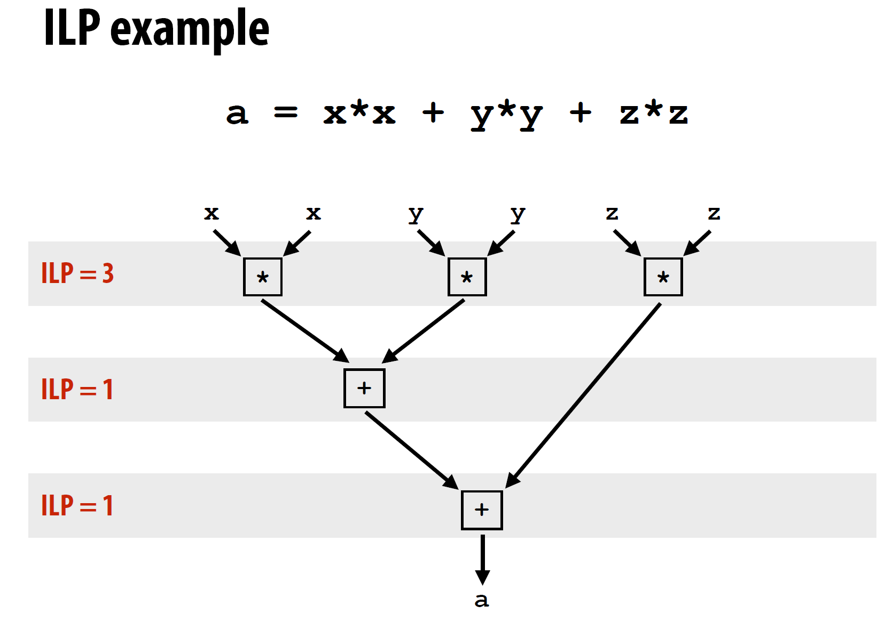

# Lecture

<!-- TOC -->

- [Lecture](#lecture)
  - [1 - Why prallelism? Why efficiency?](#1---why-prallelism-why-efficiency)
  - [2 - A Modern Multi-Core Processor](#2---a-modern-multi-core-processor)

<!-- /TOC -->
<!-- /TOC -->
<!-- /TOC -->

## 1 - Why prallelism? Why efficiency?

使用P个处理器的加速比：$1处理器的执行时间/P处理器的执行时间$

本课程的主题：

- 优化并行程序中的通信。
- 并行系统的硬件架构。
- 对efficiency的理解。fast不等于efficient，充分利用硬件能力才能算有效。例如使用10个处理器但加速比为2，不一定是个好结果。

Instruction level parallelism (ILP)

- 含义：处理器会按照顺序执行指令。但是对于相互独立的指令，处理器会同时执行这些指令，这样可以在不影响程序正确性的前提下加速程序。
- superscalar execution：处理器在同一时钟周期内并行执行多条independent instruction来提高性能和吞吐量

大部分支持ILP的处理器在一个时钟周期内可以处理4条指令，处理指令数大于4带来的加速有限。

ILP带来的单核性能提升也到瓶颈了：

功率墙（power wall）

由于功耗和散热的限制，处理器的时钟频率和性能不能无限提升。

处理器的core voltage决定最大可能的频率。

基于两个原因，需要通过并行带来性能提升：

- 功率限制了频率
- ILP对单核性能提升已到瓶颈

总结

- 单核性能提升已经到瓶颈
- 编写并行程序需要了解分区、通信、同步的知识，以及硬件相关

## 2 - A Modern Multi-Core Processor

