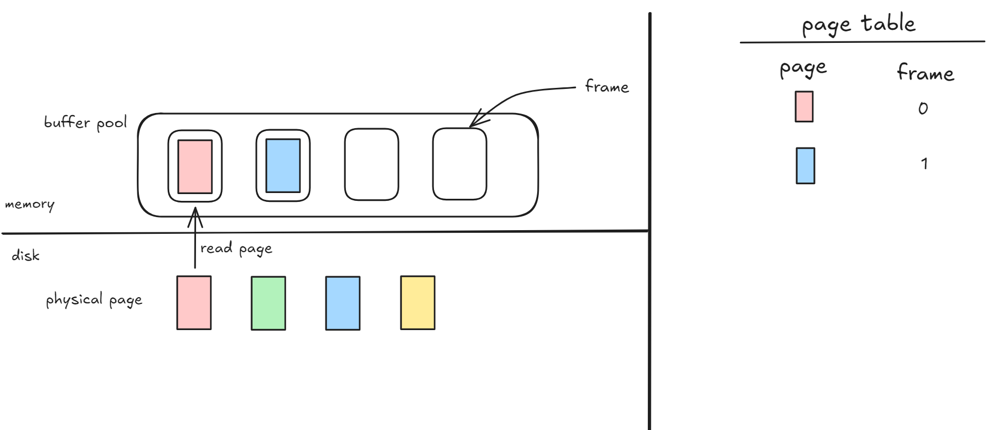

# Lab

## 环境搭建

我使用 windows11 的 wsl2（ubuntu 22.04）+clion remote 搭建了开发环境。本来准备直接在 windows 上开发的，但是因为 windows 上的 clang 似乎缺少 `clang-format` 还是 `clang-tidy` 的某些包，最后还是摆烂了。

debug 方面。还是用的古法 print debug，试了下 `common/logger.h` 自带的 log 宏还可以。至于为什么不用 lldb，已经开始反省了

## Project 0 - Primer

背景：
conflict-free replicated data type（CRDT）
一种分布式系统中的数据结构，通过网络在多个计算机上维护多个副本。CRDT 可应用在在线文档、分布式数据库、移动应用（多设备同步数据、离线状态也能更新数据）中。特点：

- 每个节点可以独立地更新副本
- 在副本之间进行同步时，CRDT 会合并修改

CRDT 的类型：

- operation-based
  - 也称为 commutative replicated data type，commutative 意为符合交换律的。
  - 内容：副本之间在同步时只传递 update 操作，其他副本会在本地应用这些修改。
  - 要求：操作要满足交换律，所有备份操作的内容相同
- state-based
  - 也称为 convergent replicated data type，convergent 意为收敛的
  - 内容：副本在同步时发送 full local state，由一个满足交换律、结合律、幂等律的函数 merge

例如，OR-set 就是一种 CRDT，可以处理 set 中元素的增减。
在添加元素时，每个元素会打上一个独特的标识。在删除元素时，这个标识会被加到 tombstone set，而不是直接删除。OR-set 可以追踪元素的添加和删除，因此可以在删除之后重新添加元素。
在处理 “对一个元素并发的 add/remove” 时，有三种可能情况：add 赢、remove 赢、error，OR-set 会让 add 赢。
OR-set merge 的结果是确定的。

感想：
project 0 整体还是简单的，就是 doc 里面只有伪代码而没有示例，doc 有个视频链接，里面才有实例。然后我发现这个示例中的 merge 和 doc 里面 merge 还不一样，好好好这么玩是吧

视频里面的：


doc 里面的：


其他就没啥了。也没性能的要求，已经开始 for 套 for 放飞自我了

## Project 1 - Buffer Pool

由于 bustub 是基于 disk 的 db，本 project 需要实现一个 buffer pool，负责在 disk-memory 之间移动 physical page，且这个 buffer pool 对其他的组件是透明的。buffer pool 需要是 thread-safe 的。

这个 project 包含几个部分：lru-k 置换算法、disk scheduler、buffer pool manager、read/write page guard

### LRU-K

- 每次 evict 的是 backward k-distance 最大的 frame
- backward k-distance：前 k 次 access 到现在的时间差。对于 access 次数少于 k 次的，该值为 `+inf`
- 有多个 `+inf` 的 frame 时，会 evict 首次访问时间最早的 frame

`std::lock_guard<std::mutex>`

C++11 引入的一个 RAII 类，用于管理 `std::mutex` 的生命周期，在作用域结束时自动释放锁。
不能手动解锁，不能复制锁。

### Disk Scheduler

Disk Manager 的读写操作需要调度。这部分就是 Disk Scheduler 的实现。涉及两个部分：`DiskScheduler`、`DiskRequest`。

- `DiskScheduler`: 使用 shared queue 处理 `DiskRequest`。一个 thread 负责将 request 加到 queue，后台 worker 负责处理 queued request。使用 `common/channel` 中的函数实现线程安全的通信。
- `DiskRequest`: 包含 request 内容以及一个 `promise`，用来将请求结果放到里面，供请求方调用。

`std::optional` 是 C++17 引入的一个类模板，主要用于管理一个可选的值，即一个可能存在也可能不存在的值。

作为函数返回值：

```c++
#include <optional>
#include <iostream>

std::optional<int> findValue(bool condition) {
    if (condition) {
        return 42; // 返回一个有效值
    } else {
        return std::nullopt; // 返回无值
    }
}

int main() {
    auto result = findValue(true);
    if (result) {
        std::cout << "Value:" << *result << std::endl;
    } else {
        std::cout << "No value found" << std::endl;
    }
    return 0;
}
```

作为函数参数：

```c++
void printID(const std::optional<int>& id) {
    if (id) {
        std::cout << "Your ID is" << *id << std::endl;
    } else {
        std::cout << "ID not provided." << std::endl;
    }
}
```

### Buffer Pool Manager

Buffer Pool Manager 会通过 `DiskScheduler` 从 disk 获取 db page，放到 memory 中。
另外还可以通过显式指示，将脏页写到 disk。
除了处理读写请求、在 disk-memory 之间调度 page 之外，buffer pool manager 还需要管理 page。

page 标识、有效 page：in-memory page 的内容是 physical page 内容的 copy，并且同一个 page 在不同的时间里面的内容也不一定相同。
`page` 中的 `page_id` 就是用来标识的，如果一个 `page` 不对应 physical page，那么它的 `page_id` 会被设置为 `INVALID_PAGE_ID`。

计数器：`page` 还有一个记录 “固定”（pinned）该 page 的 thread 数量。buffer pool manager 不能释放被固定的 page。
脏页：记录 page 是否为脏页。脏页的对象在被重用之前必须写回 disk。

实现要求：

- 用来之前实现的 `LRUKReplacer` 和 `DiskScheduler`。前者用于追踪 accessed page，用于决定需要 evict 的 page。后者用于处理读写。
- 在将 `page_id`map 到 `frame_id` 时，注意线程安全。



解释下 page 和 frame 的概念。frame 是 buffer pool 中用来存放从 disk 读的 physical page 的，frame 的数量是固定的，即 buffer pool 的大小。当 frame 都被占用时，buffer pool 已满。

实现注意点：

- `frame` 和 `page` 的概念、对应关系
- `promise` 和 `future` 的使用。在 `FetchPage` 这个函数实现中，因为向 `disk scheduler` 发起请求的时候 `move` 了 `request`，而在创建 `future` 之前移动 `request` 会导致 `std::future_error: No associated state` 错误，即 `promise` 和 `future` 对不上。因此需要在发起请求之前创建好 future 对象。

```c++
auto future = request.callback_.get_future();
  disk_scheduler_->Schedule(std::move(request));
  if (future.get()) {
    ...
  }
```
