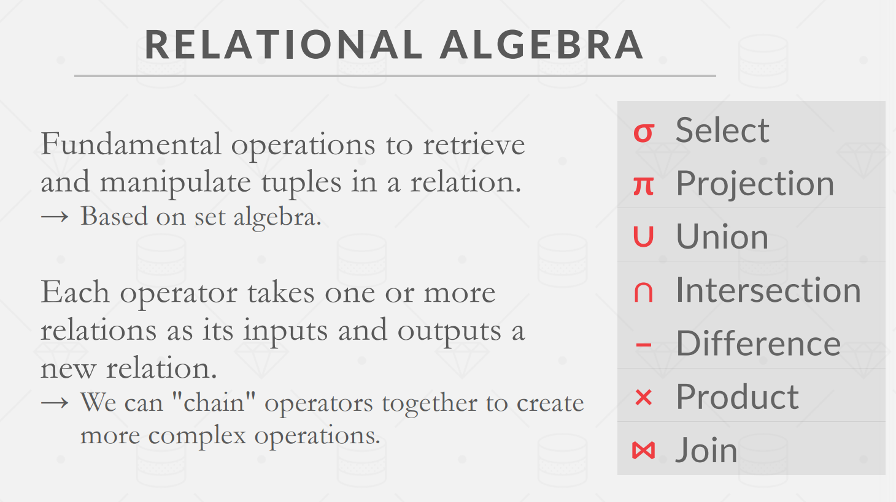
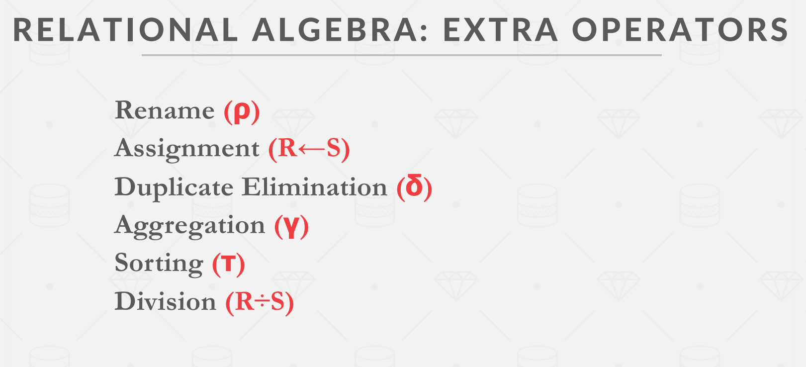
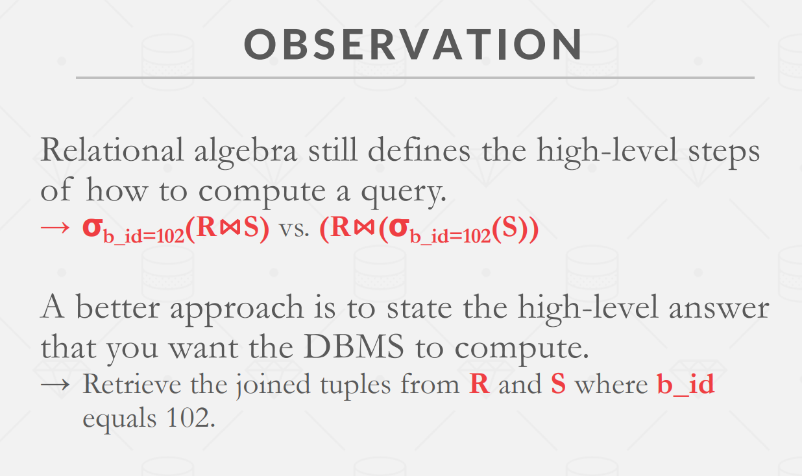
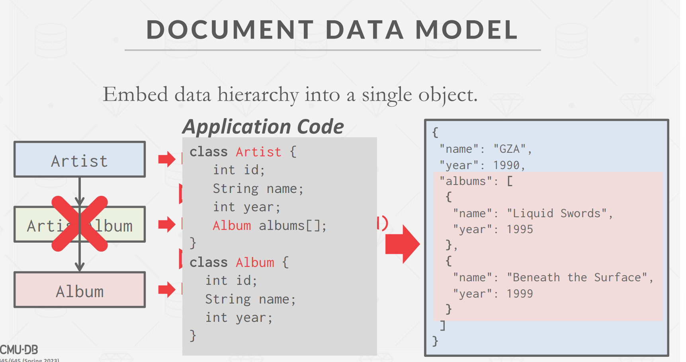
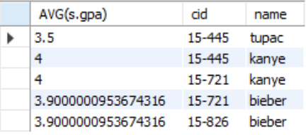
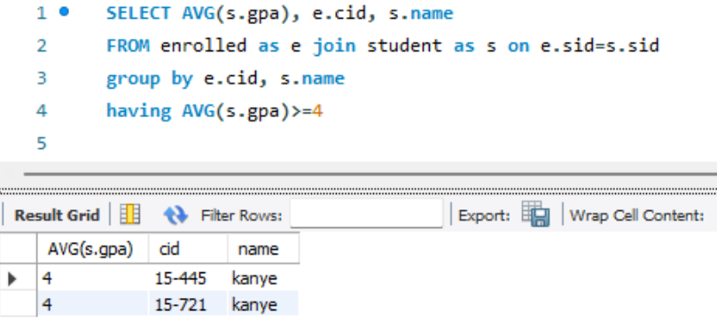
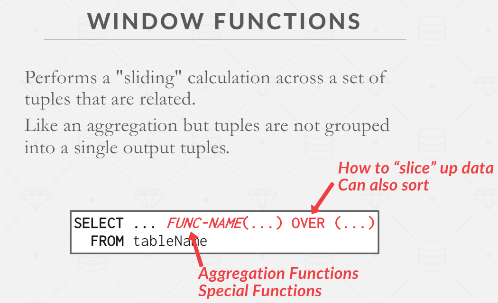
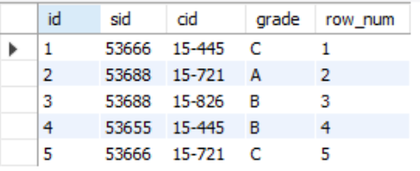
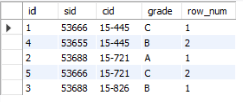
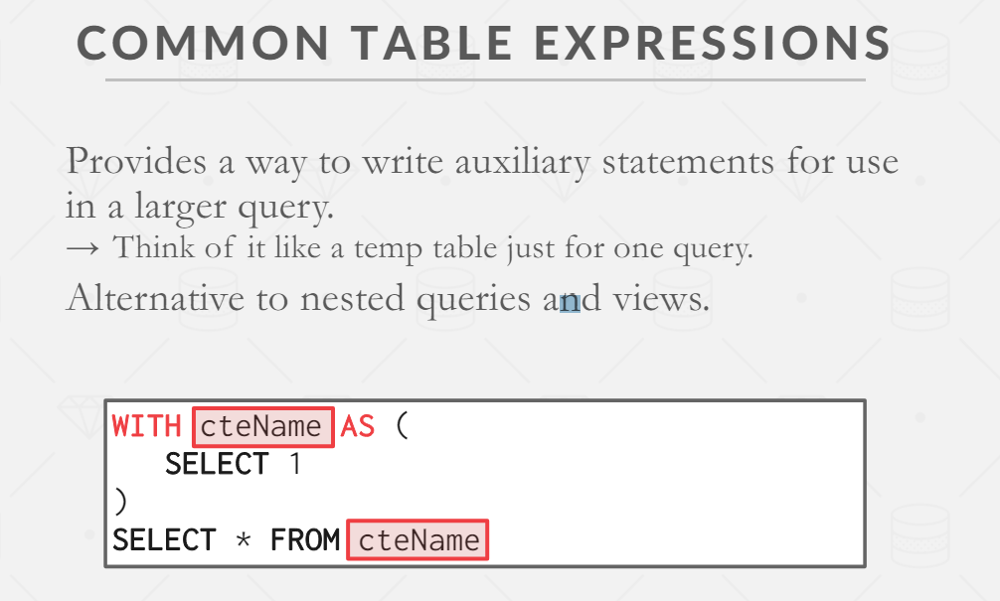

# Lecture

<!-- TOC -->

- [Lecture](#lecture)
  - [Lecture 1 - Course Overview \& Relational Model](#lecture-1---course-overview--relational-model)
  - [Lecture 2 - Modern SQL](#lecture-2---modern-sql)

<!-- /TOC -->

## Lecture 1 - Course Overview & Relational Model

Overview
这门课程是关于 database management system 的 design/implementation 的一门课程

database 对真实世界中的数据做了建模，将内在相关的数据有序组织起来

数据库和普通的存储数据的文件（flat file）有什么区别？

Q：假设我们需要存储一个音乐库信息，包括artist和album类别，并且直接用csv存储（`artist=name+year+country`，`album=name+artist+year`），那么可能有以下问题：

数据完整性：

- 一张专辑对应多个艺术家
- 有人尝试将某个album year改为invalid string
- 需要删除一个artist，而他名下有一些album

实现：

- 如何找到某条记录
- 同时有多个线程需要读写同一个csv文件

持久性：

- 当程序正在更新一条记录时，机器故障了？
- 为了保证高可用，需要复制DB到多台机器？

DBMS
可以在遵守data model前提下定义、增删、查询、管理数据

Data model
DB中数据的概念的集合

Schema
给定data model之后，对特定数据集合的描述

常见的data model：

- Relational (most DBMS)
- NoSQL
  - key/value
  - graph
  - document/object
  - wide-column/column-family
- Machine Learning
  - array/matrix/vector
- Obselete/Legacy/Rare
  - hierarchical
  - network
  - multi-value

Relational model
为了减少维护的开销，relational model定义了一种database abstraction

relational model设计标准：

- 用简单的数据结构存储数据
- 物理存储细节由DBMS实现决定
- 通过高级语言来访问数据，由DBMS来决定最佳执行策略

relational model组成部分：

- structure：db的relation定义，内容
- integrity：保证db的数据满足constraint
- manipulation：访问、修改db内容的接口

relation
一个无序集合。这个集合包括多个entity attribute的关系。例如`Artist(name,year,country)`

tuple
一个集合。集合包括relation中的attribute values。

primary key
relation的primary key可以作为tuple的唯一标识

foreign key
foreign key表示一个relation的attribute是另一个relation的primary key
例如有三个表：

```pesudo
ArtistAlbum(artist_id, album_id)
Artist(id, name, year, country)
Album(id, name, year)
```

那么，`ArtistAlbum`中的`artist_id`就是foreign key，它引用了`Artist`表中的primary key作为自己的字段

Data Manipulation Language(DML)
从DB存取数据。

- procedural，过程式。描述了数据操作的步骤和流程。例如早期的数据库DML。
- non-procedural，非过程式（声明式）。只描述希望达成的结果，而不关注步骤。例如SQL。

Relational algebra
其中，procedural也称relational algebra 关系代数。关系代数中有一些运算符，用运算符对tuple进行计算，可以操作数据。一些运算符：select、projection、union等







关系代数的表达式其实还是描述了查询数据的具体操作，和前面提到的data model设计标准还是有差距。
relation model的设计和DML的设计是分开的，并不依赖具体的DML实现。
SQL是relational model DML的事实标准

一些拓展
document/object data model发展很快。
在document data model中，数据的层级由object直接体现：



elastic中好像就是这种结构。

## Lecture 2 - Modern SQL

SQL操作的对象是bag/multiset而非set，即db中是允许有重复行的

aggregate：
聚合操作，从a bag of tuples得到single value的操作，例如`AVG`、`MIN`、`MAX`、`SUM`、`COUNT`.

`DISTINCT`：聚合操作基本只能用在`SELECT`中。`AVG`、`SUM`、`COUNT`支持`DISTINCT`去重。
`GROUP BY`：将tuple投影到subset，即分组。注意在`SELECT`输出结果中出现的非聚合列**必须**出现在`GROUP BY`中。

```sql
SELECT AVG(s.gpa), e.cid, s.name
  FROM enrolled AS e JOIN student AS s
    ON e.sid = s.sid
  GROUP BY e.cid, s.name
```

这里`e.cid`和`s.name`必须在`group by`中出现，因为它们不是聚合函数中的字段，查出来的值可能不唯一。加到`group by`里之后，相当于把整个`e.cid, s.name`作为group的标准



`HAVING`
在聚合的基础上的filter，类似于对`GROUP BY`的`WHERE`



操作字符串

- `LIKE`匹配字符串，`%`匹配任意长度的字符串，`_`匹配任意字符
- 有的DBMS有内置的函数，比如`SUBSTRING`、`UPPER`
- 拼接字符串，使用`||`，或者内置的`CONCAT`

处理输出
`ORDER BY`排序，`LIMIT`指定tuple数量和offset

嵌套查询
`ALL`、`ANY`、`IN`（和`ANY`等价）、`EXISTS`

Window Function



```sql
select *, row_number() over () as row_num
from enrolled
```



`OVER`指定了将tuple分组的方式。使用`PARTITION BY`可以指定group

```sql
select *, row_number() over (partition by cid) as row_num
from enrolled
```



如果此时有`OEDER BY`，是在每个group内部排序

举例，从选课表获取成绩第二高的学生，包括所有课程

```sql
select * from (
  select *, rank() over (partition by cid order by grade asc) as ranking
    from enrolled
) as ranks
where ranks.ranking=2
```

临时表

