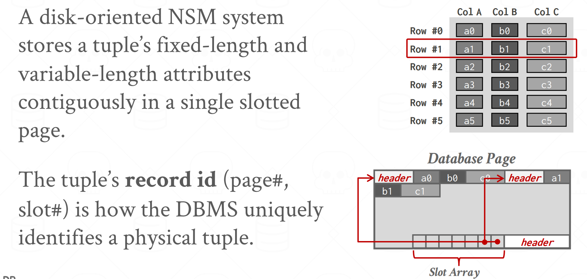
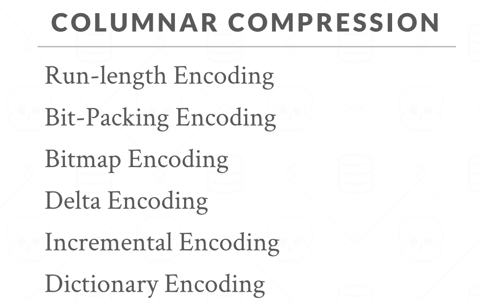
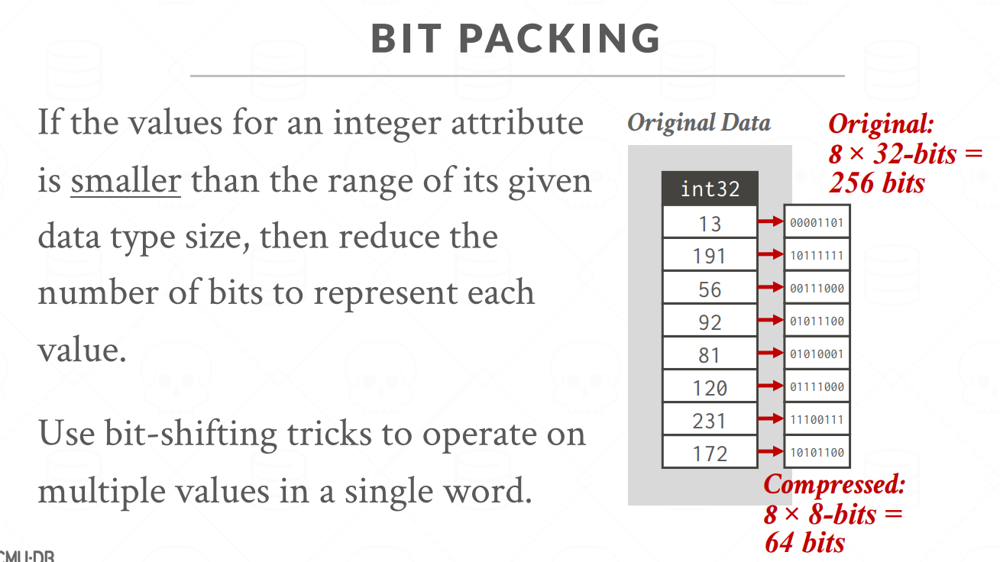
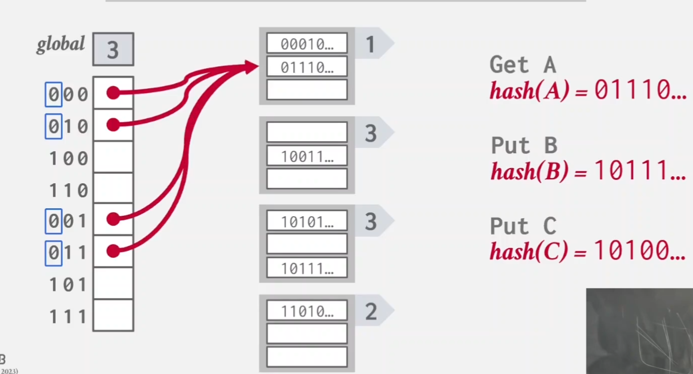

# Lecture

<!-- TOC -->

- [Lecture](#lecture)
  - [Lecture 1 - Course Overview \& Relational Model](#lecture-1---course-overview--relational-model)
  - [Lecture 2 - Modern SQL](#lecture-2---modern-sql)
  - [Lecture 3 - Database Storage (Part 1)](#lecture-3---database-storage-part-1)
  - [Lecture 4 - Datavase Storage II](#lecture-4---datavase-storage-ii)
    - [Log-Structured Storage](#log-structured-storage)
    - [Data Representation](#data-representation)
    - [System Catalogs](#system-catalogs)
  - [Lecture 5 - Storage Model \& Compression](#lecture-5---storage-model--compression)
    - [N-ary Storage Model (NSM)](#n-ary-storage-model-nsm)
    - [Decomposititon Storage Model (DSM)](#decomposititon-storage-model-dsm)
    - [Partition Attribute Across (PAX)](#partition-attribute-across-pax)
    - [Database Compression](#database-compression)
    - [总结](#总结)
  - [Lecture 6 - Memory Management](#lecture-6---memory-management)
    - [Buffer Pool Manager](#buffer-pool-manager)
    - [总结](#总结-1)
  - [Lecture 7 - Hash Tables](#lecture-7---hash-tables)
    - [Hash Tables](#hash-tables)
    - [总结](#总结-2)
  - [Lecture 8 - Tree Indexes](#lecture-8---tree-indexes)
    - [B-Tree Family](#b-tree-family)

<!-- /TOC -->
<!-- /TOC -->
<!-- /TOC -->
<!-- /TOC -->
<!-- /TOC -->
    - [总结](# 总结 - 1)

- [](#)

<!-- /TOC -->
<!-- /TOC -->
<!-- /TOC -->

## Lecture 1 - Course Overview & Relational Model

Overview
这门课程是关于 database management system 的 design/implementation 的一门课程

database 对真实世界中的数据做了建模，将内在相关的数据有序组织起来

数据库和普通的存储数据的文件（flat file）有什么区别？

Q：假设我们需要存储一个音乐库信息，包括 artist 和 album 类别，并且直接用 csv 存储（`artist=name+year+country`，`album=name+artist+year`），那么可能有以下问题：

数据完整性：

- 一张专辑对应多个艺术家
- 有人尝试将某个 album year 改为 invalid string
- 需要删除一个 artist，而他名下有一些 album

实现：

- 如何找到某条记录
- 同时有多个线程需要读写同一个 csv 文件

持久性：

- 当程序正在更新一条记录时，机器故障了？
- 为了保证高可用，需要复制 DB 到多台机器？

DBMS
可以在遵守 data model 前提下定义、增删、查询、管理数据

Data model
DB 中数据的概念的集合

Schema
给定 data model 之后，对特定数据集合的描述

常见的 data model：

- Relational (most DBMS)
- NoSQL
  - key/value
  - graph
  - document/object
  - wide-column/column-family
- Machine Learning
  - array/matrix/vector
- Obselete/Legacy/Rare
  - hierarchical
  - network
  - multi-value

Relational model
为了减少维护的开销，relational model 定义了一种 database abstraction

relational model 设计标准：

- 用简单的数据结构存储数据
- 物理存储细节由 DBMS 实现决定
- 通过高级语言来访问数据，由 DBMS 来决定最佳执行策略

relational model 组成部分：

- structure：db 的 relation 定义，内容
- integrity：保证 db 的数据满足 constraint
- manipulation：访问、修改 db 内容的接口

relation
一个无序集合。这个集合包括多个 entity attribute 的关系。例如 `Artist(name,year,country)`

tuple
一个集合。集合包括 relation 中的 attribute values。

primary key
relation 的 primary key 可以作为 tuple 的唯一标识

foreign key
foreign key 表示一个 relation 的 attribute 是另一个 relation 的 primary key
例如有三个表：

```pesudo
ArtistAlbum(artist_id, album_id)
Artist(id, name, year, country)
Album(id, name, year)
```

那么，`ArtistAlbum` 中的 `artist_id` 就是 foreign key，它引用了 `Artist` 表中的 primary key 作为自己的字段

Data Manipulation Language(DML)
从 DB 存取数据。

- procedural，过程式。描述了数据操作的步骤和流程。例如早期的数据库 DML。
- non-procedural，非过程式（声明式）。只描述希望达成的结果，而不关注步骤。例如 SQL。

Relational algebra
其中，procedural 也称 relational algebra 关系代数。关系代数中有一些运算符，用运算符对 tuple 进行计算，可以操作数据。一些运算符：select、projection、union 等


关系代数的表达式其实还是描述了查询数据的具体操作，和前面提到的 data model 设计标准还是有差距。
relation model 的设计和 DML 的设计是分开的，并不依赖具体的 DML 实现。
SQL 是 relational model DML 的事实标准

一些拓展
document/object data model 发展很快。
在 document data model 中，数据的层级由 object 直接体现：


elastic 中好像就是这种结构。

## Lecture 2 - Modern SQL

SQL 操作的对象是 bag/multiset 而非 set，即 db 中是允许有重复行的

aggregate：
聚合操作，从 a bag of tuples 得到 single value 的操作，例如 `AVG`、`MIN`、`MAX`、`SUM`、`COUNT`.

`DISTINCT`：聚合操作基本只能用在 `SELECT` 中。`AVG`、`SUM`、`COUNT` 支持 `DISTINCT` 去重。
`GROUP BY`：将 tuple 投影到 subset，即分组。注意在 `SELECT` 输出结果中出现的非聚合列 ** 必须 ** 出现在 `GROUP BY` 中。

```sql
SELECT AVG(s.gpa), e.cid, s.name
  FROM enrolled AS e JOIN student AS s
    ON e.sid = s.sid
  GROUP BY e.cid, s.name
```

这里 `e.cid` 和 `s.name` 必须在 `group by` 中出现，因为它们不是聚合函数中的字段，查出来的值可能不唯一。加到 `group by` 里之后，相当于把整个 `e.cid, s.name` 作为 group 的标准


`HAVING`
在聚合的基础上的 filter，类似于对 `GROUP BY` 的 `WHERE`


操作字符串

- `LIKE` 匹配字符串，`%` 匹配任意长度的字符串，`_` 匹配任意字符
- 有的 DBMS 有内置的函数，比如 `SUBSTRING`、`UPPER`
- 拼接字符串，使用 `||`，或者内置的 `CONCAT`

处理输出
`ORDER BY` 排序，`LIMIT` 指定 tuple 数量和 offset

嵌套查询
`ALL`、`ANY`、`IN`（和 `ANY` 等价）、`EXISTS`

Window Function


```sql
select *, row_number() over () as row_num
from enrolled
```


`OVER` 指定了将 tuple 分组的方式。使用 `PARTITION BY` 可以指定 group

```sql
select *, row_number() over (partition by cid) as row_num
from enrolled
```


如果此时有 `OEDER BY`，是在每个 group 内部排序

举例，从选课表获取成绩第二高的学生，包括所有课程

```sql
select * from (
  select *, rank() over (partition by cid order by grade asc) as ranking
    from enrolled
) as ranks
where ranks.ranking=2
```

临时表


可以定义一个临时的表，在后面的 SQL 再使用

## Lecture 3 - Database Storage (Part 1)


potpourri，大杂烩

Disk-based architecture
DBMS 假设 DB 的主要存储是 disk。DBMS 的组件需要在 volatile 和 non-volatile storage 上管理数据

一些常用的数字：

- L1 cache，1 ns
- L2 cache，4 ns
- DRAM，100 ns
- SSD，16000 ns，0.016 ms
- HDD，2 ms
- Network storage，50 ms
- Tape，1000 ms，1 s

sequential/random access

non-volatile storage 上的 random access 比 sequential access 慢很多

因此 DBMS 希望能尽量使用 sequential access：

- 减少向 random page 写的次数
- 一次分配多个 page，称为一个 extent

DBMS 设计目标：

- 让 DBMS 可以管理大小超过 available memory 的 DB
- 因为磁盘读写开销很大，需要控制向磁盘的读写次数
- 因为随机访问的开销大于顺序访问，因此需要尽量用顺序访问

面向磁盘的 DBMS 设计：


一个问题：
Q：
在上面的图中，DBMS 需要自己在 memory 和 disk 之间管理内存。OS 提供的 mmap（memory mapping）可以将磁盘上文件的内容映射到进程的 address space 中，而进程则可以跳转到任何 offset。由 OS 决定何时将 page 移入 / 移出 memory。因此如果 DBMS 使用 mmap，就可以让 OS 来管理所有的数据，DBMS 自己并不需要 “写入” 任何数据。为什么不让 OS 来替 DBMS 管理数据呢？

A：
如果 DBMS 是只读的，那确实可以用 mmap。但是如果有写入，尤其是有多个 thread 需要访问 mmap-ed file 的时候，情况会很复杂。OS 只会替换脏页，而 DBMS 在执行事务时需要保证多个写执行的顺序。

使用 mmap io 带来的问题：

- Transaction safety。OS 可能在任何时候刷新脏页
- IO stall。DBMS 不知道哪些 page 在内存中。在 page fault 时 thread 需要等待。
- Error handling。访问 mmap-ed file 可能产生 `SIGBUS`，DBMS 需要处理
- Performance issue。OS data structure contention

有一些 syscall 可以告诉 OS 如何管理 page，例如 `madvise`、`mlock`、`msync`，但是用这些来保证 OS 正常工作，还不如自己管理内存。

让 DBMS 自己管理数据的优点：

- flush dirt pages to disk in correct order
- prefetch
- buffer replacement policy
- thread/process scheduling

DBMS file storage 的两个问题：

- 如何在 disk file 上表示 DB（本次 lecture）
- 如何管理 memory，以及在 disk-memory 之间移动数据

Storage Manager
负责维护 database file。files 包括很多的 pages，storage manager 负责数据的读写、追踪剩余的空间

Database page
page 是一个固定大小的 block，可以存储 tuple、metadata、index、log 等。有的 DBMS 要求 page 是 self-contained 的。每个 page 有唯一标识。DBMS 将 page ID 和物理存储对应起来

DBMS 中的各种 page：

- hardware page，一般 4KB
- OS page，一般 4KB
- DB page，512B-16KB

hardware page 是存储设备（disk 等）能保证 failsafe write（原子写？）的最大的 block

Page storage architecture
不同的管理 page 的方式：

- heap file
- tree file
- sequential/sorted file
- hashing file

这些组织方式只到 page 一层，和 page 的内部结构无关

Heap file
无序 page 的集合。tuple 以随机顺序存储。
支持操作：create/get/write/delete page，page iterator 用于顺序遍历
如果 DB 只有单个文件，就比较容易定位 page，`offset = page# * pagesize`
如果 DB 有多个文件，需要额外记录：file-page 对应关系，哪个 file 有剩余空间

Heap file: directory page
在 heap file organization 中，除了普通的 data page，还有 directory page，用来记录 data page 在 DB file 的位置，以及剩余空间（每个 page 的 free slot、free page list）。（page metadata）

因为引入了额外的 metadata，DBMS 需要保证 directory page 和 data page 是同步的。

Page header
page header 中是 page metadata，记录和 page content 有关的信息。如 page size、checksum、DBMS version、transaction visibility info、compression 等。有的 DBMS 要求 page 是 self-contained 的。


Page layout
组织 page data 的方式。

- tuple-oriented。
- log-structured。

对于只存储 tuple 的 page。一种最简单的 page layout 是：开头存储 page 数目，后面一直追加新的 tuple


这种方式的问题：

- 如何删除 tuple？
- 如果 tuple 长度是可变的？

上面的 page layout 的改进版本是 slotted pages。
slot array 将 slot 映射到 tuple 的 offset。（从这个图看，tuple 是倒着分配空间的？）


每个 tuple 都有一个 unique ID。最常见的计算方式是：`page_id + offset`，例如 sqlite 和 oracle 中的 rowid，postgresql 的 ctid。

Tuple layout
tuple 的内容主要是 attribute 的 type 和 value。tuple 包括 tuple header 和 tuple data。
tuple header 主要有：

- visibility info，用于 concurrency control
- bitmap for null values

tuple header 并没有 schema 的 metadata 信息。（attribute name 这种存在外面的 table metadata 里面？）

tuple data 是 attribute value。它们的顺序是创建表的时候，attribute 的顺序。

## Lecture 4 - Datavase Storage II

在上一节的 slotted page 结构中，插入一个新 tuple 需要几步：

- check page directory，找到有空 slot 的 page
- 从 disk/memory 拿到 page
- check slot array，找到 fit 的位置插入 tuple

slotted page 有几个问题，主要是写的时候：

- 碎片化。空间利用率低，而且有的空间没法利用，比如 slot array 有空的，但是空间不够
- IO 放大。即使是更新一个 tuple，也需要读整个 page
- 随机 IO。需要更新的 tuple 可能在多个 page 上

有的存储系统不支持原地更新，只支持 append，并通过版本控制等方法来更新数据，比如 S3、HDFS。对于这些系统，上面设计的 tuple-page 结构就不适用了。

### Log-Structured Storage

DBMS 会记录 log，记录 tuple 的操作历史（PUT、DELETE）。

- 每条记录包含 tuple id
- PUT log 包含 tuple 新值
- DELETE 只标记不删除


log 是 append 写的，且写的时候不检查前面内容，当存储 log 的 in-memory page 写满了，DBMS 会将 log page 写到 disk。这样保证了：

- 所有的 disk write 是顺序的
- log page 写入 disk 之后是不变的（即不能原地更新覆盖记录）（这里插一句，在分布式环境下，采用 append 而非原地更新是更常用的，例如 paxos 和 raft 中都使用这种做法）

给定 tuple id，如何读一个 tuple？

- 扫描 log，用 id 匹配最新的 log。再从 memory/disk 获取
- 为了增加效率，需要维护一个 index，tuple id -> newest log record


DBMS 会定期在 disk 上合并日志，减少空间占用。合并之后的日志不需要保证时间顺序了，因为每个 tuple 最多出现一次。因此，DBMS 可以按 tuple id 排序，提高后续查询的性能。合并、排序之后的 page 称为 sorted string table（SSTable）。


日志的合并方法：

- universal compaction。每次合并两个
- level compaction。每层到了一定数目就会合并


LSM 结构的缺点？

- read 慢，compaction is expensive
- 写放大。合并的过程，需要把 tuple 读回 memory，再写到 disk

### Data Representation

DBMS 的 table schema info 中存储了 tuple layout，让 DBMS 可以 interpret 表示 tuple 的一串 byte ，读取 attribute、value


Variable Precision Number

- 可变精度数字。可根据具体计算需求，动态调整有效位数。适用于科学计算和高精度计算，缺点是计算速度较慢。
- 例如 `FLOAT`、`REAL`/`DOUBLE`
- 浮点数计算时可能出错。比如 `0.1 + 0.2`

Fixed Precision Numbers

- 定点数字。整数部分和小数部分的位数是固定的，适用于需要高精度和一致性的数据处理场景，例如金融计算。缺点是表示范围有限
- 例如 `NUMERIC`、`DECIMAL`

Large Values

大部分 DBMS 都不允许 tuple 的大小超过单个 page 的大小。
为了存储大小超过 page 的 value，DBMS 使用 overflow page。


在有的系统中，可以在外部文件存储很大的 value，按 `BLOB` 类型处理。例如 Oracle 中的 `BFILE`，Microsoft 的 `FILESTREAM`
由于没有持久性、事务的保证，DBMS 不可以读写外部文件的内容

### System Catalogs

DBMS 会存储 database metadata 信息，将 object layout 和 tuple 数据分开。比如内部的 `INFORMATION_SCHEMA` database。信息包括：

- table、column、index、view
- user、permission
- internal stats

## Lecture 5 - Storage Model & Compression

上一节讨论的两种 tuple-oriented storage scheme：

- Log-structured storage
- Index-organized storage（map: tuple id -> newest log record）

适合 write-heavy workload。而对读操作没有优化


- OLTP：处理日常的事务，如银行交易、订单处理等。它强调快速的查询和数据更新，通常涉及大量的短事务。
- OLAP：用于数据分析和决策支持，适合进行复杂的查询和报表生成，通常涉及大量的数据聚合和分析。
- 负载特征：OLTP 为 write-heavy，OLAP 为 read-heavy

Storage Model

DBMS 的 storage model 指 tuple 在 memory/disk 中的存储方式。storage model 会影响 DBMS 在不同 workload（OLTP、OLAP）上的性能，以及 DBMS 在其他方面的设计。

- N-ary Storage Model (NSM)
- Decomposition Storage Model (DSM)
- Hybrid Storage Model (PAX)

### N-ary Storage Model (NSM)

DBMS 将 tuple 中的所有 attribute 存储在一个 page 中。也称为 row store。行存储。
适用于 OLTP workload，访问的记录较少，且 write-heavy。
NSM database 的 page size 一般是 4 KB（hardware page）的整数倍。

在一个 slotted page 中，一个 tuple 的定长 / 变长 attribute 是连续存储的。通过 `page+slot` 可以定位一个 tuple。



NSM 总结：

优点：

- 写操作很快。（insert/update/delete）
- 适合需要整个 tuple 的查询（OLTP）
- 可以用 index-oriented physical storage 做 clustering（聚簇）。

> clustering 在数据库中指一种存储方式，数据的物理存储顺序和索引的顺序是一致的。
> 相关数据在物理上相邻存放，这种特性使范围查询性能增高。

缺点：

- 不适合 ` 需要扫描表内很多记录 ` 的查询，以及 ` 只需要一部分 attribute` 的查询。（无用数据读取、不同属性不利于数据压缩、NSM 随机访问模式无法预测接下来访问页面 -> 缓存命中率低）
- OLAP 访问下的内存局部性表现差。（内存利用率低、缓存命中率低）
- 同一 page 中不同的 value domain，不利于压缩

### Decomposititon Storage Model (DSM)

所有 tuple 的某个 attribute 是连续存储的。column store。列存储。
适合 OLAP workload：read-only，读的范围大，只查询部分 attribute。

存储方式：attribute 和 metadata 放在不同的数组里，数组的元素为定长的。
每个 attibute 有个 header area，记录整列的 metadata


定位 tuple：


变长数据：

padding 的方式空间利用率低。更好的方式是 dictionary compression，将重复的变长数据转化成固定长度（如 32 bit int）。

DSM 总结：

优点：

- DBMS 只会读需要的列，减少了无用的 IO
- 利用局部性，以及命中缓存
- 更好的数据压缩

缺点：

- 因为涉及 tuple 的拆分、合并、重新组织，在 point query、insert、update、delete 场景的性能差
- OLAP 的部分场景涉及多列查询，此时会发生列的合并，性能降低

### Partition Attribute Across (PAX)

设计目标是：保留列存储的优点，同时利用行存储带来的空间局部性优势。

存储形式：
PAX 将所有行划分为组，组内的按列存储。


### Database Compression

因为从 disk 搬数据很耗时，所以对 page 进行压缩，可以提高每次 IO 移动的数据量。压缩的 trade-off 在：speed-compression ratio

压缩过程的设计目标：

- 生成固定长度的值。（固定长度的值定位和访问更高效）
- 在查询中，尽量推迟解压缩。（避免不必要的解压，可以和谓词下推等优化技术结合提高性能）
- 无损压缩。（任何有损的压缩必须在 application-level）


MySQL InnoDB 中的压缩：


在上图中（对应 compression granularity=block-level？），压缩过程没有考虑 data 的 high-level meaning 或 semantics，压缩的数据需要解压才能读写，因此希望有一种支持在压缩的数据上直接操作的压缩方法。

在 column-level 的 compression granularity 中，就可以有这种直接修改压缩数据的方法，但是也只有列存储可以用：



Run-Length Encoding。
碰到 `SELECT ... GROUP BY isDead` 这种查询时，就可以直接读压缩数据


Bit Packing。
当数据不需要那么多位表示时，减少位数



对于部分较长的数据，不压缩：


Bitmap Encoding。
对某个 attribute 的所有 unique value 设置一个 bitmap，如果某个 tuple 在一个 bitmap 的值是 1，这个 tuple 的 attribute 就等于这个 bitmap 的 value。

适用条件：value 的 cardinality（基数，不重复值）较小时
有的 DBMS 提供 bimap index


例如，在设计 `customer` 表时，表中的 `zipcode` 属性就应该选择 `INT` 类型，而非 bitmap

Delta Encoding.
可以和上面的 RLE（重复值 -> 一个值 + 重复次数）结合


Dictionary Compression。
把常用值拎出来放到一个 dict 中，用 map code 来代替。好的 dict 设计需要同时支持快速的 encoding/decoding，例如设置有序的 value 以支持 range query。

注意，通过 dict 转化 code/value 是没有哈希函数的。


Dict 的数据结构实现：

- 数组。存储 ` 长度 + 变长字符串 `。只用在 immutable file
- 哈希。不支持 range/prefix query
- B + 树。比哈希慢，占用内存多。支持 range/prefix query。
-


### 总结

- OLTP=row store
- OLAP=column-store
- 压缩。多种压缩方法可以结合使用
- Dict encoding 很有用，因为不需要 pre-sorting

## Lecture 6 - Memory Management

本节讨论 DBMS 如何管理内存，以及在 disk/memory 之间移动数据的过程。

- spatial control：在 disk 上写 page 的位置。目标是保证经常读写的 page 在 disk 上的物理位置也靠近
- temporal control：时间控制。向 disk 写 / 从 disk 读 page 的时机。目标是减少从 disk 读数据时的 stall

### Buffer Pool Manager

memory 内有固定长度的 array。每个元素称为 frame。DBMS 请求的 page 会被拷贝到 frame 中。dirty page 会缓存在 buffer pool，不会立即写回 disk。

- write-back cache：写操作会被缓存，后续异步写入主存储。
- write-through cache：数据在写入时同事更新缓存和主存储。（减少数据不一致的风险）


Buffer pool 的 metadata 由一个 page table 维护。page table 里面存储了 pool 中 page 的信息。

page 的其他有用的 metadata 有：

- dirty flag
- pin counter，引用计数

page directory 和 page table 的比较：

- page directory：位于 disk 上，从 page id 到 page location 的 mapping。
- page table：位于 memory 的缓存，从 page id 到 page copy in buffer pool 的 mapping。

Buffer Pool Optimization：

- multiple buffer pools：在内存中划分多个 pool 可以减少锁竞争，同时提高 locality。例如：per-database/per-page type buffer pool。因为需要知道去哪个 buffer pool 找数据，需要维护一个额外的 mapping。1）obejct id：record 中有一个 object id，再维护一个 object id 到 pool 的 mapping。2）hashing：page id 到 pool 的 hash，自动
- pre-fetching：DBMS 根据 query plan 可预取 page。例如：顺序扫描、index scan
- scan sharing：query can reuse data。也称为 synchronized scan。允许多个查询 attach 到同一个 cursor，并 share intermediate result。和 result caching 不同。
- buffer pool bypass：有些情况并不需要 buffer pool，比如顺序扫描 page，此时还可节省换入 / 换出 page 的开销。

pre-fetching：


scan-sharing：


OS Page Cache：

大部分的 disk 操作都走 OS API。OS 自己也有 filesystem cache（也称为 page cache，buffer cache）。
大部分 DBMS 都通过 direct IO（`O_DIRECT`）来 bypass OS cache。

- 避免双重缓冲：同一 page 在 DBMS buffer pool 和 OS cache 中都被缓存。
- 控制数据一致性：通过直接控制 IO，DBMS 可以更好管理写入时机，保证故障时数据不丢失。
- 不同驱逐策略：DBMS 考虑数据一致性、事务、高并发。OS 考虑资源共享、系统整体性能和响应时间。

Buffer Replacement Policy：

DBMS 的目标：

- correctness
- accuracy
- speed
- metadata overhead

策略：

- least-recently used：维护每个 page 最后的访问时间。每次 evict 最久未访问的 page
- clock：LRU 的一种近似实现。
  - 每个 page 有一个 reference bit，如果被访问这个值被设置为 1。
  - 有一个循环缓冲区存放 page，还有一个 clock hand。
  - 需要驱逐时，clock hand 会检查当前页面，如果 reference bit 为 1，将其置为 0，并移动到下一个 page。如果 bit 为 0 就驱逐。
  - 这种做法不需要为每个 page 维护单独的 timestamp，减少内存开销。


问题：

LRU 和 clock 都对 sequential flooding 很敏感。如果有顺序扫描的 query，buffer pool 会被污染，被缓存的 page 后续不会被用到。

更好的 eviction policy：

- LRU-K：记录每个 page 最近 k 次访问的 timestamp，计算 k 次访问之间的时间间隔，从而预测下次访问的时间。需要驱逐时，驱逐 “预测下次访问时间最晚” 的 page。
- localization：DBMS 根据 query 决定 evict page，标准是减少每次 query 带来的缓存污染。这种方法需要记录每个 query 会访问的 page
- priority hints：DBMS 在执行查询时了解 page 的 context，并推测 page 是否重要。（没太看懂这块）

prioity hints：


Background Writing：

DBMS 周期遍历 page table，把 dirty page 写到 disk。写完之后，可以 evict page 或者简单 unset dirty flag。
注意是先写对应的 log record，再写 dirty page。

Other Memory Pools：

除了 tuple 和 index 要用内存，DBMS 还有一些其他的结构：


### 总结

- DBMS 管理内存的能力强于 OS。
- 利用 query plan semantics，可以做出更好的优化：eviction、allocation、pre-fetching

## Lecture 7 - Hash Tables

本节介绍 DBMS 的 execution engine 如何从 page 读写数据。

两类数据结构：

- hash table。无序的
- tree。有序的

设计数据结构的考虑：

- data organization：要支持高效访问，需要小心设计 memory/page 中的结构
- concurrency：要支持多线程并发的访问数据

### Hash Tables

包含一个无序的 array，将 key-value 关联起来。使用 hash 函数计算 key 的 array offset。
空间复杂度：`O(n)`。
时间复杂度：平均是 `O(1)`，最差是 `O(n)`。

hash table 有两个设计点：

- hash function。需要将 large key space 映射到 smaller domain。需要在 fast/collision rate 之间 tradeoff
- hashing scheme。需要处理 hash 冲突的情况。（冲突不仅影响写，还会影响读）。需要在 alloc large hash table 和 additional instruction get/put key 之间 tradeoff。（有冲突，就需要额外的代码处理读写操作）

Hash Function：

- CRC-64。在网络中应用于故障探测。
- MurmurHash。
- CityHash。
- XXHash。（sota）
- FarmHash。

Static Hashing Scheme：

static 意味着 DBMS 需要知道存储的元素个数。如果要调整表的大小，需要重建表。

- Linear Probe Hashing。解决冲突方法：线性探测，直至寻找到下一个 free slot。查询一个 key 需要 hash+scan
- Cuckoo Hashing。

还有 Robin Hood、Hopscotch、Swiss Table 等。

在 Linear Hashing 中，线性探测法的查询操作会 “hash+scan 直到遇到空桶”。假设 delete 操作会原地删除，那么可能出现 “在表中但是查不到” 的情况。

为了解决这个问题，删除操作不会直接删除，而是做删除标记。这样 scan 遇到 tombstone 时，仍然会向后查询。后续再执行 GC 过程，包括回收 tombstone 和 rehash。

优化：

- 根据不同类型的 key 设置多个 hash table。原因是 key 的 type/size 会影响哈希表实现。
- 把 metadata 存在单独的 array 中。使用 packed bitmap 来指示 tombstone。
- 使用 table+slot versioning metadata 来快速 invalidate 哈希表的所有 entry。例如，如果 table version 和 slot version 不匹配，那么把 slot 当成空的。

Cuckoo Hashing

- 有多个 hash function。在插入时，检查多个位置，选一个空位置。如果没空位置，选一个值踢掉，并且对踢掉的值 rehash。
- 查询 / 删除都是 `O(1)` 的

Dynamic Hash Table

- Chained Hashing。每个 slot 有一个 bucket 组成的链表。
- Extendible Hashing
- Linear Hashing

Bloom Filter

检查元素是否存在的结构，probablilistic data structure (bitmap)

- 不会出现 false negative
- 可能出现 false positive
- insert：计算 k 个 hash 函数的值，将 bitmap 的对应值设为 1
- lookup：检查每个 hash 函数的值是否为 1

Extendible Hashing

- 和 chained-hashing 使用链表解决 hash 冲突不同，extendible hashing 会 split bucket，而非让链表一直增长。
- 多个 slot location 可以指向同一个 bucket chain

一些术语：

- global depth：计算哈希值。例如 depth=g，那么在插入 key 时，就会取 key 的最右两个 bit（或者取 `key % 4`），来决定放到哪个 slot。
- local depth：一个 bucket 里面的 value 的相同位数。


假设需要插入一个值，hash 值为 `10...`，此时因为 bucket 满，且 global depth=local depth，会触发左边 array 的扩增，global depth+1。

新创建的 slot 可以指向原来的 bucket。上一步满的 bucket 里面的元素就需要 rehash 来判断放到哪个新 bucket。




如果在插入新元素时，出现 bucket 满了以及 local depth < global depth 的情况，那么这是不需要扩展 array，只需内部完成分裂即可。会创建一个新的 bucket，再 rehash。

Linear Hashing

- 维护一个指针，用来追踪下个 split 的 bucket。当任何 bucket 溢出时，都在指针的地方 split bucket。
- 对一个 key，使用多个 hash 来找 bucket
- 多种 overflow 标准：空间利用率、overflow chain 的平均长度

原表为：


假设插入 17，会造成 slot 1 的 bucket overflow，此时多一个 slot 4。而 overflow pointer 在 0，所以增加一个 hash1，并对 slot 0 的 bucket 的元素 rehash。8 仍在 bucket0，但是 20 到 bucket4 去了。而且，split pointer 到 1 去了。


在 get 20 的时候，首先用 hash0 计算没找到，再用 hash1 计算就找到了。

当数据量减少时，哈希表也会合并：


此时 split pointer 会反向移动


### 总结

DBMS 有很多能提供 `O(1)` 快速查询的数据结构。哈希结构在 memory/disk 中都有使用。

- memory：linear probing、cuckoo hashing、chained hashing，用于 hash join 以及聚合运算等
- disk：extendible hashing、linear hashing，用于 disk-based hash indexing

## Lecture 8 - Tree Indexes

上节课介绍了哈希表，一种空间复杂度 `O(n)`，平均时间复杂度 `O(1)` 的数据结构。以及 static/dynamic hash table。

本节介绍树。

### B-Tree Family

最早的有 B-Tree、B+Tree，后面还有很多变种。

B+Tree

自平衡、有序的树。支持 $O(log_fn)$ 时间复杂度的查询、插入和删除。

- 二叉搜索树的推广，因为一个节点可以有 > 2 个孩子
- 针对需要读写数据量很大的系统设计的
- f 指 tree fanout

定义：

B+Tree 是一棵 M-way 搜索树，满足以下特性：

- 完美平衡，即每个 leaf node 的 depth 相同
- 除 root 节点，每个节点都至少是半满的（half-full）：$\frac{M}{2-1} \le \#keys \le M-1$
- 如果 inner node 有 k 个 key，那么它有 k+1 个孩子


B+Tree Node

- 每个节点都有一个 k-v pair 的 array，根据是 inner node/leaf node，value 的类型不同。
- array 一般是按 key 有序排列的
- 所有的 `NULL`key 都在 first/last leaf node（这一句没太理解，是说没有空的叶子节点么，还是说 leaf node array 中的 `null` 是在两边？）

leaf node


leaf node value

- Record ID：指向 tuple 位置的指针
- Tuple data：laef node 存储 tuple 的实际内容。二级索引则将 Record ID 作为 value。这种 “leaf node 存储实际内容” 也称为聚簇索引。

B-Tree 和 B+Tree

- B-Tree 在树中的所有节点都存储 key、value。空间利用率更高，因为每个 key 只出现一次
- B+Tree 只在 leaf node 存储 value，inner node 只用来搜索

B+Tree Insert

- 先找到 leaf node `L`
- 如果 leaf node `L` 有空位置，插入
- 如果 leaf node `L` 没有空位置，将 `L` 分裂为 `L` 和 `L2`。两个均分 key，把中间的 key （L2 index key，即 L2 min key）放到 `L` 的 parent 中。

例子，插入 16


B+Tree Delete

- 找到 leaf node `L`，移除 key
- 如果 `L` 至少 half-full，结束
- 如果 `L` 只有 $\frac{M}{2-1}$ 个元素，首先尝试从兄弟节点借元素。如果无法借到，将 `L` 和兄弟 merge。如果出现 merge，那么 `L`parent 要删除指向 `L` 或 `L` 兄弟的 entry。（因为 merge 之后 parent 少一个孩子）

例如，下面的树删掉 19


sibling merge


又有节点不满足 half-full


slides 74