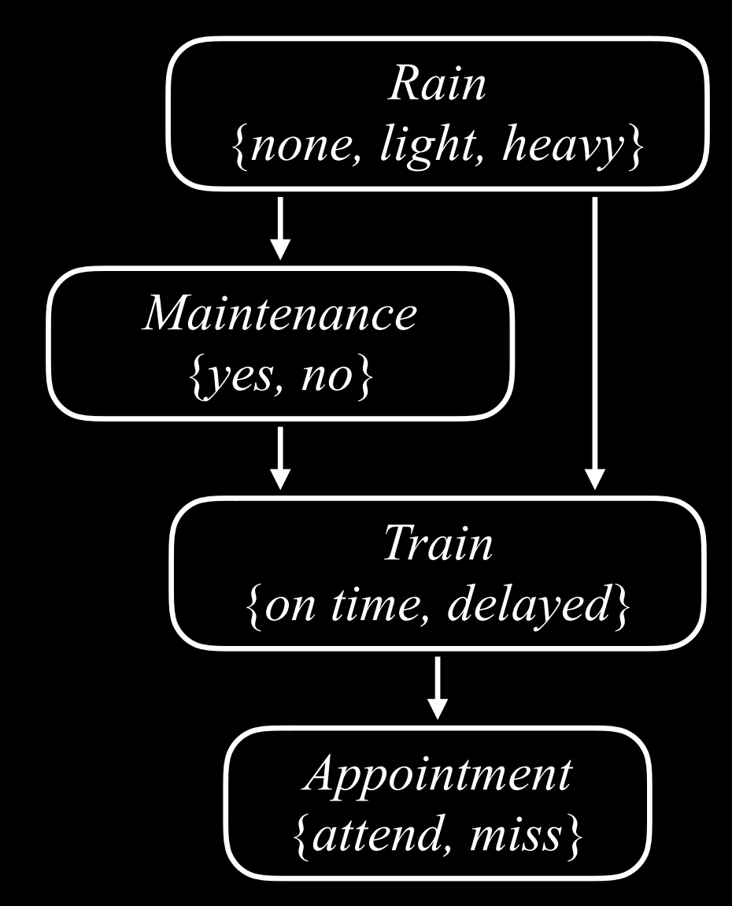
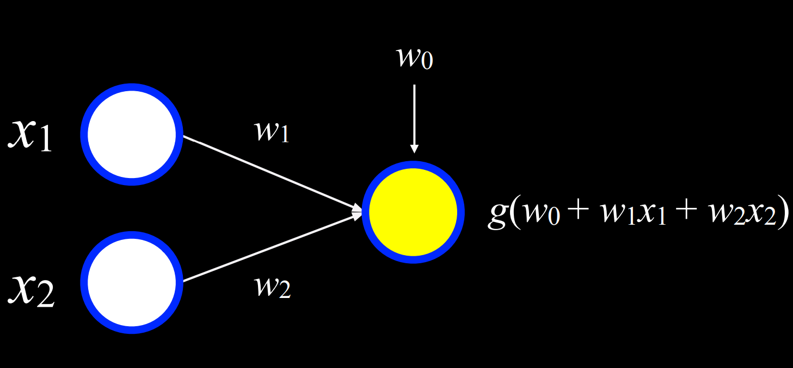

# Lecture
<!-- TOC -->

- [Lecture](#lecture)
  - [Lecture 1 - Search](#lecture-1---search)
  - [Lecture 2 - Knowledge](#lecture-2---knowledge)
  - [Lecture 3 - Uncertainty](#lecture-3---uncertainty)
  - [Lecture 3 - Optimization](#lecture-3---optimization)
  - [Lecture 4 - Learning](#lecture-4---learning)
  - [Lecture 5 - Neural Networks](#lecture-5---neural-networks)
  - [Lecture 6 - Language](#lecture-6---language)

<!-- /TOC -->
<!-- /TOC -->
<!-- /TOC -->
<!-- /TOC -->
<!-- /TOC -->

## Lecture 1 - Search

搜索方法可以看成是一个图，state是node，action是directed edge，为了避免环造成搜索永远不会结束，搜索时需要维护一个explored node set

在迷宫问题中，一些解法：

- uninformed search：解决问题的方式从根本上是一样的，没有考虑probloem-specific knowledge
  - DFS/BFS
- informed search：用到了和问题相关的信息，更高效
  - greedy best-first search，GBFS，每次会选择离goal最近的节点，距离由启发式函数`h(n)`决定，曼哈顿距离是一个常用的启发式函数
  - A* algorithm

A* algorithm
每次移动时，考虑g(n)+h(n)最小的节点
g(n) = cost to reach node, h(n) = estimated cost to goal
移动到这个节点需要的步数+后续需要的步数

和GBFS相比，A*化的时间可能更多，但是最后的结果是更好的

在以下条件下，A*算法是最佳的算法：

- `h(n)` is admissable，即启发式函数不会高估true cost
- `h(n)` is consistent，即对每个节点n以及后继者n'，`h(n) <= h(n')+c`，c为cost of step

Adversarial Search
两边对抗

Minimax
对每种可能出现的情况赋值，便于计算机理解。比如井字棋最后X赢了是1，O赢了是-1，平局是0。
包含两个对抗的玩家，max player和min player，每个人的目的是为了得到更大/更小的比分。
在井字棋中minimax算法的逻辑：考虑自己的所有可能选项，同时换位思考对手可能选择的行动，以此来决定自己的行动，如此反复直至比赛结束。

```pesudo
Given state s:
  * MAX picks action a in ACTIONS(s) that produces highest value of MIN-VALUE(RESULT(s,a))
  * MIN picks action a in ACTIONS(s) that produces lowest value of MAX-VALUE(RESULT(s,a))
```

max player会先列出来所有可能的结果RESULT(s,a)，然后模拟让min player决策，再从所有min_value里面选出来最大的。（我感觉这种max决策更偏稳，比如某个min_value很小但是后续max player可能得高分，但是max会忽略这种情况）
换位思考是minimax算法的核心

Alpha-Beta Pruning
在minimax的决策推演中，存在一些可以剪枝的情况
alpha和beta代表两个要跟踪的值，目前最好的分数和目前最坏的分数

Depth-Limited Mimimax
因为有时无法评估所有可能的情况，minimax会限制计算的步数，比如10-12步
为了在游戏未结束时评分，需要一个评估函数，对某个状态的局面进行评分

## Lecture 2 - Knowledge

一些概念：

- knowledge-based agent：可以基于knowledge internal representation推理的agent
- sentence：定义了外部世界的规则，使用knowledge representaion语言
- 一些逻辑符号：非、与、或、$\rightarrow$（蕴含，implication）、$\leftrightarrow$（双向条件，biconditional，if and only if）
- model：对一些命题赋真值（指定T F？），例如P=xxx，Q=xxx，P=F Q=T
- knowledge base：knowledge-based agent知道的一系列sentence，简写为KB
- entailment：蕴含，但是这里指两个sentence的关系：如果在每一个model中A成立，那么B也成立，记为$\alpha \models \beta$。
- inference：推理。从旧sentence得到新sentence的过程

---

Implication真值表

| P | Q | P -> Q |
|---|---|--------|
| F | F | T |
| F | T | T |
| T | F | F |
| T | T | T |

其中P=F Q=T的情况，P->Q为T。这是因为implication P->Q表示P发生则Q发生，P不发生则Q不一定发生。因此P为F时，无论Q为什么，P->Q都是T

Biconditional真值表

| P | Q | P <-> Q |
|---|---|--------|
| F | F | T |
| F | T | F |
| T | F | F |
| T | T | T |

biconditional表示的是当且仅当，if and only if。因此只有P Q同真同假时，P->Q才是真

---

语义后承（semantic consequence），$\models$，一般连接一个命题集合和一个命题。
实质蕴涵（material implication / material conditional），$\to$，连接的是两个命题

---

在上一章的搜索问题中，也有一些定义，这些定义可以迁移到本章的Theorem Proving中：

- initial state：starting knowledge base
- action：inference rules
- transition model：new knowledge base after inference
- goal test：检查是否证明了命题
- path cost function：证明的步数

---

后面还有一些名词，First-Orde Logic，Universal Quantification等，完全看不懂，先放着吧

## Lecture 3 - Uncertainty

概率：$0 \le P(\omega) \le 1$，$\sum_{\omega \in \Omega}P(\omega) = 1$
非条件概率（unconditional probability）：没有其他条件下，某个事件发生的概率
条件概率（conditional probability）：给了一些条件，此时某个事件发生的概率

Bayesian Network：表示random variable之间的dependancy的数据结构

- 有向图，顶点表示random variable，x到y的有向边表示x是y的parent
- 每个x的概率为$P(x|parents(x))$

Inference（中文应译作“推理”？）

- query：对事件计算概率
- evidence：对某个事件观测得到的概率
- hidden variable：query和evidence之外的variable
- goal：计算$P(x|e)$

条件概率和联合概率成正比：$P(A \wedge B) = P(A | B)P(B)$，这里考虑$P(B)$是常数？反正就是推到了一个这样的结论。
在使用时，可以在计算条件概率时将其转化为联合概率：

$$
    P(Appointment | light, no) = \alpha P(Appointment, light, no) \\
    = \alpha [P(Appointment, light, no, on time) + P(Appointment, light, no, delayed)]
$$

得到一个公式，y代表hidden variable能取到的值：
$P(X|e) = \alpha P(X,e) = \alpha \sum_{y}{P(X,e,y)}$
Python有一些库，可以方便的计算条件概率，只需要自己定义贝叶斯网络中的节点就行了

Approximate Inference：
某些情况下，不能得到精确的概率，但是可以对概率做一个估计，因此是近似的推理

如何在贝叶斯网络中做近似推理？

> 举个贝叶斯网络的例子
> 

- Sampling：
用大数估计的方式来估算概率。比如要计算$P(Appointment=on\ time)$。从`Rain`开始，每个节点按概率取一个值，得到一系列variable值的集合，注意前面的variable取的值会影响后面的概率。
- Reject Sampling：也是一种采样方法，比如要计算条件概率$P(Rain=light|Train=on\ time)$，那么就要在总样本中去掉$Train=delayed$的样本。因此拒绝采样就是在采样时排除“不符合现有evidence”的样本。拒绝采样的缺点是，如果过滤使用的evidence发生概率较低，那么取样时很多的样本都是无效的，比较低效。一种解决该问题的采样方法是likelihood weighting。
- Likelihood Sampling：目标是避免丢弃不符合evidence的样本。因此在取样时，首先会固定已经观测到的值，例如$Train=on\ time$，然后按正常抽样方式取样（Rain->Maintence->Appointment），最后根据相关事件的概率对这个样本赋一个权值，例如$Rain=light & Maintenance=yes$的概率为0.6，那么这个样本的权重就是0.6
- Markov Assumption：假设当前状态受前面k个状态的影响。
- Markov Chain：random variable的序列，每个variable遵循Markov假设
- Hidden Markov Model：Markov model for a system with hidden states that generate some observed events。例如，通过观察办公室有没有人带伞，推测今天是否下雨。和Markov模型不同，Hidden Markov model不像是一个chain，而是类似一个表格：

```
X1 --- X2 --- X3 --- X4 --- X5
|      |      |      |      |
E1 --- E2 --- E3 --- E4 --- E5
```

Hidden Markov Model的一个应用（explaination）是，给一个observation sequence，要求计算最可能的state sequence。（已知某段事件人们每天是否带伞，要求计算这段时间的天气）

## Lecture 3 - Optimization

local search：
局部搜索，从一个初始解出发，只关心当前解的邻域，通过连续小步骤改进逐渐寻找最优解

hill climbing：
爬山算法，每次寻找更大的neighbor，直至找不到

simulated annealing：
模拟退火，开始时温度更高，更容易接受比current更差的neighbor，后面温度更低，接受更差的解概率降低

traveling salesman problem：
xxx

linear programming：
问题形式：$l_i \le x_i \le u_i$，在限制条件$a_1x_1+a_2x_2+...+a_nx_n \le b$或者$a_1x_1+a_2x_2+...+a_nx_n = b$下，需要求$c_1x_1+c_2x_2+...+c_nx_n$的最小值。

解法：

- simplex，单纯形法
- interior point，内部点法

constraint satisfaction：
问题形式：
四个学生，每个学生需要有三门考试，只有三天可以安排考试，并且希望不要有人一天参加两场考试。


解法：

- 画约束图（constraint graph），把存在约束条件的变量之间连接起来，形成一个无向图
- 维护一个边的队列，每次拿出来一条边x-y，根据限制条件排除x可能取到的某些值；下一步，因为x的可能取值变动了，需要对x的其他边（x-y以外的）进行入队，用于后续的限制条件排除

问题的推广：
这种具有约束条件的情况，一般包含三个部分：

- variable，变量（课程 A-G）
- domain，variable可能的取值（day 1-3）
- constriant，硬限制和软限制，软限制可以区分更优的解法，比如有人喜欢课程A考试早于课程B

backtracking search：
针对现在的问题，选择一个尚未确定的变量，如果这个变量和已经做的选择不冲突，就继续尝试解决剩下的问题

回溯算法的优化：
在选择一个尚未确定的变量时，如果可以选到合适的值，可以避免很多无用的计算。

- minimum remaining values（MRV）：一种启发式算法，
它选择域最小的变量，即可能取值最少的变量
- degree heuristic：度启发式算法。一个节点的degree越大，说明它受到的约束越多，
- least-constraining values heuristic：对一个节点来说，假设它的取值范围为$\{A,B,C\}$，每个值可以排除neighbor可能值的数量为1、2、3，那么这种启发式算法会选择A，这是因为排除更少的可能选项，意味着可能找到尽可能多的解决方案。

总结：

- 问题形式化：local search、linear programming、constraint satisfaction

## Lecture 4 - Learning

Supervised Learning:
给定一个input-output的数据集，得到一个从input到output映射的函数

Classification:
有监督学习的一种，目标是得到将input映射到离散目录的映射函数。例如，给定某个地区近期的天气统计`(date,humidity,pressure,rain)`，然后建立一个`(humidity,pressure) -> rain`的映射`f`

Nearest-neighbor classification:
一种算法，给出离input最近的data point。例如在上面的天气预报中，以`(humidity,pressure)`作为坐标，把所有的数据点列出来。


k-nearest-neighbor classification:
一种算法，对距离input最近的k个数据点，统计它们的种类，根据少数服从多数，判断input的类型。例子还是上面的例子。

Perceptron learning rule:
perceptron中文是“感知机”。这个算法的目标是得到一个分类函数`h(x1,x2)`，把input`(x1,x2)`代入得到的值和`threshold`比较，然后可以将input分类。

- 分类函数`h(x1,x2)`：

$$
h(x_1,x_2)=
\begin{cases}
  Rain, if\ w_0+w_1x_1+w_2x_2 \ge 0 \\
  No\ rain, otherwise
\end{cases} \\
h_w(x)=
\begin{cases}
  1, if\ \vec{w} \cdot \vec{x} \ge 0 \\
  0, otherwise
\end{cases}
$$

$h_w(x)$可以看成两个向量$\vec{w}=(w_0,w_1,w_2)$、$\vec{x}=(x_0,x_1,x_2)$的乘积。要确定$w_1$、$w_2$的值，需要根据数据集计算：

$$
w_i=w_i+\alpha(y-h_w(x))x_i \\
w_i=w_i+\alpha(actual value-estimate)x_i
$$


Support vector machine:
目标是找到maximum margin separator。形象一点，就是找到一个离两种类型数据点距离最远的分割线


Maximum margin separator:
离任何数据点距离最远的分割线


Regression:
一种有监督学习任务，目标是得到将input映射到连续值的函数。比如线性回归。

---

上面的是各种解决问题的方法，下面是如何评估这些方法，如何评估不同的假设。

Loss function:
损失函数。值越小越好，可以代表成本函数（做出假设的成本）、预测的失败等等。下面是常见的损失函数。

0-1 loss function:
$$
L(actual,predicted)=
\begin{cases}
  0,if\ actual=predicted \\
  1,otherwise
\end{cases}
$$

如果预测不对，那么损失函数的输出就是1

$L_1$ loss function:
$$
L(actual,presicted)=|actual-predicted|
$$

这里损失函数取的是沿y轴方向的距离

$L_2$ loss function:
$$
L(actual,predicted)=(actual-predicted)^2
$$

这里损失函数取的是沿y轴距离的平方。和$L_1$的区别在于，误差较大的地方，loss会被放大

Overfitting:
过拟合。和特定样本的拟合程度太高，对其他的数据集拟合效果很差。

---

上面介绍了几种损失函数。在解决实际问题中，一般会定义一个成本函数`cost(h)`，它包括损失函数，这代表做出假设的成本。
如果只有`cost(h)=loss(h)`，那么由于只有单一的降低损失的目标，可能会造成过拟合。
因此为了避免过拟合，成本函数需要增加一项`complexity(h)`，代表假设的复杂性。一般我们更偏向简单的假设，更简单的解决方案。
因此最终的成本函数看起来是：
$$
cost(h)=loss(h)+\lambda complexity(h)
$$
假设的成本包括假设的损失以及假设的复杂性，因为需要惩罚太复杂的假设。$\lambda$是自定义的参数

Regularization:
正则化。对复杂假设进行惩罚，避免过拟合的过程。
$$
cost(h)=loss(h)+\lambda complexity(h)
$$

Holdout cross-validation:
留出交叉验证。将数据分成训练集和测试集。

k-fold cross-validation:
k折交叉验证。将数据分成k份。一共进行k次实验，每次用1份作为测试集，用其他k-1份做训练集。

Python中的机器学习库：
`scikit-learn`

Reinforcement Learning:
给定一些奖励/惩罚的方法，学习未来要采取的行动


Markov decision process:
决策模型，包括state、action、reward

- state的集合`S`
- action的集合`Actions(s)`
- transition model`P(s'|s,a)`
- reward function`R(s,a,s')`

Q-learning:
目标是学习得到一个函数`Q(s,a)`，这个函数可以估计对state`s`做出action`a`的影响，得到一个值

总流程：

- 对所有`s`，`a`，从`Q(s,a)=0`开始
- 对于state`s`采取action`a`，得到一个reward`r`：
  - 根据reward估计`Q(s,a)`的值，估计一个未来的reward
  - 根据估计值，更新`Q(s,a)`

$$
Q(s,a) \leftarrow Q(s,a) + \alpha(new\ value\ esitimate - old\ value\ estimate) \\
Q(s,a) \leftarrow Q(s,a) + \alpha((r+future\ reward\ value) - Q(s,a)) \\
Q(s,a) \leftarrow Q(s,a) + \alpha((r+max_{a'}Q(s',a'))-Q(s,a)) \\
Q(s,a) \leftarrow Q(s,a) + \alpha((r+\gamma max_{a'}Q(s',a'))-Q(s,a))
$$

上面最后一个公式中，$\gamma$表示给未来的奖励加的系数
整个公式的思想在于，每次得到新的reward的时候，更新对action的estimate

Greedy Decisio-Making:
对于state`s`，选择`Q(s,a)`取最大值对应的action`a`

Explore vs. Exploit
Exploit表示agent已知的知识，选择这些action会得到reward，Explore表示探索其他的可能性。如果agent只会利用已有的知识，没有自己探索，那么可能得不到最优解。

$\epsilon$-greedy:

- $\epsilon$代表随机探索的概率
- $1-\epsilon$的概率，选择esitimated best move
- $\epsilon$的概率，选择random move

精确了解每个`Q(state,action)`的值可能很困难，但是可以近似估计

Function approximation:
一般是结合多种feature来用函数估计`Q(state,action)`的值，而不是为每个state-action pair存一个值

Unsupervised learning:
有输入数据，但是没有额外的feedback

Clustering:
无监督学习中的一种。聚类，将一系列物体分类，相似的分到一类。常见的聚类应用有：遗传研究，市场研究，医学图像，社交网络研究

k-means clustering:
一种聚类算法。目标是将所有的数据点分成k个不同的聚类，每个类的中心被用来判断数据点属于的类别，数据点会被归为此类


总结：

- 有监督学习
- 强化学习
- 无监督学习

## Lecture 5 - Neural Networks

Neural network:

- 神经元互相连接，并且可以接收、传递电信号
- 神经元可以处理输入信号，可以被激活

Artificial neural network:

- 数学模型，包括从input到output的整个网络的结构、参数
- 通过学习数据得到参数

根据输入的一系列参数，计算$h(x_1,x_2)=w_0x_0+w_1x_1+w_2x_2$的值

计算了$h(x_1,x_2)$的值之后，如何判断结果？有一系列函数：

- step function

- logistic function

- rectified linear unit (ReLU)


根据输入参数计算h的公式$h(x_1,x_2)=w_0x_0+w_1x_1+w_2x_2$，可以表示用两层神经元表示：

顶点表示输入的参数，边表示权重

Gradient descent
梯度下降。一种训练神经网络的算法，可以最小化loss。适用于loss函数是凸函数的情况。凸函数的极小值是最小值，因此按着梯度的方向不断更新自变量，就可以达到极小值，从而最小化loss

 流程：

- 初始的权重是随机的
- 重复以下过程：
  - 根据所有数据点计算gradient，选择能降低loss的direction
  - 根据gradient更新权重

Stochastic gradient descent
随机梯度下降。
和“梯度下降”区别在于，每次使用一个数据点计算梯度，而非“所有”数据点

Mini-batch gradient descent
小批量梯度下降。
和“梯度下降”区别在于，每次根据small batch计算梯度

Perceptron
感知机。二类分类的线性分类模型。

Multilayer neural network
多层神经网络。一个input layer，一个output layer，至少一个hidden layer

Backpropagation
反向传播。一种训练包含hidden layer的神经网络的方法。

流程：

- 初始的权重是随机的
- 重复以下步骤：
  - 计算output layer的error
  - 按output->hidden->input的顺序，传播error并更新权重

Deep neural network
深度神经网络。有很多hidden layer的神经网络

Dropout
如果模型的参数太多，训练的样本比较少，那么容易产生过拟合现象。Dropout是在每次前向传播-误差反向传播的训练中随机删掉一部分的hidden neuron，这样可以减少overfitting现象。

为什么dropout可以减少过拟合现象？

- 取平均。每次随机删掉神经元改变了网络的结构，因此相当于多次训练取平均
- 减少对特定神经元的过度依赖

Image concolution
图像卷积。可以用于滤波、特征提取、边缘检测等。

具体流程：
原图片表示为矩阵A。另外有一个kernel矩阵B。每次在矩阵A里面划分一个和B一样大的矩阵，计算对应位置元素相乘的和，最后得到一个新矩阵。


Pooling
池化/共同使用。通过对input的区域进行采样，减少input size

Max-pooling
最大池化。将输入图像划分为多个区域，对每个区域输出其中的最大值。可以减少数据量，提取关键特征。


Convolutional neural network
卷积神经网络。常用于分析图像。


Feed-forward neural network
FNN。信息在层之间是单项流动的，只有input->hidden->output方向。

Recurrent neural network
循环神经网络，RNN。信息是双向流动的。


根据具体场景，可能会有1个input对多个output、多对1、多对多

## Lecture 6 - Language

语言的几个特点：

- syntax，句子中不同的成分有位置顺序
- semantics，一个句子有很多种表达形式。句子各种成分即使满足了syntax，也不一定表示有意义的东西。

