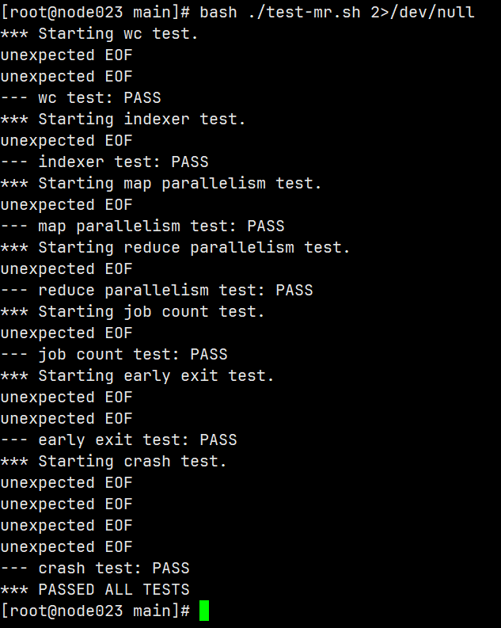

# MIT 6.824: Distributed System (Lab)

## Lab 1: MapReduce



p.s. 这里有很多 `EOF` 的报错，百度了下怀疑是 rpc 调用的问题，后面再排查下

本实验要求实现一个 MapReduce 框架，需要实现 `coordinator`、`worker`，以及它们之间的 RPC 交互逻辑。
和看论文不同，具体实现一个框架还是有很多东西需要考虑，下面是我在实现过程中的总结。

首先是数据结构设计这块。按照 Lab 要求需要有这些 feature：

```
coordinator：分配工作给 worker，处理超时 worker（将工作分配给其他 worker）
worker：向 coordinator 请求工作，调用 map/reduce 函数
使用 RPC 交互
```

### Coordinator

#### 是否要维护 worker 状态？

一开始我的想法是 `coordinator` 在初始化的时候创建一个 thread pool 并维护一个 task list，然后定时分配 task、轮询 task 状态。但是我看了下 repo 提供的测试脚本，发现 worker 的数目并不是固定的，因此如果要在 coordinator 这边维护 worker 状态，就需要实现在 coordinator 注册 worker 的方法，以及定时探活等功能，有点复杂。

如果不维护 worker 状态，转而维护 task 的状态呢？如果一个 worker 是 idle 的，它可以主动向 coordinator 发送心跳，然后从 coordinator 拿到 task 并执行。这样的 stateless worker 实现起来是更加简单的。

因此，这里的 `coordinator` 只维护了 task 的状态，使用 channel 来处理 worker 发送的信息（表示自己 idle 的心跳信息、完成 task 的报告信息）。值得一提的是，表示 job 状态的 `finishJob` 并没有使用 channel，而是使用读写锁来保护，这里我觉得还能改一下。

```go
type Task struct {
    file      []string
    id        int
    startTime time.Time
    status    TaskStatus
}

type Coordinator struct {
    files           []string
    tasks           []Task
    mappedFilenames [][]string // "map-x-y" files, mappedFiles[i] is processed by reduce worker i
    finishedTasks   int

    nMap          int
    nReduce       int
    phase         SchedulePhase
    heartbeatChan chan heartbeatMsg
    reportChan    chan reportMsg
    finishJob     bool
    finishJobLock sync.RWMutex
    // finishCh chan struct{}

    taskId int
}

type heartbeatMsg struct {
    response *HeartbeatResponse
    ok       chan struct{}
}

type reportMsg struct {
    request *ReportRequest
    ok      chan struct{}
}
```

#### Channel

`coordinator` 在接受到 `worker` 的 RPC 请求后，会将请求体放到两个 channel 中，给负责调度 task 的协程处理。协程处理完请求之后会通过 channel 通知，因为只会有这一个调度协程修改 `coodinator` 的数据，因此也不需要考虑 data race 的问题。channel 真的很好用~

#### 检测超时

我在检测超时 task 这块没有使用定时检测，而是在分配 task 的时候顺便检测，如果是 task 是 running 并且 10s 还未完成，就重新分配。本来还以为这个功能会很麻烦，其实实现起来倒挺简单。

这里还有一个和 MapReduce 论文区别的点，因为实际只有一个节点，worker 是进程，所以论文中写的 “故障节点上的 completed map task 要重新执行” 这条不需要，成功的 task 不需要重新执行，只需要重新执行失败的 task 就行了。

### Worker

`worker` 实现就比较简单，主要是一个循环：

```go
func Worker(mapF func(string, string) []KeyValue, reduceF func(string, []string) string) {
for {
    response := doHeartbeat()
    log.Printf("Worker: receive coordinator's heartbeat %v \n", response)
    switch response.JobType {
    case MapTask:
        doMapTask(mapF, response)
    case ReduceTask:
        doReduceTask(reduceF, response)
    case Wait:
        time.Sleep(1 * time.Second)
    case CompleteJob:
        return
    default:
        panic(fmt.Sprintf("unexpected jobType %v", response.JobType))
    }
}
}
```

这里做了一点简化，将发送心跳和请求 task 放到一起了，所以 coordinator 会在收到心跳之后直接派活。
在 report map task 的时候，请求里面携带了中间文件的文件名，coordinator 会将这些信息填到 reduce task 中。

还有一个文件名的问题，map worker 生成的文件名是 `map-<随机 5 位字符串>-<reduce worker id>`，这里本来想把中间部分换成 worker id 这种更有标识度的值，但是还是需要在 coordinator 这边维护 worker 状态就没弄。反正最后只需要将中间文件按 reduce worker 划分，所以这里就直接让 worker 把生成的中间文件作为 `[]string` 传过来了，后面 reduce task 的输入就直接用这个值。
