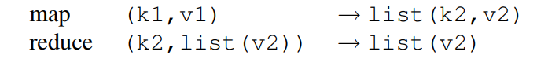
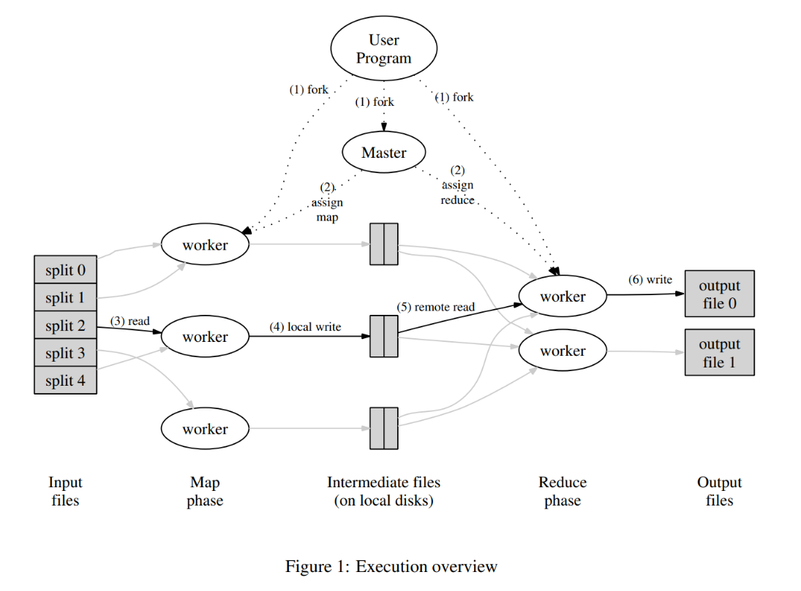

# MIT 6.824: Distributed System

<!-- TOC -->

- [MIT 6.824: Distributed System](#mit-6824-distributed-system)
  - [链接](#链接)
  - [Lecture 1](#lecture-1)
    - [预习 Mapreduce](#预习-mapreduce)
    - [分布式系统简述](#分布式系统简述)
    - [MapReduce](#mapreduce)
  - [Lecture 2](#lecture-2)
    - [Why threads?](#why-threads)
  - [RPC](#rpc)

<!-- /TOC -->

## 链接

Syllabus: <http://nil.csail.mit.edu/6.5840/2024/schedule.html>

Lab:

- <http://nil.csail.mit.edu/6.824/2021/labs/lab-mr.html>
- <http://nil.csail.mit.edu/6.5840/2024/labs/lab-kvsrv.html>
- <http://nil.csail.mit.edu/6.5840/2024/labs/lab-raft.html>
- <http://nil.csail.mit.edu/6.5840/2024/labs/lab-kvraft.html>
- <http://nil.csail.mit.edu/6.5840/2024/labs/lab-shard.html>

## Lecture 1

### 预习 Mapreduce

总结：

- MapReduce 是一种处理和生成大数据集的编程模型，MapReduce 程序是天然并行的，系统会处理并行、容错、数据管理、负载均衡，用户只需要关心关键的 map/reduce 逻辑
- `map` 函数会对每条 record 生成中间 kv 对，并且生成中间 kv 对
- `reduce` 函数会合并 key 相同的中间 kv 对

举例，现在需要大量文件中每个单词出现的次数，那么编写的 map/reduce 函数是：

- map：对每个文件，生成中间 kv 对 `(word, 1)`。
- reduce：聚合相同 key 的中间 kv 对，生成 kv 对 `(word, result)`

我感觉这里 reduce 应该表示：`(k2, list(k2, v2)) -> (k2, v3)`

一些应用场景：

- 文本匹配
- url access 统计
- reverse web-link graph，web 页面跳转统计
- inverted index，搜索 word 在哪些文件中出现过
- distributed sort，后面详细讨论

MapReduce 的正确实现依赖于具体的环境，本文介绍的实现基于 Google 的环境————以太网互联的大规模消费级 PC 集群：

- 每台机器为双核 x86 处理器，Linux 系统，2-4GB 内存
- 网卡为 100Mbps 或者 1Gbps，但是实际带宽比这个低
- 一个集群有成百上千台机器，因此节点故障很频繁
- 存储使用机器上的磁盘，分布式文件系统用于管理这些磁盘的数据、保证可靠性
- 用户通过调度系统提交作业，每个 job 包含一些 task，task 会被提交到集群的可用机器上

MapReduce 执行流程：

- 输入被划分成 M 个 16-64MB 大小的块，中间输出被划分成 R 个块
- master 负责将工作分配给 worker，一共有 `M+R` 个 task
- map worker 会读取输入，将中间 kv 对写到内存中
- 内存里的中间 kv 对会周期性地被写到 local disk，并且文件位置会被传回 master
- reduce worker 收到中间文件的位置信息之后，会远程读这些数据。之后会按照 intermediate key 排序。排序可以将相同 key 的值聚集在一起，从而 reduce 函数可以按顺序处理 kv 对。如果数据太多，还需要使用 externally sort。接着，reduce worker 会遍历已排序的数据，对 kv 对执行 reduce 函数，将结果 append 到输出文件

最后会产生 R 个文件，一般不会组合成一个文件。用户可能直接将 R 个文件作为下一个 MapReduce 应用的输入，或者是其他分布式应用的输入

每个 task 有三种状态（idle/in-progress/completed）

容错：

- worker：
  - master 通过心跳机制探活 worker，worker 一段时间不响应会被判断为 failed。
  - failed worker 上的 completed map task 和 in-progress map/reduce task 会被标记为 idle 并被其他 worker 重新执行。completed reduce task 不会重新执行，因为输出已经写到 GFS 了，而 map task 的输出在 local disk 中。
  - 对于节点故障导致的 map task 重复执行的情况，所有 reduce worker 会被通知 reexecution，这样才能在新 worker 上读数据
- master：
  - master 需要维护的状态有：每个 map/reduce task 的状态、每个 wroker 的状态、completed map task 的输出文件的位置和大小
  - 一个 master 故障的概率不高，如果要做容错可以定期保存 checkpoint 状态
- semantics：
  - 保证分布式 MapReduce 框架的计算结果和 non-faulting 串行程序的结果一致
  - atomic commits of map/reduce。这块没太看懂

局部性：

GFS 管理的输入数据存储在 local disk，不同机器上是有副本的，可以用这一点节省网络带宽。MapReduce 在调度 map task 时，会尝试在包含输入数据副本的 worker 上调度任务，如果无法实现，会尝试在靠近副本位置的 worker 上调度任务（例如同一交换机下）。效果是，大多数数据都是本地读取的

长尾优化：

- 现象：最慢的 map/reduce task 会影响整体完成时间，
- 解决方法：MapReduce 操作接近完成时，Master 会调度剩余 in-progress 任务的备份执行，无论主任务还是备份任务完成，该任务都会被标记为已完成。

Combiner 函数：

某些情况下，中间产生的 kv 对有显著重复，例如 word 计数中会出现很多 `(the, 1)`，这时可以用 combiner function 在网络传输数据之前做 partial merging。

测试部分：

省略

---

本节课介绍：

- 什么是分布式系统？
- 分布式系统发展历史
- 课程结构

### 分布式系统简述

非正式定义：多台计算机、通过网络交互、合作完成任务

使用分布式系统的场景 / 原因：

- 连接多台机器，用于数据共享 / 计算基础设施共享
- 通过并行提高性能
- 容错，高可用性
- 安全，隔离多个服务 / 系统

发展历史：

- 1980s，本地局域网，应用类型以 DNS、Email 为主
- 1990s，数据中心，大型网站，网络搜索，网上购物
- 2000s，云计算

复杂性挑战：

- 很多并行的部分
- 需要处理组件故障
- 增加机器

基础设施：

- 存储：kv 服务、文件系统
- 计算：编排或构建分布式应用，例如 mapreduce
- 通信：例如远程调用 RPC，语义会对系统产生影响

主题：

- fault tolerance
  - 可用性，描述系统的可靠程度。关键技术是 replication
  - 可恢复性，例如重启之后可以恢复状态。关键技术是 logging/transaction，以及持久存储
- consistency
  - 整个系统的使用和单台机器类似，并发和失败会影响这一点
  - 不同类型的一致性
- performance
  - 需要在性能和提供容错、一致性之间 trade-off
  - 性能指标一般涉及吞吐量、延迟

### MapReduce

略

## Lecture 2

### Why threads?

线程可以提供多种类型的 concurrency：

- I/O concurrency。一个线程因为 IO 没准备好被阻塞的时候，可以让其他线程运行
- 多核并行。不同的线程可以在不同的核心上运行
- 有一些定时操作，可以让线程执行

Thread challenge：

- race condition。两种解决方法：不共享内存，例如 Go 中的 channel；使用锁保护
- coordination。可以使用 channel，或者 condition variable
- deadlock

## RPC

远程过程调用，remote procedure call

RPC 语义

- at lease once：client 在失败时会重试，至少成功一次
- at most one：0 或 1，Go 的就是这种
- exactly once：很难