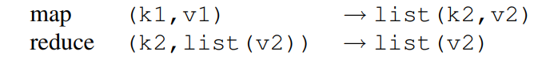
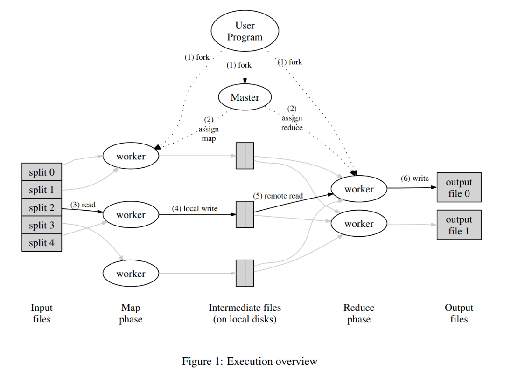
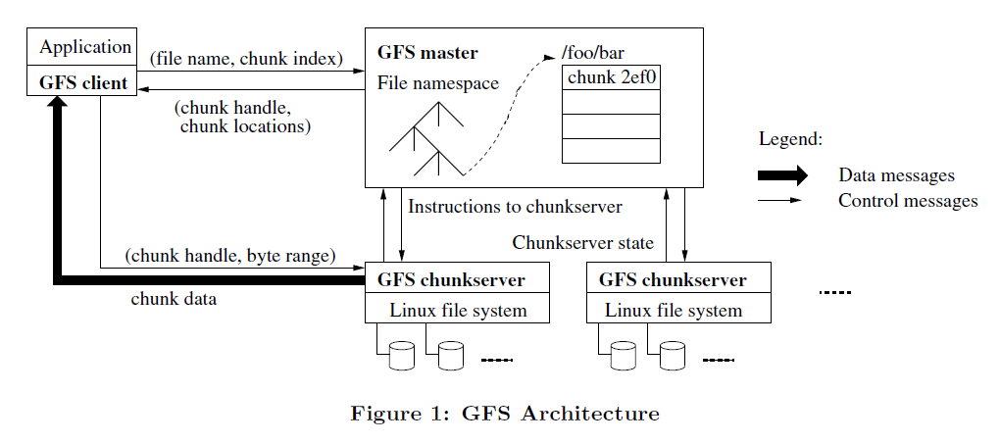

# MIT 6.824: Distributed System

<!-- TOC -->

- [MIT 6.824: Distributed System](#mit-6824-distributed-system)
  - [Lecture 1](#lecture-1)
    - [预习 Mapreduce](#预习-mapreduce)
    - [分布式系统简述](#分布式系统简述)
    - [MapReduce](#mapreduce)
  - [Lecture 2](#lecture-2)
    - [Why threads?](#why-threads)
    - [Crawler](#crawler)
    - [RPC](#rpc)
  - [Lecture 3](#lecture-3)
    - [预习 GFS](#预习-gfs)

<!-- /TOC -->
<!-- /TOC -->
<!-- /TOC -->
<!-- /TOC -->
Lab:

- <http://nil.csail.mit.edu/6.824/2021/labs/lab-mr.html>
- <http://nil.csail.mit.edu/6.5840/2024/labs/lab-kvsrv.html>
- <http://nil.csail.mit.edu/6.5840/2024/labs/lab-raft.html>
- <http://nil.csail.mit.edu/6.5840/2024/labs/lab-kvraft.html>
- <http://nil.csail.mit.edu/6.5840/2024/labs/lab-shard.html>

## Lecture 1

### 预习 Mapreduce

总结：

- MapReduce 是一种处理和生成大数据集的编程模型，MapReduce 程序是天然并行的，系统会处理并行、容错、数据管理、负载均衡，用户只需要关心关键的 map/reduce 逻辑
- `map` 函数会对每条 record 生成中间 kv 对，并且生成中间 kv 对
- `reduce` 函数会合并 key 相同的中间 kv 对

举例，现在需要大量文件中每个单词出现的次数，那么编写的 map/reduce 函数是：

- map：对每个文件，生成中间 kv 对 `(word, 1)`。
- reduce：聚合相同 key 的中间 kv 对，生成 kv 对 `(word, result)`



我感觉这里 reduce 应该表示：`(k2, list(k2, v2)) -> (k2, v3)`

一些应用场景：

- 文本匹配
- url access 统计
- reverse web-link graph，web 页面跳转统计
- inverted index，搜索 word 在哪些文件中出现过
- distributed sort，后面详细讨论

MapReduce 的正确实现依赖于具体的环境，本文介绍的实现基于 Google 的环境————以太网互联的大规模消费级 PC 集群：

- 每台机器为双核 x86 处理器，Linux 系统，2-4GB 内存
- 网卡为 100Mbps 或者 1Gbps，但是实际带宽比这个低
- 一个集群有成百上千台机器，因此节点故障很频繁
- 存储使用机器上的磁盘，分布式文件系统用于管理这些磁盘的数据、保证可靠性
- 用户通过调度系统提交作业，每个 job 包含一些 task，task 会被提交到集群的可用机器上

MapReduce 执行流程：



- 输入被划分成 M 个 16-64MB 大小的块，中间输出被划分成 R 个块
- master 负责将工作分配给 worker，一共有 `M+R` 个 task
- map worker 会读取输入，将中间 kv 对写到内存中
- 内存里的中间 kv 对会周期性地被写到 local disk，并且文件位置会被传回 master
- reduce worker 收到中间文件的位置信息之后，会远程读这些数据。之后会按照 intermediate key 排序。排序可以将相同 key 的值聚集在一起，从而 reduce 函数可以按顺序处理 kv 对。如果数据太多，还需要使用 externally sort。接着，reduce worker 会遍历已排序的数据，对 kv 对执行 reduce 函数，将结果 append 到输出文件

最后会产生 R 个文件，一般不会组合成一个文件。用户可能直接将 R 个文件作为下一个 MapReduce 应用的输入，或者是其他分布式应用的输入

每个 task 有三种状态（idle/in-progress/completed）

容错：

- worker：
  - master 通过心跳机制探活 worker，worker 一段时间不响应会被判断为 failed。
  - failed worker 上的 completed map task 和 in-progress map/reduce task 会被标记为 idle 并被其他 worker 重新执行。completed reduce task 不会重新执行，因为输出已经写到 GFS 了，而 map task 的输出在 local disk 中。
  - 对于节点故障导致的 map task 重复执行的情况，所有 reduce worker 会被通知 reexecution，这样才能在新 worker 上读数据
- master：
  - master 需要维护的状态有：每个 map/reduce task 的状态、每个 wroker 的状态、completed map task 的输出文件的位置和大小
  - 一个 master 故障的概率不高，如果要做容错可以定期保存 checkpoint 状态
- semantics：
  - 保证分布式 MapReduce 框架的计算结果和 non-faulting 串行程序的结果一致
  - atomic commits of map/reduce。这块没太看懂

局部性：

GFS 管理的输入数据存储在 local disk，不同机器上是有副本的，可以用这一点节省网络带宽。MapReduce 在调度 map task 时，会尝试在包含输入数据副本的 worker 上调度任务，如果无法实现，会尝试在靠近副本位置的 worker 上调度任务（例如同一交换机下）。效果是，大多数数据都是本地读取的

长尾优化：

- 现象：最慢的 map/reduce task 会影响整体完成时间，
- 解决方法：MapReduce 操作接近完成时，Master 会调度剩余 in-progress 任务的备份执行，无论主任务还是备份任务完成，该任务都会被标记为已完成。

Combiner 函数：

某些情况下，中间产生的 kv 对有显著重复，例如 word 计数中会出现很多 `(the, 1)`，这时可以用 combiner function 在网络传输数据之前做 partial merging。

测试部分：

省略

---

本节课介绍：

- 什么是分布式系统？
- 分布式系统发展历史
- 课程结构

### 分布式系统简述

非正式定义：多台计算机、通过网络交互、合作完成任务

使用分布式系统的场景 / 原因：

- 连接多台机器，用于数据共享 / 计算基础设施共享
- 通过并行提高性能
- 容错，高可用性
- 安全，隔离多个服务 / 系统

发展历史：

- 1980s，本地局域网，应用类型以 DNS、Email 为主
- 1990s，数据中心，大型网站，网络搜索，网上购物
- 2000s，云计算

复杂性挑战：

- 很多并行的部分
- 需要处理组件故障
- 增加机器

基础设施：

- 存储：kv 服务、文件系统
- 计算：编排或构建分布式应用，例如 mapreduce
- 通信：例如远程调用 RPC，语义会对系统产生影响

主题：

- fault tolerance
  - 可用性，描述系统的可靠程度。关键技术是 replication
  - 可恢复性，例如重启之后可以恢复状态。关键技术是 logging/transaction，以及持久存储
- consistency
  - 整个系统的使用和单台机器类似，并发和失败会影响这一点
  - 不同类型的一致性
- performance
  - 需要在性能和提供容错、一致性之间 trade-off
  - 性能指标一般涉及吞吐量、延迟

### MapReduce

略

## Lecture 2

### Why threads?

线程可以提供多种类型的 concurrency：

- I/O concurrency。一个线程因为 IO 没准备好被阻塞的时候，可以让其他线程运行
- 多核并行。不同的线程可以在不同的核心上运行
- 有一些定时操作，可以让线程执行

Thread challenge：

- race condition。两种解决方法：不共享内存，例如 Go 中的 channel；使用锁保护
- coordination。可以使用 channel，或者 condition variable
- deadlock

Is there an alternative to threads?

事件驱动模型（event-driven）是一种替代方案，它在一个单线程中通过显式地交错执行多个任务来实现并发。
每个任务的状态被显式地维护在一个表中，事件循环负责检查输入、执行任务步骤并更新状态。

工作原理：

- 事件循环不断检查是否有新的事件（如 I/O 完成、消息到达）。
- 当事件发生时，事件循环会处理该事件，并更新相关的任务状态。
- 这种方式避免了多线程的开销，但仍然可以实现 I/O 并发（例如同时处理多个网络请求）。

适用场景：适合 IO 密集型的应用，例如网络服务器、爬虫等，不适合计算密集型任务，例如科学计算

### Crawler

crawler challenges

- 要利用 IO 并行：网络请求通常受限于延迟而非带宽，因此通过并发（例如多线程或者异步 IO）可以提高爬虫效率，线程是一种实现方式
- 每个 URL 只抓取一次：避免重复抓取，可以节省网络资源和服务器资源
- 判断任务结束：爬虫需要明确任务的结束条件，例如所有目标 URL 已获取到、达到抓取深度限制、抓取数据量已到阈值

给了三种实现：

- serial。单个线程使用 DFS 爬取页面，使用 map 到记录访问过的页面
- mutex，多线程，使用 mutex 保护 map
- channel，多线程，worker 通过 channel 将爬到的 url 传给 master

sharing & lock，channel 该如何选择？

大多数情况下两者都可以。主要取决于程序员的想法：

- state，使用 sharing+lock
- communication，使用 channel

### RPC

远程过程调用，remote procedure call

RPC 语义

- at lease once：client 在失败时会重试，至少成功一次
- at most one：0 或 1，Go 的就是这种
- exactly once：很难实现

RPC 故障处理

当 RPC 因为网络或其他原因失败时，一种常用处理方法是 client 重试几次，如果仍然没有收到 server 回复再报错，这种处理方法适合只读的操作，或者是其他幂等操作

更好的 RPC behaviour 是 at most once。这需要 server 能识别到重复的请求，返回 previous reply 而非重复执行 handler。（我的理解，previous reply 就是回复一次）

如何识别重复请求：每个请求带一个唯一 ID（XID），如果重新发送这个请求，需要带相同的 XID。server 需要记录收到过的 XID，并维护一个 request-handler 的表：

```
server:
    if seen[xid]:
        r = old[xid]
    else
        r = handler()
        old[xid] = r
        seen[xid] = true
```

防止 XID 重复：使用 client 特有信息（例如 IP）+ 消息序列号作为 XID
server 在判断哪些 RPC 消息已经处理完时，可以参考 TCP 的处理方法，让 client 带一个 ack，告知哪些消息已经处理了。或者只允许同时只存在一个未完成的 RPC：每次收到 `seq` 时，server 丢弃所有 `<=seq` 的消息

如果最初的请求仍在执行，如何处理重复请求：给正在执行的 RPC 设置 flag，对重复请求 wait 或者 ignore

如果 server 发生故障，还能保证 at-most-once 吗：server 需要将 duplicate info 写到 disk，或者 replica server

go-rpc 就是 at-most-once 语义，client 不会重新请求

exactly-once：无限重试 + 重复检测 + 容错服务

## Lecture 3

### 预习 GFS

GFS 是面向大规模数据密集型应用、可伸缩的分布式文件系统。

一些背景和设计思路：

- 可用性
  - 背景：GFS 使用很多廉价节点搭建，节点故障频繁，还有些其他的故障
  - 设计点：GFS 需要集成持续监控、错误探测、容错、自动恢复
- 文件系统的设置、参数
  - 背景：文件很大很多，单个文件可能几个 GB，有数亿文件，总量大概 TB 级别
  - 设计点：需要考虑 IO 操作和 block 的尺寸
- 文件访问模式
  - 背景：
    - 写：绝大部分文件是追加数据，而不是覆盖原有数据，基本没有随机读写。一旦写完之后，对文件只有读操作，一般是顺序读。
    - 读：大部分连续读（数百 KB-1MB），小部分随机读
  - 设计点：对于这种访问模式，客户端对数据块缓存是没有意义的。后面的性能优化、原子性保证都要考虑追加写操作。（读：顺序读取本身的 locality 已经很高了，因此 OS 的 prefetch 已经能满足需求了。写：追加操作不用读取之前的数据，因此也不用缓存之前的 block）
- 应用 / FS 协同设计
  - 为了简化设计放松了对 GFS 一致性模型的要求，减少了的应用的限制
  - 引入原子的 append 操作，让多个 client 可以同时 append 一个文件而不需要额外同步操作，在多路结果合并、生产者 - 消费者队列很有用
- 性能要求
  - 应用对带宽的要求更大，因此设计上更倾向保证稳定带宽，而非低延迟

部署规模：有多套 GFS 集群，最大的有 1000 + 节点，超 300TB 存储，client 有数百个

架构：



- 一个 GFS 集群包含一个 master 和多个 chunk server
- 文件被划分成固定大小的 chunk，master 给每个 chunk 分配一个唯一的 64 位标识，chunk server 将 chunk 以 linux 文件形式保存在本地硬盘，根据 chunk id 和 offset 读写数据。每个 chunk 会被复制到多个 chunk server 上（默认 3 个）。
- master 节点管理 metadata，例如 file->chunk 的 mapping、chunk 的位置。还有一些系统管理信息，例如 chunk 租期管理、orphan chunk 回收、chunk 迁移、chunk server 状态管理等。
- 应用程序以库的形式调用 GFS client 代码。client 和 master 的通信只涉及 metadata，数据操作是和 chunk server 交互的。
- client 只会缓存 metadata，chunk server 不缓存数据，由 OS 提供 cache

chunk size

选择了 64MB 的 chunk size，远大于一般文件系统的 block size。较大的 chunk size 的几个优点：

- 减少 client-master 的通信次数，workload 主要是连续读写大文件
- client 在多次读写时能保持 TCP 连接
- 减少 master metadata 数量，可以将 metadata 全部放到内存

大 chunk size 的缺点

小文件的 chunk 很少，如果很多 client 访问同一个 chunk，会导致一个 chunk server 成为热点。
解决方法是，设置更大 replica，或者允许 client 从去其他 client 读取数据。

master metadata

master 会在内存中保存几种类型的 metadata：

- file/chunk namespace
- file->chunk mapping
- chunk replica 位置

前面两种数据的操作日志会保存在 master 和 remote master 的磁盘上，保证能从故障恢复。chunk 位置不会持久保存，master 会在启动时轮询 chunk server，之后定期轮询更新。
鉴于可能频繁出现的 chunk server 加入 / 离开集群、故障的情况，这种设计简化了 master 和 chunk server 数据同步的问题。（只有 chunk server 才能确定 chunk 是否在它硬盘上）

operation log

log 是 metadata 的持久化存储，也是判断并发操作顺序的 logical time line。file、chunk 以及它们的版本使用创建时间作为唯一标识。
为了保证 log 完整，master 会在确认 log 持久化（将操作记录写到本地、远程 disk）之后才响应 client 请求。master 会对日志进行批处理，减少对性能影响。

为了缩短故障恢复时间，需要让 log 变小，因此 master 会在 log 增长到一个量时对系统做一次 checkpoint。checkpoint 是一个 compact B-tree，可以直接 map 到内存并用于 namespace lookup，从而加速恢复。

consistency model

这块没太看懂