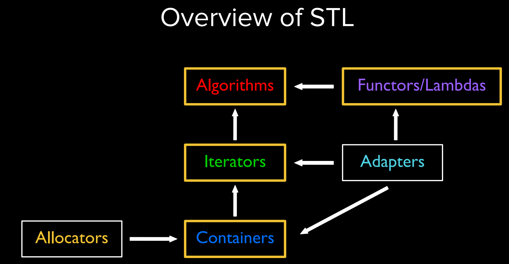
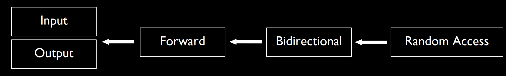
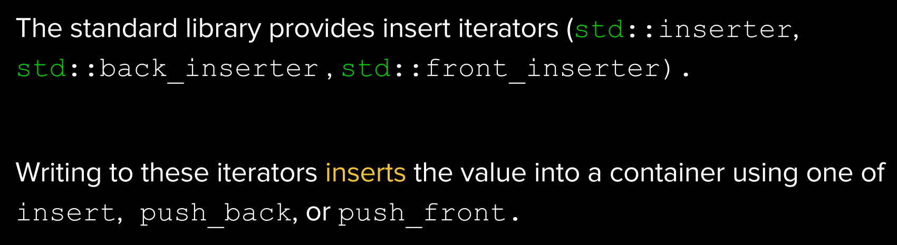
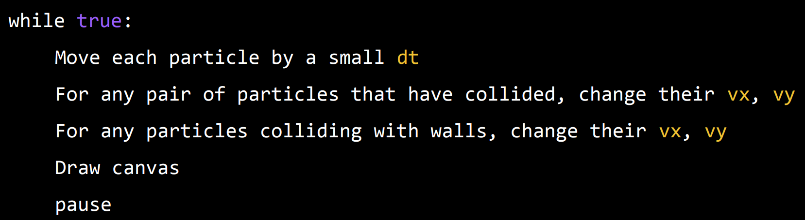
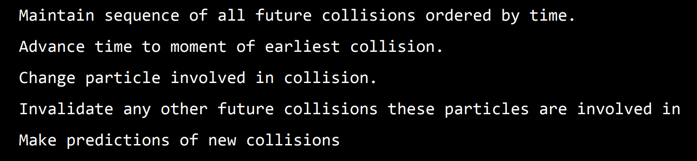

[toc]

## 0 History and Philosophy of C++

**Assembly**

* do simple tasks with lots of code
* unportable


**C++ philosophy**

* only add features if they solve an actual problem
* allow programmer full control
* enforce safety at compile time whenever possible
* don't sacrifice performance except as a last resort


## 1 Streams I

**introduction**

stream:

I/O abstraction, a source/destination of characters of indefinite length


usage:

insert any primitive type into stream, for other types, explicitly tell C++ how to do this


idea:

> stream allows a C++ programmer to convert between the string representation of data, and the data itself.

关于这句话，我的理解是输出的过程是从 data 到 string representation 的转化，而输入就是从 string representation 得到 data 的过程


**output stream(`std::ostream`)**

* insertion `<<` converts data to string, and sends it to stream

* special: `std::ofstream`


**input stream(`std::istream`)**

* `>>` gets data from stream as a string and converts it into the appropriate type
* special: `std::ifstream`


**read data from file**

`>>`会一直读，直到出现空格或者换行符

`getline`会一直读整行，直到出现换行符，最后结果不包括换行符


## 2 Streams II

**buffering**

accumulate characters in temporary buffer, when buffer is full, write out all contents to output device at once

手动 flush buffer:

```c++
stream.flush(ch);	// 一般用这个
stream << std::flush;	// 要打印时用这个
stream << std::endl;	// 要换行用这个
```

有的 stream 是没有 buffer 的，比如`std::cerr`


**stream bits**

* good bit
* eof bit：到末尾了
* fail bit：前面的 stream 操作出错了
* bad bit：前面的操作出现了不可恢复的错误

```c++
while(true) {
    stream >> temp;
    if(temp.fail()) break;	// 读了数据之后，检查数据是否有效
    do_something(temp);
}
```

由于`>>`、`<<`会返回 stream，上面的代码可以简化为：

```c++
while(stream >> temp) {
    do_something(temp);
}
```


**stream manipulator**

* common: `endl`, `ws`(skip whitespaces until it finds another character), `boolalpha`(print true/false for bools)
* numeric: `hex`, `setprecision`
* padding: `setw`, `setfill`


**stringstream**

有时候，我们需要将 string 像 stream 的方式处理，这时就会用到 `stringstream`

使用场景：对 string 分词


## 3 Sequence Containers




sequence containers: vector, list, deque


## 4 Associative Containers and Iterators

map, set, unordered_map, unordered_set


**iterator**

`iterator`的类型形如`set<int>::iterator`

`map<string, int>`的`iterator`指向`std::pair<string, int>`


## 5 Advanced Associative Containers

multimap 可以对同一个 key ，存储多个 value。比如一个人可能有多个地址


## 6 Templates

template function 可以隐式实例化（instantiation），也可以显式实例化

> * 显式实例化能提高编译效率，一是没有隐式实例化中的推断过程，二是把显式实例化放到一个文件中，让其他文件包含，使用时只需要实例化一次，减少实例化的次数。例如标准库中，`std::string`就是从`std::basic_string`显式实例化而来的
>
> * 使用显式实例化，可以把实现放到 cpp 文件中，而不必放在头文件中
>
>   ```cpp
>   // template.cpp
>   template<typename T>
>   T min(T a, T b) {
>       std::cout << "my min func" << std::endl;
>       return (a < b) ? a : b;
>   }
>             
>   template int min<int>(int, int);
>   ```
>
>   ```cpp
>   // template.h
>   template<typename T>
>   T min(T a, T b);
>   ```
>
>   ```cpp
>   // main.cpp
>   int main() {
>       std::cout << min(3, 5) << std::endl;
>       std::cout << min(3.14, 5.35) << std::endl;
>       std::cout << min('d', 'c') << std::endl;
>       return 0;
>   }
>   ```


## 7 Algorithm

**iterator types**



input/output 是 deref 取值、赋值

random access 是可以加减任意的数字


`std::ostream_iterator`

可以像处理 iterator 一样处理 stream

```cpp
std::ostream_iterator<int> iterator(std::cout, ",");
*iterator = 3;
++iterator;
*iterator = 3337;
++iterator;
*iterator = 1251;
++iterator;
// output
// 3,3337,1251,
```

结合 copy 函数：

```cpp
std::vector<int> vec{3, 1, 4, 1, 5};
std::copy(vec.begin(), vec.end(),
          std::ostream_iterator<int>(std::cout, ","));
```


**insert iterators**




**STL algortihm**

STL 里面的算法是建立在 iterator 上的，这让它们能适用于很多的 container

使用方式和 iterator 的类型有关

STL 的算法里面有很多 template


## 8 Stylometry

stylometry 意为文体学，研究文本的规律，可以应用于区分不同的写作风格，比如分辨《联邦党人文集》中不同作者的文章

统计一些 function word，比如：I，the，there 等


## 10 Classes

**运算符重载**

对于二元运算符，接收一个`rhs`参数：

```cpp
Complex operator+(const Complex& rhs) const;
```


## 11 Particle Simulator

假设现在要模拟一个粒子运动模型，这个模型包括`n`个粒子，每个粒子的状态包括位置`(x, y)`和速度`(vx, vy)`，同时碰撞都是弹性的

在实现碰撞的逻辑时，有两种方法：

* 时间驱动：划分时间，在每个离散的时间点计算粒子的状态

  

* 事件驱动：维护一个未来的碰撞事件序列，在发生碰撞时，修改对应粒子的状态，同时更新序列

  


## 12 Templatised Classes

对于模板化的类，每个方法都要是模板函数，比如下面的`pop_back`

```cpp
template <typename T>
class MyVector {
    using iterator = T*;
public:
    iterator push_back(const T& elem);
    void pop_back() const;
private:
    std::vector<T> vector;
};

template <typename T>
void MyVector<T>::pop_back() const {
    std::cout << "my vector pop back" << std::endl;
    vector.pop_back();
}
```

对于嵌套类型（比如上面的`iterator`），要使用`typename`：

```cpp
template <typename T>
typename MyVector<T>::iterator
        MyVector<T>::push_back(const T &elem) {
    vector.push_back(elem);
    return nullptr;
}
```


## 13 Const

`const vector<int>::iterator `和`int* const p`类似

`vector<int>::const_iterator`和`const int* p`类似

```cpp
vector<int>::const_iterator itr = vec.begin();
*itr = 5;	// bad
++itr; // ok
```


## 14 Constructors and Assignment

定义一个使用了模板的类时，只用`.h`文件，不在`.cpp`文件中定义成员函数

```cpp
// template.h
template<typename T>
class MySlice {
private:
    std::vector<T> slice;
public:
    void push_back(const T& elem) const;
};

template<typename T>
void MySlice<T>::push_back(const T &elem) const {
    // ...
}
```

如上面所示，第 10 行要标出来这是一个使用模板的函数，第 11 行要用`MySlice<T>`

对于 nested types，比如`MySlice<T>::iterator`，前面要用`typename`


在一个类中，`const`修饰成员函数和修饰函数传入的形参的区别：

* 调用会出现异常的情况：`const`的实参不能被传到没有`const`修饰的成员函数
* `const`修饰成员函数，其实是修饰`this`指针。

两者都是做出保证：不修改 data member


**复制构造函数**

如果类里面有指针，一定要自定义复制构造函数


## 15 RAII and Smart Pointers

RAII:

constructor acquires, destructor releases

scope based resource management


raw pointer 和 heap allocation 违背了 RAII 原则，因此产生了智能指针


## 16 Final Topics

