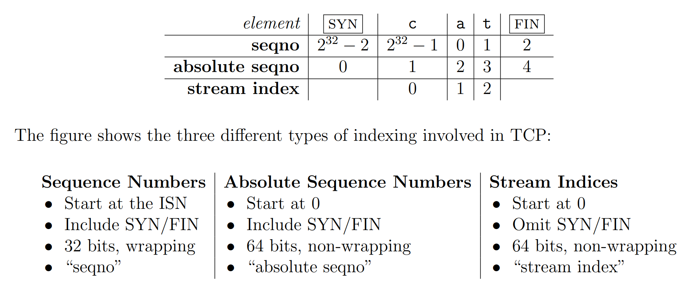

[toc]

* cs144 lab website: https://cs144.github.io/
* my solution is in: https://github.com/Uuq114/sponge


- [x] Lab 0: networking warmup
- [x] Lab 1: stitching substrings into a byte stream
- [x] Lab 2: the TCP receiver
- [ ] Lab 3: the TCP sender
- [ ] Lab 4: the TCP connection
- [ ] Lab 5: the network interface
- [ ] Lab 6: the IP router


## lab0

2.1

X-Your-Code-Is: 677018


2.3

netcat -v -l -p 9090：

```bash
# uuq114 @ LAPTOP-51P4L641 in ~ [14:02:29]
$ netcat -v -l -p 9090
Listening on [0.0.0.0] (family 0, port 9090)
Connection from localhost 4016 received!
123
^C
```


3.4

使用SHUT_WR关闭写，避免服务器等待

```c++
TCPSocket sock;
sock.connect(Address(host, "http"));
const string input(
    "GET " + path + " HTTP/1.1\r\n" +
    "Host: " + host + "\r\n" +
    "Connection: close" + "\r\n\r\n"
);
sock.write(input);
sock.shutdown(SHUT_WR);
while(!sock.eof()) {
    cout << sock.read();
}
sock.close();
```


4

`writer ====> buffer =====> reader`

deque模拟的buffer

第9个test，t_socket_dt没过，测试文件是doctests/socket_example_1、2、3

> 我用的wsl，可能和这个有关系，下次用virtualbox跑一遍


## lab1

https://cs144.github.io/assignments/lab1.pdf

要实现一个TCP recver，可以将输入的重复的、无序的`index,data`整理成有序的`data`


eof:

用户如果在push string的时候指定eof为true，代表该string的最后一个字母是流的结尾。因此使用eof_index存储该位置，当接收到大于eof_index的数据时，将其丢弃。


## lab2

要实现一个TCP recver，接收传入的TCP segment，组装byte stream，并且向发送者返回必要的信息（ack和窗口大小）


需要安装libpcap：

```bash
sudo apt-get install libpcap-dev
```


TCP报文头部中使用32位的数来表示报文的序号，有几个可能的问题：

* 序号一直递增，最后可能会溢出32位能表达的最大值
* 初始序号是随机的，所以最后消息的序号超过2^32时，要用取余的方法
* SYN和FIN也占用序号，它们不属于字节流的一部分




unwrap思路：

开始将checkpoint转化成wrap_int32，通过和isn做差获得offset，在计算n时，让n尽可能从右边接近checkpoint。checkpoint是之前实现过的ByteStream中的第一个未组装的字节索引号（64位，从0开始）。unwrap返回的是最接近checkpoint的值。

当ret小于0时（这里ret声明的类型是有符号的int64），加上1<<32，对应这种情况：
``` 
   ======.==========.======.=========
  0      c         isn     n       1<<32
```

```c++
uint64_t unwrap(WrappingInt32 n, WrappingInt32 isn, uint64_t checkpoint) {
    WrappingInt32 c = wrap(checkpoint, isn);
    int32_t offset = n.raw_value() - c.raw_value();
    int64_t ret = checkpoint + offset;
    return ret >= 0 ? ret : ret + (1ul << 32);
}
```

> string_view:
> 跟std::string相比，在创建std::string_view对象的时候，没有任何动态内存分配，没有对字符串多余的遍历
>
> optional:
>
> 用来实现多个返回值的