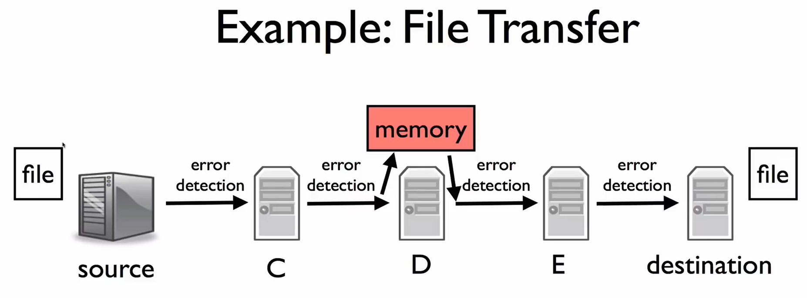

[toc]

## 简介

* 官网，包括lecture和lab：https://cs144.github.io/
* slides: https://github.com/khanhnamle1994/computer-networking

## 1-1 a day in the life of an application

world wide web (http)：

* client-server
* request-response

BitTorrent：

* client从其他的client下载文件
* 每个文件被拆成了多个部分
* tracker是一个节点，它记录了哪些client是群（swarm）的成员
* 使用torrent下载时，client首先从tracker获取其他client的名单，再从这些client下载文件

skype：

 

* 两个用户通信时，相当于在它们之间建立了通信
* 当client B这边存在NAT时，client  A是不能主动连接B的。这时需要一个在外部的集合服务器C，B和A可以主动连接C，C通知B有消息来自A，然后B再主动连接A
* 当两边都有NAT时，需要有一个中继服务器D，A和B都能主动连接D，D再中间起到转发的作用

## 1-2 the four layer internet model

四层网络模型：application、transport、network、link

internet protocol (IP)：

* 尽力交付
* IP datagram可能丢失、乱序送达、损坏

## 1-3 the ip service model

IP service model：

* datagram：每个包是单独路由的，从一个路由器到下一个路由器
* 不可靠的：包可能丢失，但是尽最大努力交付
* 无连接的：

IP对数据链路层的假设很少，这让IP层可以在热呢数据链路层上工作，有线的，无线的，甚至信鸽（IPOAC）！

IP service model的其他特点：

* 避免数据报在路由器环路中无限传输：使用TTL
* 如果数据长度太长，数据报会被拆分
* 使用校验和来验证数据报是否被送到了错误的地方
* ipv4，ipv6
* IP允许将新字段添加到header中

## 1-4 a day in the life of a packet

wireshark

traceroute

## 1-5 packet switching principle

packet：包含了让包能到达目的地的必要信息

packet switching：路由器对每个包，独立地选择这个包的出路

flow：属于同一个端到端的交流的数据报的集合，例如：TCP连接

路由器不需要保存per-flow state

packet switching的优点：

* 简单：每个包是独立处理的，不需要知道flow的状态
* 高效：在共享连接的多个流之间，有效地共享容量（capacity，带宽？）

## 1-6 layering principle

分层的优点：

* 模块化
* 定义明确的服务
* 重用
* 关注点分离：每一层只要关注自己的任务

## 1-7 encapsulation principle

Frame => IP => TCP => HTTP

上图中，headers也可以在左边

在VPN中，网关通过转发IP层的包来实现访问内部网络：

Eth => IP(VPN) => TCP(VPN) => TLS(VPN) => IP => TCP => HTTP

## 1-8 byte order

little endian：低位低字节，高位高字节

big endian：高位低字节

例子：10进制的4116等于16进制的0x1014，这是big endian

网络字节序都是big endian

C语言提供了在网络字节序和主机字节序之间的转换函数：

* 处理short的：htons、ntohs
* 处理long的：htonl、ntohl

## 1-9 ipv4 address

子网掩码：判断两个ip是否在同一个网络

CIDR：管理和分配ipv4地址

## 1-10 longest prefix match

路由器在决定包的转发地址时，匹配原则是目标地址和下一跳地址有最长的前缀

路由器的转发表里面有一系列的CIDR地址

## 1-11 address resolution protocol (ARP)

ARP协议：已经知道了数据包的下一跳的地址，需要知道将其发送到哪个link address

link address：描述了特定的网卡，发送和接收信息的唯一设备

ARP解析过程：

* 每个节点都有一个IP地址到MAC地址的映射的缓存
* 如果目标节点不在缓存中，那么发送一个request到链路层广播地址
* 目标节点收到请求后，reply给发请求的节点；其余节点收到广播request后，会更新自己的缓存

## 1-12 the internet and ip recap

* how an application uses the internet
  * browser
  * bittorrent
  * skype
* the structure of the internet: 4 layer model
* the internet protocol
* basic architectural ideas and principles
  * packet switching
  * layering
  * encapsulation

## 2-1 tcp service model

TCP工作在传输层

TCP提供了端到端的通信，称为连接。

在连接的两端，TCP使用一个状态机来跟踪连接的状态

tcp service model:

| property           | behaviour                                                    |
| ------------------ | ------------------------------------------------------------ |
| stream of bytes    | reliable byte delivery service                               |
| reliable delivery  | ack; checksum; sequence number; flow-control (avoid sender sends too fast) |
| in-sequence        | deliver in sequence                                          |
| congestion control | control network congestion                                   |

ISN: initial sequence number

## 2-2 udp service model

UDP数据报结构：

* 发送端口、接收端口
* length：整个UDP数据报的长度，头部+数据部分
* checksum：使用ipv4时，checksum是可选的。

udp service model properties：

| property                        | behaviour                                                    |
| ------------------------------- | ------------------------------------------------------------ |
| connectionless datagram service | no connection; packets may show up in any order              |
| self contained datagrams        |                                                              |
| unreliable delivery             | no ack; no mechanism to detect missing or mis-sequenced datagrams; no flow control |

使用UDP的：DNS、DHCP

## 2-3 icmp service model

ICMP: internet control message protocol

工作在网络层上

两个属性：type和code

icmp service model:

| property          | behaviour                              |
| ----------------- | -------------------------------------- |
| reporting message | self-contained message reporting error |
| unreliable        | simple datagram service -- no retry    |

用例：ping、traceroute

## 2-4 end to end principle

端到端的文件传输的正确性：

* 网络可以提供帮助，但是不能对正确性负责
* 要保证端到端的正确性，只能让应用本身负责

例如，D在收到文件之后，保存再内存中的文件发生了比特翻转，D将错误的文件往后面传输了，由于网络只能检测传输中的错误，存储中发生的错误不能被发现

## 2-5 error detection

* checksum
  * pro: fast and cheap
  * con: not very robust
* CRC, cyclic redundancy code
  * pro: stronger guarantee than checksum
  * con: more expensive than checksum
* MAC, message authentication code
  * pro: robust to malicious modifications
  * con: not robust to errors（和CRC相比）

MAC：

c=MAC(M, s)，c是生成的code，M是消息，s是secret值

链路层一般使用CRC

## 2-6 finite state machines

FSM of TCP:

左下角的FIN_WAIT1是主动关闭连接的一方在发送了FIN之后进入的状态，它有三种可转移的状态：

* 正常情况，对方还有数据没发完，对方发了ACK，主动关闭方收到ACK之后，变成FIN_WAIT2
* 连接双方同时想主动关闭连接，对方也发了FIN，这时状态变成CLOSING
* 对方没有数据要发送了，对方发了FIN+ACK，这时状态变成TIME_WAIT

## 2-7 stop and wait

flow control:

* send <= recv
* two basic approaches: 
  * stop and wait
  * sliding window

stop and wait：

* one packet in flight at most
* sender sends one packet => recver recvs data and sends ack => sender sends new packet
* sender resends packet on timeout
* use 1-bit counter to detect duplication（让sender知道是重新发，还是发送新的包）

## 2-8 sliding window

sliding window:

* bound on number of un-acked segments, called window

sender maintain 3 variables:

* send window size (SWS)
* last ack recved (LAR)
* last segment sent (LSS)

recver maintain:

* recv window size (RWS)
* last acceptable segment (LAS)
* last segment recved (LSR)

LAS-lSR<=RWS

累计确认：收到1，2，3，5，需要确认3

ack：TCP ack是希望收到的下一个序号，例如要确认3，ack是4

## 2-9 reliable communication: retransmission strategy

* go back N，从丢失的包开始，都需要重传
* selective repeat，只传输丢失的包

## 2-10 reliable communication: tcp header

tcp header:

checksum: 包括pseudo header、TCP header、TCP data

## 2-11 reliable communication: tcp setup and teardown

tcp建立连接支持simultaneous open

tcp断开连接支持simultaneous close

## 2-12 transport recap

使用UDP的应用程序：

* 应用有自己的私有方式处理重传
* 应用不需要可靠的交付

## 3-0 packet switching

packet switching，数据包交换

每个数据包都是一个独立的单元，携带了到达目的地所需的信息

## 3-2 packet switching: principle

* by looking up router's local table, packets are routed individually
* all packets share the full capacity of network
* routers don't matintain per-communication state

## 3-3 packet switching: end-to-end delay, queueing delay

end-to-end delay:端到端延迟

queueing delay:排队延迟

上面的$\frac{p}{r_i}$表示发包的延迟，p是整个包的长度，ri是网络发送速率

每个路由器里面有一个缓冲队列，因此端到端的延迟要加上排队延迟：$t=\sum_{i}(\frac{p}{r_i}+\frac{l_i}{c}+Q_{i}(t))$

排队延迟受当时的网络拥挤程度影响，是一个波动的值

## 3-4 packet switching: playback buffer

playback buffer：播放缓冲区

通过播放缓冲区，可以减少端到端延迟波动的影响

播放缓冲区在时间上的体现：

## 3-5 packet switching: queue models

网络是一组通过链接互连的queue，这些链接承载了来自不同用户的数据包

* 在理解网络传输packet的过程时，可以用简单的deterministic queue model：输入+queue+输出
* packet更小，数据包的传输过程就可以pipeline，从而减少端到端的延迟
* statistical multiplexing可以帮助确定缓冲区的合适大小

## 3-6 packet switching: queue property

 little公式，缓冲队列的平均占用量=接收速率*通过队列的平均延迟

可以用泊松分布来模拟the arrival of new flows

实际的包到达过程是突发的，并不符合泊松过程，并且突发性会增加排队延迟

## 3-7 packet switching: practice switching and forwarding

分组交换的过程：

* 查询转发表
* 改写头部：TTL等
* 放到转发队列

交换机中的查询转发表，用哈希表实现：

路由器中的查询转发表：最长前缀匹配常见的实现方式是：前缀树、van emde boas tree

交换机和路由器的查询地址过程不同：

* 交换机：精确匹配，用哈希表储存
* 路由器：最长前缀匹配，用字典树、van emde boas tree等储存

## 3-8 packet switching: how a packet switch works

 head of line blocking: 队头阻塞

在输出队列只有一个时，前面的包的阻塞会导致后面的包即使可以被转发，也会被阻塞

解决队头阻塞：虚拟的output queue

多个输出队列

output queue switch的特点：

* work conserving：有数据包进入时，输出线不会空闲
* maxmized throughput
* minimized expected delay

虚拟的输出队列在现实中也有应用：
路口前面的车道会按照左转、直行、右转划分

## 3-9 packet switching: guaranteed flow rates

FIFO队列：

* 简单，FIFO
* 不能区分紧急的流量，对发送量较少的包不友好

紧急队列和普通队列分开：

* 紧急队列有消息时，为其服务
* 可能饿死普通队列

多个队列，每个队列有权重：

* 可以优先处理更紧急的数据，而且不会饿死其他数据

## 3-11 packet switching recap

* end-to-end delay, queueing delay
* playback buffer used in streaming applications
* queue model
* rate guarantee
* delay guarantee
* how packets are switched and forwarded

## 4-0 congestion control

流控制：控制发送方的发送速率，避免发送速度大于接收速度的情况

拥塞控制：将流控制的思想扩展到整个网络

## 4-1 congestion control: basics 1

* 拥塞是网络不可避免的属性，拥塞意味着网络链接的利用率很高

* 拥塞发生在不同的事件范围：两个包的冲突、多个流对连接容量的竞争、高峰期用户拥入网络
* 数据包被丢弃时，如果立即传输，会让网络更加拥挤
* 数据包被丢弃时，它们已经浪费了上游的网络资源了
* 要让多个流共享有限的连接容量，需要定义fairness

max-min fairness:

* def: an allocation is max-min fair if you can not increase the rate of one flow without decreasing the rate of another flow with a lower rate

一个例子：

## 4-2 congestion control: basic 2

TCP通过end-host observation来实现拥塞控制

* 对在end host观测到的事件做出反应，比如丢包
* 利用了TCP的滑动窗口
* 尝试计算网络中可以容纳的数据包的数量 

cwnd：拥塞窗口

AIMD: additive increase, multiplicative decrease，加性增长，乘法减少

加性增长：$w \larr w+\frac{1}{w}$，每收到一个ack，增加1/w，当窗口中的包都被确认了，w=w+1

乘法减少：$w \larr \frac{w}{2}$

## 4-3 congestion control: dynamics of a single AIMD flow

线性增长、乘法减少：

窗口大小和RTT是同步变化的

如果网络中的缓冲区足够大（RTT*C），发送速率是恒定的

## 4-4 AIMD with multiple flows

有多个flow时，每个flow的窗口仍然是锯齿状的变化，但是锯齿的间隔是变化的

同时RTT几乎不变，因为router的缓冲区一直都是满的

AIMD控制方法下，rate和RTT、包丢失概率p的关系：

AIMD总结：

* AIMD流的吞吐量对丢包概率敏感，对RTT更敏感
* 多个流的环境下，每个流遵循自己的AIMD规则
* 多个流的环境下，缓冲区一直都是满的，RTT是一个定值

## 4-5 TCP Tahoe

三个问题：

* 发送新数据的时机
* 重传的时机
* 发送ack的时机

slow start

* window starts at maxmimum segment size(MSS)
* for each acked packet, increase window by MSS
* 开始是指数增长的，被称为slow是因为和之前的方法相比，最开始只发了MSS，而不是整个发送窗口

congestion avoidance

* for each ack, increase window by $\frac{MSS^2}{cwnd}$(increase by MSS each RTT)
* 线性增长

signal

* increasing acks: 一切正常
* duplicate acks: 丢包，或者延迟了
* timeout: 情况很糟

## 4-6 TCP RTT estimation

RTT的估计：$r=\alpha r + (1-\alpha)m$，超时时间为$timeout=\beta r$

r是RTT的估计值，m是根据最近几个ack估计的RTT，α是系数

TCP Tahoe的timeout除了考虑了r之外，还考虑了新旧r之间的差

## 4-7 TCP Reno

和Tahoe相比，在收到重复ack时的行为不同：

* 快恢复：threshold变成cwnd的一半
* 快重传：立即重传丢失的包

TCP NewReno

背景：TCP Reno在收到重复ack时会立即重传丢失的包，此时要RTT的时间，丢失的包才能到接收方，带宽是没有被利用的

NewReno做法：在快重传过程中，也发送新的数据包。在收到了丢失的包的ack之后，回到拥塞避免状态，将cwnd设置成合适的值

例子：

发送窗口是16，第一个包丢了，后面的15个包都是重复的ack => 新的窗口大小为：16/2+15=23

保证充分利用pipe，提高吞吐量的trick：

* 快重传：不要等到超时再重传
* 增大cwnd：don't wait an RTT before sending more data，不要等到重传的包返回ack之后再开始发新数据

## 4-9 Reading RFC

## 4-11 congestion control: recap

* TCP Tahoe, Reno, NewReno
* congestion window
* slow start, congestion avoidance
* RTT estimation
* self-clocking
* fast retransmit, fast recovery, CWND inflation

## 5-1 network address translation(NAT)

在端到端的设计中，网络只负责简单的传输功能，其他复杂的功能都在两边的端点实现

例子：

A、B的地址是private & local address

NAT管理了多个`internal ip:port`到`external ip:port`的映射，对应的数据包的地址会被改写

## 5-2 NAT types

* full cone NAT
  * 私网的`ip:port`被映射成公网的`ip:port`，只要建立了映射关系，所有internet上的主机都可以访问NAT后面的主机
* restricted cone NAT
  * 在内部主机向公网主机发送过报文之后，公网主机才能向私网主机发送报文
* port restricted cone NAT
  * 在restricted cone NAT进一步限制了port
  * 在内部主机向公网主机发送过报文之后，公网主机（ip+port）才能向私网主机发送报文
* symmetric NAT
  * 如果同一台主机使用相同的`ip:port`发送报文，但是发送到不同目的地，那么NAT会使用不同的映射
  * 此外，只有收到数据的公网主机才能向私网主机发送报文

