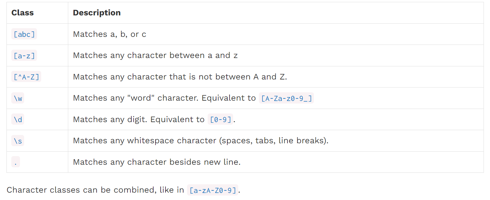

[toc]

## hw2

丘奇数（church numeral）：一种只使用函数来表示自然数的方法

https://zhuanlan.zhihu.com/p/267917164


## hw3

硬币兑换问题，要求使用递归的方法

```python
# ways of dividing n into several parts, the greatest part is m
def count_partition(n, m):
    ...
    return count_partition(n - m, m) + count_partition(n, m - 1)
```

两个例子：`cp(4,2)`和`cp(6,3)`

https://juejin.cn/post/7205161917420929061


匿名递归阶乘：

https://blog.csdn.net/qq_42103298/article/details/123773235

https://zhuanlan.zhihu.com/p/506640384


## proj cat

创建嵌套列表：

```python
a = [[]] * 3
a[0].append(1)	# [[1], [1], [1]]
```

上面这种情况是因为`a[0]`、`a[1]`、`a[2]`的地址是一样的，修改一个子元素会导致其他的也会被修改

这总情况可以用列表推导解决：

```python
a = [[] for _ in range(3)]
a[0].append(1)	# [[0], [1], [1]]
```


## lab5

输入一棵树`t`以及一个列表`leaves`，要求对每个叶子节点添加一个branch，其值为`leaves`中的元素

sprout_leaves

```python
def sprout_leaves(t, leaves):
    """Sprout new leaves containing the data in leaves at each leaf in
    the original tree t and return the resulting tree.

    >>> t1 = tree(1, [tree(2), tree(3)])
    >>> print_tree(t1)
    1
      2
      3
    >>> new1 = sprout_leaves(t1, [4, 5])
    >>> print_tree(new1)
    1
      2
        4
        5
      3
        4
        5

    >>> t2 = tree(1, [tree(2, [tree(3)])])
    >>> print_tree(t2)
    1
      2
        3
    >>> new2 = sprout_leaves(t2, [6, 1, 2])
    >>> print_tree(new2)
    1
      2
        3
          6
          1
          2
    """
    "*** YOUR CODE HERE ***"
	    if is_leaf(t):
        return tree(label(t), [tree(i) for i in leaves])
    else:
        return tree(label(t), [sprout_leaves(branch, leaves) for branch in branches(t)])

```


字符串的拼接之join：


## lab6

yield

```python
def scale(it, multiplier):
    """Yield elements of the iterable it multiplied by a number multiplier.

    >>> m = scale([1, 5, 2], 5)
    >>> type(m)
    <class 'generator'>
    >>> list(m)
    [5, 25, 10]

    >>> m = scale(naturals(), 2)
    >>> [next(m) for _ in range(5)]
    [2, 4, 6, 8, 10]
    """
    "*** YOUR CODE HERE ***"
    for i in it:
        yield i * multiplier
```


## lab10

`scheme`中声明`lambda`匿名函数的时候`x`也要括号括起来：

```scheme
(define (make-adder num) (lambda (x) (+ num x)))
```

将`list`中等于`item`的元素去掉，返回新的`list`：

```scheme
(define (remove item lst)
    (cond ( (null? lst) '() )
          ( (= (car lst) item) (remove item (cdr lst)) )
          ( else (cons (car lst) (remove item (cdr lst))) )
    )
)
```

这里注意`cons`和`list`的区别：

```scheme
(define a (list 2 3))
(cons 1 a)	; (1 2 3)
(list 1 a)	; (1 (2 3))
```


## hw8

尾递归：在递归调用时，调用的结果直接返回给函数的调用者，而不需要进行额外的操作。

```python
# 不是尾递归
def factorial(base, n):
    if n == 1:
        return base * n
    else:
        return factorial(base, n - 1) * n
```

上面的优化成尾递归：

```python
def factorial(base, n, res=1):
    if n == 1:
        return res * base
    else:
        return factorial(base, n - 1, n * res)
```

类似地，hw7的`accumulate`的尾递归版本为：

```scheme
(define (accumulate-tail-helper combiner start n term result)
  (cond ( (= n 0) result )
        ( else (accumulate-tail-helper combiner start (- n 1) term (combiner result (term n))) )
  )
)

(define (accumulate-tail combiner start n term)
  (accumulate-tail-helper combiner start n term start)
)
```


判断`exp`是不是自定义的`(list '^ base exponent)`乘幂操作：

```scheme
(define (exp? exp) (and (list? exp) (eq? (car exp) '^)))
```


## lab11

合并两个dict，如果有重复的就覆盖

```python
dict1 = {'a': 1, 'b': 2}
dict2 = {'b': 3, 'c': 4}
res = dict1.copy()
res.update(dict2)
print(res)	# {'a': 1, 'b': 3, 'c': 4}
```


Q3 Evaluating Call Expressions中，`CallExpr`类的`eval`成员函数负责对表达式求值

`CallExpr`自身的成员变量为`operator`、`operands`。`eval`传进来一个环境变量dict：`env`，对`operands`赋值。

```python
class CallExpr(Expr):
    def eval(self, env):
        args = [arg.eval(env) for arg in self.operands]
        return self.operator.eval(env).apply(args)
        # return global_env.get(self.operator.var_name).apply(args)
```

这里不能直接从`env`获取`operator`，因为`operator`可能是一个`lambda`函数，没有`var_name`，后面Q4对`lambda`函数求值时这里会出错

附Q4的代码：

```python
class LambdaFunction(Value):
    def apply(self, arguments):
        if len(self.parameters) != len(arguments):
            raise TypeError("Oof! Cannot apply number {} to arguments {}".format(
                comma_separated(self.parameters), comma_separated(arguments)))
        "*** YOUR CODE HERE ***"
        # make a copy of parent env
        parent_env_copy = self.parent.copy()
        # update copy, use params and args
        param_arg_pairs = dict(zip(self.parameters, arguments))
        parent_env_copy.update(param_arg_pairs)
        # evaluate body
        return self.body.eval(parent_env_copy)
```


## lab13

常用的正则表达式：

**字符**



**组合**

`|`

`*`、`+`、`?`

`{1,3}`、`{3,}`：匹配个数

**位置**

`^`、`$`

`\b`：单词的末尾，比如`s\b`表示以`s`结尾的词


## lab14

获得`float`的最大值和最小值

```python
a = float('-inf')
b = float('inf')
```


problem2

问题：`split-at`接收一个列表`lst`和数字`n`，返回一个新的列表，第一部分是列表的前`n`个值，第二部分是列表的其余值。如果`n`大于列表长度，第二部分为`nil`

这里用了`let`，先把子问题的结果算出来

```scheme
(define (split-at lst n)
    (cond ( (= n 0) (cons nil lst) )
          ( (null? lst) (cons nil nil) )
          ( else (let (
              (res (split-at (cdr lst) (- n 1)) ))
              (cons (cons (car lst) (car res)) (cdr res)))
          )
    )
)
```


