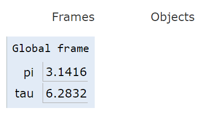
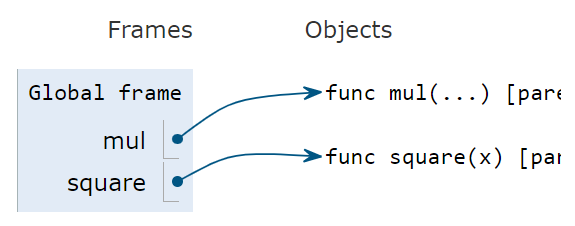
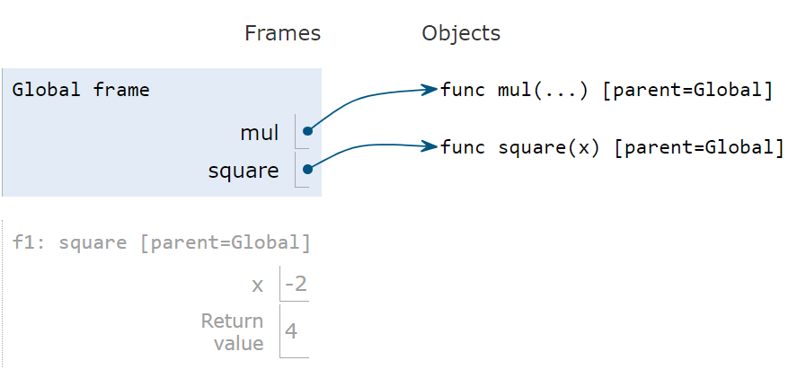
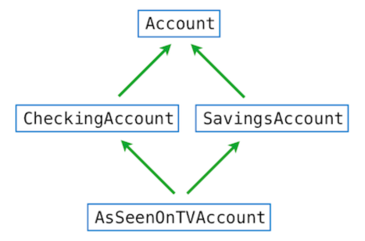

[toc]

* UCB CS61A: Structure and Interpretation of Computer Programs
* 课程网站：https://inst.eecs.berkeley.edu/~cs61a/sp21/
* 中文翻译：https://composingprograms.netlify.app/


## 1 使用函数构建抽象

**帧**

求解表达式的环境由帧（frame）的序列组成，每个帧包含一些绑定，将名称与对应的值（字面量或者指向对象）关联。






全局帧（global frame）只有一个。赋值和导入语句会将条目添加到当前环境的第一帧。


函数有两个名称：

* 内在名称：作为函数定义的一部分
* 绑定名称：在帧中出现的名称

不同的名称可能指同一个函数，但是一个函数只有一个内在名称

在求值过程中起作用的是绑定名称

```python
f = max
max = 3
res = f(2,3,4)
max(1,2)	# TypeError: 'int' object is not callable
```


调用用户定义的函数会引入局部帧（local frame），它只能访问该函数

在局部帧中，形参和值绑定

```python
from operator import mul
def square(x):
    return mul(x, x)
square(-2)
```




**lambda表达式**

一个lambda表达式的计算结果是一个函数，它仅有一个返回表达式作为主体，不允许使用赋值和控制语句

```python
def compose1(f, g):
    return lambda x: f(g(x))
```

lambda 表达式的结果称为 lambda 函数（匿名函数）。


**函数装饰器**

使用高阶函数作为执行`def`函数的一部分，称为装饰器

```python
>>> def trace(fn):
        def wrapped(x):
            print('-> ', fn, '(', x, ')')
            return fn(x)
        return wrapped
>>> @trace
    def triple(x):
        return 3 * x
>>> triple(12)
->  <function triple at 0x102a39848> ( 12 )
36
```

`trace`就是一个高阶函数

通过注解`@trace`，`triple`这个名字绑定到了`trace(triple)`这个函数上面

```python
>>> def triple(x):
        return 3 * x
>>> triple = trace(triple)
```


## 2 使用数据构建抽象

**原生数据类型**

原生数字类型：int、float、complex

python中的int是无界的，可以存储任意大小的数

int除以int，可以得到一个float值，一个截断的有限近似值


**for顺序解包**

x、y分别绑定到每对的第一个和第二个元素

```python
pairs = [[1, 2], [2, 2], [2, 3], [4, 4]]
same_count = 0
for x, y in pairs:
    if x == y:
        same_count = same_count + 1
print(same_count) # 2
```


**list数据处理**

for除了循环，还可以用于list comprehension

```python
>>> odds = [1, 3, 5, 7, 9]
>>> [x+1 for x in odds]
[2, 4, 6, 8, 10]
```


**高阶函数**

reduce：将函数参数作用于一个数据集合，最后得到一个结果

```python
>>> def reduce(reduce_fn, s, initial):
        reduced = initial
        for x in s:
            reduced = reduce_fn(reduced, x)
        return reduced

```

例子：

```python
>>> reduce(mul, [2, 4, 8], 1)
64
```

python中类似的函数有map、reduce、filter

map：将函数作用于一个序列，对每个元素做一次运算，返回一个list

filter：将函数作用于一个序列，对满足条件的元素做一次运算，返回一个list

> python3的filter返回的是filter对象，要转化成list再使用


**Propagating Constraints**

假设有一个公式，里面有5个变量

如果知道了4个变量的值，那么就可以算出来剩下的一个变量值，这种方式可以用一个赋值操作表示

但是这个赋值使用的公式并不能用来计算其他的变量值，即使它们可以从同一个公式推导出来

<u>约束</u>，就是用来体现最原始的公式的


**面向对象**

```python
class Account:
    def __init__(self, account_holder):
        self.balance = 0
        self.holder = account_holder

    def deposit(self, amount):
        self.balance += amount
        return self.balance
    
if __name__ == '__main__':
    a = Account('james')
```

`getattr`可以按名称返回对象的属性，例如`getattr(a, 'deposit')`、`getattr(a, 'balance')`

`hasattr`可以测试对象是否有对应的属性

```python
print(type(Account.deposit)) # <class 'function'>
print(type(a.deposit)) # <class 'method'>
```

作为类的属性，方法是一个函数

作为实例的属性，它是一个绑定方法


**多继承**



在多重继承中，会有菱形的继承图，在解析一个实例的对象时，python按顺序检查：从左到右，从下到上

```
AsSeenOnTVAccount, CheckingAccount, SavingsAccount, Account, object
```


2.7


## 3 解释计算机程序

`scheme`语言是一种特性不多但是很强大的语言

许多解释器的结构包括两个 mutually recursion function。第一个求解环境中的表达式，第二个将函数作用于参数。它们的递归关系是这样的：使用一个函数时，需要在函数内部求表达式的值；求表达式的值又需要将函数作用于参数

> `scheme`是`lisp`的一个方言，`lisp`的新的方言有`clojure`


**scheme**

基本形式是：`(<operator> [arg...])`

`if`语法是：`(if <predicate> <consequent> <alternative>)`

```scheme
(display (/ 10 2))
(newline)
(display (if (>= 2 1) (* 2 3) (/ 10 2)))
```

定义函数：`(define (<name> <formal parameters>) <body>)`

```scheme
(define (square x) (* x x))
```

匿名函数：`(lambda (<formal-parameters>) <body>)`

```scheme
((lambda (x y z) (+ x y (square z))) 1 2 3)		; 12
```

`pair`：使用`cons`创建，使用`car`、`cdr`获取`pair`的前后元素的值

```scheme
(define x (cons 1 2))
(car x)	 	; 1
(cdr x)	 	; 2
```

`list`：使用递归的`pair`实现

```scheme
(cons 1
      (cons 2
            (cons 3
                  (cons 4 nil))))
```

```scheme
(list 1 2 3 4)
```


3.2.4 symbolic

