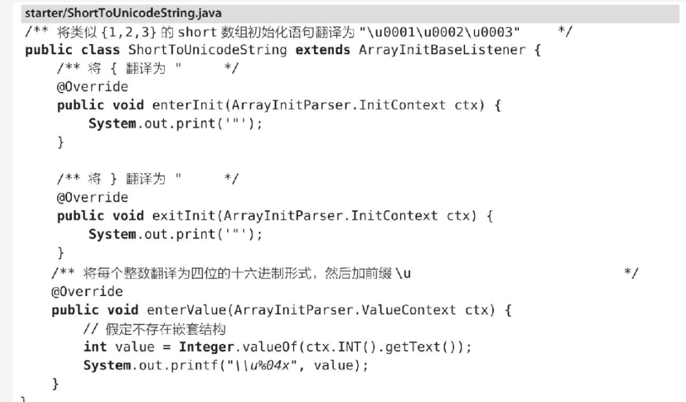

# ANTLR4

## 背景

最近需要解析 Lustre 的 jobstats log，做了一些实验和调研，发现 jobstats 的格式是魔改的 yaml，直接用 yaml 库解析可能会报错，因此需要找其他方法解析该日志。

调研了一圈下来，发现 ANTLR 可以支持这样的需求，甚至可以说这是大材小用了，毕竟 Golang 以前的 parser 就是用 ANTLR 生成的。网上搜到的大部分 ANTLR 教程基本都来自于《ANTLR4 权威指南》这本书，因此找来了这本书拜读，本篇 md 是阅读笔记。

## 一些基本概念

语法分析过程，可分为：1）将字符聚集为 token。2）实际的语法分析过程，建立 syntax tree

- 识别语言的程序：parser 或者 syntax analyzer
- 将字符聚集为 token 的过程：tokenizing 或者 lexical analysis。词法分析
- 将输入文本转换成 token 的程序：lexer，词法分析器

token 包含两个信息：类型（整数、标识符、浮点数等），以及对应的文本

## 一个例子

### 使用 ANTLR 分析语法、生成代码

3.1 节列了一个解析类似 “java 中声明 `short` 数组” 文本的例子。

使用 `antlr4 ArrayInit.g4` 会生成以下的文件：

- `ArrayInitParser`。语法分析器 parser 的定义，我感觉起一个主入口的作用。
- `ArrayInitLexer`。包含词法分析器 lexer 的类的定义。lexer 的主要作用是将字符序列分解成 token
- `ArrayInit.tokens`。我们定义的 token 会被指定一个数字形式的类型，它们的对应关系会存储在这个文件
- `ArrayInitListener`、`ArrayInitBaseListener`。

测试过程：

token

tree

gui

### 将生成的 parser 和 java 程序集成

上面的程序成功集成了生成的 parser，但是只有识别，并不能翻译成 java 中的初始化语句。后面将修改 `ArrayInitBaseListener` 中的方法来达到这一目的。基本思想是，在遍历器进行语法分析树的遍历时，令每个监听器方法翻译输入数据的一部分，并将结果打印出来。

替换过程：

扩展前面的`Test`成一个翻译程序：

新建一个语法分析树的遍历器，让它进行遍历。在遍历过程中，触发`ShortToUnicodeString`监听器的回调函数

