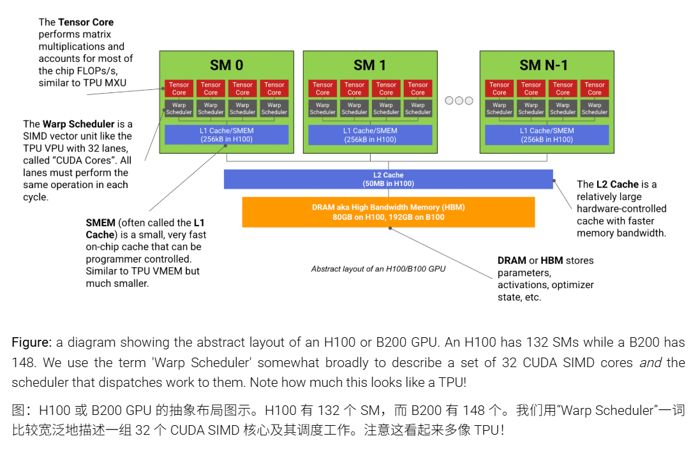
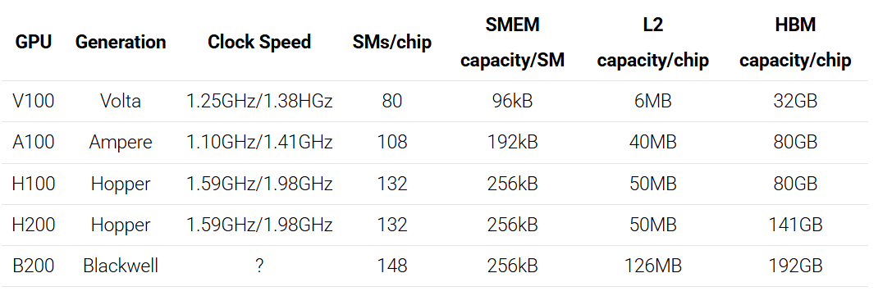
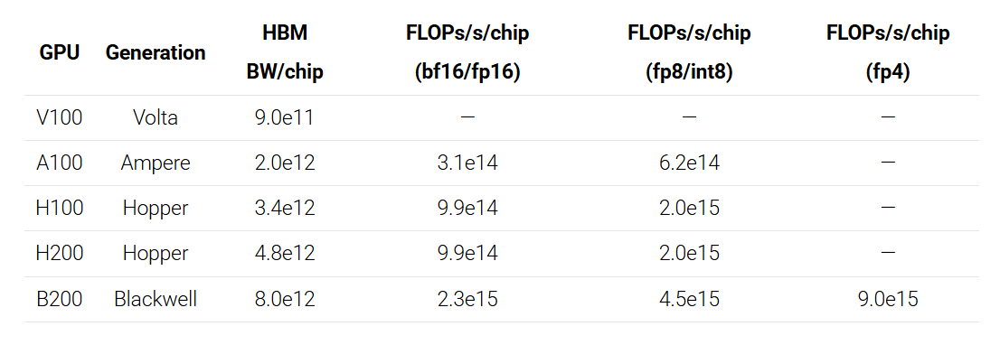
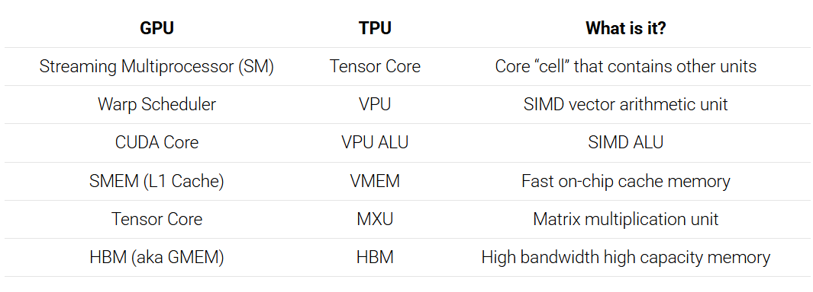
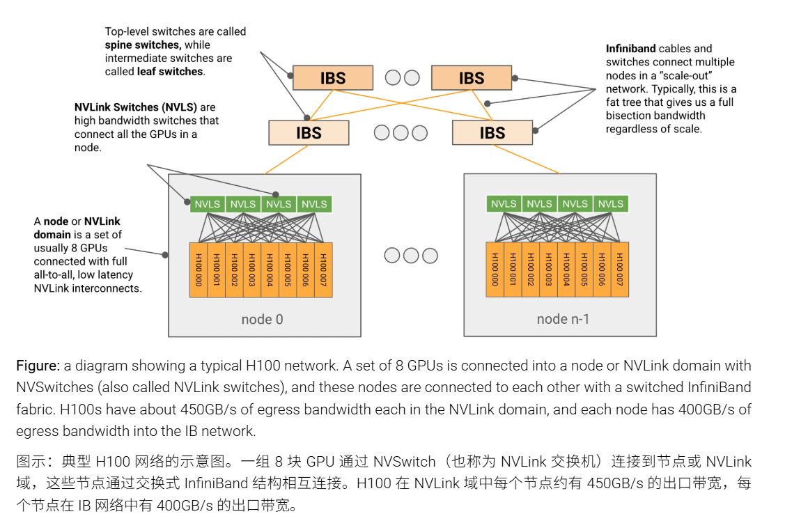
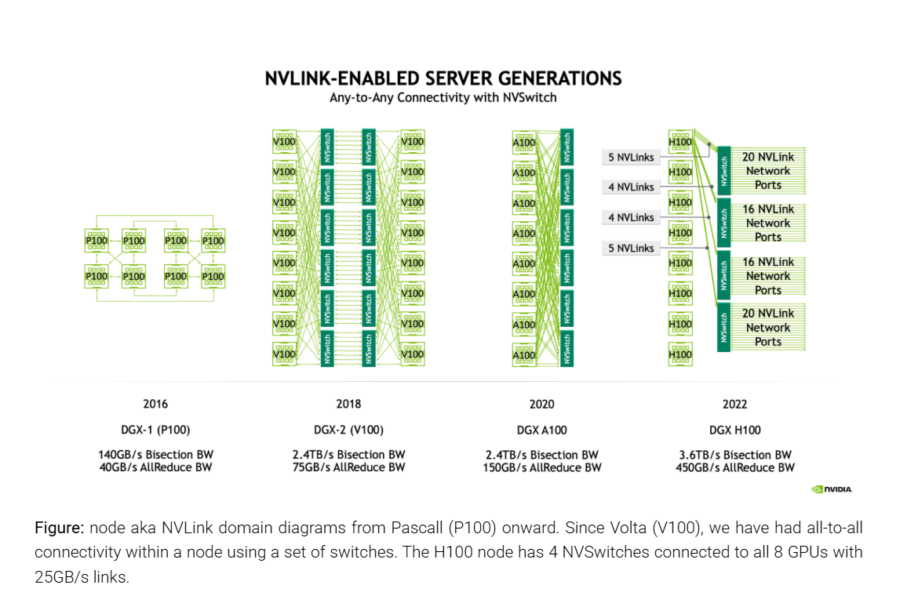
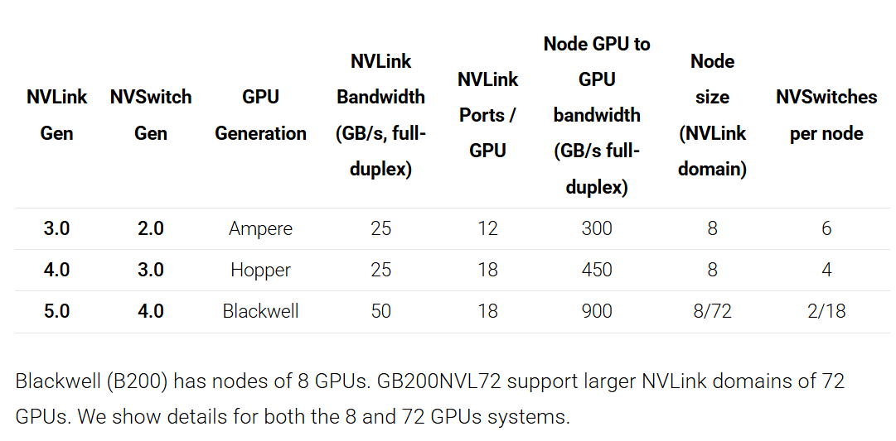
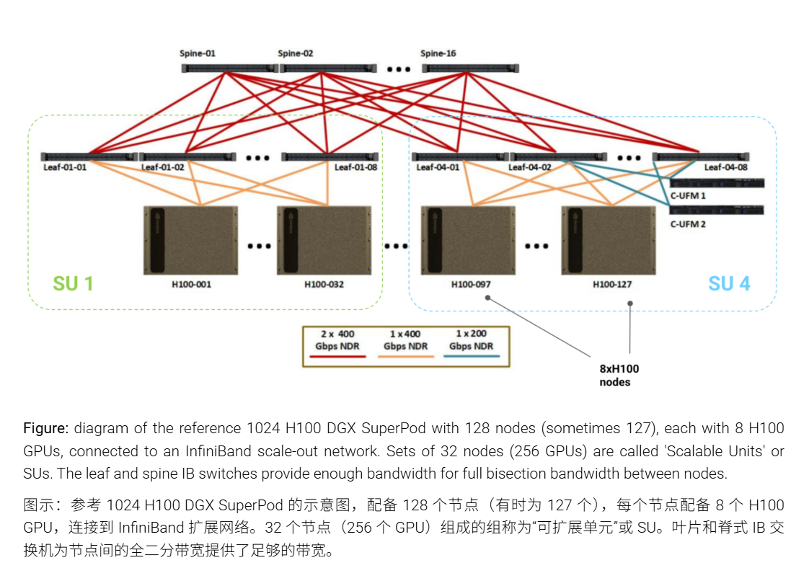

# How to Think About GPUs

https://jax-ml.github.io/scaling-book/gpus/

## What is a GPU?

一组专门进行矩阵乘法的计算核心（SMs）连接到告诉内存 HBM

- Streaming Multiprocessors, SMs
- fast memory called HBM

每个 SM 几乎完全独立，但是因为共享的 L2 缓存有限，因此需要协调 SM 才能达到峰值性能。每个 SM 包括：

- Tensor Core，处理矩阵乘
- Warp Scheduler，处理 vector arithmetic
- SMEM，快速片上缓存

每个 SM 被分成 4 个象限，称为 SM subpartition。SM partition 包括：

- Tensor Core
- 16k 32-bit register
- Warp Scheduler，其中的 ALU 称为 CUDA Cores

**CUDA Cores**

每个 SM partition 都有 CUDA Cores，可执行 SIMD/SIMT 向量运算，每个 ALU 在一个周期能执行一次算术操作如 f32.add。每个 SM partition 有 32 个 fp32 core、较少的 int32/fp64 core。

CUDA Core 负责 ReLU、Pointwise vector operations（逐元素向量计算）、Reduction（sum），即比较 + 条件选择、算术操作（加 / 乘 / 乘加 / 超越函数 sin exp log）、规约（求和）

**CUDA Core SIMT**

从 V100 起，CUDA Core 支持 SMIT 编程模型（单指令多线程）

GPU 硬件层面：同一 WARP（32 线程）必须同时执行相同操作，分支发散只在 WARP 内造成性能损失

编程模型层面：

- 为避免损失性能，按 WARP 对齐，将同性质的任务分配给连续的 32 线程
- WARP 中的线程 = 编程中的 CUDA 线程 `threadIdx.x`

**CUDA Core Scheduling**

和多线程 CPU 类似，每个 SM 最多处理 64 个 WARP 并发。Warp Scheduler 在一个 cycle 执行一个程序，以及在多个 active Warp 切换。

**Memory**

- register, SM subpartition level
- SMEM (L1 Cache), SM level
- L2 Cache, all SM share
- HBM, main GPU memory, used for storing model weights, gradients, activations

**GPU Spec Summary**

GPU-TPU 比较 cheatsheet：

matmul intensity：matmul FLOPs/s 除以内存带宽 bytes/s，可以区分是计算限制还是内存限制

如 H100 intensity 是 990e12 / 3.35e12 = 295，说明对于 matmul，batch size 需要在 290 左右才能到 compute-bound。如果要估算一个矩阵乘的时间，需要先算 intensity 看是 compute/bandwidth bound，然后再根据 TFLOPs / 带宽数据算时间

## Networking

**node level**

TPU 使用二维或三维环状连接，每个 TPU 只连接到其邻居。优点是，每个 TPU 的连接数是固定的，可以扩展到任意大的 TPU pod 而不损失带宽

GPU 使用传统的层级树状交换网络，node 内是 nvlink，node 之间是 IB

计算 GPU 节点带宽时，是分别计算 NVSwitch 和 NVLink 带宽，然后看哪个大

**beyond node level**

节点以上的网络拓扑有多种，下面是 NV 提供的 1024 H100 系统的参考

- Scalable Unit。每组 32 节点称为一个 SU，在一组 8 个 leaf IB 交换机下。128 节点连到 32 个 leaf 交换机
- SuperPod。4 个 SU 通过 16 个 spine 交换机连接。所有 leaf 交换机都连接到 spine 交换机

总结：在 H100 节点内，每个 GPU 的全树带宽为 450GB/s，而节点外，节点间带宽降至 400GB/s。这对通信原语至关重要。

## How Do Collectives Work on GPUs?

集体通信原语： ReduceScatters, AllGathers, AllReduces, AllToAlls

具体工作方式根据是在 NVlink、IB 执行发生变化，在 NVSHMEM 和 NCCL 中实现。

**Intra-node collectives**

