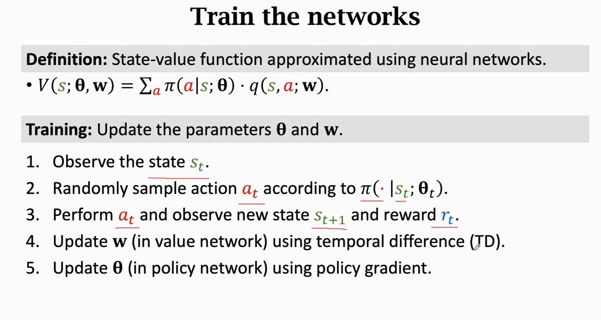

# Deep Reinforcement Learning Note

王树森 Youtube 的《深度强化学习》视频笔记

## 基本概念

- 随机变量（random variable）。一般用大写字母 $X$ 表示随机变量，用小写字母 $x$ 表示观测值
- 概率密度函数（probability density function，PDF）。$p(x)$ 表示观测值为 $x$ 的概率。类型有连续概率分布、离散概率分布
- 期望（expectation）。对于连续概率分布，$E(f(X))=\int_x{p(x)f(x)}dx$。对于离散概率分布，$E(f(X))=\sum_{x \in X}{p(x)f(x)}$
- 随机抽样（random sampling）

RL 术语：

- state
- action，agent 的动作
- policy，策略，记为 $\pi$ 函数。$\pi$ 是个概率密度函数，$\pi(a|s)=P(A=a|S=s)$，表示给定状态 s 下执行动作 a 的概率
- reward，奖励，一般需要自己定义。
- state transitition。执行 action 之后，old state 变成 new state。状态转移可以是随机的（受环境随机因素影响）。
- return，回报、未来累计奖励。$U_t=R_t+R_{t+1}+...$。未来的奖励有不确定性
- disconted return，未来累计折扣奖励。$U_t=R_t+\gamma R_{t+1}+\gamma^2 R_{t+2}+...$。$\gamma$ 是折扣率，是超参数需要自己调

RL 中的随机性来源：

- action 的随机性，action 从 policy $\pi$ 函数抽样得到
- 状态转移的随机性，新状态从状态转移函数 $p(s'|s,a)$ 抽样得到

Return & Value 术语：

- action-value function，动作价值函数。$Q_{\pi}(s_t,a_t)=E[U_t|S_t=s_t,A_t=a_t]$。discounted return $U_t$ 依赖当前和后续的 action/state，没法求具体值，只能求期望。这里求期望消掉了后续状态 $s_{t+1}...$ 和动作 $a_{t+1}...$，另外，动作价值函数 $Q_{\pi}$ 和 $\pi$ 函数也有关
- optimal action-value function，最优动作价值函数。所有 $Q_{\pi}$ 中最大的，$Q^\star(s_t,a_t)=\max_{\pi}Q_{\pi}(s_t,a_t)$。这个函数可以判断哪个动作价值最高
- state-value function，状态价值函数。$V_{\pi}$ 是 $Q_{\pi}$ 的期望，$V_{\pi}(s_t)=E_A[Q_{\pi}(s_t,A)]$。这里关于随机变量 A 求期望。$V_{\pi}$ 可以用来判断局势

总结：
- action-value function $Q_\pi(s,a)$。如果使用 policy $\pi$，$Q_\pi$ 可以判断状态 s 下执行动作 a 是否明智
- state-value function $V_\pi(s)$。可以评价状态 s 下情况的好坏，快赢了还是快输了

让 AI 控制 agent 的两种方法：
- 已知一个足够好的 policy $\pi(a|s)$。那么，可以根据 $s_t$，从 $\pi(s)$ 中随机抽样 $a_t$
- 已知最佳动作价值函数 $Q^\star(s,a)$。那么，可以根据 $s_t$，直接选能让 $Q^\star$ 最大的 action

** 因此，强化学习的目标就是学到 policy 函数 $\pi(a|s)$ 或者 $Q^\star$ 函数 $Q^\star(s,a)$**。

## Value-Based Reinforcement Learning

### Deep Q-Network (DQN)

价值学习方法，用神经网络 $Q(s,a;\vec{w})$ 来近似价值函数 $Q^\star(s,a)$

以马里奥游戏为例，DQN 的输入是屏幕截图的 size，输出是 action space dimension

Temporal Difference (TD) Learning，以预测行驶时间为例

- 之前的学习算法中，需要完成一次完整的驾驶才能更新参数
- TD 算法中，只完成部分旅程也能更新参数

TD Learning for DQN

discounted return $U_t$ 有这样的关系：$U_t=R_t+\gamma \cdot U_{t+1}$

DQN 的输出，$Q(s_t,a_t;\mathbf{w})$ 是对 $E[U_t]$ 的估计；DQN 的输出，$Q(s_{t+1},a_{t+1};\mathbf{w})$ 是对 $E[U_{t+1}]$ 的估计

因此，类比上面的预测行驶时间：model estimate <- actual time + model estimate，有这样的关系 $prediction \approx TD \ target$

$$
Q(s_t,a_t;\mathbf{w}) \approx r_t + \gamma \cdot Q(s_{t+1},a_{t+1};\mathbf{w})
$$

在训练过程中，有这样的流程：

t 时间做出预测 -> t+1 时间拿到真实值 $r_t$ 和新状态 $s_{t+1}$ -> 找到能让 Q 函数最大的 action -> 更新参数 $\mathbf{w}$，让 prediction 接近 TD target

TD 算法中每步的迭代过程

## Policy-Based Reinforcemnet Learning

policy 函数 $\pi(a|s)$ 是一个概率密度函数，表示状态 s 下执行动作 a 的概率

使用 policy network（策略网络）$\pi(a|s;\bm{\theta})$ 来近似 $\pi(a|s)$，通过学习改进 $\bm{\theta}$

softmax 可以让输出变成正数，并且总和为 1

策略学习的目标

- 给定状态 s，策略网络越好，那么 V 值越大。
- 学习到能让 $J(\bm{\theta})=E_S[V(S;\bm{\theta})]$ 最大的 $\bm{\theta}$。（这里对 S 求期望，消除了 S，代表策略的全局性能）
- 优化目标是，找到使 $J(\bm{\theta})$ 最大的 $\bm{\theta}$

使用策略梯度上升更新 $\bm{\theta}$，这里使用 policy gradient 更新 $\bm{\theta}$，是使用使用 $\nabla_{\bm{\theta}} V(s;\bm{\theta})$ 作为 $\nabla_{\bm{\theta}} J(\bm{\theta})$ 的无偏估计

算法的每步迭代中，可以用蒙特卡洛算法近似策略梯度。

先用 $\pi$ 函数抽样一个 action，再算价值函数 $Q_\pi$ 的值 $q_t$。因为 $a_t$ 是根据 $\pi$ 函数抽样得到的，$\bm{g}(a_t,\bm{\theta}_t)$ 是策略梯度的蒙特卡洛近似

上面的第三步中 $Q_{\pi}$ 是未知的，没法直接算 $q_t$。有两种近似算法：

- Reinforce。因为 $Q_{\pi}$ 是 $U_t$ 的期望，所以可以用观测到的 $u_t$ 来近似 $Q_{\pi}$。需要玩完一整局游戏，才能更新网络

- 用另一个神经网络来近似 $Q_{\pi}$，也就是 actor-critic 方法

## Actor-Critic Method

actor-critic 方法结合了前面的价值学习方法和策略学习方法

因为 $\pi(a|s)$、$Q_{\pi}(s,a)$ 都是未知的函数，所以这里用两个神经网络去近似它们，用 actor-critic 同时学习两个网络

- 策略网络，actor，运动员
- 价值网络，critic，裁判。让运动员知道怎么改进动作

actor 网络：卷积层把画面变成特征向量。全连接层映射特征向量。softmax 生成概率分布

critic 网络：两个输入 state、action，输出动作价值。

对 state 用卷积层、对 action 用全连接层提取特征向量。拼接特征向量。用全连接层输出分数

训练两个网络过程中：

- 更新策略网络参数 $\pi(a|s;\bm{\theta})$，目标是提高状态价值 $V(s;\bm{\theta},\bm{w})$。监督来自于 critic 网络
- 更新价值网络参数 $q(s,a;\bm{w})$，目标是更好地估计回报（裁判打分更接近环境上帝打分）。监督来自于环境给的奖励

总结

第 9 步中，也可以用 $\delta_t$（第 5 步中的）代替 $q_t$，称为 policy gradient with baseline，这样收敛更快

actor-critic 方法比前面的 reinforce 蒙特卡洛策略梯度方法多了一个 critic，解决了让 actor 直接接收环境真实反馈的几个问题：

- 高方差：一场比赛的胜负受很多因素影响，这种信号噪音太大，导致训练不稳定
- 延迟反馈：需要等到一个 episode 结束才能知道结果，无法知道具体动作的影响
- 缺乏基准：无法让 actor 知道自己表现是” 高于自身平均水平 “还是” 低于平均水平 “

## AlphaGo

AlphaGo 训练过程：

- 使用真实对弈数据，做 behaviour cloning。behaviour cloning 不是 RL，和多分类问题类似，是学习给定状态下人类高手的行为（将棋子分类到位置）。behaviour cloning 的问题是如果没见过某个状态，可能会做出错误行为，并且错误会逐步扩大。
- 用RL学习策略网络。用奖励来更新模型参数