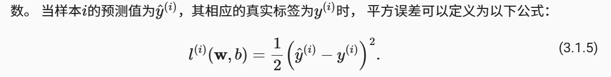
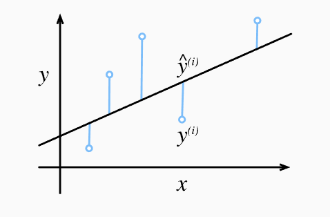
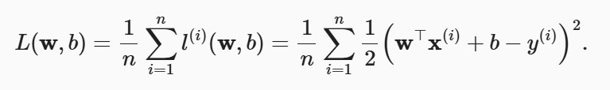
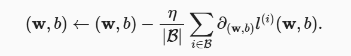
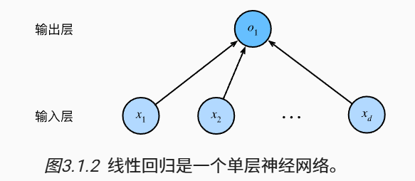
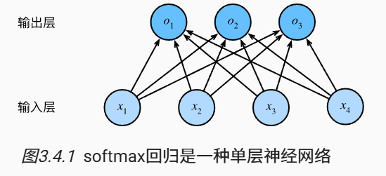
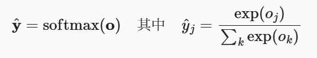
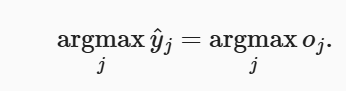
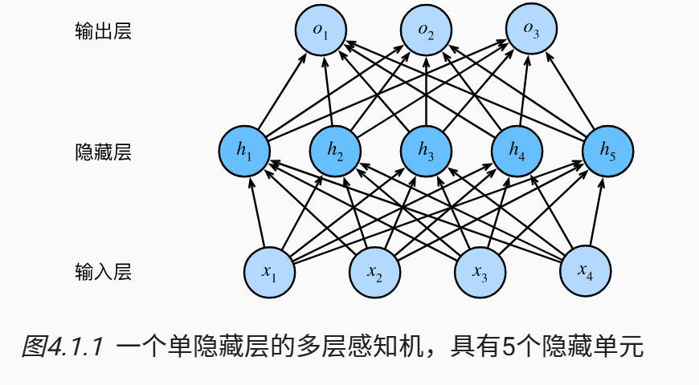
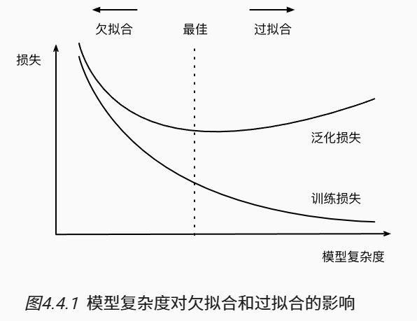

# Dive Into Deep Learning - Note

## 预备知识

### 数据操作

tensor：多维数组

tensor 的创建：

```py
import torch

# 创建 0...12 的 tensor
x = torch.arange(12)
> tensor([0,  1,  2,  3,  4,  5,  6,  7,  8,  9, 10, 11])

# 获得 tensor 沿每个坐标轴的形状
x.shape
> torch.Size([12])

# 改变 tensor 形状，原来的 x 不变
x.reshape(3, 4)
x
> tensor([[0,  1,  2,  3],
          [4,  5,  6,  7],
          [8,  9, 10, 11]])

# 用全 0、全 1 初始化矩阵
torch.zeros((2,3,4))
torch.zeros((2,3,4))
torch.randn(3,4)    # 每个元素从均值 0、标准差 1 的正态分布采样

# 指定初始值
torch.tensor([[2, 1, 4, 3], [1, 2, 3, 4], [4, 3, 2, 1]])
```

tensor 的运算：

```py
# 按元素运算
torch.exp(x)

# 拼接 tensor，可以按不同维度
X = torch.arange(12, dtype=torch.float32).reshape((3,4))
Y = torch.tensor([[2.0, 1, 4, 3], [1, 2, 3, 4], [4, 3, 2, 1]])
torch.cat((X, Y), dim=0), torch.cat((X, Y), dim=1)

# 生成二维 tensor，根据每个位置的比较为 true/false
x == y

# tensor 所有元素求和
x.sum()

# 广播机制：形状不同的 tensor 计算
a, b
> (tensor([[0],
           [1],
           [2]]),
   tensor([[0, 1]]))
a + b
> tensor([[0, 1],
          [1, 2],
          [2, 3]])
```

节省内存：

下面的命令可能会分配新的内存：`x = x + y`，为了避免这样，可以使用 `x += y` 或者用切片赋值

```py
Z = torch.zeros_like(Y)
print('id(Z):', id(Z))
Z[:] = X + Y
print('id(Z):', id(Z))
```

### 数据预处理

通常用 `pandas`

```py
# 拆分从 csv 读的数据，用平均值缺失值 NaN
inputs, outputs = data.iloc[:, 0:2], data.iloc[:, 2]
inputs = inputs.fillna(inputs.mean())
print(inputs)

# 将其中一列拆分为 xxx_<value> 和 xxx_nan
inputs = pd.get_dummies(inputs, dummy_na=True)
print(inputs)
>    NumRooms  Alley_Pave  Alley_nan
  0       3.0           1          0
  1       2.0           0          1
  2       4.0           0          1
  3       3.0           0          1

# 转换为 tensor 格式
x = torch.tensor(inputs.to_numpy(dtype=float))
y = torch.tensor(outputs.to_numpy(dtype=float))
X, y
```

### 线性代数

标量：只有一个元素的 tensor

向量是标量的推广，矩阵是向量的推广。
tensor 张量可以描述任意数量轴的 n 维数组

```py
# 矩阵的转置
A.T

# 矩阵按照元素的乘法（对应位置元素相乘），称为 Hadamard 积
A * B

# 对 tensor 求和、按行 / 列求和
A.sum() # 生成标量
A.sum(axis=[0, 1]) # 生成 tensor
A_sum_axis0 = A.sum(axis=0) # 生成 tensor
A_sum_axis1 = A.sum(axis=1) # 生成 tensor

# 平均值
A.mean(), A.sum() / A.numel()
A.mean(axis=0), A.sum(axis=0) / A.shape[0]

# 点积
torch.dot(x, y)

# 矩阵 - 向量的积
torch.mv(A, x)

# 矩阵乘
torch.mm(A, B)

# 范数，表示向量的大小
torch.norm(u) # L2 范数
torch.abs(u).sum() # L1 范数

# 矩阵的 Frobenius 范数
torch.norm(torch.ones(4, 9))
```


很多优化问题，例如最大化概率、最小化距离，都可以使用范数表示

### 微积分

梯度：一个向量，表示一个多元函数在某一点变化率最快的方向

对函数 $f(x_1,x_2,...,x_n)$，其梯度定义为：$\nabla f = \left( \frac{\partial f}{\partial x_1}, \frac{\partial f}{\partial x_2}, \dots, \frac{\partial f}{\partial x_n} \right)$

梯度指向函数值上升最快的防线。梯度的模（长度）表示该方向的变化率大小


### 自动微分

深度学习框架通过自动微分加快求导。

一个标量函数关于向量 $\vec{x}$ 的梯度是向量，有着 $\vec{x}$ 相同的形状。
例如，对函数 $y=2\vec{x}^T\vec{x}$，关于列向量 $\vec{x}$ 求导

```py
x = torch.arange(4.0, requireds_grad=True)
x.grad # 默认是 None
y = 2 * torch.dot(x, x)
y.backward()
x.grad
> tensor([0.,  4.,  8., 12.])
```

对另一个函数：

```py
x.grad.zero_() # 在默认情况下，PyTorch 会累积梯度，我们需要清除之前的值
y = x.sum()
y.backward()
x.grad
> tensor([1., 1., 1., 1.])
```

当 y 不是标量时，向量 y 关于向量 x 的导数的最自然解释是一个矩阵。对于高阶和高维的 y 和 x，求导的结果可以是一个高阶张量。

```py
x.grad.zero_()
y = x * x
# 等价于 y.backward(torch.ones(len(x)))
y.sum().backward()
x.grad
```

下面是反向传播函数计算 z=u*x 关于 x 的偏导数的例子，u 作为常数处理

```py
x.grad.zero_()
y = x * x
u = y.detach()
z = u * x

z.sum().backward()
```

### 概率

机器学习就是做出预测，需要考虑在所有可行的行为下获得高奖励的概率。

```py
# 定义概率向量，以及采样
fair_probs = torch.ones([6]) / 6
multinomial.Multinomial(1, fair_probs).sample()

# 同时抽取多个样本，计算相对概率
count = multinomial.Multinomial(100, fair_probs).sample()
count / 100
> tensor([0.1550, 0.1820, 0.1770, 0.1710, 0.1600, 0.1550])
```

贝叶斯定理：


## 线性神经网络


线性假设：将目标表示为特征的加权和。权重表示特征的影响大小，偏置 bias 表示特征都为 0 时的预测值

损失函数：度量拟合程度，量化实际值和预测值的差距。一般选择非负数。

例如，平方误差函数为：





计算训练集上 n 个样本的损失均值：



训练模型的目的，是为了找到一组参数 $(\vec{w},b)$，让训练集上的总损失最小，即：$\vec{w},b=\mathop{\argmin}\limits_{\vec{w},b}L(\vec{w},b)$

线性回归问题有解析解，但是很多情况没有解析解，这时就需要用梯度下降（gradient descent）方法来优化深度学习模型，在损失函数递减的方向更新参数以降低误差

小批量随机梯度下降（minibatch stochastic gradient descent）：梯度下降需要计算损失函数（样本的损失均值）关于模型参数的导数，为了减少这部分开销，每次更新时随机抽一批样本

训练过程：

- 初始化模型参数，如随机初始化
- 抽取小批量样本 B，计算平均损失关于模型参数的导数（梯度），当前参数减去梯度 * 正数 $\eta$
- 重复参数更新过程



超参数（hyperparameter）：是不在训练过程中更新的参数。例如 batch size，学习率 $\eta$。超参数一般根据训练效果调整，训练效果通过独立的验证数据集（validation dataset）得到

泛化（generalization）：在其他数据集上损失也较低的参数

线性回归也可以看成是神经网络：



计算层数一般不考虑输入层，因此这里是 1 层。而且每个输入和每个输出相连，因此这里的输出层称全连接层或稠密层

## softmax 回归

回归预测量，还能用于分类问题

在表示类型时，有几种方法：

- 直接编码，例如类型 1-3 使用整数 1-3 表示。如果类型之间有自然意义，可以用这种方式
- 独热编码（one-hot encoding）：使用向量表示，例如 $(1,0,0)$、$(0,1,0)$、$(0,0,1)$

如果要对三个类型分类，有四个特征，那么需要有三个仿射函数（affine function），和类型数量相同。网络结构是这样的，向量表示为 $\vec{o}=\vec{W}\vec{x}+\vec{b}$：



我们希望：模型有多个输出，表示输入等于该类型的概率，最后选择概率最高的作为预测值

但是有几个问题：

- 所有输出不一定是非负的
- 所有输出的和不一定是 1

因此需要对预测值 o 做 softmax 变换，保证非负以及和为 1，才有正确的概率分布





因为 softmax 回归的输出仍然由输入特征的仿射变换决定，因此 softmax 回归是线性模型

损失函数：模型输出类型预测概率，希望最大化正确类型的预测概率，相当于最小化负对数似然 $L=-\log P(y|\vec{x})=-\log \hat{y}$，这是单样本的损失函数

总体的的损失函数是：$L=-\sum_{k=1}^{K}y_k\log \hat{y_k}$，也称交叉熵损失。这里因为是 one-hot 编码，只有 $y_k=1$ 的项才有用

## 图像分类测试集

MNIST，fashion-MNIST

这里实现的时候，把每个 28*28 图片展平了，看成是 784 长度的向量。因为数据集有 10 个类型，因此权重是 784*10 的矩阵

在 softmax 变换时，可能出现数值上溢 / 下溢，pytorch 对这些情况做了处理

## 多层感知机

仿射变换涉及输入的线性组合，然而 * 线性 * 是一个很强的假设。有时输入数据没有明显的组合关系，这时就可以在网络中加入隐藏层，以处理更普遍的函数关系

例如，下面是一个多层感知机架构（MLP），前面 L-1 层是表示，最后一层是线性预测器



如果隐藏层 H 只有仿射函数，那么最后的输出还是所有输入的线性组合。因此，需要对每个隐藏单元应用非线性的激活函数 $\sigma$。激活函数的输出称为活性值（activation）。为了让模型更有表达能力，可以用多个隐藏层

通用近似定理：
一个具有单个隐藏层的多层感知机，只要隐藏层足够宽，并且使用非线性激活函数，就能以任何精度逼近任何连续函数。（存在性证明，不一定能找到）

虽然单隐层网络能学习任何函数，但是通过使用更深（而不是更广）的网络，可以更容易地逼近许多函数

激活函数：

- ReLU（Rectified Linear Unit），修正线性单元
  - $ReLU(x)=\max(x,0)$，仅保留正元素，丢弃负元素
  - 求导表现好：要么让参数消失，要么让参数通过
- sigmoid，挤压函数
  - $sigmoid(x)=\frac{1}{1+\exp(-x)}$，将任意输入压缩到区间 $(0,1)$
  - 已经较少使用
- tanh 函数
  - $tanh(x)=\frac{1-\exp(-2x)}{1+\exp(-2x)}$
  - 和 sigmoid 类似，tanh 将输入压缩到 $(-1,1)$ 上

欠拟合：训练误差和验证误差都很高，说明模型太简单
过拟合：模型在训练集上的拟合比潜在分布好。训练误差明显低于验证误差
正则化：用来对抗过拟合



K 折交叉验证：
训练数据不够时使用的方法。将原始数据分成 k 份，执行 k 次训练和验证。每次在 k-1 个子集上训练，在剩余一个子集上验证。最后取平均训练、验证误差

数据集大小：至少要数千个训练样本，深度学习的效果才优于线性模型

权重衰减：一种常用的正则化技术，也称为 L2 正则化。通过函数与零的距离来衡量函数的复杂度。

一种简单方法是，通过线性函数 $f(\vec{x})=\vec{w}^T\vec{x}$ 的权重向量的 L2 范数 $\Vert \vec{w} \Vert^2$。将范数作为惩罚项之后，训练目标为最小化预测损失和惩罚项之和，这样可以在预测损失和权重向量之间平衡，避免过拟合。

例如，线性回归的损失可以表示为：$L(\vec{w},b)+\frac{\lambda}{2}\Vert \vec{w} \Vert^2$，加 $\frac{1}{2}$ 是为了求导方便

- 岭回归（ridge regression）：将权重向量的 L2 范数加到惩罚项，例如线性回归中，加入回归系数的 L2 范数 $\sum \beta_j^2$
- 套索回归（lasso regression）：将 L1 范数（绝对值之和）加到惩罚项，$\sum \lvert \beta_j \rvert$

对于使用 L2 范数的惩罚项，学习算法会偏向于在大量特征上分布均衡的权重。对 L1 惩罚，权重会集中在一小部分特征上，其他权重被清除为 0

pytorch 中使用权重衰减：

在优化器中设置 `weight_decay` 参数（权重衰减的系数 $\lambda$），对所有可训练参数使用 L2 正则化

```py
import torch
import torch.nn as nn
import torch.optim as optim

# 定义模型
model = nn.Linear(10, 1)  # 示例模型

# 定义损失函数
criterion = nn.MSELoss()

# 定义优化器，并启用 weight_decay
optimizer = optim.SGD(model.parameters(), lr=0.01, weight_decay=1e-4)
# 或者使用 Adam
# optimizer = optim.Adam(model.parameters(), lr=0.001, weight_decay=1e-4)
```

对特定参数使用权重衰减

```py
# 将模型参数分为需要衰减和不需要衰减的两组
decay_params = []
no_decay_params = []

for name, param in model.named_parameters():
    if 'weight' in name and 'norm' not in name:  # 通常是权重，且不是 BatchNorm 的权重
        decay_params.append(param)
    else:
        no_decay_params.append(param)

# 构建参数组
param_groups = [
    {'params': decay_params, 'weight_decay': 1e-4},
    {'params': no_decay_params, 'weight_decay': 0.0}
]

# 使用优化器
optimizer = optim.Adam(param_groups, lr=0.001)
```

经典泛化理论认为好的模型是简单的模型，简单性表现为：

- 参数维度低，参数的范数低
- 平滑性，即函数对输入的微小变化不敏感，随机噪声对最终结果是无影响的

暂退法（dropout）：

在前向传播过程中，计算每一内部层的同时注入噪声，例如在丢弃一些神经元，在计算下一层之前将当前层的一些节点置零

暂退法应用：

- 可以将 dropout 应用于每个隐藏层的输出，并为每一层分别设置概率
- 一般越靠近输入层，dropout 概率越低

```py
net = nn.Sequential(nn.Flatten(),
        nn.Linear(784, 256),
        nn.ReLU(),
        # 在第一个全连接层之后添加一个 dropout 层
        nn.Dropout(dropout1),
        nn.Linear(256, 256),
        nn.ReLU(),
        # 在第二个全连接层之后添加一个 dropout 层
        nn.Dropout(dropout2),
        nn.Linear(256, 10))

def init_weights(m):
    if type(m) == nn.Linear:
        nn.init.normal_(m.weight, std=0.01)

net.apply(init_weights);
```

训练时 dropout 才有作用；测试时，dropout 层仅传递数据

前向传播（forward propagation）：
从输入层到输出层，按顺序计算和存储神经网络每层的结果。目的是计算模型输出和损失

反向传播（backward propagation）：计算神经网络参数梯度的方法。根据求导的链式规则，从输出层到输入层遍历网络。目的是计算参数梯度，更新训练参数

在训练神经网络时，初始化模型参数之后，会交替进行前向传播和反向传播。反向传播会重复利用前向传播中存储的中间值，从而避免重复计算。这使得训练比预测占用更多显存。

多层神经网络中，梯度的计算涉及多个权重矩阵和局部梯度向量的乘积。因为不同矩阵的特征值可能很大或很小，因此乘积也可能很大或很小。不稳定的梯度会影响优化算法的稳定性：

- 梯度爆炸（gradient exploding）：参数更新过大，破坏模型的稳定收敛
- 梯度消失（gradient vanishing）：参数更新过小，模型无法学习

例如，sigmoid 函数在输入很大或者很小时梯度为 0（神经元要么完全激活，要么完全不激活），如果网络有很多层，可能在某一层切断梯度。因此现在更多使用 ReLU 作为激活函数

参数对称性问题：在初始化隐藏层的参数时，如果使用相同的值，那么训练不会让隐藏单元的权重分化，从而没有充分利用模型表达能力。随机初始化、dropout 可以打破对称性

参数初始化方法：

- 随机初始化，例如正态分布
- xavier 初始化，根据每层输入输出连接数调整权重初始化范围。可避免梯度爆炸、梯度消失

数据分布偏移：

- 协变量偏移（covariate shift）：输入的特征分布变了，但是输出标签条件概率不变。例如，猫的图片风格背景变了，但是猫判断标准没变
- 标签偏移（label shift）：标签总体比例变了，但是每类标签对应的特征不变。例如，流感疾病 Y 引起症状 X，在流感易感季节，P(Y) 会变大，但是 “流感会导致 xx 症状”P(X|Y) 不变。当存在因果关系时，标签偏移是一个合理的假设
- 概念偏移（concept shift）：标签的定义发生变化，例如精神疾病的诊断标准、所谓的时髦

学习问题的分类：

- 批量学习（batch learning）：给一组训练特征和标签 $\{(\vec{x_1},y_1),...,(\vec{x}_n,y_n)\}$，训练 $f(\vec{x})$，对来自同意分布的新数据 $(\vec{x},y)$ 评分
- 在线学习（online learning）：观测 $\vec{x}_i$ -> 估计值 $f(\vec{x}_i)$ -> 观测到 $y_i$，根据结果得到奖励或损失。例如，股票价格预测
- 老虎机（bandits）：采取的行动是有限的
- 控制：例如 PID（比例 - 积分 - 微分）控制器算法
- 强化学习：基于环境的行动，以取得最大化预期收益

## 深度学习计算

在研究和设计神经网络时，讨论 “比单个层大” 但 “比整个模型小” 的组件更有价值，多个层的组合称为” 块 “，” 块 “可以描述单个层、多个层、整个模型本身。

每个块需要提供的功能：

- 对输入数据，使用前向传播函数生成输出。输出的形状可能和输入形状不同
- 计算输出关于输入的梯度
- 存储、访问参数
- 根据需要初始化模型参数

这里自定义的 `MLP` 类继承了表示块的类 `nn.module`，

```py
class MLP(nn.Module):
    # 用模型参数声明层。这里，我们声明两个全连接的层
    def __init__(self):
        # 调用 MLP 的父类 Module 的构造函数来执行必要的初始化。
        # 这样，在类实例化时也可以指定其他函数参数，例如模型参数 params（稍后将介绍）
        super().__init__()
        self.hidden = nn.Linear(20, 256)  # 隐藏层
        self.out = nn.Linear(256, 10)  # 输出层

    # 定义模型的前向传播，即如何根据输入 X 返回所需的模型输出
    def forward(self, X):
        # 注意，这里我们使用 ReLU 的函数版本，其在 nn.functional 模块中定义。
        return self.out(F.relu(self.hidden(X)))
```