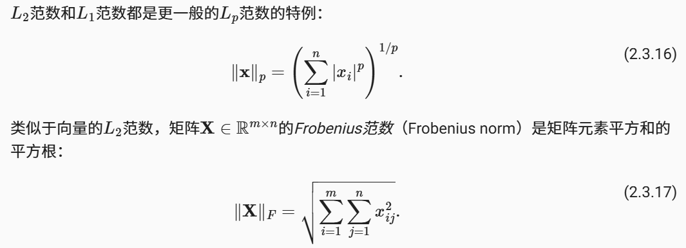
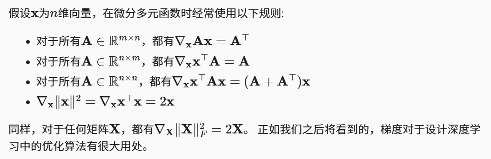
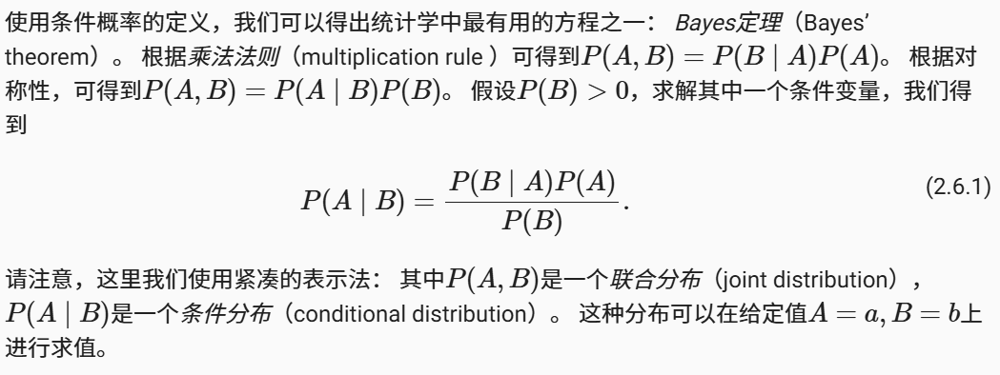
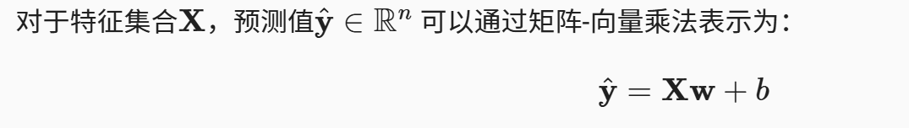

# Dive Into Deep Learning - Note

## 预备知识

### 数据操作

tensor：多维数组

tensor 的创建：

```py
import torch

# 创建 0...12 的 tensor
x = torch.arange(12)
> tensor([0,  1,  2,  3,  4,  5,  6,  7,  8,  9, 10, 11])

# 获得 tensor 沿每个坐标轴的形状
x.shape
> torch.Size([12])

# 改变 tensor 形状，原来的 x 不变
x.reshape(3, 4)
x
> tensor([[0,  1,  2,  3],
          [4,  5,  6,  7],
          [8,  9, 10, 11]])

# 用全 0、全 1 初始化矩阵
torch.zeros((2,3,4))
torch.zeros((2,3,4))
torch.randn(3,4)    # 每个元素从均值 0、标准差 1 的正态分布采样

# 指定初始值
torch.tensor([[2, 1, 4, 3], [1, 2, 3, 4], [4, 3, 2, 1]])
```

tensor 的运算：

```py
# 按元素运算
torch.exp(x)

# 拼接 tensor，可以按不同维度
X = torch.arange(12, dtype=torch.float32).reshape((3,4))
Y = torch.tensor([[2.0, 1, 4, 3], [1, 2, 3, 4], [4, 3, 2, 1]])
torch.cat((X, Y), dim=0), torch.cat((X, Y), dim=1)

# 生成二维 tensor，根据每个位置的比较为 true/false
x == y

# tensor 所有元素求和
x.sum()

# 广播机制：形状不同的 tensor 计算
a, b
> (tensor([[0],
           [1],
           [2]]),
   tensor([[0, 1]]))
a + b
> tensor([[0, 1],
          [1, 2],
          [2, 3]])
```

节省内存：

下面的命令可能会分配新的内存：`x = x + y`，为了避免这样，可以使用 `x += y` 或者用切片赋值

```py
Z = torch.zeros_like(Y)
print('id(Z):', id(Z))
Z[:] = X + Y
print('id(Z):', id(Z))
```

### 数据预处理

通常用 `pandas`

```py
# 拆分从 csv 读的数据，用平均值缺失值 NaN
inputs, outputs = data.iloc[:, 0:2], data.iloc[:, 2]
inputs = inputs.fillna(inputs.mean())
print(inputs)

# 将其中一列拆分为 xxx_<value> 和 xxx_nan
inputs = pd.get_dummies(inputs, dummy_na=True)
print(inputs)
>    NumRooms  Alley_Pave  Alley_nan
  0       3.0           1          0
  1       2.0           0          1
  2       4.0           0          1
  3       3.0           0          1

# 转换为 tensor 格式
x = torch.tensor(inputs.to_numpy(dtype=float))
y = torch.tensor(outputs.to_numpy(dtype=float))
X, y
```

### 线性代数

标量：只有一个元素的 tensor

向量是标量的推广，矩阵是向量的推广。
tensor 张量可以描述任意数量轴的 n 维数组

```py
# 矩阵的转置
A.T

# 矩阵按照元素的乘法（对应位置元素相乘），称为 Hadamard 积
A * B

# 对 tensor 求和、按行 / 列求和
A.sum() # 生成标量
A.sum(axis=[0, 1]) # 生成 tensor
A_sum_axis0 = A.sum(axis=0) # 生成 tensor
A_sum_axis1 = A.sum(axis=1) # 生成 tensor

# 平均值
A.mean(), A.sum() / A.numel()
A.mean(axis=0), A.sum(axis=0) / A.shape[0]

# 点积
torch.dot(x, y)

# 矩阵 - 向量的积
torch.mv(A, x)

# 矩阵乘
torch.mm(A, B)

# 范数，表示向量的大小
torch.norm(u) # L2 范数
torch.abs(u).sum() # L1 范数

# 矩阵的 Frobenius 范数
torch.norm(torch.ones(4, 9))
```



很多优化问题，例如最大化概率、最小化距离，都可以使用范数表示

### 微积分

梯度：一个向量，表示一个多元函数在某一点变化率最快的方向

对函数 $f(x_1,x_2,...,x_n)$，其梯度定义为：$\nabla f = \left( \frac{\partial f}{\partial x_1}, \frac{\partial f}{\partial x_2}, \dots, \frac{\partial f}{\partial x_n} \right)$

梯度指向函数值上升最快的防线。梯度的模（长度）表示该方向的变化率大小



### 自动微分

深度学习框架通过自动微分加快求导。

一个标量函数关于向量 $\vec{x}$ 的梯度是向量，有着 $\vec{x}$ 相同的形状。
例如，对函数 $y=2\vec{x}^T\vec{x}$，关于列向量 $\vec{x}$ 求导

```py
x = torch.arange(4.0, requireds_grad=True)
x.grad # 默认是 None
y = 2 * torch.dot(x, x)
y.backward()
x.grad
> tensor([0.,  4.,  8., 12.])
```

对另一个函数：

```py
x.grad.zero_() # 在默认情况下，PyTorch 会累积梯度，我们需要清除之前的值
y = x.sum()
y.backward()
x.grad
> tensor([1., 1., 1., 1.])
```

当 y 不是标量时，向量 y 关于向量 x 的导数的最自然解释是一个矩阵。对于高阶和高维的 y 和 x，求导的结果可以是一个高阶张量。

```py
x.grad.zero_()
y = x * x
# 等价于 y.backward(torch.ones(len(x)))
y.sum().backward()
x.grad
```

下面是反向传播函数计算 z=u*x 关于 x 的偏导数的例子，u 作为常数处理

```py
x.grad.zero_()
y = x * x
u = y.detach()
z = u * x

z.sum().backward()
```

### 概率

机器学习就是做出预测，需要考虑在所有可行的行为下获得高奖励的概率。

```py
# 定义概率向量，以及采样
fair_probs = torch.ones([6]) / 6
multinomial.Multinomial(1, fair_probs).sample()

# 同时抽取多个样本，计算相对概率
count = multinomial.Multinomial(100, fair_probs).sample()
count / 100
> tensor([0.1550, 0.1820, 0.1770, 0.1710, 0.1600, 0.1550])
```

贝叶斯定理：



## 线性神经网络



线性假设：将目标表示为特征的加权和。权重表示特征的影响大小，偏置 bias 表示特征都为 0 时的预测值

损失函数：度量拟合程度，量化实际值和预测值的差距