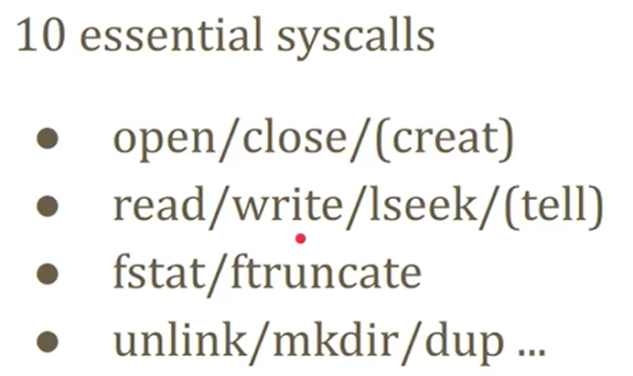
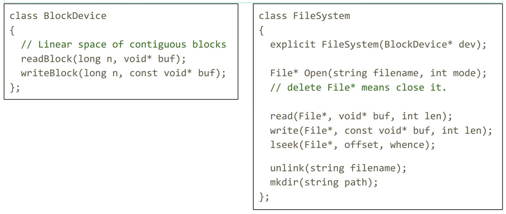
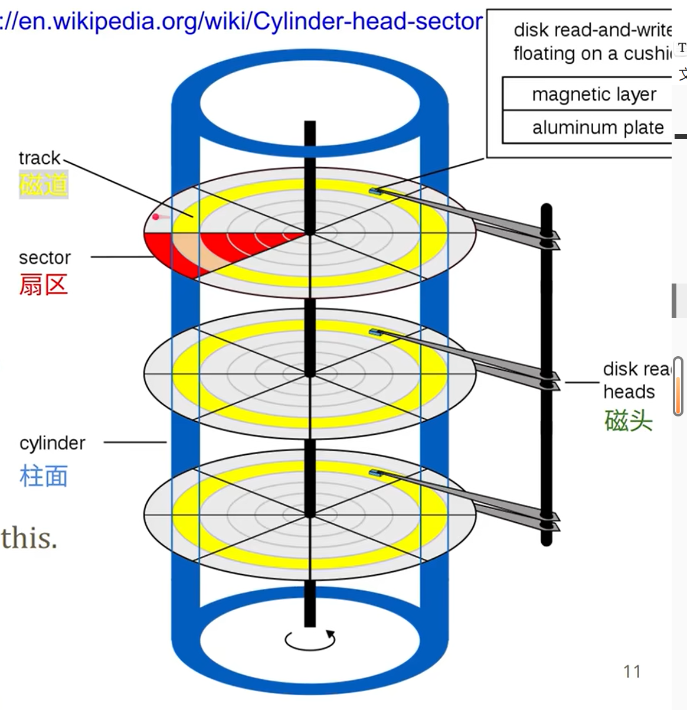
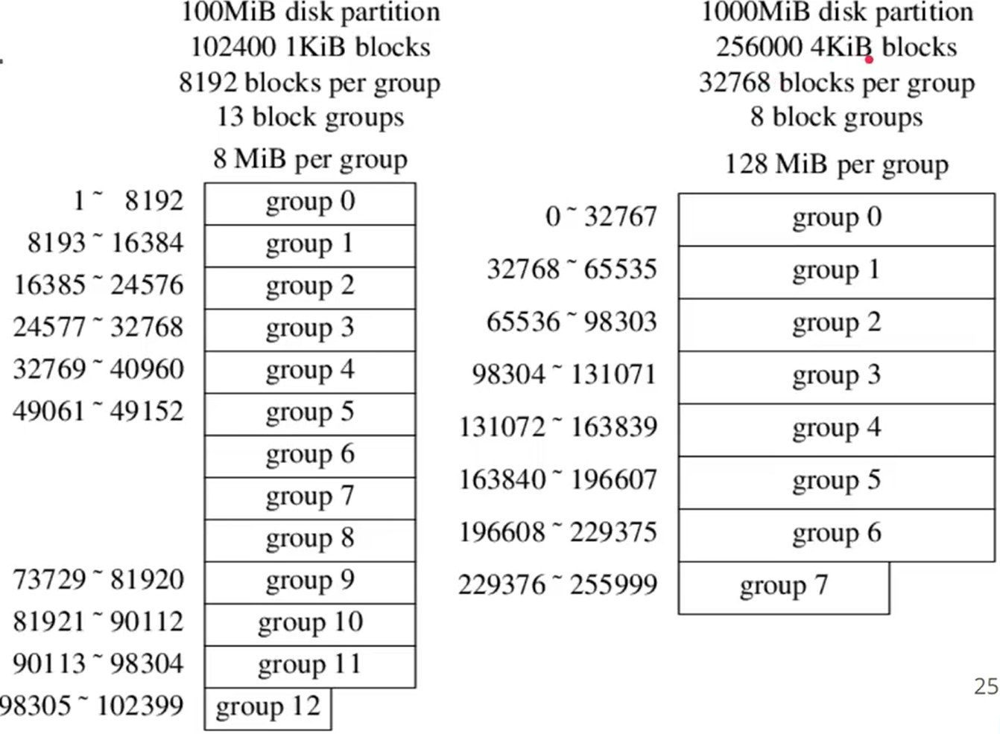
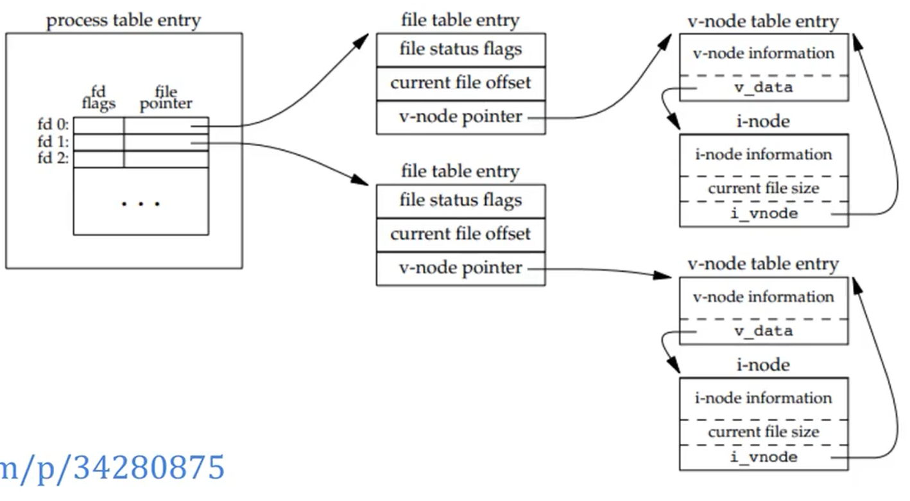
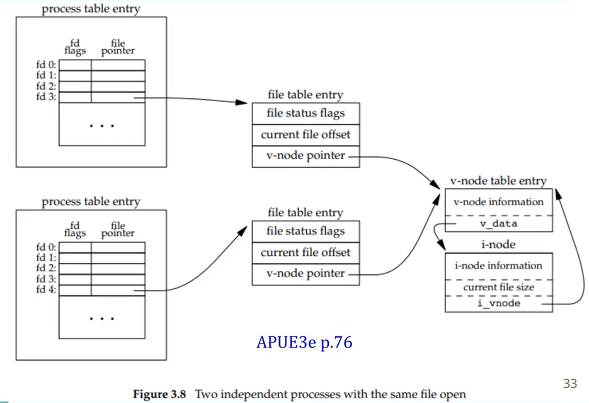
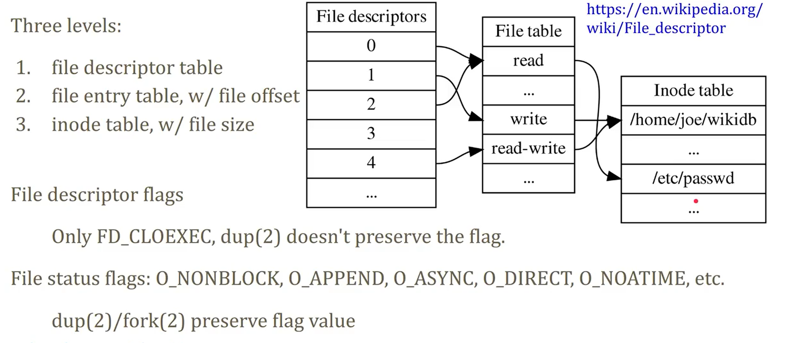

# Unix-like file systems

[toc]

## 写在前面

这篇笔记主要内容是 Linux 上的文件系统，讨论文件系统的基本设计

Ken Thompson 先实现了文件系统，在此基础上实现了 Unix

## 1 抽象

**对文件的抽象：**

* a sequence of bytes
* 文件的格式取决于用户如何解释这个文件

10个基本的系统调用：

**文件系统的抽象：**

* 从文件名到文件的映射

  * 文件的元数据（权限、类型、user、group、创建时间、修改时间、...）

  * 文件的内容

**Unix文件的抽象：使用 inode 作为桥梁**

filename => inode => File

inode 是一个整数，可以看成是 FS 里面的 primary key

存在多个文件名指向一个 inode 的情况（硬链接，hard link）

**磁盘的抽象：块设备**

磁盘读写的单位是扇区（sector），扇区大小为 4 KB。

块设备具有线性连续的块空间，每个块有一个下标。块的大小有 1 KB（老设备）、2 KB、4 KB（现在更常见）的。

**文件系统在块设备和文件之间的角色**

基于块设备，文件系统提供了操作文件的接口

## 2 磁盘

**磁盘结构图**

CHS结构：cylinder-head-sector

* 磁道是一系列的同心圆，从外圆到内圆开始编号：0、1、...
* 盘面的正反两面都可以读，对应两个磁头

在写磁盘的时候使用电梯算法：

* 电梯算法：沿磁头的移动方向，将需要访问的位置由近到远排队；沿背离磁头的移动方向，将需要访问的位置由近到远排队。
* 优点：降低响应时间的方差
* 问题：导致写指令重排，涉及数据库事务等

**可靠性**

磁盘不是一个很可靠的设备：温度会影响故障率（annual failure rate）

* MTBF（平均故障间隔时间）是技术产品两次可修复故障之间的平均时间。

写到硬盘上的数据和实际数据相比，是经过编码后的：partial-response maximum-likelihood

磁盘上面是有缓存的（如 512 MB），有时 controller 会在数据到了缓存之后就认为已经完成数据写入了

## 3 分块读写

这一节标题的英文是：block and block groups

文件系统为文件分配空间的粒度就是 block，而非 byte

**块的大小会显著影响 FS 性能**

* 大的 block 可以减少元数据的大小
* 小的 block 可以提高 FS 空间利用率

**磁盘扇区大小、FS block 大小、内存 page 大小**

磁盘扇区 sector：目前 4K 的比较多，有 512e 和 4Kn 两种

> 512e 是物理扇区的大小是 512B，以 1:8 的比例映射到 4K
>
> 4Kn 是 4K native，物理扇区的大小就是 4K

`mke2fs`，这个工具可以检查物理扇区的大小、逻辑扇区的大小

sector size <= block size <= memory page size，现在它们都是 4K 了

**block group**

 disk block 被划分成了若干 group，每个 group 含有若干 block

使用 block group 的目的：让文件的元数据和文件内容更接近，利用局部性来增加吞吐量

最后一个 group 可能不满

superblock 和 group descriptors 会在多个 group 上备份

**SSD**

SSD 的 average access time 远小于磁盘：0.03 ~ 0.05 ms 对比 12 ~ 15 ms。基于磁盘设计的 block group 可能在 SSD 的文件系统上用处不大了。

**block group descriptor**

一个 block group descriptor 包括：

* block bitmap、inode bitmap
* inode table
* free block count、free indoe count
* ...

**fragement & cluster**

为了减少小文件也要占用一个 block 造成的空间浪费，ext2 支持为文件分配比 block 小的空间，例如 1 KB

为了减少大文件的元数据大小，ext4 可以为大文件分配多个 block 的 cluster_size，称为 bigalloc

## 4 内核文件表

**inode**

文件的数据放在 block 中，元数据就在 inode 中。

inode 一定包括：

* type + permission
* size in bytes
* refrence count
* block address

inode 可以包括：timestamps, uid/gid, device number

inode 在一个 FS 中是唯一的：

* hard link 是两个 inode 相同的文件，不能跨 FS
* soft link 记录的是一个绝对路径，可以跨 FS

**进程打开文件时的内核数据结构**

file offset 放在了 file table entry

file size 放在了 inode

两个进程打开了同一个文件，每个进程看到的 file size 是相同的，file offset 是不同的：

**unix file descriptors**

fd => file table => inode table

file table 里面记录了文件的打开方式（）

Q: open twice; open then dup; open then fork，区别是什么？

