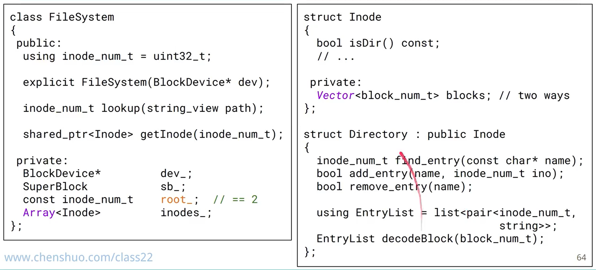

# Unix-like file systems

[toc]

## 写在前面

这篇笔记主要内容是 Linux 上的文件系统，讨论文件系统的基本设计

Ken Thompson 先实现了文件系统，在此基础上实现了 Unix


## 1 抽象

**对文件的抽象：**

* a sequence of bytes
* 文件的格式取决于用户如何解释这个文件

10个基本的系统调用：


**文件系统的抽象：**

* 从文件名到文件的映射

  * 文件的元数据（权限、类型、user、group、创建时间、修改时间、...）

  * 文件的内容


**Unix文件的抽象：使用 inode 作为桥梁**

filename => inode => File

inode 是一个整数，可以看成是 FS 里面的 primary key

存在多个文件名指向一个 inode 的情况（硬链接，hard link）


**磁盘的抽象：块设备**

磁盘读写的单位是扇区（sector），扇区大小为 4 KB。

块设备具有线性连续的块空间，每个块有一个下标。块的大小有 1 KB（老设备）、2 KB、4 KB（现在更常见）的。


**文件系统在块设备和文件之间的角色**

基于块设备，文件系统提供了操作文件的接口


## 2 磁盘

**磁盘结构图**

CHS结构：cylinder-head-sector


* 磁道是一系列的同心圆，从外圆到内圆开始编号：0、1、...
* 盘面的正反两面都可以读，对应两个磁头


在写磁盘的时候使用电梯算法：

* 电梯算法：沿磁头的移动方向，将需要访问的位置由近到远排队；沿背离磁头的移动方向，将需要访问的位置由近到远排队。
* 优点：降低响应时间的方差
* 问题：导致写指令重排，涉及数据库事务等


**可靠性**

磁盘不是一个很可靠的设备：温度会影响故障率（annual failure rate）

* MTBF（平均故障间隔时间）是技术产品两次可修复故障之间的平均时间。

写到硬盘上的数据和实际数据相比，是经过编码后的：partial-response maximum-likelihood

磁盘上面是有缓存的（如 512 MB），有时 controller 会在数据到了缓存之后就认为已经完成数据写入了


## 3 分块读写

这一节标题的英文是：block and block groups

文件系统为文件分配空间的粒度就是 block，而非 byte


**块的大小会显著影响 FS 性能**

* 大的 block 可以减少元数据的大小
* 小的 block 可以提高 FS 空间利用率


**磁盘扇区大小、FS block 大小、内存 page 大小**

磁盘扇区 sector：目前 4K 的比较多，有 512e 和 4Kn 两种

> 512e 是物理扇区的大小是 512B，以 1:8 的比例映射到 4K
>
> 4Kn 是 4K native，物理扇区的大小就是 4K

`mke2fs`，这个工具可以检查物理扇区的大小、逻辑扇区的大小

sector size <= block size <= memory page size，现在它们都是 4K 了


**block group**

 disk block 被划分成了若干 group，每个 group 含有若干 block

使用 block group 的目的：让文件的元数据和文件内容更接近，利用局部性来增加吞吐量


最后一个 group 可能不满

superblock 和 group descriptors 会在多个 group 上备份


**SSD**

SSD 的 average access time 远小于磁盘：0.03 ~ 0.05 ms 对比 12 ~ 15 ms。基于磁盘设计的 block group 可能在 SSD 的文件系统上用处不大了。


**block group descriptor**

一个 block group descriptor 包括：

* block bitmap、inode bitmap
* inode table
* free block count、free indoe count
* ...


**fragement & cluster**

为了减少小文件也要占用一个 block 造成的空间浪费，ext2 支持为文件分配比 block 小的空间，例如 1 KB

为了减少大文件的元数据大小，ext4 可以为大文件分配多个 block 的 cluster_size，称为 bigalloc


## 4 内核文件表

**inode**

文件的数据放在 block 中，元数据就在 inode 中。

inode 一定包括：

* type + permission
* size in bytes
* refrence count
* block address

inode 可以包括：timestamps, uid/gid, device number

inode 在一个 FS 中是唯一的：

* hard link 是两个 inode 相同的文件，不能跨 FS
* soft link 记录的是一个绝对路径，可以跨 FS


**进程打开文件时的内核数据结构**

file offset 放在了 file table entry

file size 放在了 inode


两个进程打开了同一个文件，每个进程看到的 file size 是相同的，file offset 是不同的：


**unix file descriptors**

fd => file table => inode table

file table 里面记录了文件的打开方式（）


Q: open twice; open then dup; open then fork，区别是什么？


## 5 inode

**ext2 inode**

一个 ext2 inode 的大小是 128 byte。1 KB 大小的 block 可以放 8 个 ext2 inode

* direct block: 直接存储的 block number，有 12 个
* indirect block: 一个 inode number 是 32 位，1 KB 的 indirect block 可以存 256 个 inode number
* double indirect: 和 indirect block 类似


ext2 对源代码等小文件比较好，对图片、视频等大文件不是很好


**file is appendable, but not easy-insertable**

上面的 block mapping mechanism 意味着，文件的追加写开销比从中间写的开销要小

在需要中间写的情况下，如果是整个地替换掉 data block，那么只需要修改中间的 xxx indirect number，大小为 4 KB，开销也比较小

在 ext4 中，全部是 0 的 block 不会消耗磁盘空间，inode 只会指向有实际内容的 inode


**ext4**

因为 ext2 对大文件不是很友好，ext4 放弃了 block mapping，使用 extent tree

一个 extent 是一个连续的物理 block 的范围，它提升了大文件的性能

ext4 中的一个 extent 通过一个 4 KB 的 block，可以映射到 128 MB 的连续空间

如果没有连续的 128 MB 空间，或者是文件很大，ext4 会用 extent tree 来存储文件


**ext2、ext4 比较**


如果小文件太多，可能出现 inode 比磁盘空间先用完的情况

上面表格的 inode ratio 就是一个文件大小的参考值

使用 block mapping 的 ext2 能包括最多 1G 个 block，ext4 extent 最多有 4G 个 block


**inode=file**

inode 将 FS 的 file 抽象映射到 data block

inode 不包括文件名，文件名在目录的 inode 里面


## 6 目录

* 目录是一种特殊的文件
* 目录将文件名映射到 inode number


**以链表形式组织的目录**

每个 entry 包括：inode number、entry length、filename length、filename、pad


因为`..`创建的时间更早，所以在 inode table 里面，`i2`是最小的


**ext2 中的 dir entry**

对文件名的长度做了限制，所以 ``name_len ``只需要 8 位了

`file_type `表示类型为目录、链接等

最后面的尚未分配的空间作为`pad`，合并到最后一个 entry 中


dir entry 是不会跨 block 的边界的，如果空间不够分配新 entry，会开一个新的 block


**修改目录内容的时间开销**

创建一个 dir entry（子目录或者文件）：first-fit algorithm，线性时间复杂度

删除一个 entry：将 inode number 设置为 0，将这个 entry 和前面的 entry 合并

重命名一个 entry：create and remove，两次线性查找


**ext4 directory**

使用 hashmap 实现 filename 到 inode number 的映射，找一个 entry 的时间从 O(n) 变成了 O(1)


**目录的大小**

目录的大小不会自动收缩：在一个目录里面创建很多文件，然后把这些文件都删了，目录的大小不会下降

要让目录真的变小，可以用 move and swap：`mkdir X; mv dirA/* X; rmdir dirA; mv X dirA`


**总结**

引入目录之后，FS 就可以通过 root inode 进入根目录，从根目录往下面找




## 7 磁盘布局

**ext2 block group 的结构**

block group 将 block 的元数据和 block 之间距离缩短了，利用了局部性

每个 group 就是一个 mini-FS

每个 FS 有一个 superblock，一般存储在第一个 group（group0）中

每个 group 有一个block group descriptor


group desc 的结构，包含指向两个 bitmap 的指针、inode table 的指针：


一个 group 有 8192 个 block，这是因为 group 里面的 block bitmap 是一个 block ，大小为 1KB，对应 8192 个block 


**superblock**

superblock 记录了整个 FS 的信息，例如 inode 数量、block 数量等，一般放在第一个 group

在新增、修改文件时，需要同步修改 superblock 的信息，因此 superblock 这里可能成为 FS 的瓶颈，对于存储设备（磁盘、SSD）来说，存储 superblock 的位置也更容易坏掉


**layout: ext2 & ext4**


**play with FS**

```bash
dd if=/dev/zero of=ext2.img bs=1M count=500
mkfs,ext2 -r 0 ext2.img
sudo mount ext2.img /mnt/small
// copy files to it, then umount
debugfs -w ext2.img
```


## 8 总结

**local FS summary**

磁盘：

* 磁盘作为块设备，读写的单位是 block，现在 block 的大小是 4K
* 和 CPU/RAM 相比，磁盘的读写是很慢的。OS 会通过预读来增加性能。磁盘也用缓存提高写入的性能

文件系统提供的抽象

操作文件的接口

superblock、group、group desc、inode、directory


Todo:

VFS layer: 系统中可能有多种 FS，VFS 是 syscall 和具体 FS 接口（如 ext2 functions）的中间层

IO scheduling


**leveldb 对 FS 的需求**

作为 kv 存储，leveldb 对 FS 的要求不高，它只需要对文件进行追加写，不需要覆盖写 

kv 存储需要的独特功能：compression、snapshot
