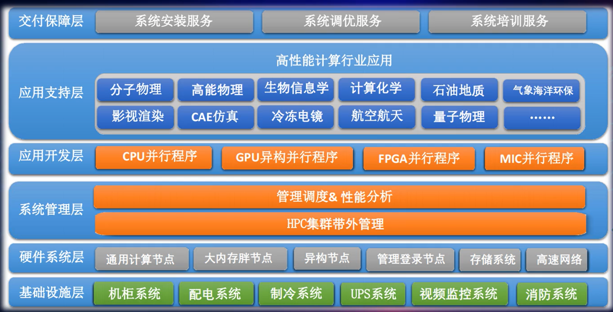
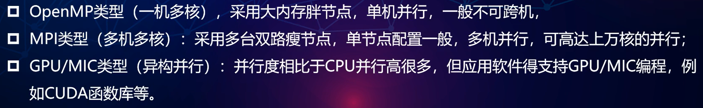

[toc]

## HPC概念

* HPC: 将多个计算节点通过网络组织起来，协同工作
* HPC方案组成：
  * 硬件：服务器、存储、网络
  * 软件：集群管理、作业调度、并行存储、并行环境、OS、行业应用软件
  * 业务：应用调优、开发、专业咨询

## HPC系统架构

登录节点：用户访问HPC集群的入口

管理节点：部署作业调度软件、集群监控软件、应用软件的许可服务器等

计算节点：

网络分为：

* 管理网络：登录节点、管理节点，常用千兆网络
* 计算网络：计算节点的互联，常用低延迟IB/OPA网络
* 存储网络：向HPC集群的节点提供数据访问服务，常用SCSI、FC、IB网络