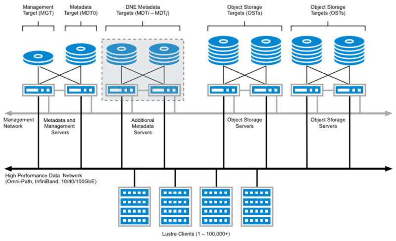
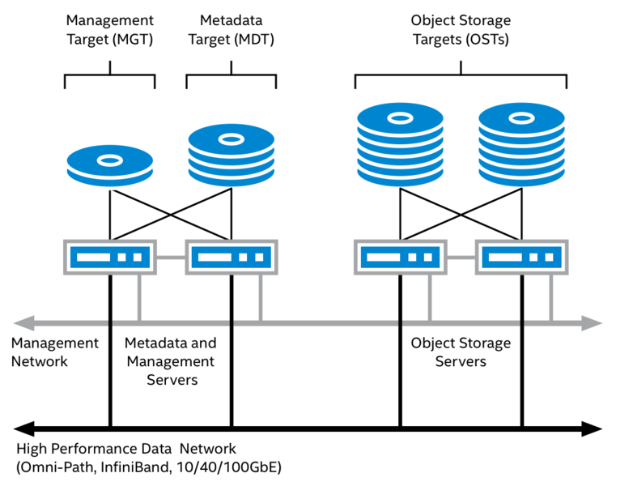

[toc]

## 写在前面

这篇主要是学习 lustre 的笔记，目前进度在：

* introduction to lustre

## 简介

lustre 是一个分布式的并行文件系统，设计目标是可扩展、高性能、高可用

特点是：开源、全局统一的命名空间（global single namespace）、符合 posix 标准

> 在非层次化的存储系统中，namespace可以理解为所有的文件/对象名；
>
> 在层次化的存储系统（如文件系统）中，除了文件名、目录名外，还包括他们之间隐含的父子关系。

lustre 采用的是 c-s 架构

## lustre 架构

**lustre FS architecture**

lustre 是建立在分布式、对象存储上的，namespace hierarchy 和 file content 是分开存储的

两种对象类型：

* data object：简单的数组，存文件内容的
* index object：存 kv，比如 posix 目录

* metadata server (MDS): 提供 namespace 操作
* object storage server (OSS): 提供 bulk IO 服务
* management server (MGS): 全局的配置信息

* LNet: lustre 内部服务的通信协议

**metadata server (MDS)**

MDS 提供了所有的 namespace 操作：MDS 提供了对 MDT 的访问接口，MDS 在创建文件时可以让 OSS 分配 storage object，MDS 还管理文件的打开关闭、删除、重命名等操作

> metadata target (MDT): 存储了 namespace metadata，包括文件名、目录、权限等，

一个 FS 里面可以有多个 MDT，类似于目录和子目录。一个目录也可以跨多个 MDT，适用于目录层级不深、文件很多的应用

**object storage server (OSS)**

OSS 存储了 lustre 中的文件内容部分：OSS 将文件数据存储在 OST 上，一般一个 OSS 对应 2-8 个 OST

> object storage object (OST)

OSS 一般是以 pair 配置的，每个 pair 连接到一些 OST。用 pair 主要是为了高可用，这里的 pair 是 active-passive 模式，一个 OSS 挂了另外一个顶上去。

**management server (MGS)**

MGS 存储了 lustre 中的配置信息部分，client 和 server 在启动时会从 MGS 获取配置信息。配置信息有变动时，MGS 会通知

management target (MGT): 存储配置信息的地方

**client**

应用通过 lustre client 来访问 FS 的数据。lustre client 在主机上提供了 FS 的一个 mount point，为应用提供了统一的 namespace。

每个 lustre instance 是一个在 client 的 OS 上的单独的 mount point

## lustre 的高可用

lustre 没有做 data object 的冗余设计，比如跨 storage server 存 data object

数据可靠性在存储子系统中实现

为了防止服务故障，lustre 有多个 server 连接到 lustre 存储目标（MGT、MDT、OST）上，如果一个 server 故障，可以从其他幸存的 server 继续访问 lustre 存储目标

基于上面的高可用模型，在 linux 发行版中，集群框架对两个软件进行了整合：用于集群成员资格和通信的 corosync、用于资源管理的 pacemaker

## 链接

* [lustre wiki](https://wiki.lustre.org/Main_Page)
* [Introduction to lustre](https://wiki.lustre.org/Introduction_to_Lustre)
* [Lustre101](https://lustre.ornl.gov/lustre101-courses/)