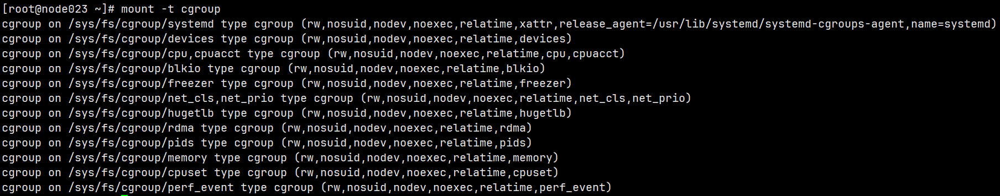

# 深入剖析 Kubernetes

<!-- TOC -->

- [深入剖析 Kubernetes](#深入剖析-kubernetes)
  - [Docker](#docker)
    - [Docker 实现方法](#docker-实现方法)
    - [Docker 的局限](#docker-的局限)
    - [Docker 容器镜像](#docker-容器镜像)
    - [Docker layer](#docker-layer)
    - [一个例子](#一个例子)
    - [Docker volume](#docker-volume)
    - [总结](#总结)
  - [Kubernetes](#kubernetes)
    - [Intro](#intro)
    - [K8S 部署](#k8s-部署)
    - [K8S 使用](#k8s-使用)

<!-- /TOC -->
    - [Intro](#intro)
    - [K8S 部署](#k8s - 部署)
    - [K8Sshi](#k8sshi)

<!-- /TOC -->
<!-- /TOC -->
<!-- /TOC -->

## Docker

### Docker 实现方法

容器是一种特殊的进程。操作系统在启动进程时通过设置一些参数，实现了资源隔离和限制

- cgroup：资源限制。
- namespace：隔离资源。Linux 提供了 PID、Mount、Network 等多种 namespace。应用进程只能看到指定的内容

Linux Cgroup，全程为 linux control group，用于限制进程组能使用的资源上限，例如 CPU、内存、磁盘、网络带宽等

cgroup 通过文件和目录的方式暴露接口，在 `/sys/fs/group` 目录下。



在对应的子系统新建一个目录，就新建了一个 “控制组”，系统会自动在这个目录下新建一些文件，表示限制的任务（PID，`tasks` 文件）、限制的量

### Docker 的局限

和虚拟机相比，基于 Linux namespace 的虚拟化技术主要问题是：隔离不彻底

- 多个容器使用的是同一宿主机的内核。无法在 windows 主机运行 Linux 容器
- 有的资源无法 namespace 化，例如时间

### Docker 容器镜像

Linux 提供了 `chroot` 命令，可以将进程的根目录改变到指定位置，mount namespace 就是在这个命令上发展的。

通过将一个完整 OS 的文件系统挂载到容器根目录，可以让容器看到的文件系统更真实。这个挂载在容器根目录上、用来为容器进程提供隔离后执行环境的文件系统，就是所谓的 “容器镜像”，又称 rootfs（根文件系统）。

容器镜像（rootfs）只是 OS 的文件和目录，不包括内核，一般几百 MB。虚拟机的镜像大多是磁盘的快照。

```bash
$ ls /
bin dev etc home lib lib64 mnt opt proc root run sbin sys tmp usr var
```

进入容器后执行的 `/bin/bash`，和宿主机的不是一个 bash

### Docker layer

在制作应用依赖环境时，我们希望能基于 rootfs 做增量修改，避免对每个应用都要重复制作 rootfs。因此，Docker 在设计镜像时引入了 layer 的概念。

用户制作镜像的每一个操作，都会生成一个 layer，也就是一个增量 rootfs。通过 UnionFS（可以将多个目录联合挂载到同一个目录）

```bash
# 从 Docker Hub 上拉取一个 Ubuntu 镜像到本地
$ docker run -d ubuntu:latest sleep 3600

# 查看 Docker 镜像 rootfs，发现由多个层组成。在使用镜像时，Docker 会把这些增量联合挂载在一个统一的挂载点上
$ docker image inspect ubuntu:latest
...
     "RootFS": {
      "Type": "layers",
      "Layers": [
        "sha256:f49017d4d5ce9c0f544c...",
        "sha256:8f2b771487e9d6354080...",
        "sha256:ccd4d61916aaa2159429...",
        "sha256:c01d74f99de40e097c73...",
        "sha256:268a067217b5fe78e000..."
      ]
    }
```

通过在 `/sys/fs/aufs` 记录的挂载信息，5 个镜像层被联合挂载成完整的 Ubuntu 文件系统


- 只读层（ro+wh）。包含 `/usr`、`/sbin` 等目录，以增量的方式包含 OS 的一部分
- 读写层。如果在容器里做了写操作，修改内容会以增量方式出现在这一层。如果是删除操作，会创建一个 whiteout 文件，将只读层的文件 “遮挡” 起来
- init 层。Docker 项目单独生成的内部层。保存 `/etc/hosts`、`/etc/resolv.conf` 等信息。为什么需要 init 层？因为用户需要修改这些信息，并且这些配置只对当前容器有效，不希望提交这些信息。（docker commit 只会提交读写层）

最终，这 7 个层都被联合挂载到 `/var/lib/docker/aufs/mnt` 目录下，表现为一个完整的 Ubuntu 操作系统供容器使用。

### 一个例子

在 Docker 里运行 web 应用，通过宿主机来访问服务

应用部分，`app.py`

```python
from flask import Flask
import socket
import os

app = Flask(__name__)

@app.route('/')
def hello():
    html = "<h3>Hello {name}!</h3>" \
           "<b>Hostname:</b> {hostname}<br/>"
    return html.format(name=os.getenv("NAME", "world"), hostname=socket.gethostname())

if __name__ == "__main__":
    app.run(host='0.0.0.0', port=80)
```

```dockerfile
# 使用官方提供的 Python 开发镜像作为基础镜像
FROM python:3.6-slim-jessie

# 将工作目录切换为 / app
WORKDIR /app

# 将当前目录下的所有内容复制到 / app 下
ADD . /app

# 使用 pip 命令安装这个应用所需要的依赖
#RUN pip install --trusted-host pypi.python.org -r requirements.txt
RUN pip install /app/whl/*.whl

# 允许外界访问容器的 80 端口
EXPOSE 80

# 设置环境变量
ENV NAME World

# 设置容器进程为：python app.py，即：这个 Python 应用的启动命令
CMD ["python", "app.py"]
```

dockerfile 的一些关键字：

- `FROM`：指定镜像
- `RUN`：执行 shell 命令
- `WORKDIR`：指定后面语句的工作目录
- `CMD`：等价于 `docker run <image> python app.py`
- `ENTRYPOINT`：将 `CMD` 作为执行参数，执行格式是 `ENTRYPOINT CMD`。Docker 默认会提供一个 `/bin/sh -c` 的 `ENTRYPOINT`。

设置 `Dockerfile`、`app.py`、`requirements.txt` 之后，就可以制作 Docker 镜像，相当于 Docker 使用基础镜像启动了一个容器，然后在容器中依次执行 Dockerfile 中的原语。

```bash
# 使用 -t 为镜像设置 tag
docker build -t helloworld .
```

Dockerfile 的每个原语执行后，都会生成一个对应的镜像层

启动容器。因为 Dockerfile 写了 `CMD`，所以这里不用写启动命令

```bash
docker run -p 4000:80 helloworld
```

如果要上传镜像到 DockerHub，需要给镜像起一个完整名字，然后上传

```bash
docker tag helloworld <user>/helllworld:v1
docker push <user>/helllworld:v1
```

如果需要将 running 的容器提交为镜像，需要用 `docker commit`

```bash
$ docker exec -it 4ddf4638572d /bin/sh
# 在容器内部新建了一个文件
root@4ddf4638572d:/app# touch test.txt
root@4ddf4638572d:/app# exit

#将这个新建的文件提交到镜像中保存
$ docker commit 4ddf4638572d geektime/helloworld:v2
```

进入容器内部，需要用 `docker exec` 命令。
`exec` 的原理是：宿主机上有记录进程的 namespace 信息的文件，位于 `/proc/<pid>/ns`。通过加入到进程已有的 namespace 中，可以 “进入” 进程所在容器

### Docker volume

通过 volume 机制，可以将宿主机上指定的目录或者文件，挂载到容器里面进行读取和修改操作。

```bash
# 创建一个临时目录 /var/lib/docker/volumes/[VOLUME_ID]/_data，然后把它挂载到容器的 /test 目录
docker run -v /test ...
# 把宿主机的一个目录挂载进了容器的 /test 目录
docker run -v /home:/test ...
```

整个过程：mount namespace -> 将宿主机目录挂载到指定容器目录 -> chroot
容器后续对 / test 目录的修改，不会被 `docker commit` 提交，这是因为 volume 直接映射到宿主机目录，文件的修改都发生在宿主机目录中，而非容器的可读写层。
但是最后 commit 的镜像会多一个 `/test` 空目录。

### 总结

一个 “容器”，实际上是一个由 Linux Namespace、Linux Cgroups 和 rootfs 三种技术构建出来的进程的隔离环境。

一个正在运行的 Linux 容器，其实可以被 “一分为二” 地看待：

- 一组联合挂载在 /var/lib/docker/aufs/mnt 上的 rootfs，这一部分我们称为 “容器镜像”（Container Image），是容器的静态视图
- 一个由 Namespace+Cgroups 构成的隔离环境，这一部分我们称为 “容器运行时”（Container Runtime），是容器的动态视图

对于 “开发 - 测试 - 发布” 的流程，其实是前面的 “静态视图” 镜像更关键。因此从商业价值来说，容器编排比容器更有价值。

## Kubernetes

### Intro

k8s 架构：


Master

- `kube-apiserver`：API 服务
- `kube-scheduler`：调度
- `kube-controller-manager`：容器编排
- `etcd`：持久化存储，保存 api server 处理后的数据

Node

- `kubectl` 组件：
  - 通过 Container Runtime Interface (CRI) 和容器交互。容器运行时通过 OCI 和底层 OS 交互。
  - 通过 gRPC 协议和 Device Plugin 插件交互。这个插件是 K8S 哦你过来管理 GPU 等设备的
  - 调用网络插件（container network interface，CNI）、存储插件（container storage interface，CSI）为容器配置网络、持久化存储

K8S 项目着重解决的问题：

运行在大规模集群各种任务之间存在的关系。例如，web 应用和 db 的访问关系、负载均衡和后端服务的代理关系、门户应用和授权组件的调用关系。

K8S 的设计思想：

用统一方式定义任务之间的各种关系，并准备支持更多种类的关系。

- 例如对 “紧密交互” 的关系，即需要频繁交互访问的服务，K8S 会将这些容器划分到一个 Pod，Pod 中的容器共享 namespace 和 volume，从而能高效交换信息。

- 对类似 web 应用和 DB 的访问关系，K8S 提供 Service 服务，service 作为 pod 代理，提供固定 ip 地址

K8S 的使用方法：

- 用 “编排对象” 描述应用，例如 Pod、Job、CronJob
- 定义 “服务对象”，例如 Service、Secret、Horizontal Pod Autoscaler，负责具体功能

### K8S 部署

K8S 的各个组件是二进制文件，需要编写对应配置文件、自启动脚本，为 kube-apiserver 配置授权文件等工作

K8S 部署工具：kubeadm
部署方式：宿主机上运行 kubelet，用 docker 运行其他组件
`kubeadm init` 部署步骤：

- 安装前检查：内核版本、hostname 是否标准、K8S 二进制文件版本，等等
- 生成证书，kube-apiserver 默认通过 HTTPS 服务
- 生成配置文件：为其他组件生成访问 apiserver 的配置文件
- 为 master 其他组件生成 pod 配置：master 的三个组件 `kube-apiserver`、`kube-controller-manager`、`kube-scheduler` 都用 pod 运行。`kubelet` 启动时会在 master 上面启动它们
- 生成 etcd 的 pod 配置

`kubectl` 在设计上是独立的组件，其他的 master 组件更像是辅助的容器。

最后 master 各组件的 pod yaml 类似：

```bash
ls /etc/kubernetes/manifests/
etcd.yaml  kube-apiserver.yaml  kube-controller-manager.yaml  kube-scheduler.yaml
```

master 各组件运行起来之后，kubeadm 会生成一个 bootstrap token。其他节点安装 `kubeadm` 和 `kubelet` 之后可以通过 `kubeadm join` 加入集群。

为什么需要 token？

节点加入集群时需要从 apiserver 获取证书，`kubeadm` 在访问 apiserver 时使用 token 验证

K8S 部署工具：kubeadm、kops、SaltStack
选择生产环境的部署工具时，需要考虑高可用性。例如 etcd、master 组件应该是多节点集群

### K8S 使用

使用 `yaml` 文件记录容器的定义、参数、配置，使用 `kubectl create -f <config>` 运行

```yaml
apiVersion: apps/v1
kind: Deployment
metadata:
  name: nginx-deployment
spec:
  selector:
    matchLabels:
      app: nginx
  replicas: 2
  template:
    metadata:
      labels:
        app: nginx
    spec:
      containers:
      - name: nginx
        image: nginx:1.7.9
        ports:
        - containerPort: 80
```

上面的 yaml 定义了一个 pod 模板，pod 里面只有一个容器。容器镜像是 `nginx:1.7.9`，监听 80 端口。
这里使用一种 API 对象（Deployment）管理另一种 API 对象（Pod），称为控制器模式（controller pattern）。

pod 是 K8S 中的容器，一个应用可以有多个容器。（豌豆荚里面有多个豆子）

一个 API 对象的定义，可以分 Metadata 和 Spec 两个部分，分别存放对象的元数据、定义（描述功能）

常用命令：

```bash
# 按照配置文件运行 K8S
$ kubectl create -f nginx-deplyment.yaml

# kubectl get 获取指定 API 对象，用 - l 匹配 pod
$ kubectl get pods -l app=hello-minikube
NAME                           READY   STATUS    RESTARTS   AGE
hello-minikube-b8f9497-kchsx   1/1     Running   0          4d12h

# kubectl describe 查看 API 对象细节，events 部分会记录操作历史，例如调度、拉取镜像、创建等。也有可能是 none
$ kubectl describe pod hello-minikube-b8f9497-kchsx
Name:             hello-minikube-b8f9497-kchsx
Namespace:        default
Priority:         0
Service Account:  default
Node:             minikube/192.168.49.2
Start Time:       Thu, 26 Jun 2025 01:38:16 +0800
Labels:           app=hello-minikube
                  pod-template-hash=b8f9497
Annotations:      <none>
Status:           Running
IP:               10.244.0.44
IPs:
  IP:           10.244.0.44
Controlled By:  ReplicaSet/hello-minikube-b8f9497
Containers:
  echo-server:
    Container ID:   docker://354038c1464004eaae815eaf5ab07ed7bee1ef282e8f6a930886497bf4cc4e9a
    Image:          docker.io/kicbase/echo-server:latest
    Image ID:       docker://sha256:9056ab77afb8e18e04303f11000a9d31b3f16b74c59475b899ae1b342d328d30
    Port:           <none>
    Host Port:      <none>
    State:          Running
      Started:      Thu, 26 Jun 2025 01:38:17 +0800
    Ready:          True
    Restart Count:  0
    Environment:    <none>
    Mounts:
      /var/run/secrets/kubernetes.io/serviceaccount from kube-api-access-nxw7g (ro)
Conditions:
  Type                        Status
  PodReadyToStartContainers   True
  Initialized                 True
  Ready                       True
  ContainersReady             True
  PodScheduled                True
Volumes:
  kube-api-access-nxw7g:
    Type:                    Projected (a volume that contains injected data from multiple sources)
    TokenExpirationSeconds:  3607
    ConfigMapName:           kube-root-ca.crt
    Optional:                false
    DownwardAPI:             true
QoS Class:                   BestEffort
Node-Selectors:              <none>
Tolerations:                 node.kubernetes.io/not-ready:NoExecute op=Exists for 300s
                             node.kubernetes.io/unreachable:NoExecute op=Exists for 300s
Events:                      <none>

# kubectl replace 应用修改后的配置，例如更新镜像
$ kubectl replace -f nginx-deployment.yaml

# （更建议）统一用 kubectl apply 进行 K8S 对象的创建、更新
$ kubectl apply -f nginx-deployment.yaml

# kubectl delete 从 K8S 集群删除 depployment
$ kubectl delete -f nginx-deployment.yaml

# kubectl exec 进入 pod 中
$ kubectl exec -it nginx-deployment-5c678cfb6d-lg9lw -- /bin/bash
```

指定挂载目录

pod 中的容器使用 `volumeMounts` 声明要挂载的 volume，用 `mountPath` 表定义容器内的 volume 目录。

下面配置文件中，`emptyDir` 表示 K8S 在宿主机上创建临时目录，挂载到 nginx 容器的 `/usr/share/nginx/html` 目录


```yaml
apiVersion: apps/v1
kind: Deployment
metadata:
  name: nginx-deployment
spec:
  selector:
    matchLabels:
      app: nginx
  replicas: 2
  template:
    metadata:
      labels:
        app: nginx
    spec:
      containers:
      - name: nginx
        image: nginx:1.8
        ports:
        - containerPort: 80
        volumeMounts:
        - mountPath: "/usr/share/nginx/html"
          name: nginx-vol
      volumes:
      - name: nginx-vol
        emptyDir: {}
```

使用 `hostPath` 挂载宿主机目录

```yaml
 ...
    volumes:
      - name: nginx-vol
        hostPath:
          path:  "/var/data"
```

