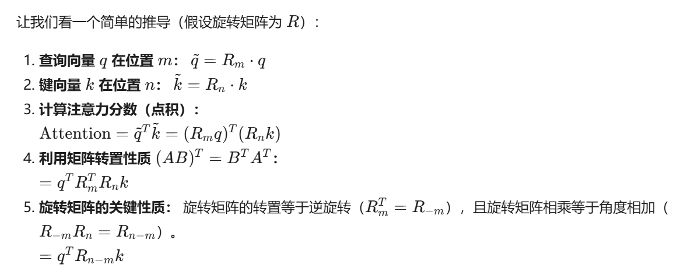

# Nano-vLLM

```txt
.
├── bench.py
├── example.py
├── LICENSE
├── nanovllm
│   ├── config.py
│   ├── engine/
│   ├── __init__.py
│   ├── layers/
│   ├── llm.py
│   ├── models/
│   ├── __pycache__
│   ├── sampling_params.py
│   └── utils/
├── pyproject.toml
└── README.md
```

以下分为 `Engine`、`Layers`、`Models` 几个部分介绍

## Engine

xxx

## Models

以 `Qwen3-0.6B` 为例

**Qwen3ForCausalLM**

在 `models/qwen3.py` 下面定义了两个类 `Qwen3Model`、`Qwen3ForCausalLM`。这两个类都继承了 `nn.Module`。`Qwen3Model` 是 Transformer 主体，内部包含 embedding、decoder layer、norm layer 等，将输入的 token 变成 hidden state。（hidden state 是一个语义向量，维度是 hidden_size）

`Qwen3Model` 后面可以接不同的 “头” 来完成不同任务（因果生成、分类、序列标注等）

`Qwen3ForCausalLM` 在 `Qwen3Model` 基础上增加 `lm_head`。`lm_head` 本质是一个线性层，权重矩阵是 `[vocab_size, hidden_size]`。总之，`lm_head` 的权重矩阵的每一行是一个词的 “特征向量”，做矩阵乘是在算 hidden_state 和每个词的相似度，产生 logits 用于后续的采样

```txt
logits = hidden_states @ lm_head.weight.T

[1, hidden_size] × [hidden_size, vocab_size] → [1, vocab_size]
```

`Qwen3ForCausalLM` 类定义了：

```py
packed_modules_mapping = {
    "q_proj": ("qkv_proj", "q"),
    "k_proj": ("qkv_proj", "k"),
    "v_proj": ("qkv_proj", "v"),
    "gate_proj": ("gate_up_proj", 0),
    "up_proj": ("gate_up_proj", 1),
}

def __init__(self, config: Qwen3Config) -> None

def forward(self, input_ids: torch.Tensor, positions: torch.Tensor) -> torch.Tensor

def compute_logits(self, hidden_states: torch.Tensor) -> torch.Tensor
```

1. 将 HuggingFace 格式的权重转换成 vLLM 需要的融合形式。HF 实现将 Attn 和 MLP 的权重分开，Attn 有三个独立矩阵 `q_proj`/`k_proj`/`v_proj`，MLP 是两个独立矩阵 `gate_proj`/`up_proj`。为了提升推理性能，这里定义 dict，将 QKV、GateUp 矩阵拼起来。以 QKV 为例，未融合时需要 3 次 GEMM，融合后需要 1 次 GEMM
2. `__init__` 函数。两个核心组件 `Qwen3Model`、`lm_head`。以及一个特殊配置 `tie_word_embeddings`，如果开启，`lm_head` 和 `embed_tokens` 共享一份权重，可以节省显存
3. `forward` 函数。输入 token，输出 hidden_state
4. `compute_logits` 函数。将 hidden_state 转为 logits

**Qwen3DecoderLayer**

单层 Transformer decoder 实现

1. 搭建 transformer decoder 时，在 `__init__` 函数中定义各层模块， 在 `forward` 方法中显式指定调用顺序。
2. 这里 decoder 的实现和原始 Transformer 不同，在 attn 前有 pre norm，这样训练更稳定，梯度通过残差直接回传，不会被 norm 层卡住，更容易收敛。
input_layernorm → self_attn → post_attention_layernorm → mlp

**Qwen3Attention**

decoder layer 中的注意力层。包含三步：

1. 计算 qkv 向量，以及 rope 位置编码。qkv_proj → split → reshape → QK Norm → RoPE
2. 注意力计算。`attn(Q, K, V)`
3. 多头输出结果投影，映射到 `[seq_len, hidden_size]`。多头展开 → 各自计算 → o_proj 融合 → 送给 FFN

`__init__` 函数：

1. TP 分头计算。将 head 分到 `tp_size` 个 GPU 上计算，
2. 核心组件，qkv 融合矩阵，o 投影矩阵，RoPE，attn 计算。这里采用 GQA 优化 KV Cache 占用
3. 可选的 QK Norm。没有 `qkv_bias` 时，用 RMSNorm 来稳定 QK 的数值范围，可以防止注意力分数爆炸

`forward` 函数：

1. qkv 融合计算。融合的 qkv 投影矩阵的形状 `qkv_proj` 是 `[hidden_size, (num_heads + 2 * num_kv_heads) * head_dim]`。embeddings 和融合的 qkv 投影矩阵相乘后，结果是 `[seq_len, (num_heads + 2 * num_kv_heads) * head_dim]`。
2. split 上述结果，将 qkv 分开。在列上切分 `num_heads*head_dim | num_kv_heads*head_dim | num_kv_heads*head_dim`
3. 将一个长向量拆成多个 head。以 q 为例，`[seq_len, num_heads * head_dim] -> [seq_len, num_heads, head_dim]`。`head_dim` 是每个 head 的独立工作维度
4. 多头输出投影。单个 head 输出 `[seq_len, head_dim]`，head 数量是 `num_heads`（Q 的数量），因此最后多头输出 concat 后是 `[seq_len, head_dim * num_heads]`，`o_proj` 形状是 `[hidden_size, hidden_size]`，注意这里 `hidden_size=head_dim * num_heads`。GQA 中，kv 头数量只影响 kv 存储和计算过程，不影响输出的头数

**Qwen3MLP**

`Qwen3MLP` 是 Transformer 中的 FFN 模块，即 MLP 层

1. 功能：对特征进行 “升维线性变换 -> 非线性激活 -> 降维线性变换” 的加工，增强模型表达能力。以 ReLU 激活为例，$FFN(X)=ReLU(XW_1)W_2$$
2. 流程：
   - 升维：输入 `hidden_state`，输出 `2 * intermediate_state`，分别用于 gate 和 up
   - 激活：使用 SwiGLU
   - 降维：降维，从 `intermediate_state` 到 `hidden_size`

** 总结 **

整个流程是：

```text
input_ids
   ↓
Embedding (vocab_size → hidden_size)
   ↓
[Pre-LN Residual Block] × num_hidden_layers
   ├── x = x + Attn(RMSNorm(x) )
   ├── x = x + MLP(RMSNorm(x) )   # MLP: SwiGLU + 升维降维
   ↓
Final RMSNorm
   ↓
LM Head (hidden_size → vocab_size)  # compute_logits 调用
   ↓
logits → (optional) softmax → probabilities
```

## Layers

按照以下顺序介绍 `layers` 中的组件

1. attention
2. layernorm
3. rotary embedding
4. linear
5. activation
6. embedding/lm_head
7. `qwen3.py` 总结

每一层需要关注输入、输出的 shape、在 qwen3 的哪里被调用、有没有 TP 通信

**attention**

1. 定义 `Attention` 类：根据当前上下文（prefill/decode 阶段），选择注意力计算方式
    - prefill 阶段：为 prompt 的所有 token 计算注意力，同时为整段 k/v 构建 cache
    - decode 阶段：对新生成的 token 计算一次 q/k/v，然后使用 ` 新 token 的 q + 历史 kv cache` 计算 attn
    - 具体计算注意力，是调 flashattn kernel
    - 输出 shape 和 q 对齐，都是 `[N, num_q_heads, head_dim]`。N 代表这次参与计算的 token 总数，比如有多条序列 prefill，这里 N 就等于所有序列长度之和。因为 `k = k.view(-1, self.num_kv_heads, self.head_dim)` 已经压平了 batch/sequence 维度，所以使用 `cu_seq_lens_q`/`cu_seq_lens_k` 区分每条序列的起止
2. 管理 kv cache：`store_kvcache` 函数将新的 `k_cache/v_cache` 写进全局 cache 的 slot

整体流程

```
                当前层传入
          q [N, num_heads, head_dim]
          k [N, num_kv_heads, head_dim]
          v [N, num_kv_heads, head_dim]
                     |
                     v
         如果有 cache，就先写入 k/v cache
                     |
                     v
          +-------------------------+
          |   context.is_prefill ?  |
          +-------------------------+
              | yes             | no
              v                 v
   flash_attn_varlen_func   flash_attn_with_kvcache
              |                 |
              +---------> o <---+
                         |
                         v
             [N, num_heads, head_dim]
```

todo: kv cache 管理，读取 / 写入怎么定位；

**layernorm**

RMSNorm 是一种高效的归一化方法，让神经网络某一层的输出数值稳定。和标准的 LayerNorm 区别是：

1. LayerNorm 是减去均值，再除方差
2. RMSNorm 去掉了 “减去均值” 操作，减少了计算复杂度。缺点是，省略均值计算可能丢失输入分布的信息，影响模型表达能力

RMSNorm 计算公式是：

$$
RMS(x)=\sqrt{\frac{1}{d}\sum^d_{i=1}x^2_i+\epsilon} \\
RMSNorm(x)=\frac{x}{RMS(x)}\gamma
$$

其中，$d$ 是 token 特征维度数，$\epsilon$ 是防止除以零的小常数，$\gamma$ 是可训练的缩放参数

在 `qwen3` norm 用在了这些地方：

1. attn 之前
2. attn 之后，MLP 之前
3. 最后一层 decoder 输出后，lm_head 之前（hidden_state 经过 lm_head 变成 logits）

解析这里的 RMSNorm 实现：

1. `__init__` 部分。定义两个参数，`epsilon` 和 `gamma`，小常数和缩放参数（长度是 `hidden_size`，学习每一维度应该方所多少）
2. `rms_forward` 部分。对输入的最后一维（即 hidden 维度）计算 RMSNorm，不改变 shape，只调整数值
3. `add_rms_forward` 部分。把残差和 RMSNorm 一起算了。输入是 `x,residual`，输出是 `RMSNorm(x+residual),x+residual`
4. `forward` 部分。供上层调用的统一入口，如果有残差就调用 `add_rms_forward`，否则调用 `rms_forward`

```py
class RMSNorm(nn.Module):
    def __init__(self, dim: int, eps: float = 1e-5):
        super().__init__()
        self.eps = eps
        self.weight = nn.Parameter(torch.ones(dim))  # 可学习的缩放参数 γ

    def _norm(self, x):
        # 均方根归一化：沿最后一维计算
        # torch.rsqrt 返回的是 x.pow(2).mean(-1, keepdim=True) + self.eps 的平方根的倒数
        # 直接调用 rsqrt 比先 sqrt 再 1 / 更高效，尤其在 GPU 上
        return x * torch.rsqrt(x.pow(2).mean(-1, keepdim=True) + self.eps)

    def forward(self, x):
        # print(self._norm(x.float()).shape)# # torch.Size([1, 2, 4])
        return self.weight * self._norm(x.float()).type_as(x)
```

Q：为什么 RMSNorm 和 LayerNorm 都在 token 特征维度上操作，而非跨 batch？

A：

- BatchNorm 是处理图像数据常用的归一化方式，图像数据通常有强烈的空间相关性，即相邻的像素通常会有相似的值或模式。因此，图像的像素特征在一个 batch 中通常有相似的分布，BatchNorm 通过跨 batch 归一化，可以减轻空间相关性的影响，让训练时每一层的输入保持一定的分布，从而加速收敛

- NLP 任务中，每个 token 的特征是通过 embedding-transformer 层独立计算的，不同 token 的语义不同，因此 token 的特征需要独立归一化处理

- 如果归一化操作发生在 batch 维度上，会导致不考虑每个 token 的独立性。用于归一化的数据来自不同的 batch，包含不同的 token 内容和信息，如果跨 batch 进行标准化，会丢失 token 间的独立性，使得 token 之间存在耦合关系，比如一些 padding token 并没有实际意义，但是被加入了归一化计算，进而影响模型的学习效果。

**rotary_embedding**

RoPE（Rotary Positional Embedding，旋转位置编码）

- 为什么需要 RoPE：
    - Transformer 的自注意力机制是置换不变的（不依赖输入顺序）。为了让模型感知序列中 token 的前后关系，需要显式注入位置信息
    - 绝对位置编码（如 Transformer 原论文的 sin/cos 编码、可学习的绝对位置编码）缺点是，不直接表达相对位置，外推性差
    - 相对位置编码，在计算注意力时引入位置差 `i-j` 的 bias。缺点是，需要修改注意力公式，计算比较复杂，且不容易和线性注意力等变体结合
    - RoPE 是相对位置编码的一种新实现
- RoPE 的核心思想：在二维平面旋转向量
    - 位置 m 的 $q_m$ 和位置 n 的 $k_n$，希望点积只依赖相对位置 `m-n`
    - 旋转后的点积，等于 “原始向量经过相对旋转后” 的点积



具体到 nano vllm 中 RoPE 的实现：

1. 核心的数学实现部分。

```py
def apply_rotary_emb(
    x: torch.Tensor,
    cos: torch.Tensor,
    sin: torch.Tensor,
) -> torch.Tensor:
    # 1. 将特征维度切成两半 (x1, x2)，
    # RoPE 是成对处理维度的
    x1, x2 = torch.chunk(x.float(), 2, dim=-1) # 计算前强制转为浮点（FP32）。防止在 FP16/BF16 精度下，乘法运算导致精度损失或溢出。

    # 2. 执行旋转矩阵乘法
    # 原始公式：[y1, y2] = [cos, -sin; sin, cos] * [x1, x2]
    # 展开后：
    y1 = x1 * cos - x2 * sin
    y2 = x2 * cos + x1 * sin

    # 3. 拼接回原维度，并转回原始精度 (如 float16)
    return torch.cat((y1, y2), dim=-1).to(x.dtype)
```

2. 位置编码管理类 `RotaryEmbedding`

- 对 head 所有维度旋转
- 频率计算，$\theta_i=base^{\frac{-2i}{d}}$，i 从 1 到 `rotary_dim/2`
- 预计算缓存 `cos_sin_cache`。计算所有可能位置（0 到 `max_position_embeddings`）的 cos/sin。`register_buffer(..., persistent=False)` 将缓存注册为 Buffer，这样它会自动跟随模型移动到 GPU/CPU。
`persistent=False` 表示这个缓冲不会被保存到模型的 `state_dict` 中。因为它是可以通过参数重新计算的，保存它会浪费磁盘空间。

```py
def __init__(
    self,
    head_size: int,
    rotary_dim: int,
    max_position_embeddings: int,
    base: float,
) -> None:
    super().__init__()
    self.head_size = head_size
    assert rotary_dim == head_size  # 关键点 1
    inv_freq = 1.0 / (base**(torch.arange(0, rotary_dim, 2, dtype=torch.float) / rotary_dim))
    t = torch.arange(max_position_embeddings, dtype=torch.float)
    freqs = torch.einsum("i,j -> ij", t, inv_freq)
    cos = freqs.cos()
    sin = freqs.sin()
    cache = torch.cat((cos, sin), dim=-1).unsqueeze_(1) # 关键点 2
    self.register_buffer("cos_sin_cache", cache, persistent=False) # 关键点 3
```

`forward` 函数：

- 通过 token 的实际位置，直接从预计算的达标取 cos/sin 值
- `@torch.compile` 是 pytorch 特性，会将这个函数编译乘优化的 CUDA kernel 或 CPU 代码。可以提升推理速度

`get_rope` 函数：

- 创建一个 `RotaryEmbedding` 实例
- `@lru_cache(1)`，python 装饰器，实现单例模式。如果多个地方请求相同配置的 RoPE，不会重复创建，而是复用缓存的实例
- `rope_scaling`，现在版本不支持位置插值（linear/YARN 等），仅支持标准 RoPE
