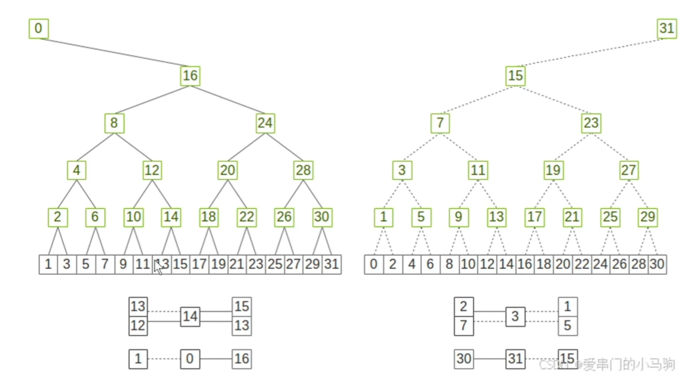
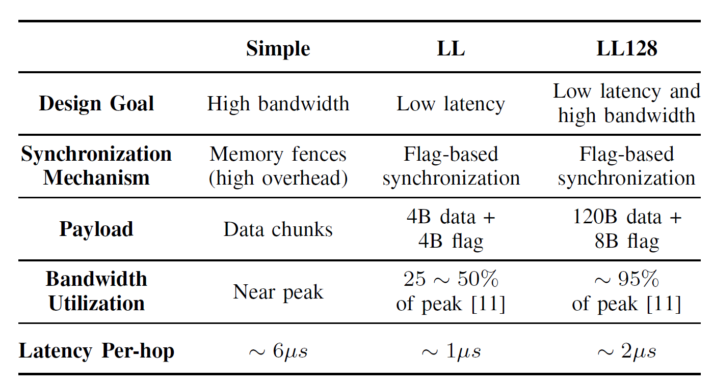
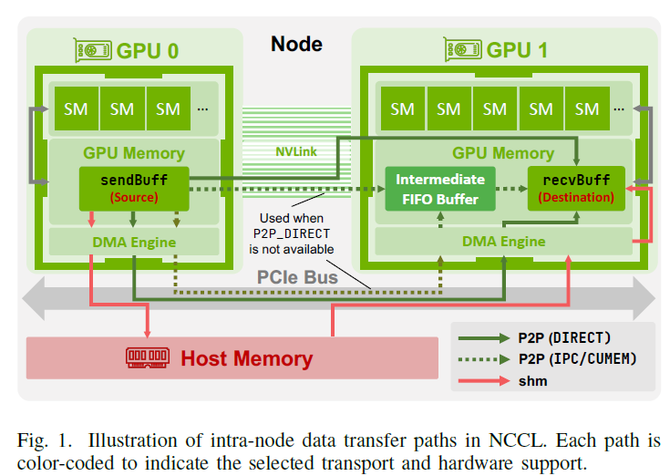

# Nvidia Collective Communication Library (NCCL)

NCCL 设计目标：使用 NVLink/PCIe/IB 等技术，让 GPU-GPU 通信达到高带宽、低延迟

下面以四个部分介绍 NCCL 的实现：

- 总览，介绍 API 结构、communication channel 管理
- 介绍通信协议（Simple/LL/LL128）
- NCCL data-transfer 模型分析
- NCCL 集合通信算法分析

## NCCL Overview

### NCCL API

主要给用户提供四种函数：

- communicator 管理
  - 所有参与通信的 GPU 都会维护一个 communicator 对象，用来调用 NCCL。用户需要先初始化一个 communicator，然后定义通信的 GPU 集合
  - 初始化。如果是单进程 / 线程，调用 `ncclCommInitAll`。如果是多进程 / 多线程，每个进程需要调用 `ncclCommInitRank` 并指定唯一标识号
  - 结束释放资源。`ncclCommDestroy` 安全结束，待处理通信结束后再清理。`ncclCommAbort` 立即结束，用于错误恢复、避免死锁
- 集合通信
  - 集合操作。`ncclAllReduce`、`ncclBroadcast`、`ncclReduce`、`ncclAllGather`、`ncclReduceScatter`，五种集合操作
- 点对点通信
  - `ncclSend`、`ncclRecv`
- 组调用
  - `ncclGroupStart`、`ncclGroupEnd`。中间包裹一系列 NCCL 调用。可以降低启动开销

### 启动策略

在多 GPU 上，NCCL 支持三种启动操作的执行模型

- 单 CPU 进程 - 单 GPU：将每个 GPU 绑定到不同 CPU 进程上，对应的进程可以被调度到固定 NUMA 节点（CPU - 内存 - GPU），提高数据局部性、减少内存访问延迟
- 单 CPU 线程 - 单 GPU：一个进程通过多个线程管理多个 GPU，所有线程可以访问共享内存（包括 GPU buffer 的 CPU 侧地址），减少数据拷贝
- 单 CPU 线程 - 多 GPU：一个线程管理多个 GPU，架构简单、CPU 开销小、执行确定性，可用于小型部署

### Communication Channel

NCCL 为了解决通信瓶颈问题，在设计上有几点：

- communication channel 调度：将大的集合通信操作分解成可以并行的 “子任务”，每个 channel 是处理子任务的独立执行单元
- 计算 / 通信重叠：为通信分配专门的 SM，避免 SM 同时负担计算、通信
- 数据并行：将输入缓冲分成多个 chunk，让多个 channel 可以并行处理
- 网卡均衡：将不同 channel 绑定到不同网卡，跑满物理链路带宽，避免单个 NIC 瓶颈

这里的 chunk size 具体取值也是并行 / 网络效率的 trade-off。如果每个 channel 的 chunk 太小、小于 NIC 的 512KB FIFO buffer size，那么网络带宽是部分浪费的。NCCL 有启发式算法，针对小消息减少 channel 数量来解决此问题。

NCCL 的内部调优模型会基于当前策略、message size、可用带宽、每个 channel 配置的 thread 数等因素，最终确定实际的 channel 数量。

分配给每个 channel 的逻辑通信拓扑直接决定了数据在 GPU 间的传输路径：

- 环状拓扑（ring）。每个 GPU 会找到前向、后继节点，所有 GPU 构成一个单向通信环
- 树状拓扑（tree）。每个 GPU 追踪父节点 / 子节点的 rank，构建一个通信树

为了增加带宽利用率，NCCL 使用双二叉树优化通信拓扑。
> 传统 AllReduce 的瓶颈
> - Ring AllReduce：带宽效率高，但是延迟 `O(n)` 高
> - Tree AllReduce：延迟 `O(log n)` 低，但是带宽利用率低（根节点成为瓶颈）
>
> NCCL 引入双二叉树，两棵树互为镜像：
> - Tree 0：以某节点为根，其他节点作为子树，数据向上 Reduce
> - Tree 1：以另一个（或相同）节点为根，结构对称，用于向下 Broadcast
>
> 下图中，左树的中间节点都是右树的叶子节点，右树的中间节点都是左树的叶子节点。AllReduce=Reduce+Broadcast，在 Reduce 操作中，叶子节点发数据，中间节点收数据，因此这样可以把带宽充分用起来
> 
>

对于 `ncclGroupStart` 和 `ncclGroupEnd` 之间的点对点操作，NCCL 会尽可能让这些操作分散到多个 channel，让不依赖的 send/recv 并行。（task-level parallelism）

## Communication Protocols

三种通信协议 Simple、LL（Low Latency）、LL128，在带宽 / 延迟的 trade-off 不同：

### Simple Protocol

- 设计目标：充分利用带宽，用来传 large message
- 原理：chunking。将数据分成较大的 chunk 通过多个 channel 发送。
- 保证内存一致性：使用 memory fence 来保证 data correct ordering and visibility

> 内存一致性：多个处理器（或 GPU）对共享内存的访问顺序和可见性规则
>
> 场景：NCCL 集体通信（AllReduce、Broadcast）中，GPU 可以通过 RDMA 直接读写远端 GPU 内存，接收方需要知道何时能使用接收的数据
> 为了确保从内存读取的是最新数据，需要使用 memory fence 来保证内存一致性

因为 memory fence 的开销巨大，latency 较高，对 small message 的影响大。但是对 large message，带宽基本能跑满

### Low Latency (LL) Protocol

- 设计目标：解决 Simple 协议的延迟问题。
- 原理：
    - 优化 small message 场景（带宽未充分利用），采用基于标志位的轻量级同步方法。每次 8 字节的原子操作传输 4 字节数据 + 4 字节 flag
    - 缓冲区在 host memory 上而非 GPU memory 上。因为如果缓冲区在 GPU memory 上：① DRAM 操作比通过 PCIe 轮询 GPU 内存速度快。②需要显式同步保证 CPU 能看到 GPU 写入的数据。
- 结果：LL 协议延迟低，但是带宽受限（只有峰值带宽的 25%-50%）。因此只适用于延迟更重要的场景

### LL128 Protocol

- 设计目标：优化 LL 协议，保持低延迟特性的同时提高带宽利用率
- 原理：
    - 使用基于标志位的同步机制。但是数据传输单元为 128 字节，120 字节的负载 + 8 字节 flag。
    - 发送端 GPU 会聚合较大的数据块（128 字节）之后再通知 CPU 准备发送。这有两个影响：
        - 跨节点流水线受限：和 Simple 协议相比，频繁小包传输的网络利用率较低
        - 节点内流水线受益：传输粒度小于 Simple 协议，128 字节的小单元允许计算、通信更好地重叠
- 结果：
    - 节点内传输 LL128 很快，但是节点间带宽受限
    - 依赖硬件的 128 字节原子写操作。因此，协议受消息尺寸、系统支持能力的影响

### 协议比较

NCCL 根据用户设置 `NCCL_PROTO` 、集合通信算法、内部启发式策略，在运行时动态选择 Simple/LL/LL128 协议。一般是：

针对小消息选 LL/LL128 降低延迟，针对大消息选 Simple 增加吞吐

## 传输层

### 节点内数据传输

使用 GPUDirect p2p 技术，GPU 能直接访问对端显存，不需要 CPU 系统内存中转

使用 NVLink/PCIe 传输，比 cudaMemcpy 经 host memory 中转性能好

- P2P 基础上，使用 `P2P_DIRECT` 进一步提升性能：
  - 当通信双方的 rank 属于同一进程时，P2P 传输的 `P2P_DIRECT` 模式可以在内存寻址、数据传输路径提升效率
    - 同一地址空间内直接使用 GPU 内存指针，避免 IPC（进程间通信）开销
    - 通过 `directSend`、`directRecv` 等原语消除中间数据拷贝
  - NCCL 通过共享结构（如 `ncclSendMem`、`ncclRecvMem`）的原子头尾计数器，保证正确的同步、操作顺序
- GPU 直连 P2P 不可用或效率低时（如跨 socket、通过 PCIe 进行 P2P 通信），NCCL 使用共享内存（SHM）传输：GPU -> host memory -> GPU
- 在多 socket 系统中，如果有支持 GPUDirect RDMA 的网卡，可以用 GPU -> NIC -> NIC -> GPU 传输路径，绕过 CPU 互联，更高效

总结，节点内共有四种数据传输方法：

- P2P Direct。最快的，直接读写 remote GPU mem。可使用 NVLink/PCIe，需要通信 rank 在一个进程
- P2P IPC。中等，通过 NVLink，经过 buffer 中转，远程读写 GPU mem
- P2P SHM。最慢，经过 host memory 中转，适用于跨 socket 场景
- GPU 与 NIC 同 NUMA socket 时启用，可以绕过 CPU 互联，通过 GPU->NIC->NIC->GPU 快速传输

### 节点间数据传输

节点间数据传输涉及：执行 NCCL kernel 的 GPU、执行 proxy thread 的 CPU、底层网络。NCCL 根据底层硬件选择 TCP socket 传输或 IB 传输

TCP socket 传输：

buffer 是 host mem 中的 CUDA pinned memory。引入额外的 PCIe 总线内存复制开销。发送方、接收方需要协调确认 buffer 就绪，再开始传输数据

IB 传输：

IB 传输利用 RDMA 能力，CPU 干预很少。buffer 位置取决于硬件配置。CPU proxy thread 负责管理 DMA、RDMA 操作。IB 传输也需要发送方、接收方协调

- （默认）如果 NIC 无法直接访问 GPU mem，buffer 就在 host mem。
  - 发送方：GPU kernel 将数据拷贝到 host mem，proxy thread 执行 RDMA write
  - 接收方：NIC 将数据写到 host mem，proxy thread 将数据拷贝到 device mem

IB 传输中的优化：

- GPUDirect RDMA (GDRDMA)。让 NIC 可以直接访问 GPU mem，避免经过 host mem 的开销。NIC 需要和 GPU 连接到同一个 PCIe switch，才能用 GDRDMA
- per-peer multi-channel connection。IB 传输层默认为每个 NIC-remote GPU 创建两个 logical channel。每个 channel 维护独立的内部结构、IB QP 对，proxy thread 在发送时会轮询两个队列的多组 QP。这样的多 channel + 轮询设计可以：
  - 增大每个 QP 的有效 chunk size。（增大 QP 发送间隔后，可以安全增加 chunk size 而不担心流水线停顿，从而降低控制开销）
  - 为支持 ECMP 的网络提供路径多样性（ECMP 是 equal-cost multi-path。数据中心常部署 ECMP，让同一 TCP/UDP/RoCE 流固定映射到同一路径避免乱序，使单 QP 流被映射到单路径，无法利用多条物理链路。路径多样性是通过多 QP 主动分裂大流，提升聚合带宽）