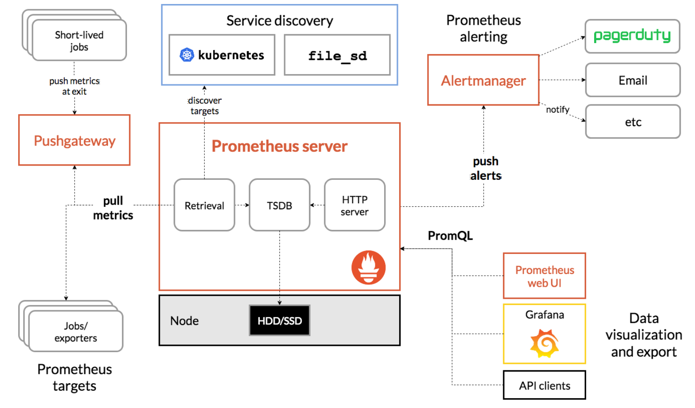

[toc]

## 简介

虽然标题只列出来了指标采集工具的 Prometheus，但是这一部分其实包括了指标采集的 Prometheus、数据视图 Grafana、异常告警三个部分

整个系统的结构：

```
App => Prometheus => Grafana => Alert
```


## Prometheus

整体特点：核心就是一个 binary 文件，没有其他的依赖；基于 Pull 模型架构

数据存储：以 metric 的形式保存在时间序列数据库中，每一条时间序列包括 metric name 和一组 label

查询语言：PromQL 可以查询、聚合数据，还可以用到 Grafana 和告警


**overview**

从左到右：采集层、存储计算层、应用层



数据采集有两种方式，pushgateway 和 exporter


**官网提供的组件**

可下载的有很多，下面列了 4 个：

* prometheus：主程序，时间序列数据库
* pushgateway：接收短任务推送结果的
* node_exporter：获取机器指标的
* alertmanager：告警


**PromQL**

`label{[filter]}`，这种结构

`=`、`!=`

```promql
prometheus_http_requests_total
prometheus_http_requests_total{instance="xxx"}
```

`label=~regex`、`label!~regex`

```promql
prometheus_http_requests_total{environment=~"staging|testing",method!="GET"}
```


时间范围查询：`label{...}[time_range]`

```promql
prometheus_http_requests_total{}[5m]
```

1天前的时间范围：`label{...}[5m] offset 1d`


聚合：`sum(...)`

`topk`：前n条时序

`quantile`：分位统计