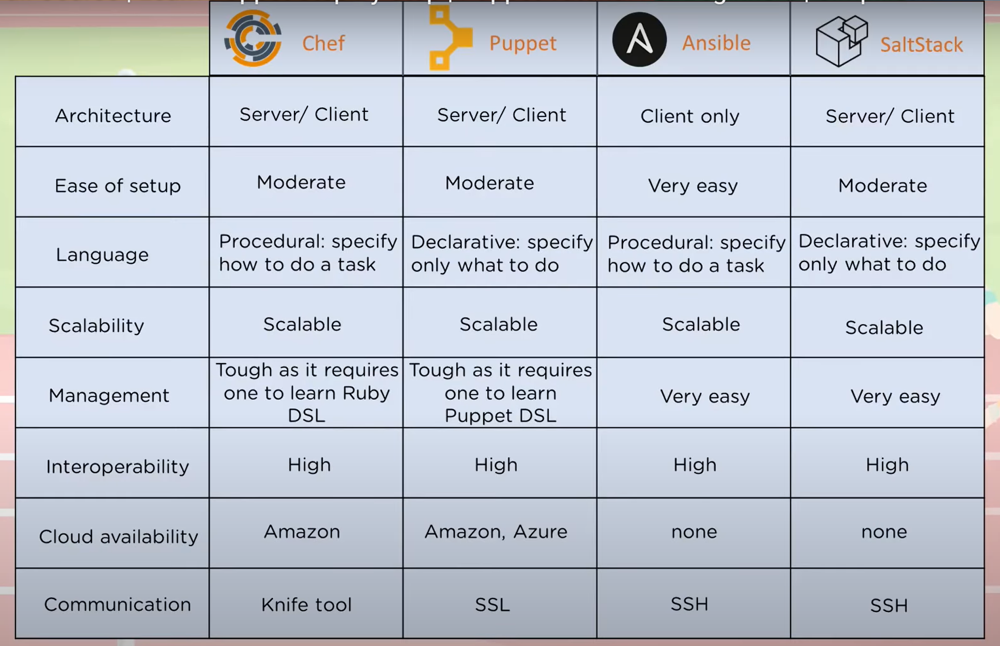

# Puppet

[toc]

puppet: a configuration management tool


## 0 Puppet Component

puppet master:

* manifests: actual code for configuring clients
* templates: combine our codes together, render a final document
* files: content, can be downloaded by clients
* module: manifest + template + file
* CA: certificate authority, sign documents

puppet client:

* agent: communicate with puppet master
* facter: current client state


## 1 Puppet Workflow

master-slave architecture

1. client to master: send a certificate with client id
2. master to client: sign that certificate, called <u>authentication</u>
3. client to master: collect and send facter
4. master to client: based on facter, compile manifests to catalogs, send catalogs to client
5. client to master: initiate catalog, generate report for any changes, send report


## 2 Puppet Manifest Example

**manifest**

resource_type: pkg, file, ...

resource_name: pkg name (type=pkg), path (type=file)

```ruby
resource_type {'resource_name':
	attribute1 => value1,
    attribute2 => value2,
}
```


manifest: a collection of resource declarations, with `.pp` extension

```ruby
package {'nginx':
    ensure => 'installed',
}
file {'/tmp/hello.txt':
    ensure => present,
    content => 'hello, world',
    mode => '0644',
}
```


create a directory, raise a httpd service

```ruby
node default{
	file{'/etc/example':
    	Content => "this is a sample manifest"
    }
    
    service{'httpd':
    	ensure => installed
    }
}
```


example manifest file path: 

`/etc/puppet/code/environments/production/manifests/site.pp`


**variables**

```ruby
# site.pp
node default{
    package{'nginx':
    	ensure => installed,
    }
    
    $text = "hello hello puppet"
    
    file{'/tmp/status.txt':
    	content => $text,
    }
}
```

**loops**

```ruby
# site.pp
node default{
    $packages = ['nginx', 'mysql-server']
    package{$packages:
    	ensure => installed,
    }
    
    file{'/tmp/status.txt':
    	content => "hello hello puppet",
    }
}
```

**conditions**

```ruby
# site.pp
node default{
    exec {'Test':
        command => '/bin/echo apache2 is installed > /tmp/status.txt',
        onlyif => '/bin/which apache2',
    }
}
```

```ruby
# site.pp
node default{
    exec {'Test':
        command => '/bin/echo apache2 is not installed > /tmp/status.txt',
        unless => '/bin/which apache2',
    }
}
```


## 3 Advanced Usage

todo


## 4 Competitors

* Chef: ruby & erlang, suitable for heterogenous infrastructure, version control
* Puppet: ruby & DSL, heterogenous environment
* Ansible: yaml, push instructions to machines, quick deployment, no agent
* SaltStack; python & yaml, CLI tool

