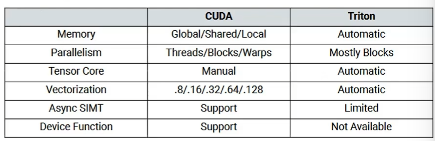
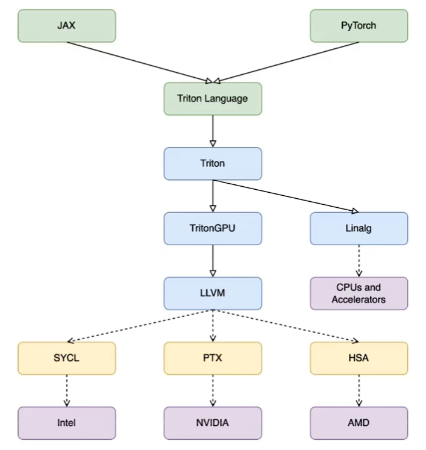
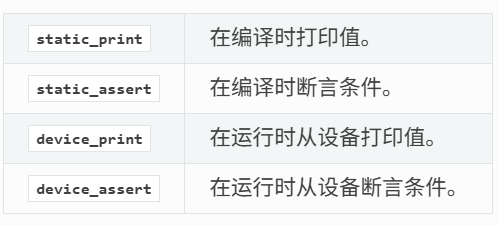

# Triton

## 概述

triton 特点：

- 既是基于 python 的 DSL（语言），也是编译器
- 面向 GPU 体系特点，自动分析和实施神经网络计算的分块（tiled neural network compute）
- 和 CUDA 相比，Triton 提供更易用的编程模型；和 TVM/XLA 等图级编译器相比，Triton 用于 kernel 开发和编译优化

kernel 算子开发：大量算子（linear/convolution/norm/pooling/loss）和多种数据类型（f64/f32/bf16/int64/int32）的不同组合



triton 编译器：

- 兼容 pytorch 等框架
- 基于 MLIR 的多层中间表示和优化
  - Triton dialect
  - TritonGPU dialect
- 利用 LLVM 生成不同硬件平台的高效执行代码



## Triton API 语法

`jit`: 即时编译

`autotune`: 对 `triton.jit` 函数自动调优，比如 `num_warps`、`num_stages`、block size 等


debug ops，调试使用的函数，不能用 python 的 `print()`



## 例子

以 safe softmax 的 kernel+wrapper 为例：

```py
import torch
import triton
import triton.language as tl

@triton.jit
def _softmax_kernel(
    output_ptr, input_ptr,
    input_row_stride, output_row_stride,
    n_cols,
    BLOCK_SIZE: tl.constexpr    # trion kernel 的编译期参数，不是 runtime 参数。其他的 BLOCK_M、BLOCK_N、BLOCK_Ks 等也是这类参数
):
    row_idx = tl.program_id(0)  # axis=0 是当前 program 在 x 轴的 id

    row_start_ptr = input_ptr + row_idx * input_row_stride
    col_offsets = tl.arange(0, BLOCK_SIZE)  # 一次生成这行要访问的所有 col offset。比如 BLOCK_SIZE=1024，那这个 program 会一次处理 1024 个列元素
    input_ptrs = row_start_ptr + col_offsets

    row = tl.load(input_ptrs, mask=col_offsets < n_cols, other=-float("inf"))   # mask 防止越界访问，因为后面要算最大值，所以 mask val 是 - inf

    # safe softmax 部分
    row_minus_max = row - tl.max(row, axis=0)
    numerator = tl.exp(row_minus_max)
    denominator = tl.sum(numerator, axis=0)
    softmax_output = numerator / denominator

    output_row_start_ptr = output_ptr + row_idx * output_row_stride
    output_ptrs = output_row_start_ptr + col_offsets
    tl.store(output_ptrs, softmax_output, mask=col_offsets < n_cols)    # 写回时还要再 mask 一次


def triton_softmax(x: torch.Tensor) -> torch.Tensor:
    assert x.dim() == 2, "only support 2D tensor for now"
    assert x.is_cuda, "input must be on CUDA device"
    rows, cols = x.shape
    block_size = triton.next_power_of_2(cols)

    if block_size <= 1024:
        num_warps = 4
    elif block_size <= 2048:
        num_warps = 8
    else:
        num_warps = 16

    grid = (rows,)
    softmax_out = torch.empty_like(x)
    _softmax_kernel[grid](
        softmax_out, x,
        x.stride(0), softmax_out.stride(0),
        cols,
        BLOCK_SIZE=block_size,
        num_warps=num_warps,
    )
    return softmax_out

sample = torch.tensor([[1,2,3,4,5],[5,4,3,2,1]], dtype=torch.float32, device="cuda")
ts_out = triton_softmax(sample)
print(f"{ts_out=}")
```

以 online softmax 的 kernel+wrapper 为例：

```py
@triton.jit
def _online_softmax_kernel(
    output_ptr, input_ptr,
    input_row_stride, output_row_stride,
    n_cols,
    BLOCK_SIZE: tl.constexpr
):
    row_index = tl.program_id(0)
    row_start_ptr = input_ptr + row_index * input_row_stride

    old_max, exp_sum = float('-inf'), 0.0

    for start in range(0, n_cols, BLOCK_SIZE):
        col_offsets = start + tl.arange(0, BLOCK_SIZE)
        input_ptrs = row_start_ptr + col_offsets
        row = tl.load(input_ptrs, mask=col_offsets<n_cols, other=float('-inf'))

        new_max = tl.maximum(tl.max(row, axis=0), old_max)
        rescale = tl.exp(old_max - new_max)
        old_max = tl.maximum(old_max, new_max)
        exp_sum = exp_sum * rescale + tl.sum(tl.exp(row-old_max), axis=0)

    for start in range(0, n_cols, BLOCK_SIZE):
        col_offsets = start + tl.arange(0, BLOCK_SIZE)
        input_ptrs = row_start_ptr + col_offsets
        row = tl.load(input_ptrs, mask=col_offsets<n_cols, other=float('-inf'))

        up = tl.exp(row-old_max)
        softmax_output = up / exp_sum

        output_start_ptr = output_ptr + row_index * output_row_stride
        output_ptrs = output_start_ptr + col_offsets
        tl.store(output_ptrs, softmax_output, mask=col_offsets<n_cols)


def online_softmax(x: torch.Tensor) -> torch.Tensor:
    assert x.dim() == 2, "only support 2D tensor for now"
    assert x.is_cuda, "input must be on CUDA device"
    rows, cols = x.shape
    block_size = triton.next_power_of_2(cols)

    if block_size <= 1024:
        num_warps = 4
    elif block_size <= 2048:
        num_warps = 8
    else:
        num_warps = 16

    grid = (rows,)
    softmax_out = torch.empty_like(x)
    _online_softmax_kernel[grid](
        softmax_out, x,
        x.stride(0), softmax_out.stride(0),
        cols,
        BLOCK_SIZE=block_size,
        num_warps=num_warps,
    )
    return softmax_out

sample = torch.tensor([[1,2,3,4,5],[5,4,3,2,1]], dtype=torch.float32, device="cuda")
os_out = online_softmax(sample)
print(f"{os_out=}")
```

顺便比较了下 pytorch 的 softmax 和 triton 版本的 online softmax 性能😄

```text
input_shape: (32768, 32768)
max error: tensor(4.1723e-07, device='cuda:0')

torch_softmax: 11.854 ms
online_softmax: 6.542 ms
```
