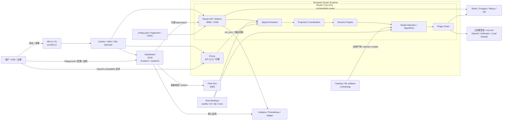
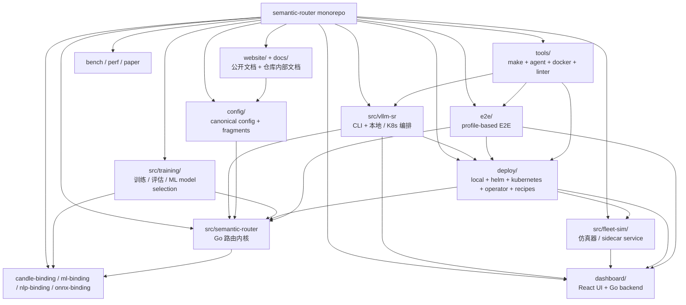
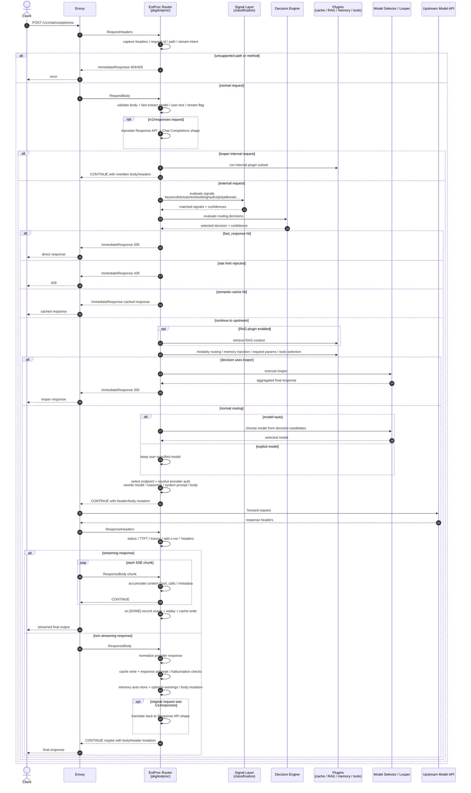

# vllm-sr

[vllm-semantic-router](https://github.com/vllm-project/semantic-router) 是一个 LLM 多模型路由平台。解决的问题是：如何根据能力、成本、隐私、安全和场景语义，将请求路由到合适的模型或模型组合上

运行时架构

仓库模块架构

- `src/vllm-sr` 是总入口，负责把本地 Docker 栈或 K8s 栈拉起来。
- `src/semantic-router` 是核心决策面，内部主线就是 `signal -> projection -> decision -> selection -> plugin`。
- `dashboard` 是控制面和可视化入口，连着 router API、监控系统和 fleet simulator。
- `deploy`、`e2e`、`tools` 属于交付与质量保障层，不直接做路由决策，但决定这个项目怎么部署、验证、复现。
- `src/training` 和各类 Rust bindings 是 “能力支撑层”，为 ML 选择器、分类器和底层推理 / 特征能力提供支持。

## 用户请求的处理链路

客户端 -> Envoy -> Go ext_proc router -> 上游模型服务 -> Envoy -> 客户端

1. Envoy 将请求拆成 req header、req body、resp header、resp body 四部分，传给 router。四部分依次处理，前面阶段可能再前面链路就返回了
2. req header 阶段。提取 header，校验 path/method
3. req body 阶段。如果是 Response API，先将请求翻译成 Chat Completions 风格。然后从 body 提取信息（model、用户文本、图片、是否 stream）
4. 信号评估。router 会把当前用户消息、历史消息、header、图片等送进 classifier，跑 keyword、embedding、domain、fact_check、user_feedback、language、context、structure、complexity、modality、authz、jailbreak、pii、kb、projection 等信号。
5. 决策。decision engine 处理信号结果，按照 `routing.decisions` 做 and/or/not 规则匹配，选出命中的 decision 并计算 confidence
6. 选完 decision 后，先跑一批 “可能提前结束” 的分支。顺序上比较重要的是：
    - fast_response：直接返回，不打上游
    - rate limit：超限直接 429
    - semantic-cache：命中缓存直接返回
    - RAG：需要的话先去取上下文
7. 如果没有提前返回，才做完整的 OpenAI 请求解析和请求改写。这里会处理：
    - modality/image generation 分流
    - memory 检索并把记忆注入消息
    - system prompt 注入
    - reasoning mode 注入
    - request params 改写
    - tools 过滤 / 自动选择
8. 选模型并路由。
    - 如果客户端指定的是具体模型，router 通常保留这个模型，只做插件和上游选择。
    - 如果请求模型是 auto，router 会从 decision 的候选模型里选一个，算法可能是 static、elo、router_dc、automix、hybrid、knn、svm 等。
    - 如果 decision 配的是 confidence/ratings/remom，会走 looper，多轮或多模型执行后直接聚合出结果。
9. 请求上游模型。必要时改写 req 的 model/prompt/memory/tool
10. 上游返回之后，处理 resp header、记录 TTFT 等
11. 处理 resp body。
    - 非流式：anthropic/openai 格式归一化、resp jailbreak 检测、hallucination 检测、memory 写入
    - 流式：实时转发 chunk 给用户，本地累积状态，在流结束时结算 usage

